# TaskFlow - DevOps Final Project

**Student:** Bhuvanesh M S
**Enrollment:** 24bcs10134
**Repository:** https://github.com/Bhuvanesh66/devops-heros (folder `final-devops-project/`)
**Pipeline:** [`.github/workflows/final-devops-project.yml`](../.github/workflows/final-devops-project.yml)

## Project overview

TaskFlow is a small task tracker. You create a task with a title, an optional
description, a priority (low / medium / high) and an optional due date. You
move it from *to do* to *in progress* to *done*, filter the list by status,
see live counters (total, per status, open high-priority tasks), and delete
tasks you no longer need.

The app is deliberately small. The point of the project is everything around
it: one commit goes through the whole delivery chain end to end.

```
Application -> Git -> GitHub -> CI -> Build & Test -> Security Scanning -> Docker Image
  -> Container Registry (GHCR) -> Kubernetes -> Helm -> Monitoring -> GitOps
                    Terraform provisions the AWS infrastructure
```

| Layer | What I built |
|---|---|
| Application | FastAPI + SQLAlchemy 2 + Alembic + PostgreSQL backend, React + Vite frontend served by nginx |
| Tests | 18 pytest tests (CRUD, validation, probes, metrics, migration, config) covering 6 endpoints, against a throw-away SQLite database built by the real Alembic migration |
| Containers | two non-root images (multi-stage), docker compose for the full stack |
| CI/CD | GitHub Actions: lint, test, IaC validation, SAST, SCA, secret scan, image build, image scan + SBOM, security gate, push to GHCR, Helm deploy to kind with smoke tests |
| Kubernetes | Deployment, Service, ConfigMap, Secret, Ingress, HPA, startup/liveness/readiness probes, StatefulSet + PVC for PostgreSQL |
| Helm | one chart with dev/prod values, checksum annotations, `helm test`, monitoring toggles |
| Terraform | AWS VPC with two public subnets, IGW, routes, SG, IAM, EC2 Docker host (AL2023 via SSM), encrypted versioned S3 bucket, optional ECR and EKS |
| Monitoring | `/metrics`, ServiceMonitor, five alert rules, a 12-panel Grafana dashboard, JSON logs |
| GitOps | Argo CD Application with automated prune + self-heal on the Helm chart |
| Troubleshooting | eight intentionally broken variants with a detect / root cause / fix / verify write-up |

## Architecture

### Delivery pipeline

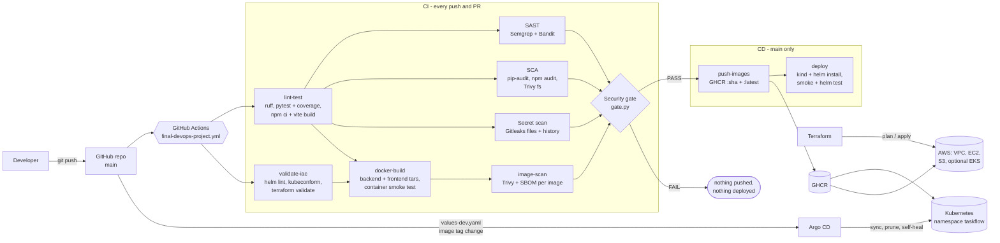
```mermaid
flowchart LR
    dev[Developer] -->|git push| gh[GitHub repo<br/>main]
    gh --> ci{{GitHub Actions<br/>final-devops-project.yml}}

    subgraph CI[CI - every push and PR]
        lt[lint-test<br/>ruff, pytest + coverage,<br/>npm ci + vite build]
        iac[validate-iac<br/>helm lint, kubeconform,<br/>terraform validate]
        sast[SAST<br/>Semgrep + Bandit]
        sca[SCA<br/>pip-audit, npm audit,<br/>Trivy fs]
        sec[Secret scan<br/>Gitleaks files + history]
        build[docker-build<br/>backend + frontend tars,<br/>container smoke test]
        scan[image-scan<br/>Trivy + SBOM per image]
        gate{Security gate<br/>gate.py}
    end

    ci --> lt & iac
    lt --> sast & sca & sec
    lt & iac --> build --> scan
    sast & sca & sec & scan --> gate

    subgraph CD[CD - main only]
        push[push-images<br/>GHCR :sha + :latest]
        deploy[deploy<br/>kind + helm install,<br/>smoke + helm test]
    end
    gate -->|PASS| push --> deploy
    gate -->|FAIL| stop([nothing pushed,<br/>nothing deployed])

    push --> ghcr[(GHCR)]
    gh -->|values-dev.yaml<br/>image tag change| argo[Argo CD]
    ghcr --> k8s
    argo -->|sync, prune, self-heal| k8s[(Kubernetes<br/>namespace taskflow)]
    tf[Terraform] -->|plan / apply| aws[(AWS: VPC, EC2,<br/>S3, optional EKS)]
    ghcr --> aws
```

### Runtime

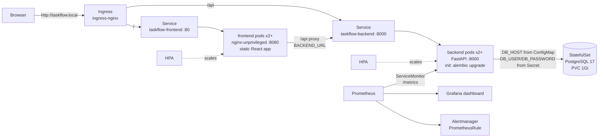
```mermaid
flowchart LR
    user[Browser] -->|http://taskflow.local| ing[Ingress<br/>ingress-nginx]
    ing -->|/| fsvc[Service<br/>taskflow-frontend :80]
    ing -->|/api| bsvc[Service<br/>taskflow-backend :8000]
    fsvc --> fe[frontend pods x2+<br/>nginx-unprivileged :8080<br/>static React app]
    fe -->|/api proxy<br/>BACKEND_URL| bsvc
    bsvc --> be[backend pods x2+<br/>FastAPI :8000<br/>init: alembic upgrade]
    be -->|DB_HOST from ConfigMap<br/>DB_USER/DB_PASSWORD from Secret| pg[(StatefulSet<br/>PostgreSQL 17<br/>PVC 1Gi)]
    hpa[HPA] -.scales.-> be
    hpa2[HPA] -.scales.-> fe
    prom[Prometheus] -->|ServiceMonitor<br/>/metrics| be
    prom --> graf[Grafana dashboard]
    prom --> am[Alertmanager<br/>PrometheusRule]
```

## Technologies used

| Area | Technology | Version / detail |
|---|---|---|
| Backend | Python, FastAPI, Uvicorn | Python 3.12, FastAPI 0.142.2, Uvicorn 0.54.0 |
| ORM / DB | SQLAlchemy, Alembic, psycopg, PostgreSQL | SQLAlchemy 2.1.3, Alembic 1.20.0, psycopg 3.3.6, PostgreSQL 17 |
| Validation / config | Pydantic, pydantic-settings | 2.13.5 / 2.15.0 |
| Metrics | prometheus-fastapi-instrumentator, prometheus_client | 8.1.0 / 0.26.0 |
| Tests / lint | pytest, pytest-cov, httpx, ruff | 9.1.1, 7.1.0, 0.28.1, 0.16.10 |
| Frontend | React, Vite | React 19.3.0, Vite 8.3.3 |
| Containers | Docker, docker compose, nginx-unprivileged | `python:3.12-slim-trixie`, `node:24-alpine`, `nginxinc/nginx-unprivileged:1.30-alpine` |
| CI/CD | GitHub Actions, GHCR | checkout@v7, setup-python@v7, setup-node@v7, build-push@v7, kind-action@v1 |
| DevSecOps | Semgrep, Bandit, pip-audit, npm audit, Trivy, Gitleaks | Semgrep 1.179.0, Bandit 1.9.4, pip-audit 2.10.1, Trivy 0.75.0, Gitleaks 8.30.1 |
| Orchestration | Kubernetes, Kustomize, Helm | autoscaling/v2 HPA, networking.k8s.io/v1 Ingress, Helm 3/4 chart (apiVersion v2) |
| IaC | Terraform, AWS provider | Terraform >= 1.6, hashicorp/aws ~> 6.0 |
| Monitoring | kube-prometheus-stack (Prometheus, Alertmanager, Grafana) | ServiceMonitor, PrometheusRule, dashboard ConfigMap |
| GitOps | Argo CD | Application with automated sync |

## Repository layout

```
final-devops-project/
├── application/
│   ├── backend/          FastAPI app (app/), Alembic (alembic/), tests/, pytest.ini, requirements*.txt, start.sh
│   └── frontend/         React + Vite (src/, index.html, package.json, package-lock.json)
├── docker/               backend.Dockerfile, frontend.Dockerfile, nginx.conf, docker-compose.yml
├── kubernetes/           plain manifests + kustomization.yaml
├── helm/taskflow/        Helm chart (values.yaml, values-dev.yaml, values-prod.yaml)
├── terraform/            AWS infrastructure
├── .github/workflows/    README + mirror of the root workflow (GitHub only runs the root one)
├── security/             Semgrep rules, Bandit/Gitleaks/Trivy config, gate.py, scan-local.sh
├── monitoring/           ServiceMonitor, PrometheusRule, Grafana dashboard, kube-prometheus-stack values
├── gitops/               Argo CD Application
├── troubleshooting/      lab-base + eight broken overlays + write-up
└── README.md
```

---

## Application setup

### API

| Method | Path | Description |
|---|---|---|
| GET | `/health` | liveness: the process answers (no DB access) |
| GET | `/ready` | readiness: runs `SELECT 1`; 503 if the database is unreachable |
| GET | `/api/tasks?status=&priority=&limit=` | list tasks, newest first, optional filters |
| GET | `/api/tasks/{id}` | one task (404 if missing) |
| POST | `/api/tasks` | create (201). Title is required and stripped; priority defaults to medium, status to todo |
| PUT | `/api/tasks/{id}` | update; only the fields sent are changed |
| DELETE | `/api/tasks/{id}` | delete (204) |
| GET | `/api/stats` | counts per status + open high-priority tasks |
| GET | `/metrics` | Prometheus metrics |
| GET | `/docs` | Swagger UI |

The `tasks` table is created by the Alembic migration
`alembic/versions/0001_create_tasks_table.py`, never by the app itself.

### Configuration (environment only)

The backend reads its database location in this order:

1. `DATABASE_URL`, a full SQLAlchemy URL such as
   `postgresql+psycopg://taskflow:<password>@postgres:5432/taskflow`. Used by
   docker compose, the EC2 host and the tests.
2. Otherwise `DB_HOST`, `DB_PORT`, `DB_NAME`, `DB_USER`, `DB_PASSWORD`. Used in
   Kubernetes: the non-secret parts come from the ConfigMap and the credentials
   from the Secret. The app builds the URL itself with `URL.create`, so special
   characters in the password need no escaping.
3. If neither is set, a local SQLite file `taskflow.db`, so the app runs on a
   laptop with no setup.

Other variables: `LOG_LEVEL`, `APP_ENV`, `CORS_ORIGINS` (empty means same
origin only), `RUN_MIGRATIONS` (container entrypoint), `PORT`.

### Run it locally without Docker

```bash
cd final-devops-project/application/backend
python -m venv .venv && source .venv/bin/activate      # Windows: .venv\Scripts\activate
pip install -r requirements-dev.txt
alembic upgrade head                                    # creates taskflow.db (SQLite)
uvicorn app.main:app --reload                           # http://localhost:8000/docs

ruff check . && ruff format --check .
pytest -v --cov                                         # 18 tests, SQLite in a temp dir

cd ../frontend
npm ci
npm run dev                                             # http://localhost:5173, proxies /api to :8000
```

The tests never touch PostgreSQL. `tests/conftest.py` points `DATABASE_URL` at
a SQLite file in a temporary directory before the app is imported, builds the
schema by running the real Alembic migration (so the migration is tested too),
and empties the table before every test.

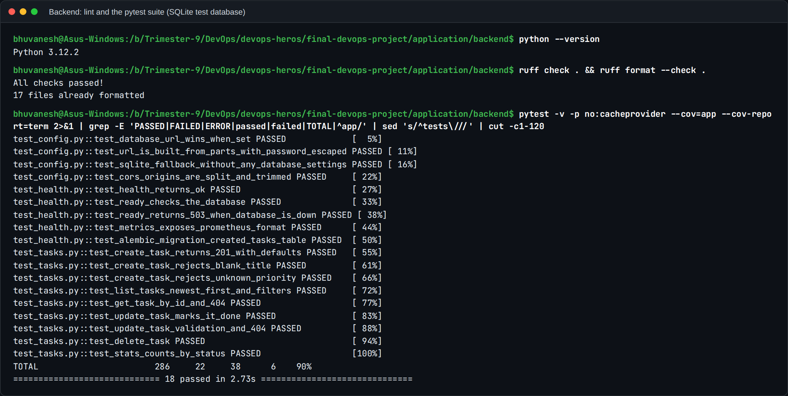

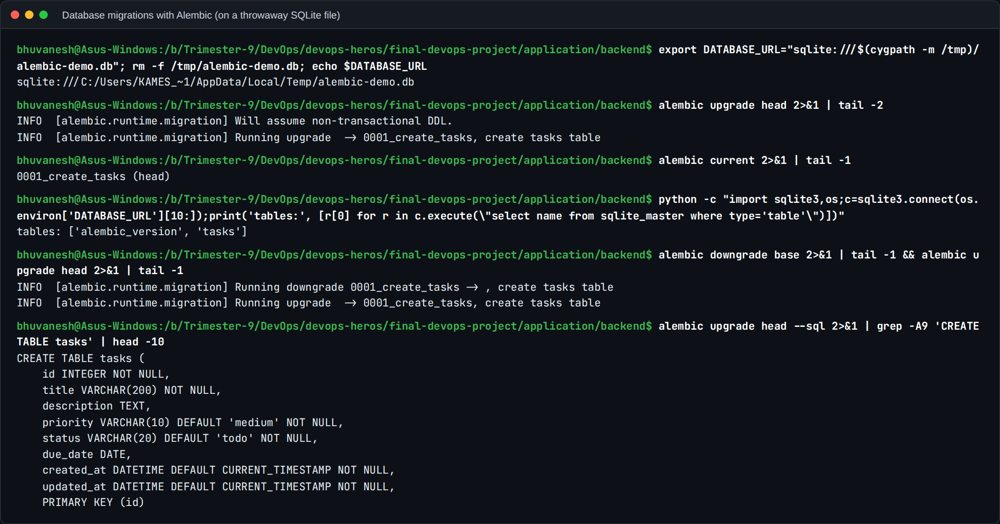
TaskFlow in a browser (Playwright), served through the minikube Ingress at `taskflow.local`, and the same calls made with curl:

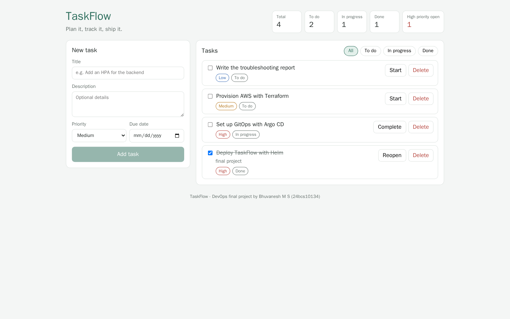

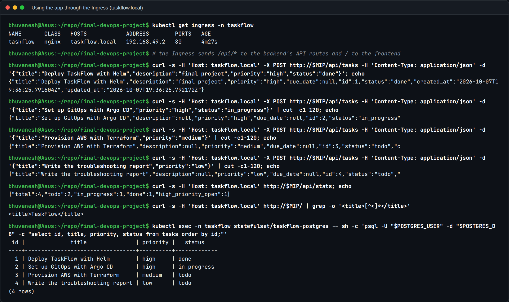

## Docker setup

Details: [docker/README.md](docker/README.md).

```bash
cd final-devops-project/docker
docker compose up --build
# UI  http://localhost:3000     API docs  http://localhost:8000/docs
```

- `docker/backend.Dockerfile`: multi-stage (venv builder, slim runtime). Runs
  as UID 10001 with a health check. `start.sh` waits for the database, runs
  `alembic upgrade head`, then starts uvicorn.
- `docker/frontend.Dockerfile`: multi-stage, Node 24 build then
  `nginx-unprivileged`. Runs as UID 101 on port 8080.
- Both images use `final-devops-project/` as the build context. The
  `.dockerignore` there is an allow-list.
- In compose, the app containers are read-only with `cap_drop: [ALL]` and
  `no-new-privileges`. Start-up is ordered with health checks
  (postgres → backend → frontend).

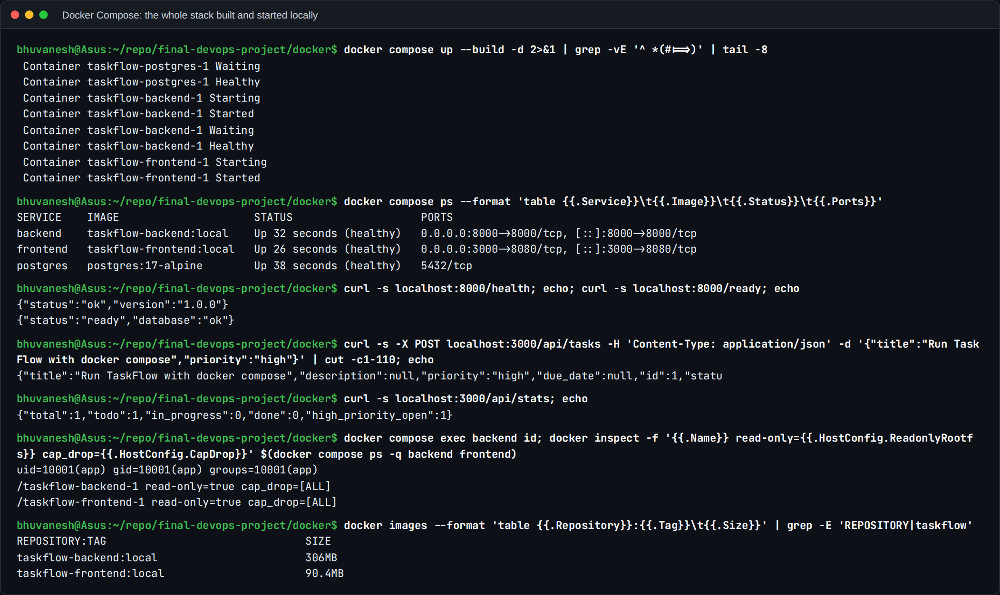

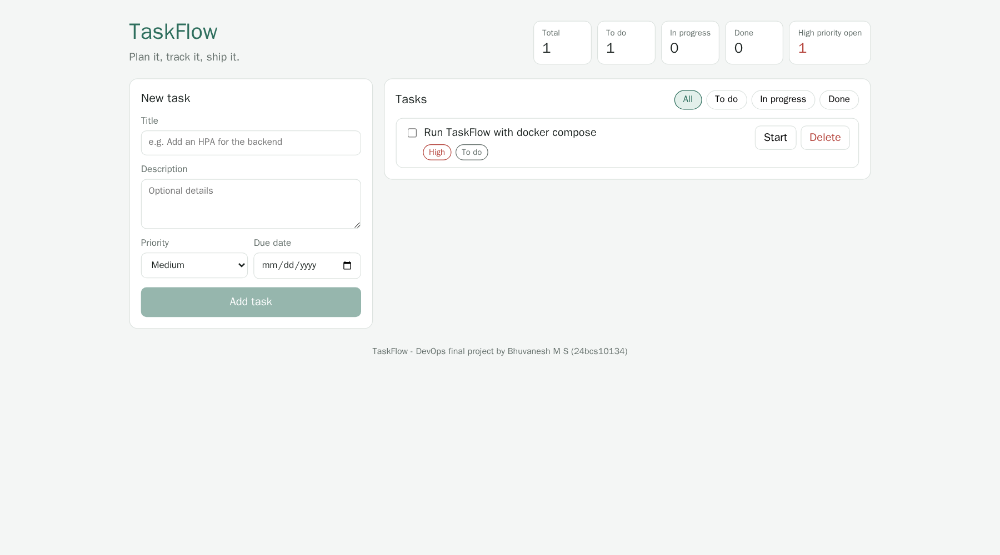

## Kubernetes deployment

Details: [kubernetes/README.md](kubernetes/README.md).

```bash
minikube addons enable ingress && minikube addons enable metrics-server
kubectl apply -k final-devops-project/kubernetes
kubectl -n taskflow get pods,svc,pvc,hpa,ingress
# hosts file: <minikube ip> taskflow.local   ->   http://taskflow.local
```

| Requirement | Where |
|---|---|
| Deployment | `backend.yaml`, `frontend.yaml` (2 replicas each, rolling update with `maxUnavailable: 0`) |
| Service | ClusterIP `taskflow-backend` :8000, `taskflow-frontend` :80, headless `taskflow-postgres` |
| ConfigMap | `taskflow-config` (DB host/port/name, log level, `BACKEND_URL`) |
| Secret | `taskflow-db` (`DB_USER`, `DB_PASSWORD`). Demo-only placeholder; create the real one with `kubectl create secret generic` |
| Ingress | `taskflow.local`, `/api` → backend, `/` → frontend, class `nginx` |
| HPA | `autoscaling/v2`, backend 2-6 (CPU 70 %, memory 80 %), frontend 2-4 |
| Probes | startup + liveness `/health`, readiness `/ready` (backend), `/healthz` (frontend), `pg_isready` (postgres) |
| Storage | PostgreSQL StatefulSet with a 1Gi PersistentVolumeClaim from `volumeClaimTemplates` |

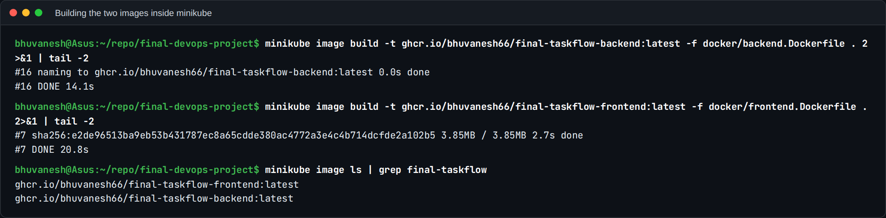

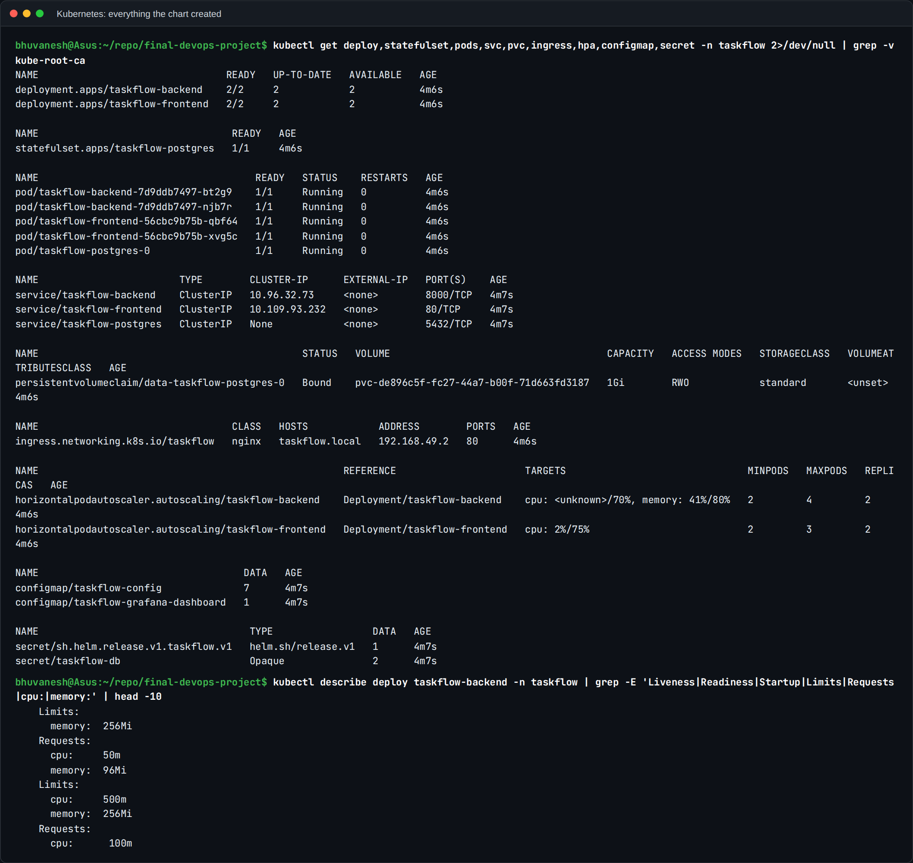
Under load (two busybox Pods calling `/api/tasks` in a loop) the backend HPA went from 2 to 4 replicas at 147 % CPU. On this 7 GB laptop the metrics-server lost its own metrics a minute later (`<unknown>`, and `kubectl top` failed), so the scale-down part is not in the screenshot.

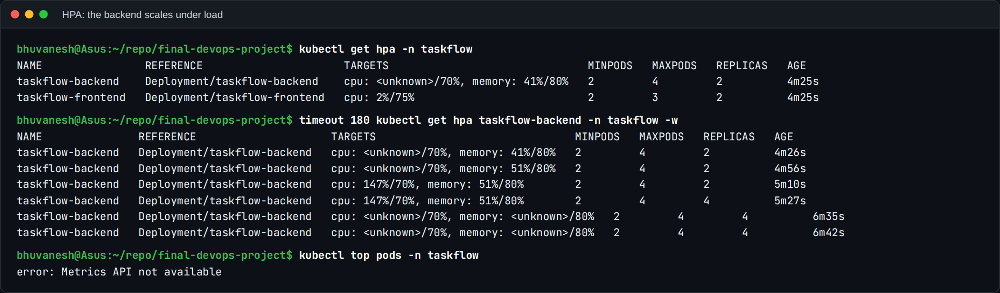

## Helm deployment

Details: [helm/README.md](helm/README.md).

```bash
helm upgrade --install taskflow final-devops-project/helm/taskflow -n taskflow --create-namespace \
  -f final-devops-project/helm/taskflow/values-dev.yaml \
  --set backend.image.tag=<commit-sha> --set frontend.image.tag=<commit-sha>
helm list -n taskflow
helm test taskflow -n taskflow --logs
```

The chart covers the same objects as the plain manifests. On top of that it has
`values-dev.yaml` / `values-prod.yaml`, checksum annotations that roll the pods
when the ConfigMap or Secret changes, a required DB password (no silent
default), `existingSecret` support, and toggles for the ServiceMonitor,
PrometheusRule and Grafana dashboard.

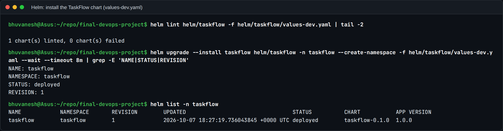

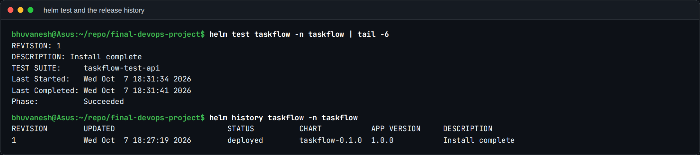

## Terraform infrastructure

Details and cost notes: [terraform/README.md](terraform/README.md).

```bash
cd final-devops-project/terraform
cp terraform.tfvars.example terraform.tfvars
terraform init && terraform fmt -check && terraform validate
terraform plan -out tfplan && terraform apply tfplan
terraform output app_url
terraform destroy
```

Terraform creates a VPC with **two public subnets in two AZs**, an Internet
Gateway and a route table. It adds a security group (HTTP in, SSH only from
listed CIDRs) and an IAM role and instance profile for SSM Session Manager.
The `t3.micro` EC2 host runs Amazon Linux 2023, with the AMI looked up through
the SSM public parameter, IMDSv2 only and an encrypted gp3 root volume. Its
user data installs Docker and the compose plugin, generates the database
password on the instance, and starts the GHCR images. The S3 artifact bucket
is versioned, encrypted, blocked from public access and TLS-only. ECR
repositories and an **EKS cluster with a managed node group** are optional
(`enable_ecr`, `enable_eks`), because EKS is not free tier. `default_tags` tag
every resource.

`terraform fmt`, `init` and `validate` pass, and CI runs the same checks (job 2). **`plan`, `apply` and `destroy` are still pending**: the AWS account for this coursework is waiting for AWS to finish activating it (S3 and EC2 calls return `NotSignedUp` / `OptInRequired`). These screenshots will be added when that is done.

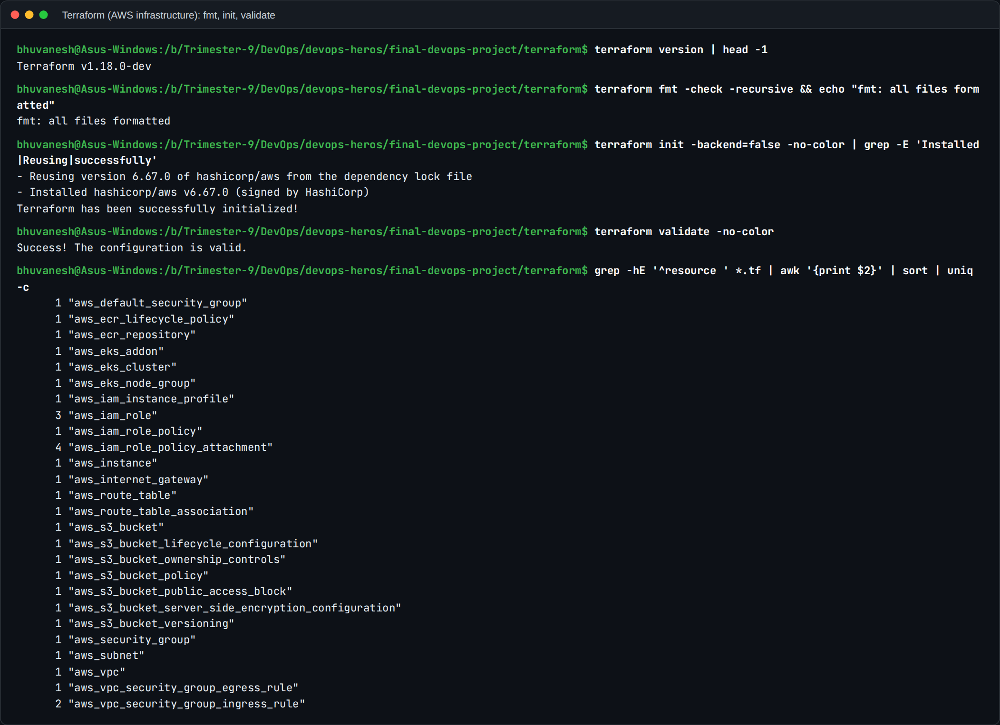

## CI/CD pipeline

Workflow: [`/.github/workflows/final-devops-project.yml`](../.github/workflows/final-devops-project.yml),
named **"Final DevOps Project - CI/CD + DevSecOps"**. It triggers on push and
pull request to `main` for `final-devops-project/**` and the workflow file
itself, and on `workflow_dispatch`. The default permission is
`contents: read`; only the jobs that need more ask for it
(`security-events: write`, `packages: write`).

| # | Job | What it does | Fails the build when |
|---|---|---|---|
| 1 | lint-test | ruff lint + format check, pytest with coverage (JUnit + summary), `npm ci` + `vite build` | lint error, any failing test, frontend build error |
| 2 | validate-iac | `helm lint` (dev + prod), `helm template` + `kubectl kustomize` (base + 9 troubleshooting overlays) through kubeconform, dashboard copies identical, `terraform fmt -check` + `validate` | invalid chart/manifest/HCL |
| 3 | sast | Semgrep (p/python, p/javascript, p/dockerfile + custom rules) and Bandit, SARIF to code scanning | (report only, gate decides) |
| 4 | sca | pip-audit, npm audit, Trivy fs | (report only) |
| 5 | secret-scan | Gitleaks on the project files and on the git history of the project | (report only) |
| 6 | docker-build | both images built once to tar files (tags `<sha>` and `latest`, OCI labels), then a smoke test: backend on SQLite (`/health`, `/ready`, POST), frontend proxying `/api` to it, both read-only with all capabilities dropped | build or smoke test error |
| 7 | image-scan | Trivy on each tar (JSON, table, SARIF) + CycloneDX SBOM | (report only) |
| 8 | security-gate | `security/gate.py` reads every report and decides | any blocking finding or missing report |
| 9 | push-images | verifies the image IDs match the scanned build, pushes `ghcr.io/bhuvanesh66/final-taskflow-backend` and `-frontend` as `:<sha>` and `:latest` | main only (push or manual), never on PRs |
| 10 | deploy | kind cluster, `kind load image-archive` of the scanned tars, `helm upgrade --install --wait` with the SHA tag and a random DB password, smoke tests through port-forward (`/health`, `/ready`, create + list through the backend and through the frontend's `/api` proxy, `/api/stats`, `/metrics`), `helm test`, `kubectl get all` in the job summary | rollout or any smoke test fails |

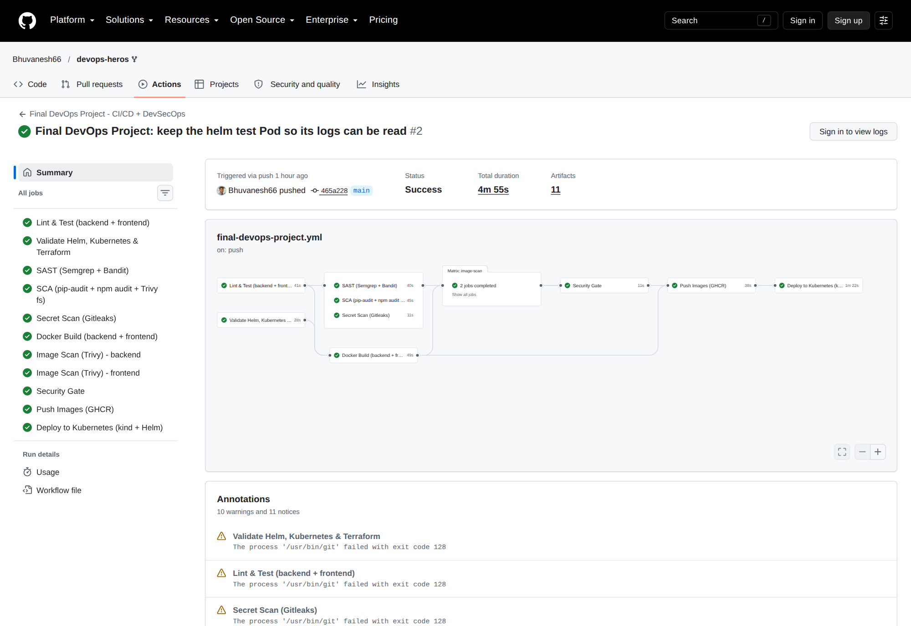

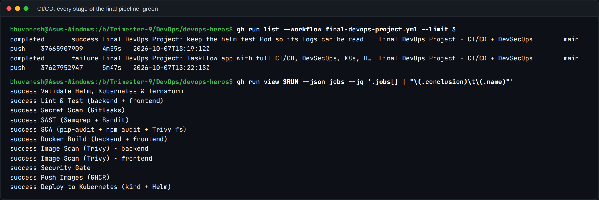

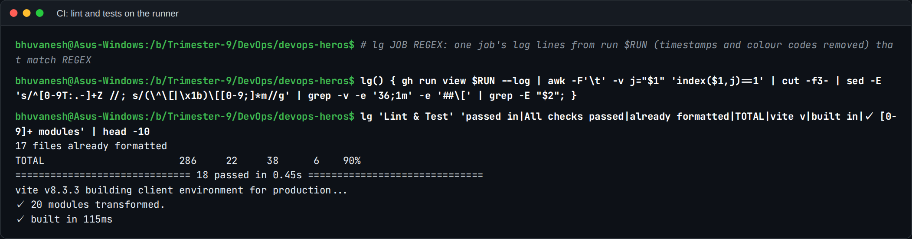

The first run of the pipeline failed in the very last step. Everything was deployed and `helm test` passed, but `helm test --logs` could not read the logs, because the hook policy `hook-succeeded` had already deleted the test Pod. Commit `465a228` keeps the Pod until the next test run, and the second run was green:

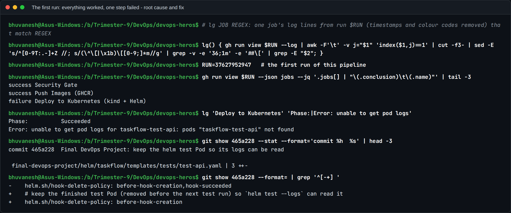
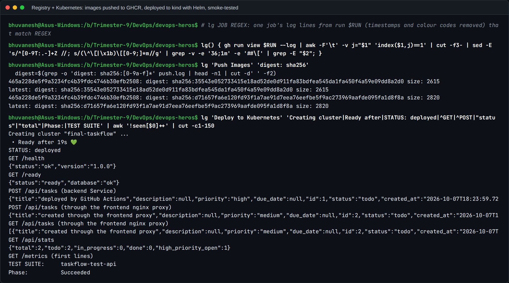

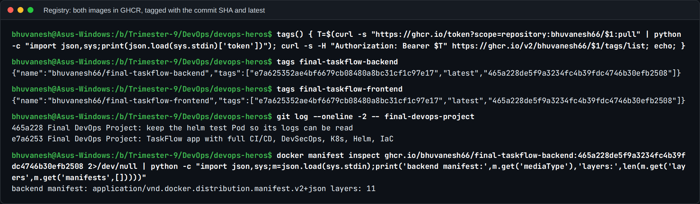

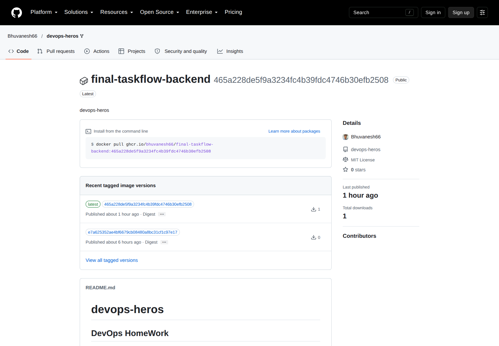

## DevSecOps implementation

Details: [security/README.md](security/README.md).

| Practice | Tool | Scope |
|---|---|---|
| SAST | Semgrep (registry + 7 custom Python rules), Bandit | backend, frontend, Dockerfiles |
| SCA | pip-audit, npm audit, Trivy fs | `requirements.txt`, `package-lock.json` |
| Secret scanning | Gitleaks (default rules) | current files **and** git history of this folder + the workflow |
| Container image scanning | Trivy (vuln + secret) + CycloneDX SBOM | backend and frontend images |
| Security gate | `security/gate.py` | one decision; blocks push and deploy |
| Supply chain | pinned Python/npm versions, lockfile installs, Trivy action pinned by commit SHA, scanned tar = pushed image (ID check) | |
| Runtime hardening | non-root UIDs, read-only root FS, `drop: ALL`, seccomp RuntimeDefault, no service account token, IMDSv2 on EC2 | |

Before the first push I checked the dependencies locally: `pip-audit` found
no known vulnerabilities in either requirements file, `npm audit` found 0, and
Bandit found no issues.

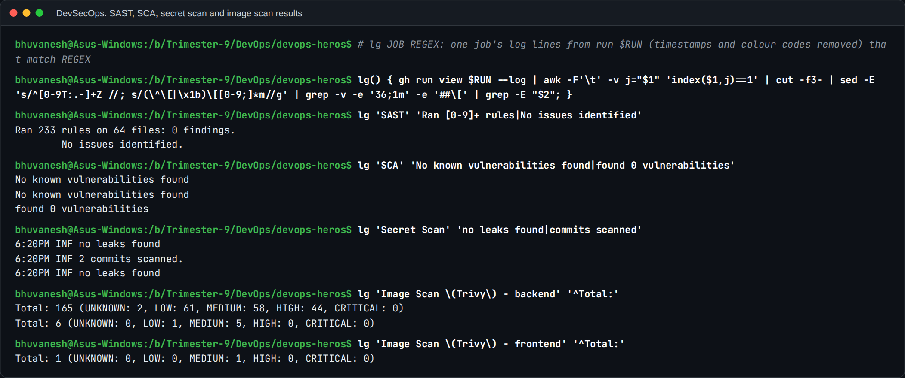

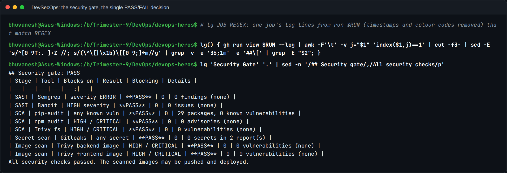

One honest note on the image scan. The full Trivy table for the backend image lists 44 HIGH findings, all in Debian base-image packages that have **no fixed version yet**. The gate runs Trivy with `--ignore-unfixed`, so it blocks on anything I can actually fix by upgrading, and it reports 0. The unfixed findings are not hidden: the image-scan job prints the full all-severities table in its log (shown above), and the CycloneDX SBOM lists every package, so they can be re-checked once Debian ships fixes.

## Monitoring

Details: [monitoring/README.md](monitoring/README.md).

- The backend exposes `/metrics`: HTTP request count, latency histograms and
  sizes from prometheus-fastapi-instrumentator, plus my own counters
  `taskflow_tasks_created_total{priority}`, `taskflow_tasks_completed_total`
  and `taskflow_tasks_deleted_total`.
- kube-prometheus-stack is installed from `monitoring/kube-prometheus-stack-values.yaml`.
  A ServiceMonitor scrapes the backend every 15 s.
- Alerts (PrometheusRule): **TaskFlowBackendDown**, **TaskFlowHighErrorRate**
  (5xx > 5 % for 5 min), **TaskFlowHighLatencyP95** (> 0.5 s for 5 min),
  **TaskFlowPodRestarting** (> 2 restarts in 15 min), TaskFlowHPAAtMaxReplicas.
- Grafana dashboard *TaskFlow - Application Overview* (ConfigMap labelled
  `grafana_dashboard: "1"`): targets up, request rate, 5xx ratio, p50/p95/p99
  latency, requests by endpoint and status class, tasks created/completed, CPU
  and memory per pod, HPA replicas, restarts.
- Logs: one JSON object per line on stdout (`kubectl logs`, or Loki with LogQL
  `| json`).

I took the Prometheus and Grafana evidence from their HTTP APIs. In a headless browser on this laptop the two web UIs never finished loading their JavaScript under the memory pressure.

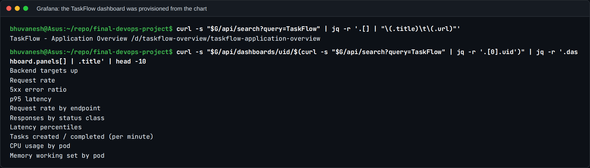
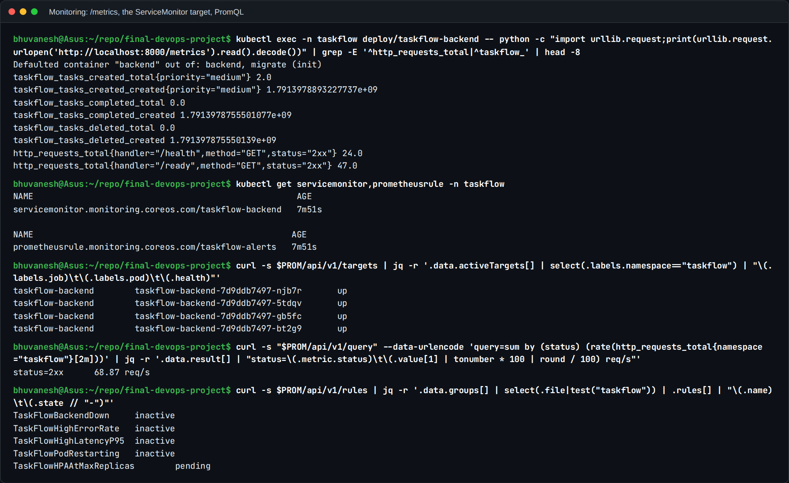

## GitOps

Details: [gitops/README.md](gitops/README.md).

`gitops/argocd-application.yaml` points Argo CD at
`https://github.com/Bhuvanesh66/devops-heros.git`, path
`final-devops-project/helm/taskflow`, values file `values-dev.yaml`,
destination namespace `taskflow`, with automated `prune` + `selfHeal` and
`CreateNamespace=true`. To promote a build, I change the image tags in
`values-dev.yaml` to the commit SHA CI pushed, commit and push; Argo CD syncs
it. A manual change in the cluster is reverted by self-heal, and a rollback is
a `git revert`.

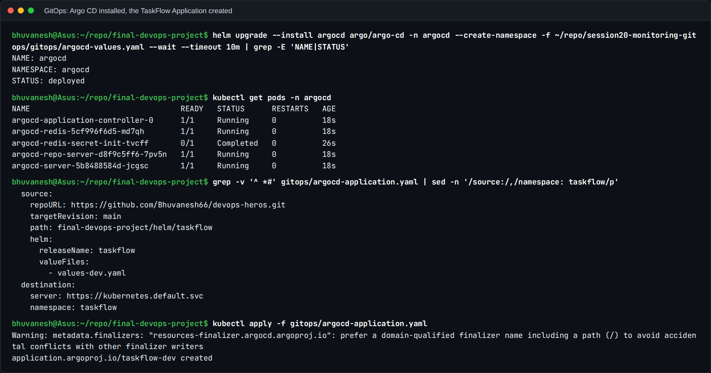

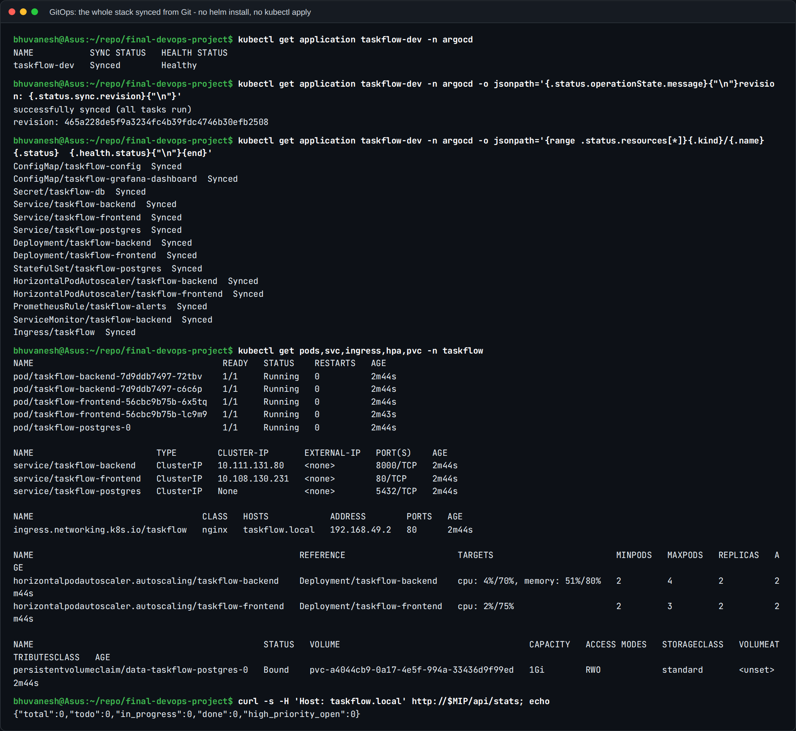

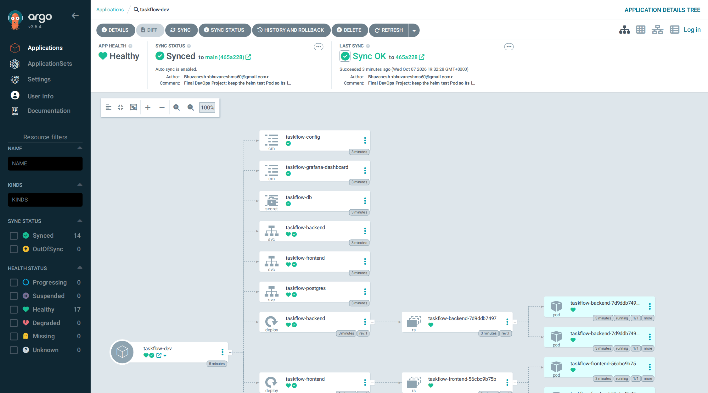
At first the app stayed **OutOfSync** because of the PostgreSQL StatefulSet. Kubernetes adds `apiVersion`, `kind`, `volumeMode` and an empty `status` to every `volumeClaimTemplate`. That field is immutable, so a sync can never make the live object match Git, and self-heal kept retrying. I found this by diffing the target and live state from the Argo CD API, then added an `ignoreDifferences` rule for `.spec.volumeClaimTemplates` with `RespectIgnoreDifferences=true` to `gitops/argocd-application.yaml`. After that the app was Synced, and a Service I deleted by hand was back 2 seconds later:

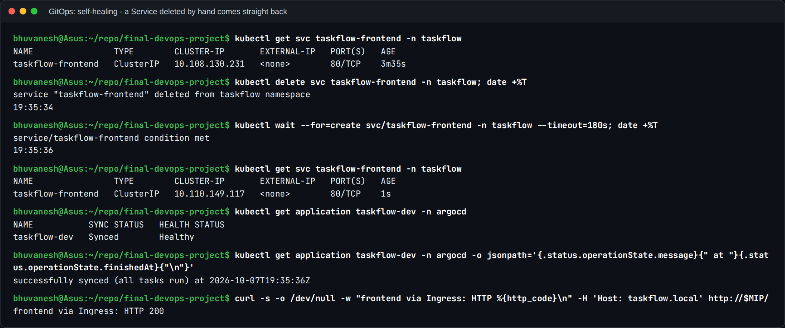

## Troubleshooting

Details and the full write-up: [troubleshooting/README.md](troubleshooting/README.md).

`troubleshooting/lab-base` deploys a healthy copy of the stack into its own
namespace `taskflow-lab`. Each `issue-N-*` overlay breaks one thing:

| # | Broken on purpose | Symptom |
|---|---|---|
| 1 | backend image tag does not exist | `ImagePullBackOff` |
| 2 | wrong `DB_HOST` in the ConfigMap | `Init:CrashLoopBackOff` (migrate initContainer) |
| 3 | Service selector does not match the pods | no endpoints, `/api` 502/503 |
| 4 | Service `targetPort` 8080 instead of 8000 | connection refused |
| 5 | readiness probe on `/readyz` | pods `0/1 READY`, rollout stuck |
| 6 | Secret key renamed `DB_PASS` | `CreateContainerConfigError` |
| 7 | backend container without `resources` | HPA `<unknown>` targets |
| 8 | frontend `BACKEND_URL` points at a missing Service | nginx `CrashLoopBackOff` |

For each issue the write-up covers the symptom, how I detected it, the root
cause, the fix and the verification.

Every issue, with the break, investigation, root cause, fix and verification, is in [troubleshooting/README.md](troubleshooting/README.md). Two examples:

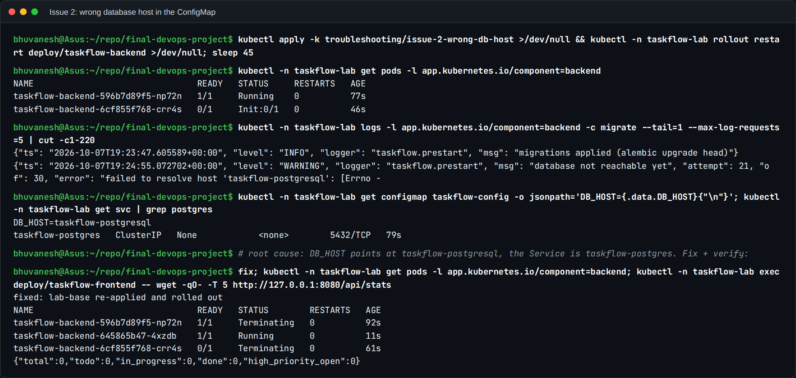

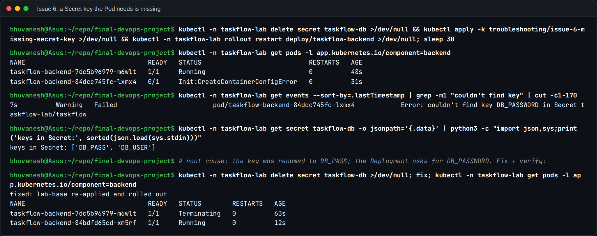

## Screenshots

| # | Evidence | Screenshots |
|---|---|---|
| 01 | `pytest -v` all passing | [10](images/10-local-tests.png), [11](images/11-alembic.png) |
| 02 | `docker compose up --build` | [13](images/13-compose-up.png), [13b](images/13b-compose-browser.png) |
| 03 | TaskFlow in the browser | [23b](images/23b-app-browser.png), [23](images/23-app-through-ingress.png) |
| 04 | green pipeline run graph | [01b](images/01b-actions-run.png), [01](images/01-pipeline-run.png), [02](images/02-ci-tests.png), [06](images/06-first-run-failure.png) |
| 04b | GHCR packages with SHA tags | [05](images/05-push-deploy.png), [07](images/07-ghcr-packages.png), [07b](images/07b-ghcr-package-page.png) |
| 05 | security gate summary | [03](images/03-security-scans.png), [04](images/04-security-gate.png) |
| 06 | `kubectl get pods,svc,pvc,ingress -n taskflow` | [20](images/20-build-images.png), [22](images/22-k8s-resources.png) |
| 07 | `helm list` / `helm test` | [21](images/21-helm-install.png), [24](images/24-helm-test.png) |
| 08 | HPA scaling under load | [25](images/25-hpa.png) |
| 09 | Grafana dashboard with live data | [27](images/27-grafana.png) (API) |
| 10 | Prometheus alerts | [26](images/26-metrics.png) (rules) |
| 11 | Argo CD application synced / self-heal | [30](images/30-argocd-install.png), [31](images/31-argocd-synced.png), [32](images/32-argocd-ui.png), [33](images/33-argocd-selfheal.png) |
| 12 | `terraform plan` | [12](images/12-terraform-validate.png) (validate); plan pending AWS activation |
| 13 | `terraform apply` + app on EC2 | pending AWS activation |
| 14 | AWS console (VPC, subnets, EC2) | pending AWS activation |
| 15 | `terraform destroy` | pending AWS activation |
| 16 | Prometheus targets UP | [26](images/26-metrics.png) (targets) |
| 17 | `curl /metrics` | [26](images/26-metrics.png) |
| 18 | a troubleshooting session | [40](images/40-lab-baseline.png), [41](images/41-issue-1.png) to [48](images/48-issue-8.png) |

## Lessons learned

- **Readiness is not liveness.** `/health` does not touch the database and
  `/ready` does. If liveness checked the database, one PostgreSQL hiccup would
  restart every backend pod at the same time and turn a short outage into a
  long one.
- **Migrations need an owner.** Two replicas starting together both try
  `alembic upgrade head`. Running it in an initContainer behind a PostgreSQL
  advisory lock makes that safe without a separate Job or Helm hook ordering.
- **Same-origin `/api` keeps the frontend simple.** nginx proxies `/api` to a
  `BACKEND_URL` rendered at container start, so one image works in compose,
  in Kubernetes and on EC2, with no CORS and no rebuild per environment.
- **Scanners report, the gate decides.** Running every tool in report-only
  mode and deciding in one script gives a single readable summary, and a
  missing report counts as a failure, so the gate can never pass by accident.
- **No default passwords.** The Helm chart refuses to render without a
  password or an existing Secret, and the EC2 host generates its own, so no
  usable credential ever lives in Git or in Terraform state.
- **Read-only root filesystems need a plan for every write.** My first
  frontend image mounted a tmpfs over `/etc/nginx/conf.d` so that the nginx
  entrypoint could render the `BACKEND_URL` template there. The tmpfs came up
  owned by root, the entrypoint logged `/etc/nginx/conf.d is not writable`,
  and nginx started with no server block, so every request was reset. Now the
  template renders to `/tmp/default.conf` (`NGINX_ENVSUBST_OUTPUT_DIR=/tmp`)
  and `conf.d/default.conf` is a symlink to it, so `/tmp` is the only writable
  path the container needs.
- **Small details from building it:** ruff sorted `alembic` as first-party
  because of the local `alembic/` folder. Vite 8's lockfile has to carry the
  native bindings for every platform, so `npm ci` works the same on Windows
  and on the Alpine build stage. `kubectl apply` merges `stringData` into the
  existing `data`, which is why issue 6 needs the Secret deleted first.

- **Argo CD and StatefulSets.** Defaults that the API server writes into an
  immutable field, here `volumeClaimTemplates`, leave an app OutOfSync forever.
  The fix is `ignoreDifferences` plus `RespectIgnoreDifferences=true`. The way
  to find it is to diff the target and live state, not to sync again.
- **`helm test --logs` needs the Pod.** With `hook-delete-policy:
  hook-succeeded` the test Pod is gone before its logs can be read, so the job
  failed although the test had passed. `before-hook-creation` alone keeps it
  until the next run.
- **Know your own routes.** The Ingress sends `/api/*` to the backend's API
  routes, so `/api/health` is a 404. The health checks live at `/health` and
  `/ready` on the Service itself, and through the Ingress I check `/api/stats`.
