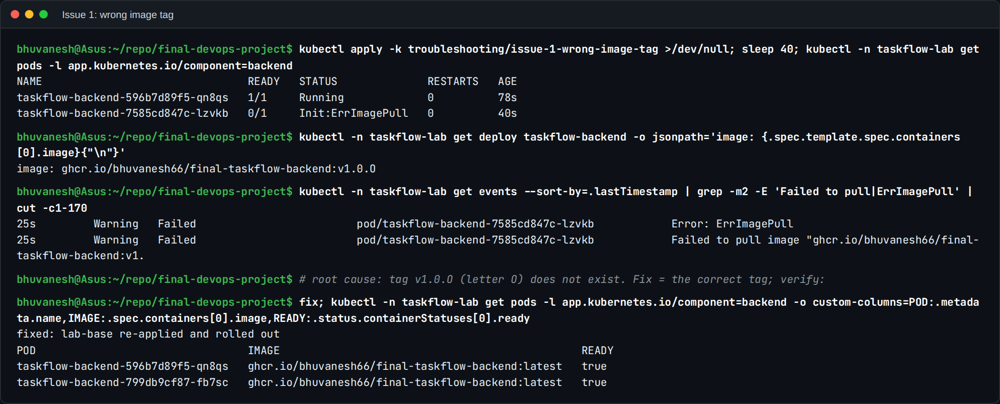
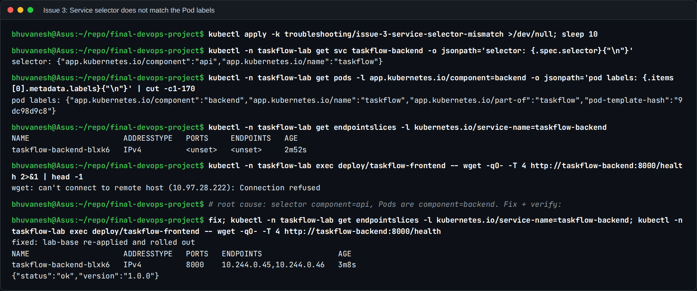
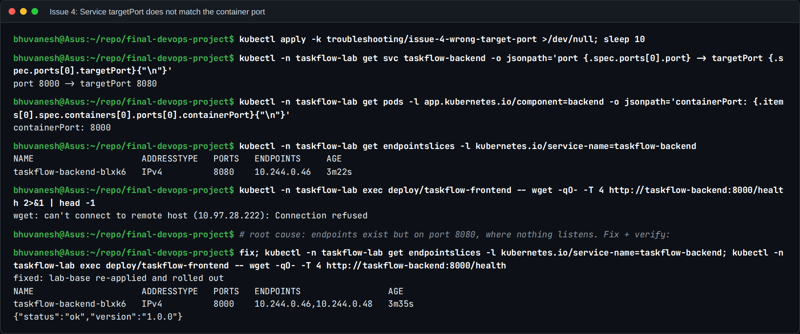
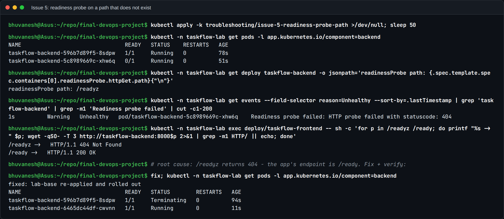
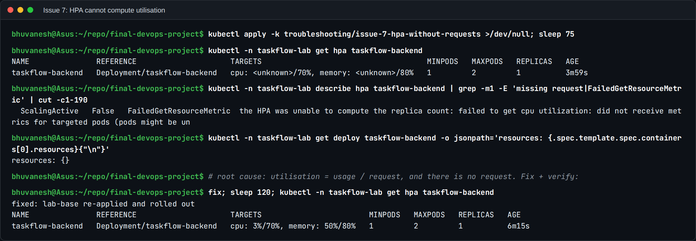
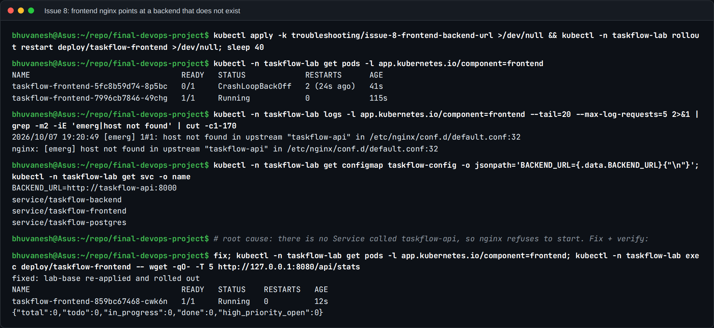
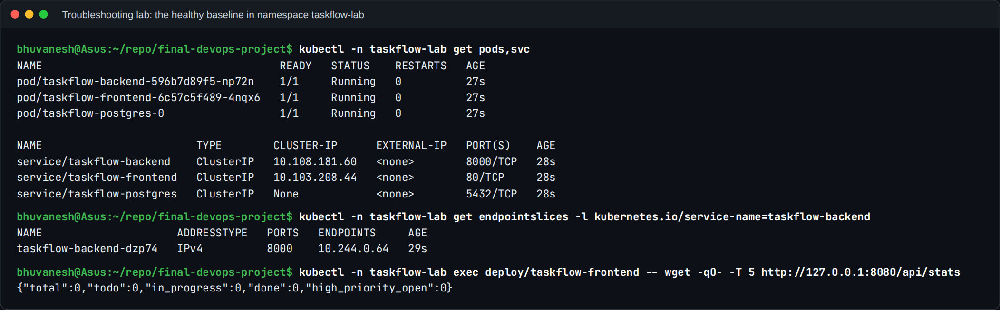

# Troubleshooting challenge

Eight issues are broken into the TaskFlow stack on purpose. Each one is a small
Kustomize overlay on top of `lab-base/`, which is a working copy of
`kubernetes/` in its own namespace, `taskflow-lab`. The broken variants never
touch the real deployment in namespace `taskflow`, which Argo CD may be
self-healing.

For every issue I follow the same loop: **identify** the symptom, **investigate**
with kubectl, find the **root cause**, **fix** it, **verify** the fix, and
**document** it here.

```bash
cd final-devops-project

# 0. healthy baseline (needs the images: GHCR packages public, or minikube image load)
kubectl apply -k troubleshooting/lab-base
kubectl -n taskflow-lab get pods,svc,endpoints,hpa

# 1. break it
kubectl apply -k troubleshooting/issue-3-service-selector-mismatch

# 2. investigate ... fix ... verify, then return to the baseline
kubectl apply -k troubleshooting/lab-base

# clean up the whole lab
kubectl delete namespace taskflow-lab
```

| # | Overlay | What is broken | First visible symptom |
|---|---|---|---|
| 1 | `issue-1-wrong-image-tag` | backend image tag `v1.0.O` does not exist | `ErrImagePull` / `ImagePullBackOff` |
| 2 | `issue-2-wrong-db-host` | ConfigMap `DB_HOST=taskflow-postgresql` | `Init:Error` then `Init:CrashLoopBackOff` |
| 3 | `issue-3-service-selector-mismatch` | Service selects `component: api` | Service has no endpoints, `/api` returns 502/503 |
| 4 | `issue-4-wrong-target-port` | Service `targetPort: 8080`, app listens on 8000 | endpoints exist but connections are refused |
| 5 | `issue-5-readiness-probe-path` | readiness probe on `/readyz` (404) | pods `Running` but `0/1 READY` |
| 6 | `issue-6-missing-secret-key` | Secret key renamed to `DB_PASS` | `CreateContainerConfigError` |
| 7 | `issue-7-hpa-without-requests` | backend container has no `resources` | HPA `TARGETS` shows `<unknown>` |
| 8 | `issue-8-frontend-backend-url` | nginx proxies to `http://taskflow-api:8000` | frontend `CrashLoopBackOff` |

The general toolbox I used:

```bash
kubectl -n taskflow-lab get pods -o wide
kubectl -n taskflow-lab describe pod <pod>          # Events at the bottom
kubectl -n taskflow-lab logs <pod> [-c migrate] [--previous]
kubectl -n taskflow-lab get endpointslices -l kubernetes.io/service-name=taskflow-backend
kubectl -n taskflow-lab get events --sort-by=.lastTimestamp
kubectl -n taskflow-lab run tmp --rm -it --image=curlimages/curl:8.22.0 --restart=Never -- sh
```

---

## Issue 1 - wrong image tag

**Symptom.** New backend pods never start. `kubectl get pods` shows
`ErrImagePull`, then `ImagePullBackOff`. The old ReplicaSet keeps serving
because the rollout uses `maxUnavailable: 0`, so the app may look "fine" while
the rollout is stuck.

**How to detect.**

```bash
kubectl apply -k troubleshooting/issue-1-wrong-image-tag
kubectl -n taskflow-lab get pods
kubectl -n taskflow-lab describe pod -l app.kubernetes.io/component=backend | sed -n '/Events/,$p'
kubectl -n taskflow-lab rollout status deploy/taskflow-backend --timeout=60s
kubectl -n taskflow-lab get deploy taskflow-backend -o jsonpath='{.spec.template.spec.containers[0].image}{"\n"}'
```

**Root cause, fix and verification.**

- **Root cause:** the Deployment asks for
  `ghcr.io/bhuvanesh66/final-taskflow-backend:v1.0.O`, with a capital letter O
  instead of a zero. No such tag exists in GHCR, so the kubelet gets
  `ErrImagePull`. The old Pod kept serving, because the rollout uses
  `maxUnavailable: 0`.
- **Fix:** put back the tag that CI actually pushed (re-apply `lab-base`). In
  the real pipeline the tag is always the commit SHA written by CI, never typed
  by hand.
- **Verification:** both backend Pods run the correct image and are `READY true`.



---

## Issue 2 - wrong database host in the ConfigMap

**Symptom.** Backend pods stay in `Init:0/1`, then `Init:Error` and
`Init:CrashLoopBackOff`. The `migrate` initContainer waits for the database
(30 attempts, 2 s apart) and then exits with code 1. The frontend shows
"Could not reach the API".

**How to detect.**

```bash
kubectl apply -k troubleshooting/issue-2-wrong-db-host
kubectl -n taskflow-lab rollout restart deploy/taskflow-backend   # pick up the new ConfigMap
kubectl -n taskflow-lab get pods -w
kubectl -n taskflow-lab logs deploy/taskflow-backend -c migrate
kubectl -n taskflow-lab get configmap taskflow-config -o yaml
kubectl -n taskflow-lab get svc
```

**Root cause, fix and verification.**

- **Root cause:** `DB_HOST=taskflow-postgresql`, but the PostgreSQL
  Service is called `taskflow-postgres`. The `migrate` initContainer logs
  `failed to resolve host 'taskflow-postgresql'` on every attempt, so the Pod
  stays in `Init:0/1`. A ConfigMap change does not restart Pods by itself, which
  is why the rollout restart is part of reproducing it.
- **Fix:** correct `DB_HOST` and restart the Deployment.
- **Verification:** the new Pod is `Running`, and `/api/stats` answers through
  the frontend, so the whole path frontend → backend → database works.


---

## Issue 3 - Service selector does not match the pods

**Symptom.** All pods are `Running` and `READY`, but every `/api` call fails:
through the Ingress it is a 503, through the frontend's nginx a 502. The
backend Service exists and has a ClusterIP, but it has no endpoints.

**How to detect.**

```bash
kubectl apply -k troubleshooting/issue-3-service-selector-mismatch
kubectl -n taskflow-lab get endpointslices -l kubernetes.io/service-name=taskflow-backend
kubectl -n taskflow-lab describe svc taskflow-backend        # Selector vs Endpoints
kubectl -n taskflow-lab get pods --show-labels -l app.kubernetes.io/name=taskflow
```

**Root cause, fix and verification.**

- **Root cause:** the Service selects `app.kubernetes.io/component: api`,
  but the Pods are labelled `component: backend`. The EndpointSlice is empty
  (`<unset>`), so a call to the ClusterIP is rejected at once
  (`Connection refused`) and never reaches a Pod.
- **Fix:** set the selector back to `component: backend`.
- **Verification:** the EndpointSlice lists both Pod IPs on port 8000, and
  `/health` through the Service returns `{"status":"ok"}`.



---

## Issue 4 - wrong targetPort

**Symptom.** The Service has endpoints, but they point at port 8080. Calls to
the Service time out or are refused, and nginx logs `connect() failed (111:
Connection refused) while connecting to upstream`.

**How to detect.**

```bash
kubectl apply -k troubleshooting/issue-4-wrong-target-port
kubectl -n taskflow-lab get endpointslices -l kubernetes.io/service-name=taskflow-backend -o wide
kubectl -n taskflow-lab get svc taskflow-backend -o jsonpath='{.spec.ports}{"\n"}'
kubectl -n taskflow-lab get pod -l app.kubernetes.io/component=backend \
  -o jsonpath='{.items[0].spec.containers[0].ports}{"\n"}'
kubectl -n taskflow-lab run tmp --rm -it --image=curlimages/curl:8.22.0 --restart=Never -- \
  curl -sv --max-time 5 http://taskflow-backend:8000/health
```

**Root cause, fix and verification.**

- **Root cause:** the Service forwards port 8000 to `targetPort: 8080`.
  The container listens on 8000. The endpoints exist, which is the confusing
  part, but nothing is listening on the port they point at.
- **Fix:** point `targetPort` back at the named container port `http` (as in `lab-base`), so a port change
  in the Pod cannot break the Service again.
- **Verification:** the EndpointSlice shows port 8000 and `/health` answers.



---

## Issue 5 - readiness probe on a path that does not exist

**Symptom.** The new backend pod is `Running` with `0/1` READY and never becomes
ready. `describe` shows `Readiness probe failed: HTTP probe failed with
statuscode: 404`. It is not restarted (only liveness failures restart a
container), it just never receives traffic, and the rollout hangs.

**How to detect.**

```bash
kubectl apply -k troubleshooting/issue-5-readiness-probe-path
kubectl -n taskflow-lab get pods
kubectl -n taskflow-lab describe pod -l app.kubernetes.io/component=backend | grep -A3 -i readiness
kubectl -n taskflow-lab logs deploy/taskflow-backend | tail     # the 404s are logged as JSON
```

**Root cause, fix and verification.**

- **Root cause:** the readiness probe asks for `/readyz`. The app serves
  `/ready`. The event says `HTTP probe failed with statuscode: 404`, and calling
  both paths from inside the cluster shows `/readyz -> 404` and
  `/ready -> 200`. The container is never restarted, because only liveness
  failures restart it, so the Pod just stays `0/1` and the rollout waits.
- **Fix:** probe `/ready`.
- **Verification:** the new Pod becomes `1/1` and the old one terminates.



---

## Issue 6 - Secret is missing the key the pods reference

The story: somebody recreated the Secret by hand and called the key `DB_PASS`.
To reproduce it, the old Secret has to go first, because `kubectl apply` merges
`stringData` into the existing `data` and would keep the old key:

```bash
kubectl -n taskflow-lab delete secret taskflow-db
kubectl apply -k troubleshooting/issue-6-missing-secret-key
kubectl -n taskflow-lab rollout restart deploy/taskflow-backend
```

**Symptom.** New backend pods are stuck in `CreateContainerConfigError`
(already in the `migrate` initContainer).

**How to detect.**

```bash
kubectl -n taskflow-lab get pods
kubectl -n taskflow-lab describe pod -l app.kubernetes.io/component=backend | sed -n '/Events/,$p'
kubectl -n taskflow-lab get secret taskflow-db -o jsonpath='{.data}' ; echo   # key names only matter here
```

**Root cause, fix and verification.**

- **Root cause:** the Secret only has the keys `DB_PASS` and `DB_USER`. The
  Deployment reads `DB_PASSWORD` with `secretKeyRef`, so the kubelet refuses to
  create the container: `couldn't find key DB_PASSWORD in Secret`.
- **Fix:** delete the hand-made Secret and recreate it with the expected key
  (re-apply `lab-base`). The delete matters, because `apply` would only merge
  keys.
- **Verification:** the new Pod is `Running 1/1`.


---

## Issue 7 - HPA without resource requests

**Symptom.** The application works, but the backend HPA never scales:
`kubectl get hpa` shows `cpu: <unknown>/70%` and `memory: <unknown>/80%`, and the
HPA events say `FailedGetResourceMetric ... missing request for cpu`.

**How to detect.**

```bash
kubectl apply -k troubleshooting/issue-7-hpa-without-requests
kubectl -n taskflow-lab get hpa
kubectl -n taskflow-lab describe hpa taskflow-backend
kubectl -n taskflow-lab get deploy taskflow-backend -o jsonpath='{.spec.template.spec.containers[0].resources}{"\n"}'
kubectl top pods -n taskflow-lab     # proves metrics-server itself works
```

**Root cause, fix and verification.**

- **Root cause:** the backend container has `resources: {}`. HPA utilisation is
  usage divided by the request, so without a request there is nothing to divide
  by, and both targets show `<unknown>`. The HPA condition is
  `ScalingActive False ... FailedGetResourceMetric`.
- **Fix:** add the requests and limits back (`cpu: 100m`, `memory: 128Mi` requested).
- **Verification:** two minutes later the HPA shows `cpu: 3%/70%, memory: 50%/80%`.



---

## Issue 8 - frontend proxies /api to a Service that does not exist

**Symptom.** Frontend pods go into `CrashLoopBackOff` right after start. The
logs end with `host not found in upstream "taskflow-api:8000"`: nginx resolves
`proxy_pass` hosts once at start-up and refuses to start when the name does not
resolve.

**How to detect.**

```bash
kubectl apply -k troubleshooting/issue-8-frontend-backend-url
kubectl -n taskflow-lab rollout restart deploy/taskflow-frontend
kubectl -n taskflow-lab get pods -l app.kubernetes.io/component=frontend
kubectl -n taskflow-lab logs deploy/taskflow-frontend --previous
kubectl -n taskflow-lab get configmap taskflow-config -o jsonpath='{.data.BACKEND_URL}{"\n"}'
kubectl -n taskflow-lab get svc
```

**Root cause, fix and verification.**

- **Root cause:** `BACKEND_URL=http://taskflow-api:8000`, and there is no
  Service called `taskflow-api` (only `taskflow-backend`, `taskflow-frontend` and
  `taskflow-postgres`). nginx resolves `proxy_pass` hosts once at start-up, so
  it stops with `[emerg] host not found in upstream "taskflow-api"` and the Pod
  goes into `CrashLoopBackOff`.
- **Fix:** `BACKEND_URL=http://taskflow-backend:8000` and restart the frontend.
- **Verification:** the new frontend Pod is `Running`, and `/api/stats` through
  its nginx proxy returns JSON.



---

## What I took away

The healthy baseline every issue starts from and returns to:



- **Read the status column first.** `ErrImagePull`, `Init:0/1`,
  `CreateContainerConfigError`, `0/1 Running` and `CrashLoopBackOff` each point
  at a different layer before I open a single log.
- **Running is not working.** In issues 3 and 4 every Pod was green. The
  problem was only visible in the EndpointSlice, so I check endpoints whenever
  "the Pods are fine but nothing answers".
- **Config changes need a restart.** Changing a ConfigMap or Secret does not
  restart Pods that read it through environment variables. The Helm chart rolls
  them with checksum annotations, and in the lab I used `rollout restart`.
- **Always verify through the real path.** A fix counts only after a request
  goes through the same route a user's request takes (frontend → backend →
  database), not just after the Pod turns green.
- **Make the broken state hard to reach.** Named ports, image tags written by
  CI, and a chart that refuses to render without a password each remove one of
  these mistakes for good.
