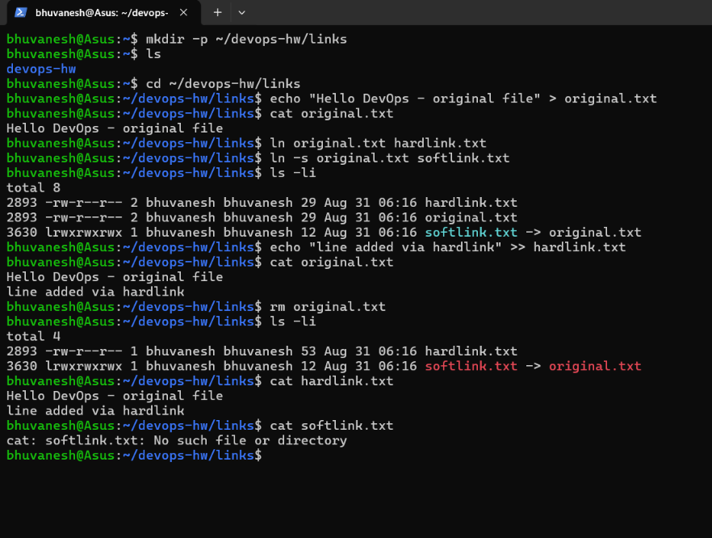
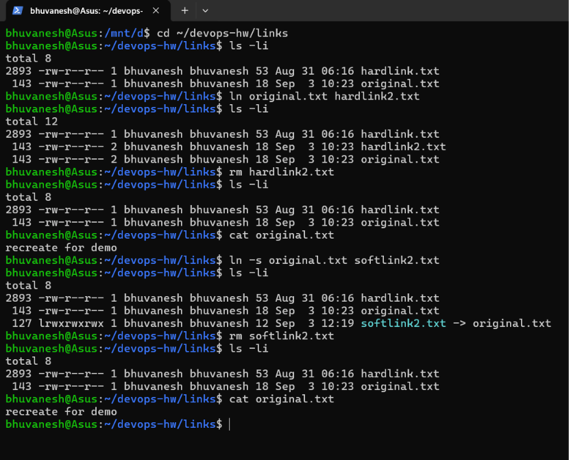
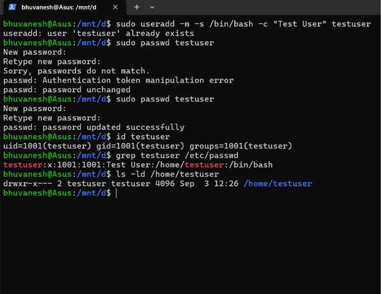
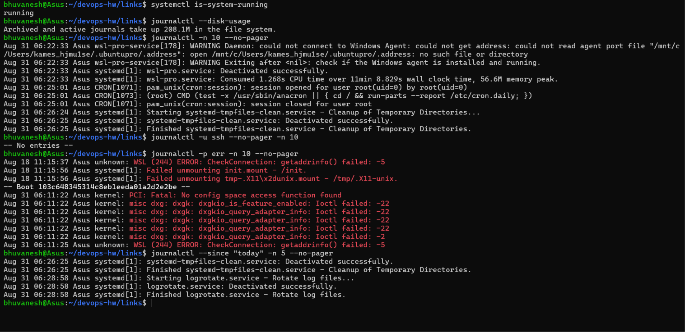
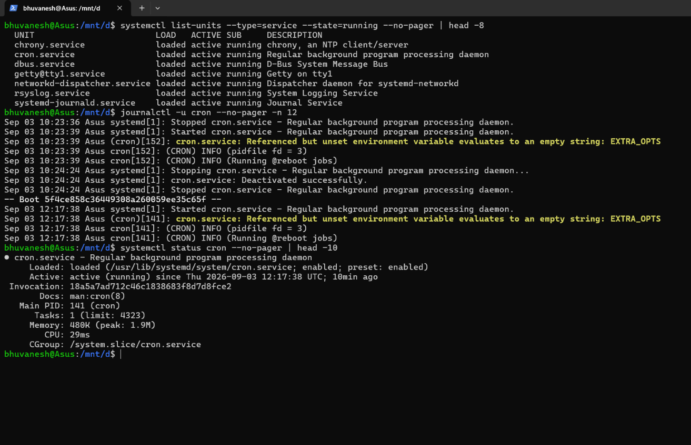
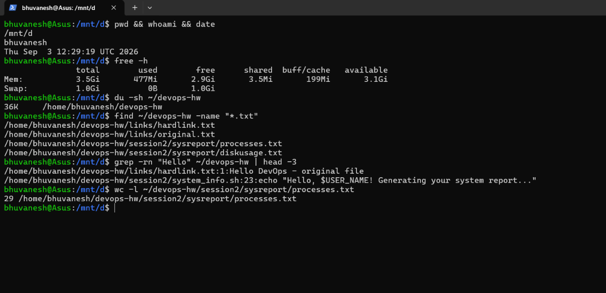

# Session 1 — DevOps Engineer Roadmap (Homework Submission)

**Name:** Bhuvanesh M S (24bcs10134)
**Environment used:** Ubuntu on WSL 2 (Windows 11)

Homework tasks assigned in class:

1. **Soft link & hard link** — the difference, the commands to create both, and practice
   creating and deleting them (interview question)
2. **`adduser` vs `useradd`** — the difference, which is preferred on Ubuntu and why, and
   creating a test user with the recommended command
3. **`journalctl`** — what it is used for, how to view system and service logs, and checking
   the logs of a specific service
4. **Linux command cheat sheet** — review it, practise the important commands, and understand
   the purpose and basic usage of each

---

## 1. Soft Links vs Hard Links

A **hard link** is a second name pointing to the _same inode_ — the same physical data on
disk. The file's link count increases, and the data survives as long as at least one link
remains.

A **soft link** (symbolic link) is a small, separate file that simply stores the _path_ of
the target. It has its own inode, and if the target disappears the link is left dangling.

### Commands used

```bash
mkdir -p ~/devops-hw/links
cd ~/devops-hw/links

echo "Hello DevOps - original file" > original.txt

ln    original.txt hardlink.txt    # hard link
ln -s original.txt softlink.txt    # soft link

ls -li                             # -i shows inode numbers

echo "line added via hardlink" >> hardlink.txt
cat original.txt                   # original reflects the change

rm original.txt                    # delete the original
ls -li
cat hardlink.txt                   # still works
cat softlink.txt                   # broken
```

### Practical demonstration (screenshot)



### Observations from the output above

- After `ls -li`, `original.txt` and `hardlink.txt` both show inode **2893** and a link
  count of **2** — they are two names for one file. `softlink.txt` has a different inode
  (**3630**), permissions beginning with `l`, and a size of only **12 bytes** (the length
  of the string `original.txt`), displayed as `softlink.txt -> original.txt`.
- Appending through `hardlink.txt` immediately changed the content read back from
  `original.txt`, confirming both names refer to the same data.
- After `rm original.txt`, the link count on inode 2893 dropped from **2 to 1**, but the
  data was **not** deleted — `cat hardlink.txt` still printed both lines (size now 53 bytes).
- `cat softlink.txt` failed with `No such file or directory`. The symlink still exists, but
  the path it stores no longer resolves — it is now a **broken / dangling link**.

### Deleting soft links and hard links

```bash
cd ~/devops-hw/links
ls -li                            # starting state

ln original.txt hardlink2.txt     # create a hard link
ls -li                            # link count is now 2

rm hardlink2.txt                  # DELETE the hard link
ls -li                            # count back to 1
cat original.txt                  # data survived

ln -s original.txt softlink2.txt  # create a soft link
ls -li
rm softlink2.txt                  # DELETE the soft link
ls -li                            # target untouched
cat original.txt
```



**Observations from the output above**

- Deleting a link uses the ordinary `rm` command — there is no special "delete link"
  command. `rm` removes a **name**, not necessarily the data behind it.
- After `ln original.txt hardlink2.txt`, both names share inode **143** and the link count
  rises to **2**.
- After `rm hardlink2.txt` the count on inode 143 falls back to **1**, and
  `cat original.txt` still prints `recreate for demo`. The kernel frees the data only when
  the link count reaches **zero**, so deleting one hard link never destroys the file.
- The soft link `softlink2.txt` gets its **own** inode (**127**), a size of **12 bytes** (the
  length of the path string `original.txt`), and permissions `lrwxrwxrwx` starting with `l`.
- After `rm softlink2.txt`, `original.txt` is completely unaffected — deleting a symlink
  removes only the pointer, never the target.
- This is the reverse of the earlier demonstration: deleting the **target** leaves the soft
  link dangling, while deleting the **link** leaves the target intact.

### Summary table

| Property                        | Hard Link                   | Soft Link (Symbolic Link)       |
| ------------------------------- | --------------------------- | ------------------------------- |
| Command                         | `ln target link`            | `ln -s target link`             |
| Inode                           | Same inode as the target    | Its own separate inode          |
| Points to                       | The data (inode) directly   | The _pathname_ of the target    |
| If target is deleted            | Still works, data intact    | Breaks (dangling link)          |
| Across filesystems / partitions | Not allowed                 | Allowed                         |
| Link to a directory             | Not allowed (normal users)  | Allowed                         |
| Size                            | Same as the file            | Length of the stored path       |
| Shown by `ls -l` as             | `-rw-r--r--` (regular file) | `lrwxrwxrwx ... link -> target` |

**Where it matters in DevOps:** symlinks are used constantly for release/versioning
patterns (`/opt/app/current -> /opt/app/releases/v1.4.2`), for `/etc/nginx/sites-enabled`,
and for `alternatives`-managed binaries such as `java` or `python`.

---

## 2. `adduser` vs `useradd`

|                              | `useradd`                                          | `adduser`                                          |
| ---------------------------- | -------------------------------------------------- | -------------------------------------------------- |
| Type                         | Low-level **binary** utility                       | High-level **Perl script** wrapping `useradd`      |
| Availability                 | POSIX-standard, present on _every_ Linux distro    | Debian/Ubuntu family (differs on RHEL)             |
| Behaviour                    | Non-interactive; does the bare minimum             | Interactive; prompts for password, full name, etc. |
| Home directory               | **Not** created unless you pass `-m`               | Created automatically                              |
| Password                     | Account left locked until you run `passwd`         | Prompts for one during creation                    |
| Shell                        | Defaults to `/bin/sh` or none unless `-s` is given | Sets a sensible login shell                        |
| Skeleton files (`/etc/skel`) | Copied only with `-m`                              | Copied automatically                               |
| Best suited for              | Scripts, automation, Ansible/Dockerfiles           | Manual, one-off admin work at a terminal           |

```bash
# useradd - everything must be stated explicitly
sudo useradd -m -s /bin/bash -c "Test User" testuser
sudo passwd testuser

# adduser - guided and interactive
sudo adduser testuser
```

**Which is the standard/default one?**
`useradd` is the standard, portable command — it is part of the `shadow-utils` package and
exists on every Linux distribution, which is why it is the one used in scripts, Dockerfiles
and configuration-management tools.

**Why `adduser` is not preferred:** it is a distribution-specific convenience wrapper, not a
standard tool. On Debian/Ubuntu it is a friendly interactive script, but on RHEL/CentOS
`adduser` is merely a symlink to `useradd` and behaves completely differently. Because it is
interactive by design, it also blocks waiting for input, which breaks unattended automation.
Portable, repeatable scripts therefore use `useradd`; `adduser` is fine for a human typing at
a Debian/Ubuntu prompt.

### Creating a test user with the recommended command

`useradd` is the recommended command, so the test user was created with it:

```bash
sudo useradd -m -s /bin/bash -c "Test User" testuser
sudo passwd testuser        # set the password
id testuser                 # confirm UID / GID / groups
grep testuser /etc/passwd   # confirm the account entry
ls -ld /home/testuser       # confirm the home directory
```



**Observations from the output above**

- `useradd` reported **`user 'testuser' already exists`** — the command refuses to overwrite
  an existing account, which is exactly the safe behaviour wanted in automation. The account
  had already been created by an earlier run of the same command.
- `sudo passwd testuser` failed the first time with **`Sorry, passwords do not match`** and
  `Authentication token manipulation error`, because the two typed entries differed. Retrying
  gave **`password updated successfully`**. Nothing is echoed while typing a password — that
  is normal.
- `id testuser` returned `uid=1001(testuser) gid=1001(testuser) groups=1001(testuser)`,
  confirming Linux also created a **group of the same name** alongside the user.
- `grep testuser /etc/passwd` shows the full account record:
  `testuser:x:1001:1001:Test User:/home/testuser:/bin/bash`. Reading the fields left to right:
  username, `x` (the password is stored in the shadow file, not here), UID, GID, the comment
  set by `-c`, the home directory, and the login shell set by `-s`.
- `ls -ld /home/testuser` shows `drwxr-x---` owned by `testuser:testuser`, proving the `-m`
  flag created the home directory. Without `-m`, `useradd` would have made the account with
  **no home directory at all** — the single most common mistake with this command.
- To remove the account afterwards: `sudo userdel -r testuser` (`-r` also deletes the home
  directory).

---

## 3. The `journalctl` Command

`journalctl` is the tool used to **query and view logs collected by `systemd-journald`**,
the logging service of systemd. Instead of reading scattered plain-text files under
`/var/log`, journald stores logs in a structured, indexed binary format that carries
metadata — timestamp, service unit, PID, UID, priority — so logs can be filtered precisely.

### Commonly used options

```bash
journalctl                          # all logs, oldest first
journalctl -n 50                    # last 50 lines
journalctl -f                       # follow live (like tail -f)
journalctl -u nginx.service         # logs for one specific service/unit
journalctl -u nginx -f              # follow one service live
journalctl -b                       # logs from the current boot
journalctl -b -1                    # logs from the previous boot
journalctl -p err                   # only priority "error" and worse
journalctl --since "1 hour ago"
journalctl --since "2026-08-31 09:00" --until "2026-08-31 10:00"
journalctl -k                       # kernel messages (like dmesg)
journalctl -u ssh -o json-pretty    # structured output for parsing
journalctl --disk-usage             # space consumed by the journal
sudo journalctl --vacuum-time=7d    # keep only the last 7 days
```

**Why it matters in DevOps:** it is the first command reached for when a service fails to
start. `systemctl status myapp` shows only the last few lines, whereas
`journalctl -u myapp -n 100 --no-pager` gives the full failure trace, and
`journalctl -u myapp -f` lets you watch a deployment in real time.

### Practical demonstration (screenshot)

Commands run in the capture below:

```bash
systemctl is-system-running            # confirm systemd is active
journalctl --disk-usage                # space used by the journal
journalctl -n 10 --no-pager            # last 10 entries
journalctl -u ssh --no-pager -n 10     # filter by service/unit
journalctl -p err -n 10 --no-pager     # filter by priority (errors only)
journalctl --since "today" -n 5 --no-pager   # filter by time
```



### Observations from the output above

- `systemctl is-system-running` returned **running**, confirming systemd is active — this is
  a prerequisite, because `journalctl` reads the journal that `systemd-journald` maintains.
- `journalctl --disk-usage` reported **208.1M** of archived and active journals. This is why
  retention commands such as `--vacuum-time` and `--vacuum-size` exist.
- `journalctl -n 10` shows a **unified stream**: entries from `wsl-pro-service`, `systemd`
  and `CRON` interleaved in time order. Every line carries a timestamp, the hostname
  (`Asus`), and the process name with its PID (`systemd[1]`, `CRON[1071]`) — the structured
  metadata that plain text log files do not provide.
- `journalctl -u ssh` returned **`-- No entries --`**, correctly showing that the SSH service
  has produced no logs on this machine. This demonstrates unit-level filtering.
- `journalctl -p err` shows **only error-priority entries**, highlighted in red, and includes
  a `-- Boot <id> --` marker separating one boot from the next — which is how `-b` and `-b -1`
  can select logs by boot session.
- `journalctl --since "today"` limits output to the current day, showing `logrotate.service`
  and `systemd-tmpfiles-clean.service` activity.
- `--no-pager` was used throughout so output prints directly to the terminal instead of
  opening in the `less` pager.


### Checking logs for a specific service

```bash
systemctl list-units --type=service --state=running --no-pager | head -8
journalctl -u cron --no-pager -n 12       # logs for one specific service
systemctl status cron --no-pager | head -10
```



**Observations from the output above**

- `systemctl list-units --type=service --state=running` was run first to find a service that
  is actually running and therefore has logs worth reading — `chrony`, `cron`, `dbus`,
  `rsyslog` and `systemd-journald` are all active here.
- `journalctl -u cron` filters the system-wide journal down to **one unit**, showing the
  service's full lifecycle: stopped at 10:23:36, started at 10:23:39, stopped again at
  10:24:24, and started at 12:17:38.
- The `-- Boot 5f4ce858c36449308a260059ee35c65f --` marker separates the previous boot from
  the current one. This is what makes `journalctl -b` (current boot) and `-b -1` (previous
  boot) possible.
- The highlighted warning `Referenced but unset environment variable ... EXTRA_OPTS` is a
  real configuration detail that appears **only** in the journal — it is not printed anywhere
  on screen when the service starts.
- `systemctl status cron` gives the **current** state: `active (running) since Thu
  2026-09-03 12:17:38 UTC; 10min ago`, `Main PID: 141`, memory 480K and its CGroup.
- The practical difference: `systemctl status` tells you **whether** a service is healthy and
  shows only a few recent lines, while `journalctl -u` gives the **full history** and tells
  you **why** it is not. In a real incident you run `systemctl status` first, then
  `journalctl -u <service> -n 100` to read the failure.

---

## 4. Linux Command Cheat Sheet

Key commands reviewed from the session cheat sheet:

| Category            | Commands                                                             |
| ------------------- | -------------------------------------------------------------------- |
| Navigation          | `pwd`, `ls -la`, `cd`, `tree`                                        |
| Files & directories | `touch`, `mkdir -p`, `cp -r`, `mv`, `rm -rf`, `ln`, `ln -s`          |
| Viewing content     | `cat`, `less`, `head -n`, `tail -f`, `wc -l`                         |
| Searching           | `find`, `grep -r`, `which`, `locate`                                 |
| Permissions         | `chmod`, `chown`, `chgrp`, `umask`, `sudo`                           |
| Users & groups      | `useradd`, `usermod`, `passwd`, `groupadd`, `id`, `whoami`           |
| Processes           | `ps aux`, `top`, `htop`, `kill -9`, `jobs`, `bg`, `fg`               |
| Services            | `systemctl start/stop/status/enable`, `journalctl`                   |
| Disk & memory       | `df -h`, `du -sh`, `free -h`, `lsblk`, `mount`                       |
| Networking          | `ip a`, `ping`, `netstat -tulnp`, `ss`, `curl`, `wget`, `ssh`, `scp` |
| Archiving           | `tar -czvf`, `tar -xzvf`, `zip`, `unzip`                             |
| Text processing     | `sed`, `awk`, `cut`, `sort`, `uniq`, `tr`                            |
| Packages            | `apt update`, `apt install`, `yum`, `dnf`, `rpm`                     |
| Help                | `man`, `--help`, `whatis`, `history`                                 |

Reference PDF included in this folder: [devops1-83.pdf](devops1-83.pdf)

### Practising the commands

```bash
pwd && whoami && date
free -h
du -sh ~/devops-hw
find ~/devops-hw -name "*.txt"
grep -rn "Hello" ~/devops-hw | head -3
wc -l ~/devops-hw/session2/sysreport/processes.txt
```



**Observations from the output above**

- `pwd`, `whoami`, `date` — the basic "where am I / who am I / what time is it" trio. `pwd`
  returned `/mnt/d`, which is the Windows **D: drive** as mounted inside WSL.
- `free -h` — 3.5Gi total memory, 477Mi used and 3.1Gi available. The `-h` flag prints
  human-readable sizes instead of raw kilobytes. Note that **available** is the number that
  matters, not **free**, because cached memory can be reclaimed on demand.
- `du -sh ~/devops-hw` — **d**isk **u**sage of one directory (36K), where `-s` summarises
  instead of listing every file. This differs from `df`, which reports whole **filesystems**
  rather than directories.
- `find ~/devops-hw -name "*.txt"` — searches by **filename** and located all four text files
  created across sessions 1 and 2.
- `grep -rn "Hello" ~/devops-hw` — searches **inside** file contents, with `-r` for recursive
  and `-n` to print line numbers. It found the text in `hardlink.txt` at line 1 and in
  `system_info.sh` at line 23. In short: `find` locates files by name, `grep` looks within them.
- `wc -l` — counted **29 lines** in `processes.txt`, confirming that the `>` redirection in
  the Session 2 script really wrote the process list rather than leaving an empty file.
- `|` (the pipe) was used to feed the output of one command into another, as in
  `grep ... | head -3` — the building block of nearly all real shell work.
