# Kubernetes Pods, ReplicaSets & Deployments (Homework Submission)

**Name:** Bhuvanesh M S
**Enrollment number:** 24bcs10134
**Environment:** Ubuntu 26.04 LTS on WSL 2 (Windows 11) · minikube v1.39.0 (docker driver) ·
Kubernetes v1.37.0 · containerd 2.3.4

Resources:

- https://github.com/Nency-Ravaliya/Kubernetes
- https://github.com/Nency-Ravaliya/Kubernetes/blob/main/core-objects.md
- https://kubernetes.io/docs/concepts/workloads/

---

## Homework tasks

1. Work through **all 12 files** in `pod-lifecycle/` in order — `kubectl apply -f`,
   `kubectl get pods -w`, `kubectl describe pod`, `kubectl logs` for each, including the ones
   not walked through live (readiness, liveness, startup, init container, multi-container,
   graceful termination).
2. Deploy the **`yatri-backend-rs` ReplicaSet**, confirm 3 Pods, then scale up and down with
   `kubectl scale`.
3. Deploy **`deployment-v1.yaml`**, confirm with `kubectl get all`, then
   `kubectl scale deployment yatri-backend --replicas=5`.
4. Deploy **`deployment-v2.yaml`** over the running V1 and watch the rolling update live with
   `kubectl get pods -w`.
5. Deliberately run **`troubleshooting/selector-mismatch.yaml`** and
   **`troubleshooting/broken-image.yaml`** to see what those failures actually look like.
6. Build a **4-revision history (V1 → V4)** and practise rolling back **directly from V4 to
   V1** with a targeted `--to-revision` rollback.
7. Write up **ReplicaSet vs Deployment**, and research **StatefulSet vs DaemonSet vs
   Deployment** (StatefulSet was not taught live — homework research).

### Files in this folder

```
session10-k8s-core-objects/
├── pod-lifecycle/             12 lifecycle manifests + index README
├── troubleshooting/           two manifests that are broken on purpose
├── yatri-backend-rs.yaml      the ReplicaSet
├── deployment-v1..v4.yaml     four revisions of the same Deployment
├── k8s-core-objects/          the instructor's reference manifests
└── pod.yml, replicaset.yml, deployment.yml, hello.yml   (class-along files)
```

---

# Part 1 — Pod lifecycle (all 12 files)

## 01 — The simplest Pod

```bash
kubectl apply -f pod-lifecycle/01-simple-pod.yaml
kubectl get pod lifecycle-01-simple -o wide
kubectl describe pod lifecycle-01-simple
```

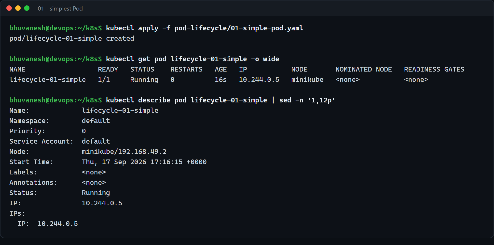

Baseline. `1/1 Running`, its own Pod IP `10.244.0.5` out of the CNI's Pod CIDR — a different
range from the node's `192.168.49.2`.

## 02 — Labels vs annotations

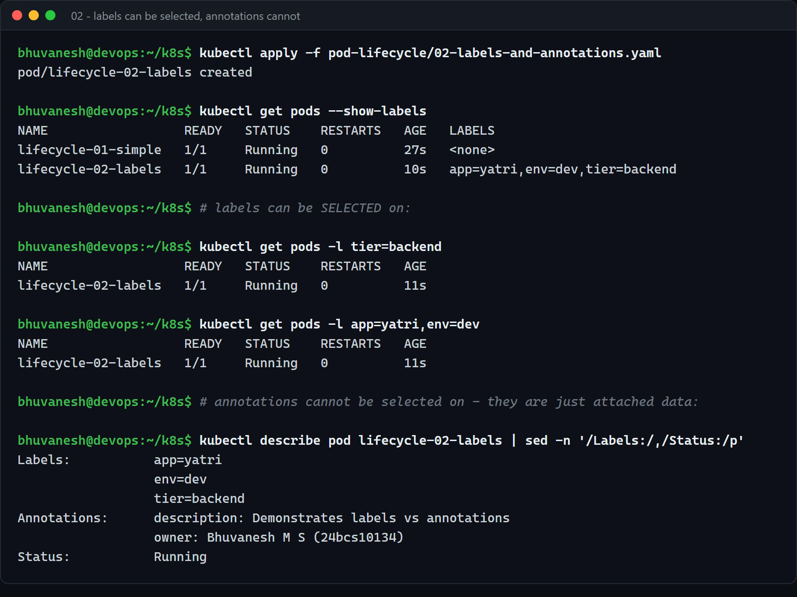

```bash
kubectl get pods --show-labels
kubectl get pods -l tier=backend
kubectl get pods -l app=yatri,env=dev      # comma = AND
```

**Labels are an index; annotations are a comment field.** `-l app=yatri,env=dev` matched the
Pod because both labels are present — comma means AND, not OR. The annotations
(`owner`, `description`) only appear in `describe`; there is no `-a owner=...` flag, because
nothing selects on annotations. That distinction matters later: a Service or a ReplicaSet
finds its Pods **entirely by label**, so a typo in a label silently breaks the link, whereas a
typo in an annotation breaks nothing.

## 03 — `restartPolicy: Never`

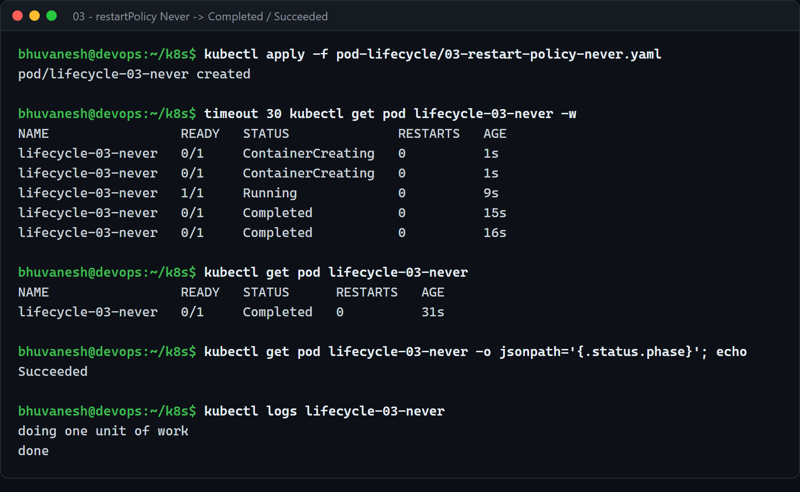

The watch captures the whole life of the Pod:

```
lifecycle-03-never   0/1   ContainerCreating   0   1s
lifecycle-03-never   1/1   Running             0   9s
lifecycle-03-never   0/1   Completed           0   15s
```

`kubectl get pod -o jsonpath='{.status.phase}'` → **`Succeeded`**.

Two separate things to keep apart: **`Completed` is the STATUS column**, a kubectl display
string; **`Succeeded` is the phase**, the actual API field. A Pod that finishes its work and
is not restarted is not a failure — this is the normal end state for Jobs and one-shot tasks.

## 04 — `restartPolicy: Always` and CrashLoopBackOff

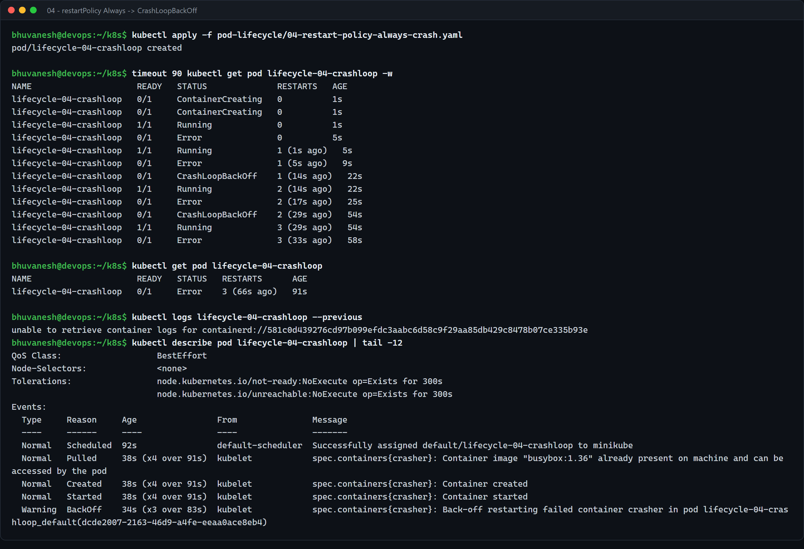

This is the single most useful thing in the folder, because it is what you actually see in
production when something is wrong:

```
Running            0   1s
Error              0   5s
Running            1 (1s ago)    5s
Error              1 (5s ago)    9s
CrashLoopBackOff   1 (14s ago)   22s
Running            2 (14s ago)   22s
Error              2 (17s ago)   25s
CrashLoopBackOff   2 (29s ago)   54s
```

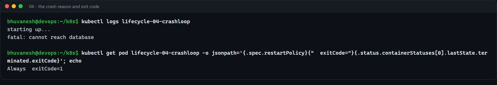

**What I understood:**

- **`CrashLoopBackOff` is not an error — it is a *waiting* state.** The container already
  failed; this status means the kubelet is deliberately pausing before trying again.
- The backoff is **exponential**: look at the gaps between restarts in the AGE column —
  restart 1 at 5s, restart 2 at 22s, restart 3 at 54s. It doubles (10s → 20s → 40s …) and
  caps at 5 minutes. This is why a broken Pod looks "stuck" after a few minutes: it is not
  stuck, it is just waiting a long time between attempts.
- **`kubectl logs` is where the answer is, not `describe`.** `describe` only told me
  `Back-off restarting failed container` — true but useless. `kubectl logs` gave me
  `fatal: cannot reach database`, which is the actual bug.
- `kubectl logs --previous` is the flag for a container that has *already* been replaced. In
  my run it returned `unable to retrieve container logs` because containerd had already
  garbage-collected that container — a real limitation worth knowing, and the reason you ship
  logs off the node instead of relying on `kubectl logs`.
- Exit code **1** with `restartPolicy: Always` → restarts forever. The same manifest with
  `restartPolicy: OnFailure` would also restart; with `Never` it would stop at `Error`.

## 05 — Resource requests and limits

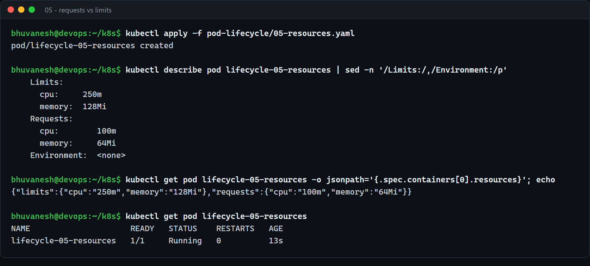

```json
{"limits":{"cpu":"250m","memory":"128Mi"},"requests":{"cpu":"100m","memory":"64Mi"}}
```

| | Who enforces it | When | What happens if exceeded |
| - | --- | --- | --- |
| **requests** | kube-scheduler | at scheduling time | Pod stays `Pending` if no node has room |
| **limits** | kubelet / cgroups | at runtime | CPU is **throttled**; memory is **OOMKilled** |

The asymmetry is the point: **CPU is compressible, memory is not.** A container over its CPU
limit just runs slower; a container over its memory limit is killed outright with exit code
137. `100m` means 100 millicores = 0.1 of a CPU core.

Requests also decide the Pod's **QoS class** — the crashloop Pod in 04, which set no
resources at all, showed `QoS Class: BestEffort`, meaning it is the first thing evicted when
the node runs out of memory.

## 06 — Environment variables and the downward API

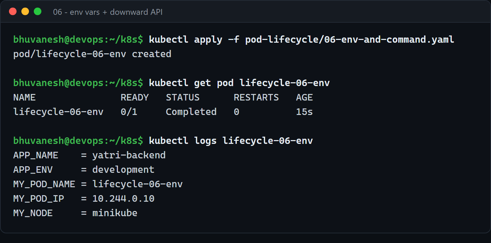

```
APP_NAME    = yatri-backend
APP_ENV     = development
MY_POD_NAME = lifecycle-06-env
MY_POD_IP   = 10.244.0.10
MY_NODE     = minikube
```

The first two are plain values. The last three come from the **downward API** — `fieldRef`
pulls `metadata.name`, `status.podIP` and `spec.nodeName` out of the Pod object itself at
runtime. This is how an app learns its own identity without being told, which is exactly what
you need for log tagging and service registration. Note that `status.podIP` cannot be known
when the YAML is written — Kubernetes fills it in after scheduling.

`command` overrides the image's ENTRYPOINT and `args` overrides its CMD.

## 07 — Readiness probe

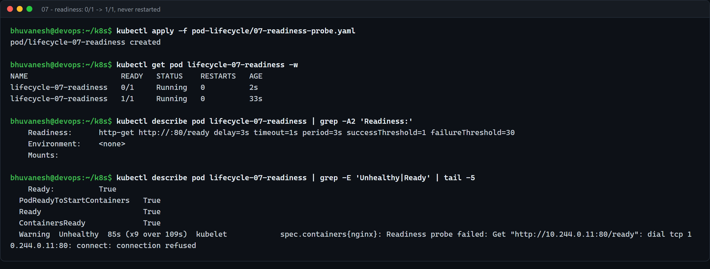

```
lifecycle-07-readiness   0/1   Running   0   2s
lifecycle-07-readiness   1/1   Running   0   33s
```

**`STATUS` stayed `Running` the whole time; only `READY` changed, and `RESTARTS` stayed 0.**
That single line is the whole lesson. For the first 33 seconds the container was up but the
probe was failing:

```
Warning  Unhealthy  Readiness probe failed: Get "http://10.244.0.11:80/ready": connection refused
```

A failing readiness probe means **"do not send me traffic yet"** — the Pod is pulled out of
its Service's endpoint list. It is never restarted for it. This is what makes zero-downtime
rolling updates possible: the Deployment will not consider a new Pod available, and will not
kill an old one, until readiness passes.

## 08 — Liveness probe

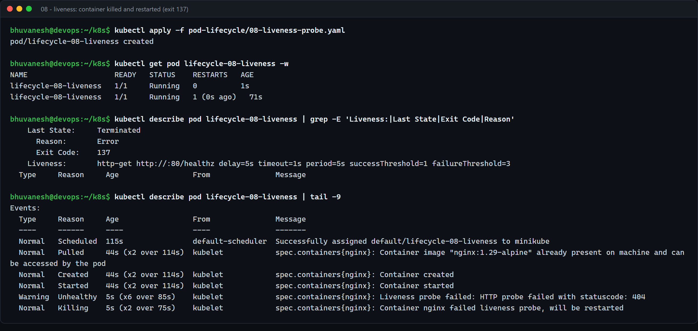

```
lifecycle-08-liveness   1/1   Running   0            1s
lifecycle-08-liveness   1/1   Running   1 (0s ago)   71s
```

```
Last State:  Terminated
  Reason:    Error
  Exit Code: 137
Warning  Unhealthy  Liveness probe failed: HTTP probe failed with statuscode: 404
Normal   Killing    Container nginx failed liveness probe, will be restarted
```

**The comparison with 07 is the whole point:**

| | Probe fails → | Pod restarted? | Removed from Service? |
| - | --- | --- | --- |
| **readiness** | not ready | **no** | **yes** |
| **liveness** | unhealthy | **yes** | (it dies, so yes) |

Details worth noting: **exit code 137** = 128 + 9 = killed by SIGKILL, i.e. the kubelet killed
it, the app did not choose to exit. And the restart only happened after
`failureThreshold: 3` consecutive failures at `periodSeconds: 5` — roughly 15s of being
unhealthy — not on the first failed check. That tolerance is deliberate; a liveness probe that
is too aggressive will restart a healthy app that is merely busy, which is a classic way to
turn a small problem into an outage.

## 09 — Startup probe

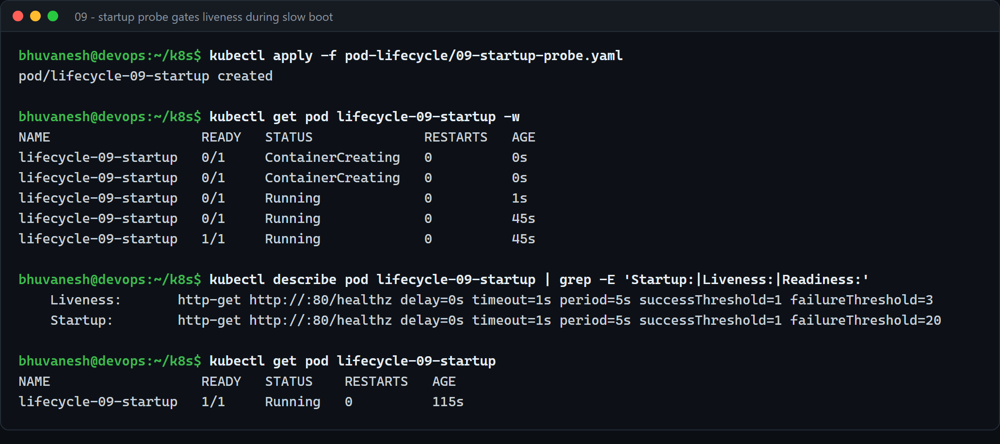

```
lifecycle-09-startup   0/1   Running   0   1s
lifecycle-09-startup   0/1   Running   0   45s
lifecycle-09-startup   1/1   Running   0   45s
```

The app deliberately takes 40s to boot. The liveness probe here is aggressive
(`periodSeconds: 5`, `failureThreshold: 3` — it would kill the container after ~15s), and yet
**`RESTARTS` is 0**. That is the proof that the startup probe worked: while a startup probe is
still running, **liveness and readiness are disabled entirely**.

The alternative — putting `initialDelaySeconds: 60` on the liveness probe — would also survive
boot, but would then leave the container **unmonitored for 60 seconds after every single
restart**, forever. The startup probe gives a large *one-time* budget
(`20 × 5s = 100s`) and then hands over to a tight liveness probe. That is why it exists as a
separate probe type.

## 10 — Init containers

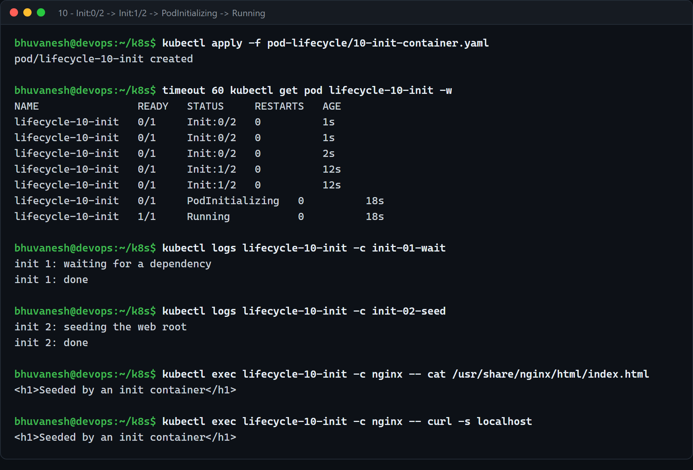

```
lifecycle-10-init   0/1   Init:0/2          0   1s
lifecycle-10-init   0/1   Init:1/2          0   12s
lifecycle-10-init   0/1   PodInitializing   0   18s
lifecycle-10-init   1/1   Running           0   18s
```

`Init:1/2` is the status format — *one of two init containers finished*. They ran
**sequentially**, each to completion, and the app container did not start until both were
done. Logs must be requested per-container with `-c`:

```bash
kubectl logs lifecycle-10-init -c init-01-wait
kubectl logs lifecycle-10-init -c init-02-seed
```

The second init container wrote `index.html` into an `emptyDir` volume that the nginx
container also mounts, and nginx really served it:

```
$ kubectl exec lifecycle-10-init -c nginx -- curl -s localhost
<h1>Seeded by an init container</h1>
```

This is the standard pattern for "wait for the database to be up" or "fetch config before
starting" — work that must be **finished** before the app runs, kept out of the app image.

## 11 — Multi-container Pod (sidecar)

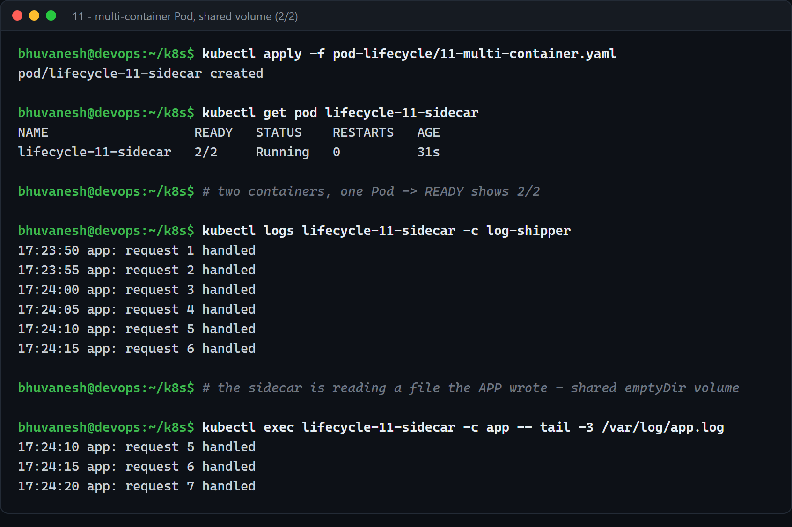

`READY 2/2` — two containers, one Pod. The app writes to `/var/log/app.log` on a shared
`emptyDir`; the sidecar `tail -f`s the same file to stdout, so `kubectl logs -c log-shipper`
shows lines the **other** container wrote:

```
17:23:50 app: request 1 handled
17:23:55 app: request 2 handled
...
```

**This is the reason a Pod is not just "a container".** The containers in a Pod share a
network namespace (same IP, they can reach each other on `localhost`) and can share volumes.
Two separate Pods could do neither. The cost is that they scale together and die together —
so the rule is: only put a container in the same Pod if it genuinely cannot be scaled or
scheduled separately from the main one.

## 12 — Graceful termination

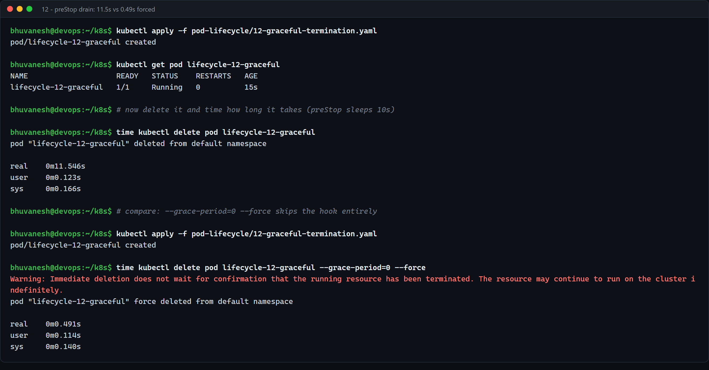

```
$ time kubectl delete pod lifecycle-12-graceful
real    0m11.546s

$ time kubectl delete pod lifecycle-12-graceful --grace-period=0 --force
real    0m0.491s
```

**11.5 seconds vs 0.49 seconds** — measured, not asserted. The 11s is the `preStop` hook's
`sleep 10`. The full shutdown sequence is:

1. Pod is marked `Terminating` and **removed from Service endpoints immediately** (so no new
   traffic arrives).
2. The **`preStop` hook runs** — and the container has not been signalled yet.
3. **SIGTERM** is sent to PID 1.
4. Kubernetes waits up to `terminationGracePeriodSeconds` (30 here).
5. **SIGKILL** for anything still alive.

Steps 1 and 2 overlapping is the useful part: endpoint removal propagates through kube-proxy
asynchronously, so for a moment traffic can still arrive at a Pod that is already
`Terminating`. A `preStop` sleep of a few seconds covers exactly that window. This is the
standard fix for "we get 502s during every deploy".

`--grace-period=0 --force` skips all of it and even kubectl warns you that the resource *"may
continue to run on the cluster indefinitely"* — it removes the object from the API without
waiting for the kubelet to confirm the container is dead.

---

# Part 2 — ReplicaSet

```bash
kubectl apply -f yatri-backend-rs.yaml
kubectl get pods -l app=yatri-backend -w
kubectl get replicaset
```

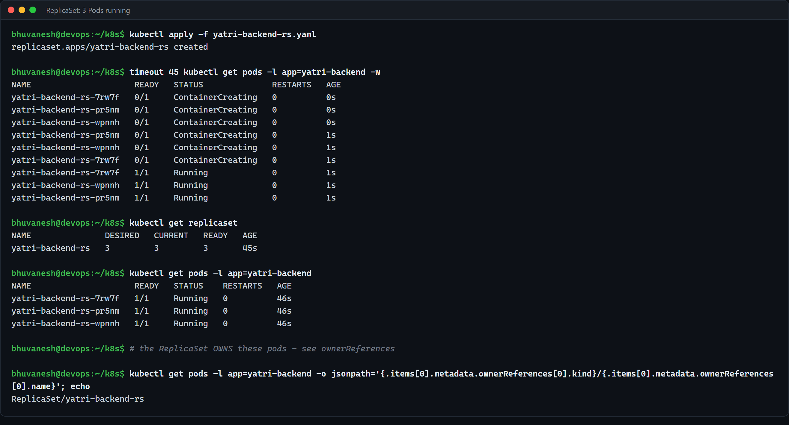

```
NAME               DESIRED   CURRENT   READY   AGE
yatri-backend-rs   3         3         3       45s
```

Three Pods, all created in the same second, with **generated names**
(`yatri-backend-rs-7rw7f`) — the ReplicaSet appends a random suffix because the Pods are
interchangeable and none of them has an identity worth preserving.

The link back to the controller is the **ownerReference**:

```
$ kubectl get pods -l app=yatri-backend -o jsonpath='{...ownerReferences[0].kind}/{...name}'
ReplicaSet/yatri-backend-rs
```

## Self-healing

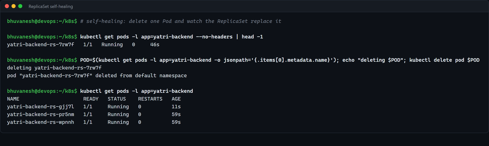

Deleted `yatri-backend-rs-7rw7f`; 8 seconds later there are still three Pods, and the new one
`yatri-backend-rs-gjj7l` is 11s old while the other two are 59s old. The ReplicaSet controller
noticed `current < desired` and reconciled. **This is the thing a bare Pod cannot do** — the
`my-first-pod` from Session 9 would simply have stayed deleted.

Note it is a **replacement, not a resurrection**: new name, new IP, no state carried over.

## Scaling

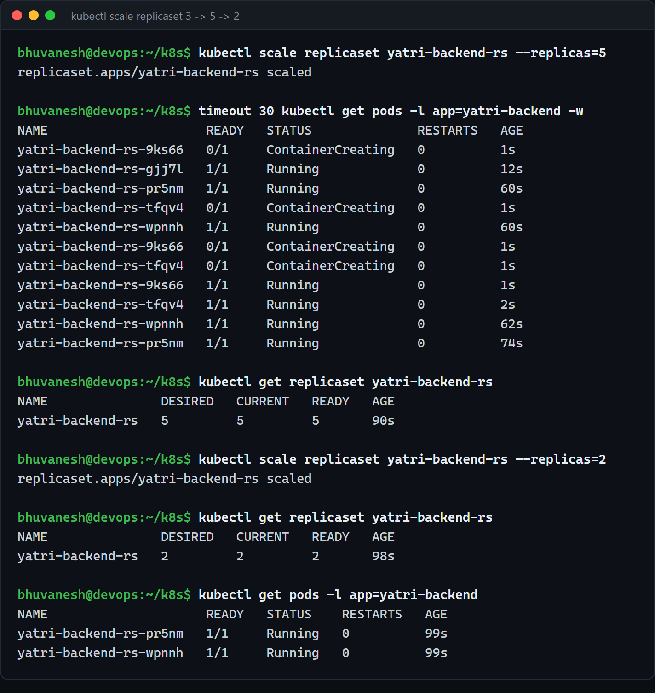

```bash
kubectl scale replicaset yatri-backend-rs --replicas=5     # 3 -> 5
kubectl scale replicaset yatri-backend-rs --replicas=2     # 5 -> 2
```

Scale up is nearly instant (the nginx image is already on the node — `ContainerCreating` to
`Running` in ~1s). Scale down is instant too, and the ReplicaSet kept the two **oldest** Pods
(both 99s old) — its scale-down heuristic prefers to delete the newest / least-ready Pods
first.

### The gap this leaves

A ReplicaSet has **no update strategy**. If I edit `.spec.template` to change the image and
re-apply, the running Pods are **not touched** — the new image only appears on Pods created
from then on. There is no `rollout`, no revision history, no rollback. That is exactly the gap
a Deployment fills, which is Part 3.

---

# Part 3 — Deployment

```bash
kubectl apply -f deployment-v1.yaml
kubectl get all
```

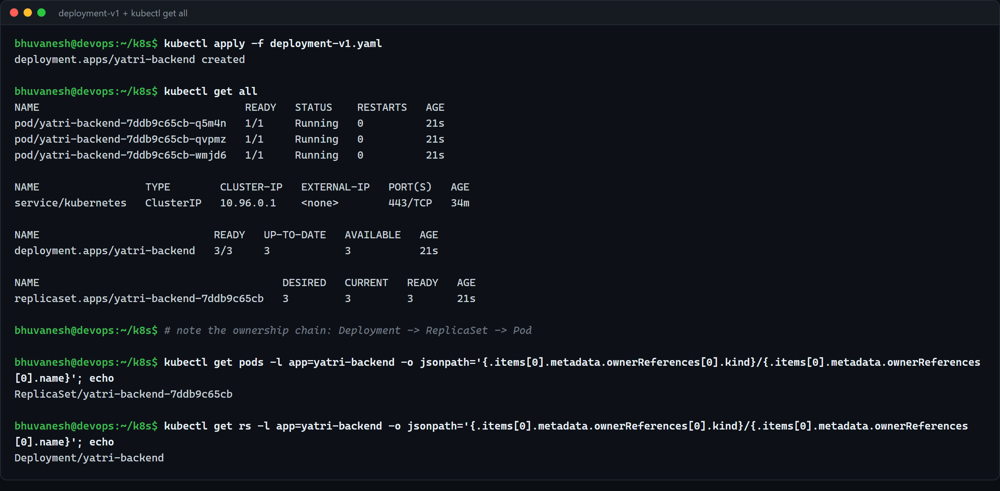

`kubectl get all` shows **three kinds of object for one `apply`** — a Deployment, a
ReplicaSet I never wrote, and three Pods. The ownership chain is real and verifiable:

```
Pod        -> ReplicaSet/yatri-backend-7ddb9c65cb
ReplicaSet -> Deployment/yatri-backend
```

`7ddb9c65cb` is the **pod-template-hash** — a hash of the Pod template. Remember this value;
it comes back in the rollback section.

## Scaling the Deployment

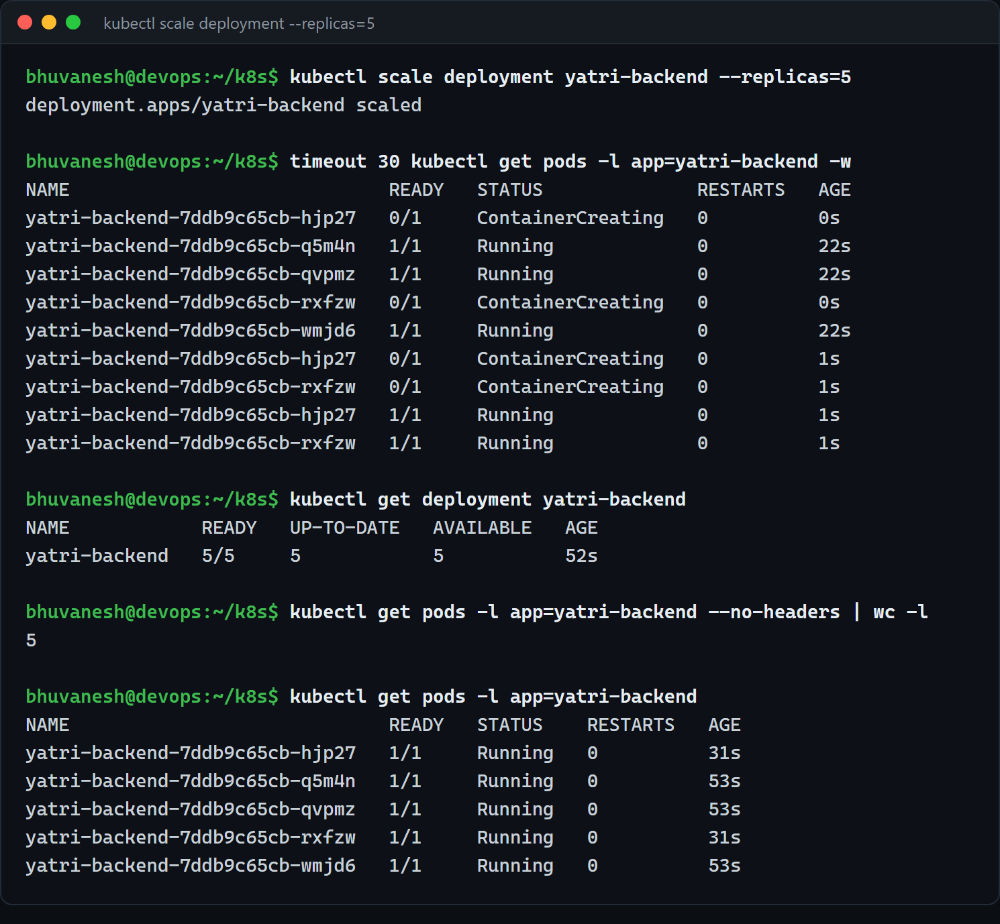

```bash
kubectl scale deployment yatri-backend --replicas=5
```

`5/5` and five Pods confirmed with `kubectl get pods --no-headers | wc -l`. Note that
**all five Pods still have the same `7ddb9c65cb` hash** — scaling changes the replica count
on the existing ReplicaSet, it does not create a new one. Only a change to the *template*
does that.

## Rolling update: V1 → V2

Scaled back to 3 first so the rollout is readable, then applied V2 in one terminal while
watching in another:

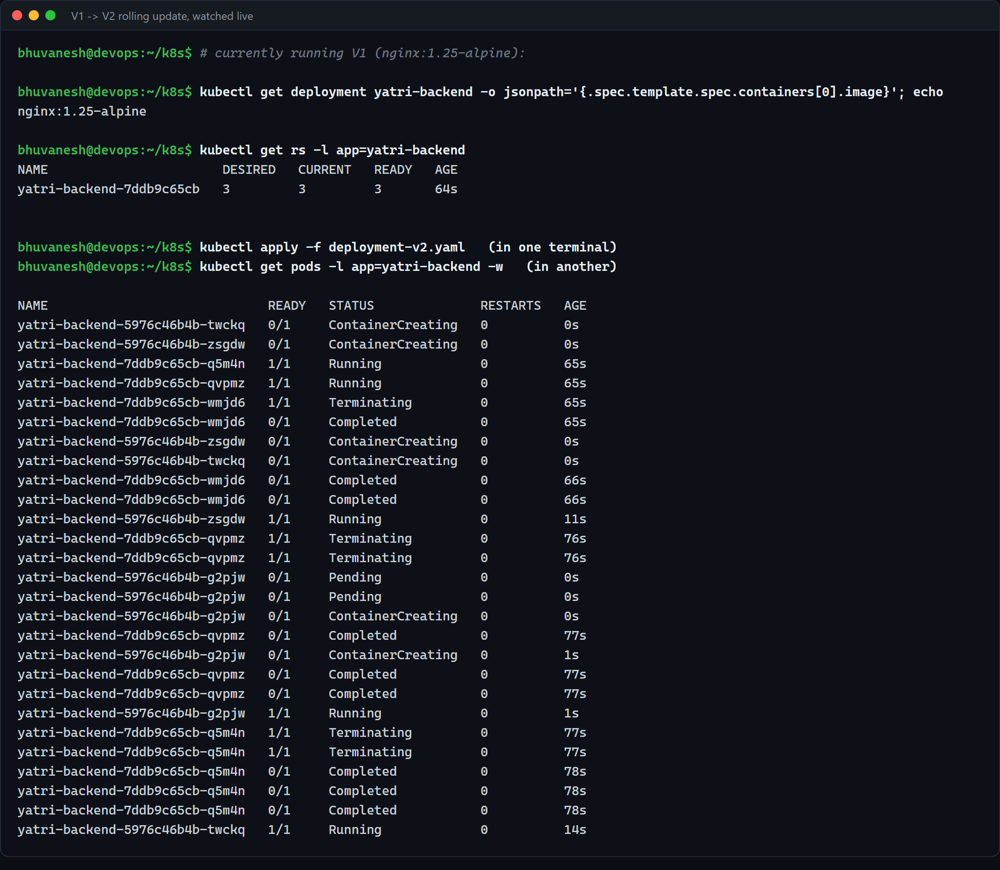

Reading the watch output, with `maxSurge: 1` and `maxUnavailable: 1`:

```
5976c46b4b-twckq   0/1   ContainerCreating         <- new RS, surging up
7ddb9c65cb-wmjd6   1/1   Terminating               <- old RS, coming down
5976c46b4b-zsgdw   1/1   Running        11s        <- new pod becomes Ready...
7ddb9c65cb-qvpmz   1/1   Terminating    76s        <- ...and only THEN an old one goes
```

**Two different pod-template-hashes are alive at the same time** — `7ddb9c65cb` (V1) and
`5976c46b4b` (V2). That overlap *is* the rolling update. The ordering is the important part:
a new Pod reaches `1/1 Running` **before** the next old one is terminated, which is why there
is never a moment with zero capacity.

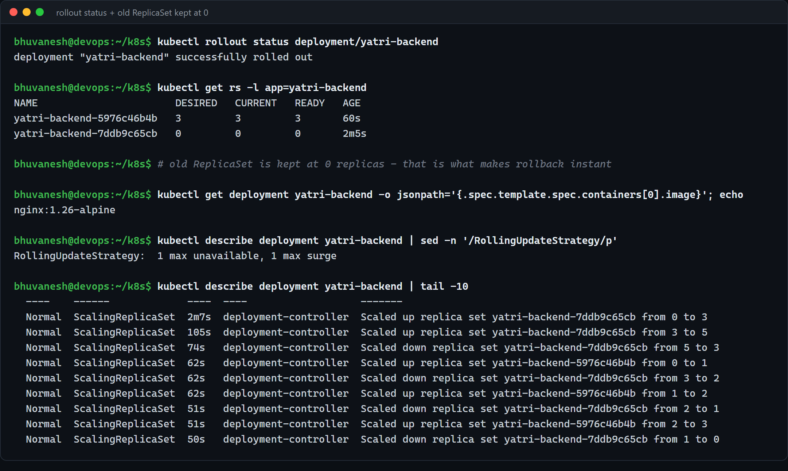

```
$ kubectl get rs -l app=yatri-backend
yatri-backend-5976c46b4b   3   3   3    60s     <- new, active
yatri-backend-7ddb9c65cb   0   0   0    2m5s    <- old, kept at zero
```

**The old ReplicaSet is not deleted — it is parked at 0 replicas.** That is the entire
mechanism behind instant rollback: the object, with its exact template, is still sitting
there.

`kubectl describe deployment` shows the controller's own account of the dance:

```
Scaled up   replica set yatri-backend-5976c46b4b from 0 to 1
Scaled down replica set yatri-backend-7ddb9c65cb from 3 to 2
Scaled up   replica set yatri-backend-5976c46b4b from 1 to 2
Scaled down replica set yatri-backend-7ddb9c65cb from 2 to 1
...
```

A Deployment controller does not manage Pods at all. **It manages ReplicaSets, and moves
replica counts between them.**

---

# Part 4 — Four revisions and a targeted rollback

Applied V3 and then V4, giving four revisions of the same Deployment:

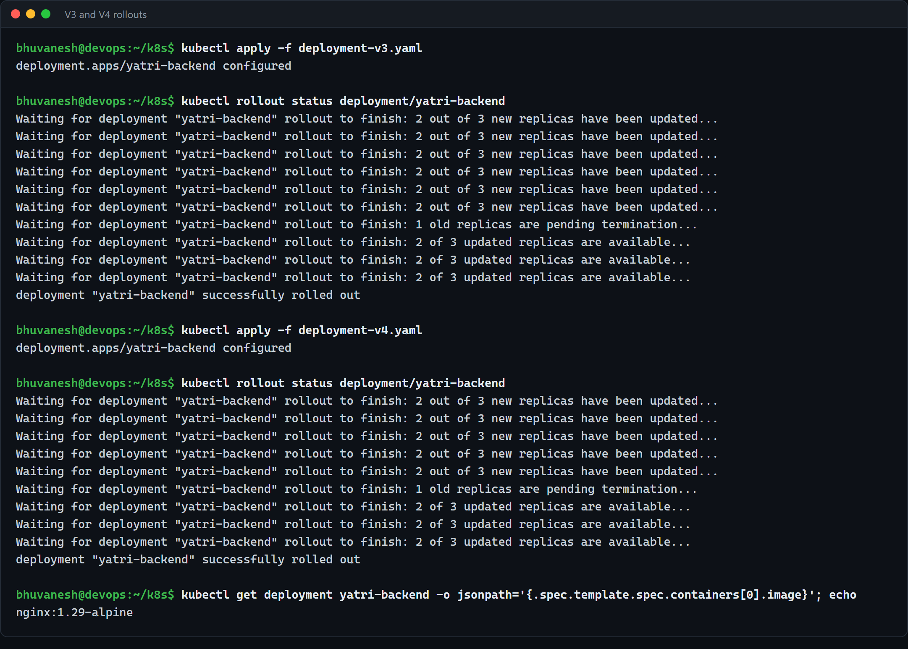

Each manifest carries a `kubernetes.io/change-cause` annotation, which is what makes the
history readable (the old `--record` flag is deprecated):

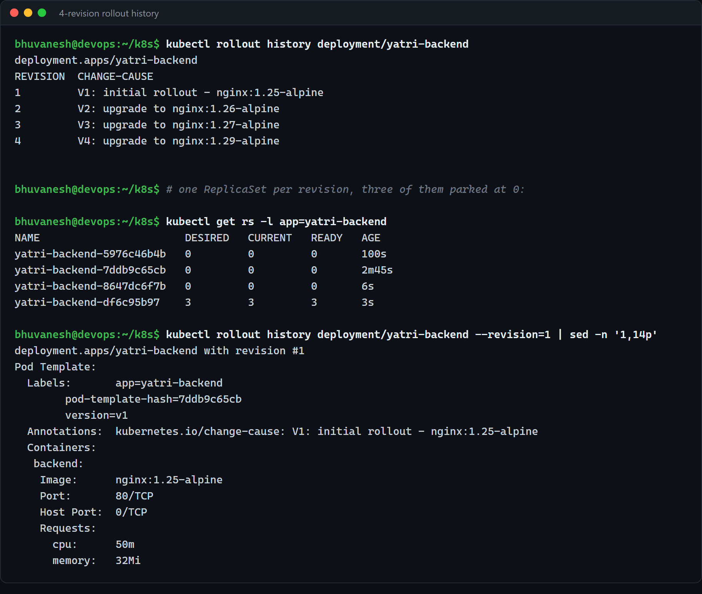

```
REVISION  CHANGE-CAUSE
1         V1: initial rollout - nginx:1.25-alpine
2         V2: upgrade to nginx:1.26-alpine
3         V3: upgrade to nginx:1.27-alpine
4         V4: upgrade to nginx:1.29-alpine
```

and **one ReplicaSet per revision**, three of them parked at 0:

```
yatri-backend-5976c46b4b   0   0   0    (V2)
yatri-backend-7ddb9c65cb   0   0   0    (V1)
yatri-backend-8647dc6f7b   0   0   0    (V3)
yatri-backend-df6c95b97    3   3   3    (V4, live)
```

`kubectl rollout history --revision=1` prints the **full Pod template** of that revision —
image, ports, resource requests, labels. The history is not a changelog, it is the actual
stored spec.

## Rolling back V4 → V1 directly

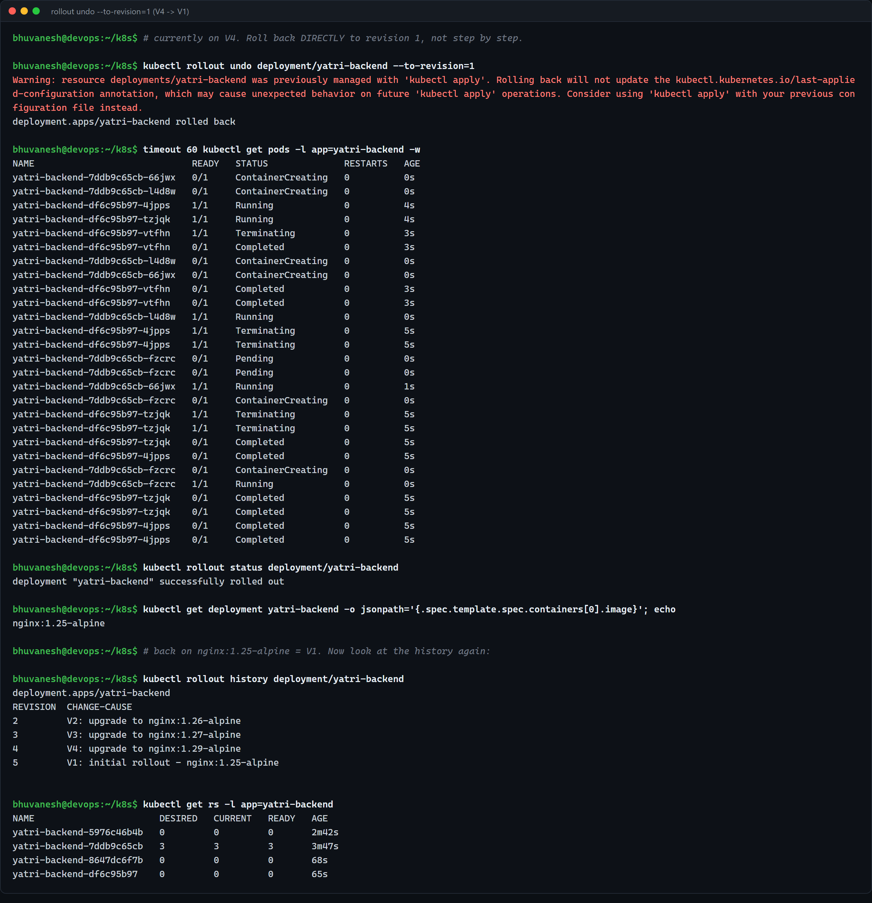

```bash
kubectl rollout undo deployment/yatri-backend --to-revision=1
```

**Not** four `undo`s — one targeted jump. Verified:

```
$ kubectl get deployment yatri-backend -o jsonpath='{.spec.template.spec.containers[0].image}'
nginx:1.25-alpine
```

Three things worth pointing out from this run:

1. **The rollback is itself a rolling update.** The watch shows new Pods coming up and old
   ones terminating in the same interleaved pattern — it is not a restart, and there is no
   downtime.
2. **The old ReplicaSet was reused, not recreated.** The Pods that came back are named
   `yatri-backend-7ddb9c65cb-...` — the *same* pod-template-hash as the original V1 Pods,
   because the template is byte-identical and the hash is derived from it. The rollback cost
   nothing more than setting that ReplicaSet's replica count back to 3.
3. **The history renumbers.** Afterwards:

   ```
   REVISION  CHANGE-CAUSE
   2         V2: ...
   3         V3: ...
   4         V4: ...
   5         V1: initial rollout - nginx:1.25-alpine
   ```

   Revision 1 is **gone** and reappears as **revision 5**. A revision number is a position in
   the history, not a permanent label on a version. So a script that hardcodes
   `--to-revision=1` will roll back to the wrong thing after the first rollback — check
   `rollout history` before rolling back, every time. This is the detail I would not have
   noticed without doing it by hand.

There is also a warning worth reading rather than ignoring:

```
Warning: resource deployments/yatri-backend was previously managed with 'kubectl apply'.
Rolling back will not update the kubectl.kubernetes.io/last-applied-configuration annotation...
```

`rollout undo` changes the cluster but **not** the YAML file in git. The next `kubectl apply`
of `deployment-v4.yaml` would silently roll you forward again. In a GitOps setup the real fix
is to revert the commit; `rollout undo` is the emergency lever, not the record.

---

# Part 5 — Breaking things on purpose

## Selector mismatch

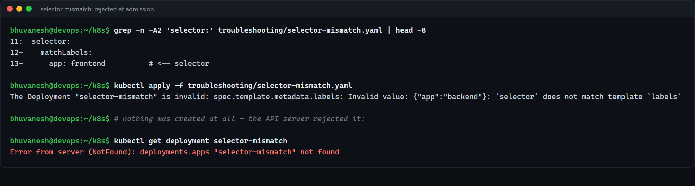

```
The Deployment "selector-mismatch" is invalid: spec.template.metadata.labels:
Invalid value: {"app":"backend"}: `selector` does not match template `labels`

$ kubectl get deployment selector-mismatch
Error from server (NotFound): deployments.apps "selector-mismatch" not found
```

**Nothing was created at all.** This is a *validation* failure at admission time, rejected by
the API server before the object was ever stored — so there is no broken Deployment to clean
up, and `kubectl get` cannot show you anything.

The reason Kubernetes refuses this: a controller finds its Pods **only by label**. A selector
of `app=frontend` over a template labelled `app=backend` would create Pods it could never see
again — so `CURRENT` would stay 0, it would create three more, forever, orphaning Pods on
every loop. Rather than allow that, the API server rejects the object outright.

Practical lesson: **if `kubectl apply` fails and `kubectl get` says NotFound, the problem is
in your YAML, not in the cluster.** Read the error text — it names the exact field.

## Broken image

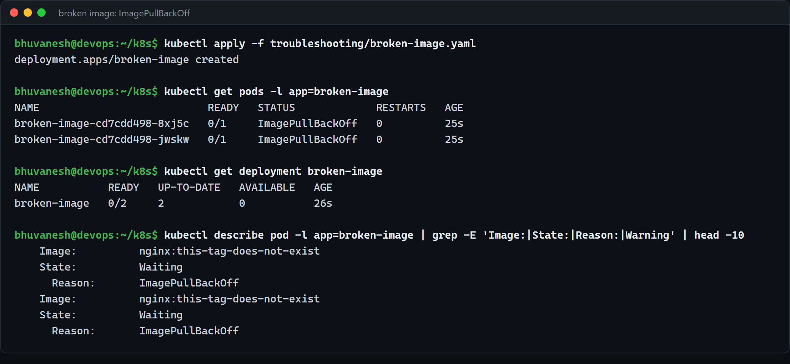

```
NAME                           READY   STATUS             RESTARTS   AGE
broken-image-cd7cdd498-8xj5c   0/1     ImagePullBackOff   0          25s
broken-image-cd7cdd498-jwskw   0/1     ImagePullBackOff   0          25s

NAME           READY   UP-TO-DATE   AVAILABLE   AGE
broken-image   0/2     2            0           26s
```

The **opposite** kind of failure from the selector mismatch. This YAML is perfectly valid — the
API server accepted it and created everything. Nothing can tell whether an image tag exists
until the kubelet tries to pull it, so this only fails at **runtime**.

`ErrImagePull` is the first failed attempt; `ImagePullBackOff` is the same exponential backoff
as `CrashLoopBackOff`. Note `UP-TO-DATE 2` but `AVAILABLE 0` — the Deployment did everything
it was asked to do; the Pods just cannot run. And `RESTARTS` stays **0**, because the
container never started once, so there is nothing to restart.

## The dangerous version — a broken image on a *live* Deployment

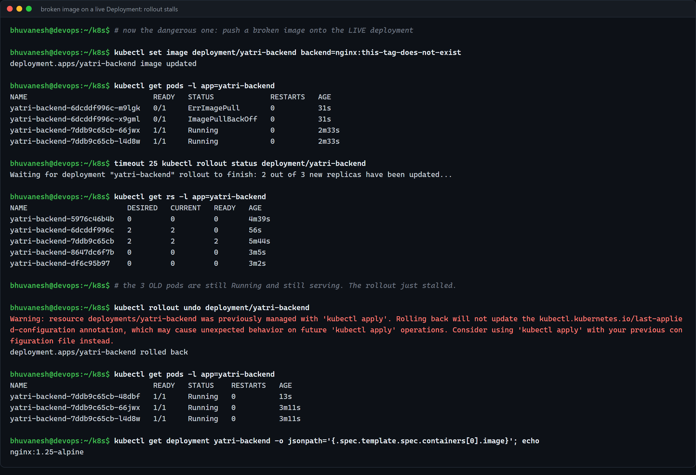

```bash
kubectl set image deployment/yatri-backend backend=nginx:this-tag-does-not-exist
```

```
yatri-backend-6dcddf996c-m9lgk   0/1   ErrImagePull       0   31s    <- new, broken
yatri-backend-6dcddf996c-x9gml   0/1   ImagePullBackOff   0   31s    <- new, broken
yatri-backend-7ddb9c65cb-66jwx   1/1   Running            0   2m33s  <- old, still serving
yatri-backend-7ddb9c65cb-l4d8w   1/1   Running            0   2m33s  <- old, still serving

$ kubectl rollout status deployment/yatri-backend
Waiting for deployment "yatri-backend" rollout to finish: 2 out of 3 new replicas have been updated...
```

**This is the best-news-in-bad-news moment of the whole homework.** A completely broken image
was pushed to a live Deployment and **the application never went down**. The rolling update
simply *stalled*:

- `maxUnavailable: 1` means at most one old Pod may be removed before a new one is Ready.
- The new Pods never become Ready, so the Deployment is not allowed to remove any more old
  ones. Two of the three original Pods stayed up and serving.
- `kubectl rollout status` hangs rather than returning — which is precisely why you run it in
  CI with `--timeout`, so a stalled rollout fails the pipeline instead of hanging it.

The fix is one command, and it is instant because the old ReplicaSet was still parked there:

```bash
kubectl rollout undo deployment/yatri-backend        # back to 3/3 Running
```

---

# Part 6 — Written answers

## Q1: ReplicaSet vs Deployment

|  | ReplicaSet | Deployment |
| - | ---------- | ---------- |
| **Job** | Keep *N* Pods alive | Manage **ReplicaSets** over time |
| **Manages** | Pods directly | ReplicaSets (which manage Pods) |
| **Self-healing** | Yes | Yes (via its ReplicaSet) |
| **Scaling** | Yes | Yes |
| **Rolling update** | **No** | Yes — `maxSurge` / `maxUnavailable` |
| **Revision history** | **No** | Yes — `kubectl rollout history` |
| **Rollback** | **No** | Yes — `kubectl rollout undo` |
| **Written by hand?** | Almost never | **Yes — this is what you deploy** |

The honest one-line answer: **a ReplicaSet answers "how many?", a Deployment answers "how many,
and how do I change what they are running?"**

Everything in the ReplicaSet column that says "Yes" is *still* provided when you use a
Deployment, because the Deployment creates a ReplicaSet to do it. So there is essentially no
situation where you write a ReplicaSet yourself. It is worth learning only because it is what
you will see in `kubectl get all` and in ownerReferences when you are debugging.

The proof from this homework is Part 3: **one `kubectl apply -f deployment-v1.yaml` produced a
Deployment, a ReplicaSet and three Pods.** I never wrote the ReplicaSet.

## Q2: StatefulSet vs DaemonSet vs Deployment

> Researched as homework — StatefulSet was not taught in the live session. Sources:
> [Workloads / Controllers](https://kubernetes.io/docs/concepts/workloads/controllers/) in the
> official docs, plus `core-objects.md` from the class repo.

|  | **Deployment** | **StatefulSet** | **DaemonSet** |
| - | -------------- | --------------- | ------------- |
| **Question it answers** | "Run *N* copies of this" | "Run *N* copies, each with a **stable identity**" | "Run **one** copy **on every node**" |
| **Replica count** | You choose | You choose | **Not settable** — it equals the number of matching nodes |
| **Pod names** | Random suffix — `yatri-backend-7ddb9c65cb-q5m4n` | **Ordinal and stable** — `db-0`, `db-1`, `db-2` | Tied to the node |
| **Identity across restarts** | None — a replacement is a different Pod | **Preserved.** `db-1` comes back as `db-1`, with the same name, the same DNS record and the **same PersistentVolume** | Tied to the node |
| **Storage** | Usually none, or shared | `volumeClaimTemplates` → **one PVC per Pod**, kept when the Pod is deleted | Usually a hostPath into the node |
| **Create / scale order** | All at once, any order | **Strictly ordered**: `0`, then `1`, then `2`. Scale down is **reverse** order | Follows nodes joining/leaving |
| **Needs a Service** | A normal Service | A **headless Service** for per-Pod DNS | Usually none |
| **Rolling update** | Yes | Yes, but one Pod at a time in reverse ordinal order | Yes |
| **Use it for** | Stateless web/API tiers | Databases, Kafka, ZooKeeper, anything with a leader or per-member disk | `node-exporter`, `fluentd`, CNI plugins, `kube-proxy` |

### What the instructor's hint actually meant

The one comment made in class was that a StatefulSet Pod *"is created in a particular manner"*,
deliberately left vague. Having read it up, that phrase covers **three** guarantees that a
Deployment does not give:

1. **Stable, predictable names.** Ordinal indexes, not random hashes. `db-0` is always `db-0`.
2. **Stable network identity.** With a headless Service, each Pod gets its own DNS name:
   `db-0.db.default.svc.cluster.local`. You can address *one specific replica* — impossible
   with a Deployment, where every Pod is behind one virtual IP and interchangeable.
3. **Stable storage.** `volumeClaimTemplates` creates a **separate PVC per Pod**, bound by
   ordinal, and it is **not deleted** when the Pod is. `db-1` restarting anywhere in the
   cluster reattaches to *its own* disk.

Plus the ordering itself: Pod `N` is not created until Pod `N-1` is Running and Ready, and
scale-down goes in reverse. That matters for a database cluster where the first member must be
up before the others can join it — start them all simultaneously and you get a split brain.

### The mental test I'll use

- Are the replicas **interchangeable**? → **Deployment.**
- Does replica #2 need to still be replica #2 tomorrow, with the same disk? → **StatefulSet.**
- Is this an **agent that belongs to the node**, not to the application? → **DaemonSet.**

A DaemonSet is the odd one out: you do not scale it, you scale the *cluster*. Add a node and a
DaemonSet Pod appears there automatically; drain the node and it goes away. That is why the
cluster's own plumbing — `kube-proxy` and the CNI — ships as DaemonSets.

---

## Summary

| Homework item | Status |
| ------------- | ------ |
| All 12 `pod-lifecycle/` files, with apply / watch / describe / logs | Done — Part 1 |
| `yatri-backend-rs` ReplicaSet, 3 Pods, scale up and down | Done — Part 2 |
| `deployment-v1.yaml` + `kubectl get all` + scale to 5 | Done — Part 3 |
| `deployment-v2.yaml` rolling update watched live | Done — Part 3 |
| `troubleshooting/selector-mismatch.yaml` | Done — Part 5 |
| `troubleshooting/broken-image.yaml` (+ on a live Deployment) | Done — Part 5 |
| 4-revision history, rollback V4 → V1 with `--to-revision` | Done — Part 4 |
| ReplicaSet vs Deployment | Done — Part 6 Q1 |
| StatefulSet vs DaemonSet vs Deployment (research) | Done — Part 6 Q2 |
