# Kubernetes Networking & Services (Homework Submission)

**Name:** Bhuvanesh M S
**Enrollment number:** 24bcs10134
**Environment:** Ubuntu 26.04 LTS on WSL 2 (Windows 11) · minikube v1.39.0 (docker driver) ·
Kubernetes v1.37.0 · CoreDNS

Resources:

- https://kubernetes.io/docs/concepts/services-networking/service/
- https://kubernetes.io/docs/concepts/services-networking/dns-pod-service/
- https://github.com/Nency-Ravaliya/Kubernetes

---

## Homework tasks

1. **Research FQDN and CoreDNS** and write up what an FQDN is, what CoreDNS is, how
   Kubernetes' internal DNS resolution actually works, why it is needed, and how it resolves
   automatically. The instructor called this *"one of the most important parts of
   Kubernetes."*
2. Read through and run the **service examples** — ClusterIP, NodePort, LoadBalancer,
   ExternalName and Headless.
3. Use the **`dns-test/`** Pod to do the DNS work hands-on from inside the cluster.

### Files in this folder

```
session11-kubernetes-services/
├── backend-deployment.yaml     3 echo-server Pods, the target of every Service here
├── 01-clusterip.yaml           default type - internal only
├── 02-nodeport.yaml            a port on every node
├── 03-loadbalancer.yaml        cloud LB (pending on Minikube)
├── 04-externalname.yaml        a CNAME to an external host
├── 05-headless.yaml            clusterIP: None
├── statefulset-headless.yaml   StatefulSet + headless Service, for stable per-Pod DNS
└── dns-test/curl-test-pod.yaml a netshoot Pod with curl/dig/nslookup
```

The backend is an **echo server**, which replies with the name of the Pod that served the
request. That is what makes load balancing visible instead of something you have to take on
trust.

---

# Part 1 — Why Services exist at all

From Session 10: Pods are mortal and replaceable. Every time a ReplicaSet replaced a Pod, the
new one came back with **a new name and a new IP**. During the rolling update, three IPs were
replaced within 80 seconds.

So a Pod IP is useless to write down anywhere. A **Service** is the fix: a **stable name and a
stable virtual IP** in front of a set of Pods that is constantly changing underneath.

The binding is by **label selector**, and nothing else:

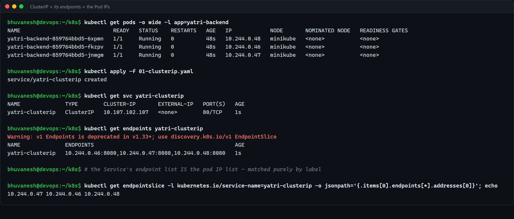

```
$ kubectl get pods -o wide -l app=yatri-backend
yatri-backend-859764bbd5-fkzpv   10.244.0.46
yatri-backend-859764bbd5-jnwgm   10.244.0.47
yatri-backend-859764bbd5-6xpmn   10.244.0.48

$ kubectl get endpoints yatri-clusterip
yatri-clusterip   10.244.0.46:8080,10.244.0.47:8080,10.244.0.48:8080
```

**The endpoint list is exactly the Pod IP list.** No one typed those IPs anywhere — the
endpoints controller watches Pods, matches `app: yatri-backend`, and keeps the list current.
When a Pod dies, it leaves the list within seconds; when a new one becomes **Ready**, it joins.
(That is the readiness probe from Session 10 doing its real job.)

> `kubectl get endpoints` now prints `Warning: v1 Endpoints is deprecated in v1.33+; use
> discovery.k8s.io/v1 EndpointSlice`. `EndpointSlice` is the replacement — the old `Endpoints`
> object stuffed every backend into one object, which does not scale past a few thousand Pods.

### `port` vs `targetPort`

```yaml
ports:
  - port: 80          # the port the SERVICE listens on
    targetPort: 8080  # the port the CONTAINER listens on
```

Two different numbers on purpose, to show they are unrelated. Clients talk to `:80`; kube-proxy
rewrites the destination to a Pod IP on `:8080`.

---

# Part 2 — The four Service types

## ClusterIP (the default)

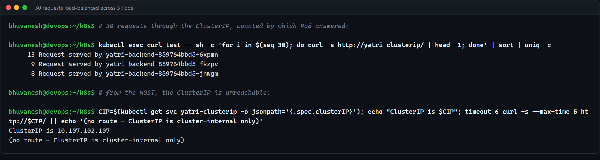

30 requests from inside the cluster, counted by which Pod answered:

```
13 Request served by yatri-backend-859764bbd5-6xpmn
 9 Request served by yatri-backend-859764bbd5-fkzpv
 8 Request served by yatri-backend-859764bbd5-jnwgm
```

Roughly even across all three — that is **kube-proxy load balancing per connection**, with no
client-side logic at all. (It is random, not round-robin, which is why it is 13/9/8 and not
10/10/10. My first attempt with only 6 requests happened to hit the same Pod all 6 times, which
is exactly the trap of testing a random distribution with a tiny sample.)

And from the host:

```
$ curl http://10.107.102.107/
(no route - ClusterIP is cluster-internal only)
```

**The ClusterIP is a virtual IP that does not exist on any interface anywhere.** There is no
process listening on `10.107.102.107`. It is purely a match target in the node's
iptables/IPVS rules, which is why it only means anything to traffic originating inside the
cluster network.

## NodePort

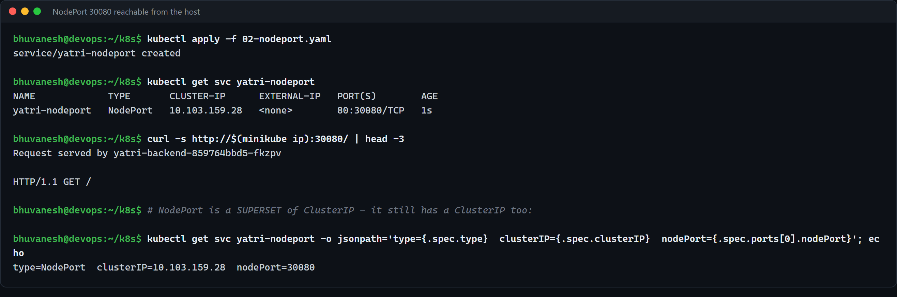

```
NAME             TYPE       CLUSTER-IP      EXTERNAL-IP   PORT(S)
yatri-nodeport   NodePort   10.103.159.28   <none>        80:30080/TCP

$ curl http://$(minikube ip):30080/
Request served by yatri-backend-859764bbd5-fkzpv
```

**A NodePort is a ClusterIP plus extra.** The `-o jsonpath` output proves it still has its own
`clusterIP=10.103.159.28`; the nodePort is an additional door. The `80:30080/TCP` notation
means *Service port 80, node port 30080*.

`30080` is inside the mandatory **30000–32767** range. Leave `nodePort` out and Kubernetes
allocates one for you. The range exists so that node ports can never collide with the
well-known ports the node itself uses.

The catch that makes NodePort unsuitable for production: the port opens on **every node**, you
have to know a node's IP to use it, the port number is ugly, and there is no TLS termination
or hostname routing. It is a debugging and dev tool.

## LoadBalancer

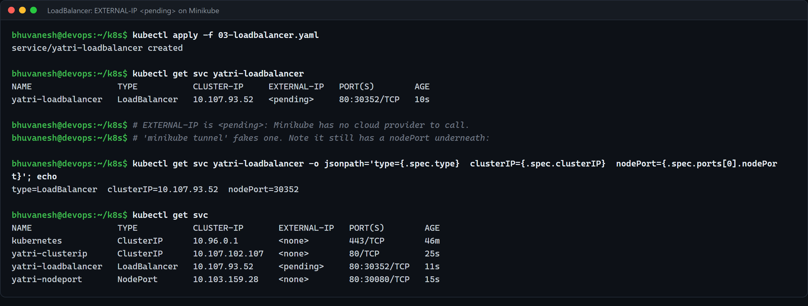

```
NAME                 TYPE           CLUSTER-IP     EXTERNAL-IP   PORT(S)
yatri-loadbalancer   LoadBalancer   10.107.93.52   <pending>     80:30352/TCP
```

**`EXTERNAL-IP` is `<pending>`, and that is the correct, expected result here — not a bug.**

A LoadBalancer Service does not create a load balancer. It asks the
**cloud-controller-manager** to go and create one. On EKS that produces an AWS NLB, on GKE a
Google LB. Minikube has no cloud provider (exactly the component that Session 9's architecture
notes said does not exist on Minikube), so nobody answers the request and it waits forever.

`minikube tunnel` is the local workaround — it runs a process that assigns an IP and routes to
it.

Note `80:30352/TCP`: the LoadBalancer **also** has a nodePort and **also** has a ClusterIP.
The types are cumulative:

```
ClusterIP  ⊂  NodePort  ⊂  LoadBalancer
```

## ExternalName

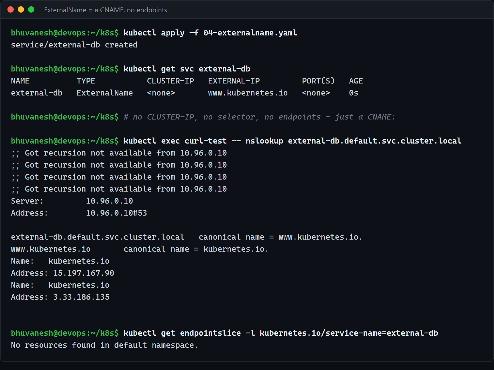

```
NAME          TYPE           CLUSTER-IP   EXTERNAL-IP         PORT(S)
external-db   ExternalName   <none>       www.kubernetes.io   <none>

$ kubectl exec curl-test -- nslookup external-db.default.svc.cluster.local
external-db.default.svc.cluster.local  canonical name = www.kubernetes.io.
www.kubernetes.io                      canonical name = kubernetes.io.
Name: kubernetes.io   Address: 15.197.167.90

$ kubectl get endpointslice -l kubernetes.io/service-name=external-db
No resources found in default namespace.
```

**The odd one out.** No selector, no cluster IP, no ports, and — confirmed above — **no
endpoints object at all**. Nothing is proxied. CoreDNS simply returns a **CNAME**, and the
client connects to the external host directly.

Why it is useful: your app can hardcode `external-db` in every environment. In dev it is an
ExternalName pointing at a managed database; in prod you replace it with a real ClusterIP
Service pointing at in-cluster Pods. **The application code never changes.**

The gotcha: because it is only DNS, there is no load balancing, no health checking, and TLS
certificate hostnames will be the *external* name, not the Service name.

## Headless (`clusterIP: None`)

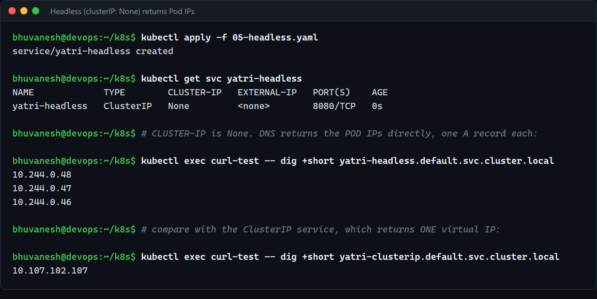

```
NAME             TYPE        CLUSTER-IP   PORT(S)
yatri-headless   ClusterIP   None         8080/TCP

$ kubectl exec curl-test -- dig +short yatri-headless.default.svc.cluster.local
10.244.0.48
10.244.0.47
10.244.0.46

$ kubectl exec curl-test -- dig +short yatri-clusterip.default.svc.cluster.local
10.107.102.107
```

The comparison is the whole lesson. **Same Pods, same selector, completely different DNS
answer:**

- The **ClusterIP** Service returns **one virtual IP** and kube-proxy picks a Pod for you.
- The **headless** Service returns **all three Pod IPs**, and the client picks.

Setting `clusterIP: None` switches off the virtual IP and the proxying entirely. You do this
when the client is smarter than a round-robin — a database driver that needs to find the
primary, or a Kafka client that needs to connect to a specific broker.

---

# Part 3 — FQDN and CoreDNS

> This is the written-up research the instructor asked for.

## What an FQDN is

A **Fully Qualified Domain Name** is a domain name written out **completely**, all the way up
to the root, so it is unambiguous and needs no context to interpret.

- `yatri-clusterip` — a **short name**. Meaningless on its own; it depends on where you are.
- `yatri-clusterip.default.svc.cluster.local` — an **FQDN**. Means exactly one thing, from
  anywhere in the cluster.

Kubernetes Services always follow the same four-part shape:

```
<service-name> . <namespace> . svc . cluster.local
      │              │          │          │
      │              │          │          └── the cluster domain (configurable)
      │              │          └───────────── "this is a Service" (vs. "pod")
      │              └──────────────────────── which namespace it lives in
      └─────────────────────────────────────── the Service's own name
```

and a Pod behind a headless Service gets one more level on the front:

```
web-0 . yatri-sts . default . svc . cluster.local
  │         │
  │         └── the headless (governing) Service
  └──────────── the Pod's stable name
```

## What CoreDNS is

**CoreDNS is the DNS server that runs inside the cluster and answers these names.** It is a
plugin-based DNS server written in Go, and since Kubernetes v1.13 it is the default cluster
DNS (it replaced kube-dns — which is why, confusingly, the Service is still *called*
`kube-dns`).

It is not part of the control plane. It is an **addon**: ordinary Pods, in `kube-system`,
behind an ordinary Service.

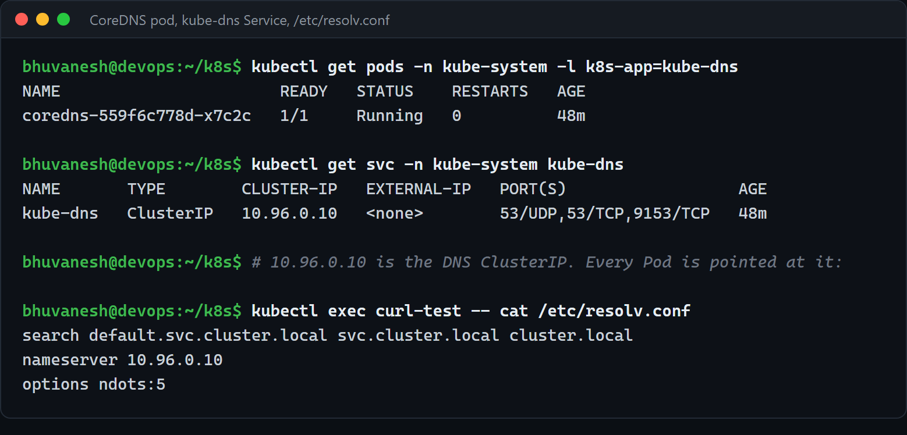

```
$ kubectl get pods -n kube-system -l k8s-app=kube-dns
coredns-559f6c778d-x7c2c   1/1   Running

$ kubectl get svc -n kube-system kube-dns
kube-dns   ClusterIP   10.96.0.10   53/UDP,53/TCP,9153/TCP
```

`10.96.0.10` is a well-known, fixed address — the tenth address of the Service CIDR, assigned
at cluster creation so that every Pod can be told about it before CoreDNS itself has started.

What makes CoreDNS *Kubernetes-aware* rather than a generic DNS server is its **`kubernetes`
plugin**, configured in the `Corefile`:

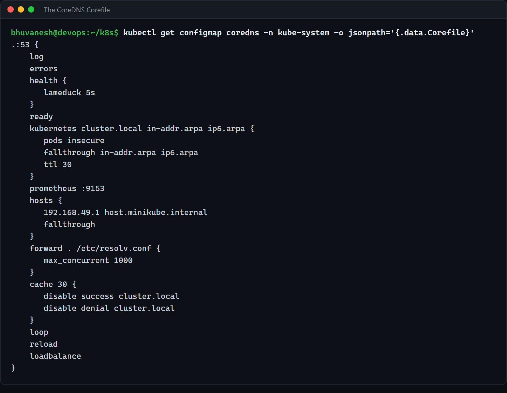

```
.:53 {
    errors
    health { lameduck 5s }
    ready
    kubernetes cluster.local in-addr.arpa ip6.arpa {
       pods insecure
       fallthrough in-addr.arpa ip6.arpa
       ttl 30
    }
    prometheus :9153
    forward . /etc/resolv.conf { max_concurrent 1000 }
    cache 30
    loop
    reload
    loadbalance
}
```

Reading the important lines:

| Line | What it does |
| ---- | ------------ |
| `kubernetes cluster.local ...` | **The whole point.** CoreDNS watches the Kubernetes API for Services and EndpointSlices and answers `*.cluster.local` **from the live API state** — there is no zone file, nothing to edit, nothing to reload when a Pod moves. |
| `ttl 30` | Records expire after 30s, so clients cannot cache a stale Pod IP for long. |
| `forward . /etc/resolv.conf` | **Anything that is not a cluster name** (`github.com`, `pypi.org`) is forwarded to the node's upstream DNS. This is why Pods can reach the internet by name as well. |
| `cache 30` | In-memory cache, so CoreDNS is not hammered for the same name. |
| `reload` | Editing the ConfigMap takes effect without restarting the Pods. |
| `loadbalance` | Shuffles A records in each answer — a second, DNS-level round-robin. |
| `health` / `ready` / `prometheus` | The endpoints for its own liveness/readiness probes and metrics. |

## How resolution actually works, end to end

The other half of the mechanism is **on the Pod side**, and it is what makes short names work:

```
$ kubectl exec curl-test -- cat /etc/resolv.conf
search default.svc.cluster.local svc.cluster.local cluster.local
nameserver 10.96.0.10
options ndots:5
```

The kubelet writes this file into **every** Pod at creation time. Nothing is installed in the
container image; the container just uses the standard libc resolver, which reads this file.

- **`nameserver 10.96.0.10`** — send all DNS queries to CoreDNS.
- **`search ...`** — if a name is not fully qualified, try appending each of these suffixes
  **in order** until one answers.
- **`options ndots:5`** — a name containing fewer than 5 dots is treated as *not* fully
  qualified, so the search list is used first.

So resolving `yatri-clusterip` from a Pod in `default`:

1. `yatri-clusterip` has 0 dots, which is `< 5` → use the search list.
2. Try `yatri-clusterip.default.svc.cluster.local` → **CoreDNS answers `10.107.102.107`.** Done.

Resolving `shop-api.shop.svc.cluster.local` (4 dots, still `< 5`) tries the suffixes first,
gets NXDOMAIN for each, then tries the name as-is and succeeds. (This is the well-known
`ndots:5` performance footgun: every external lookup like `api.github.com` wastes three failed
queries before the real one. Ending the name with a dot — `api.github.com.` — skips it.)

### Proving it

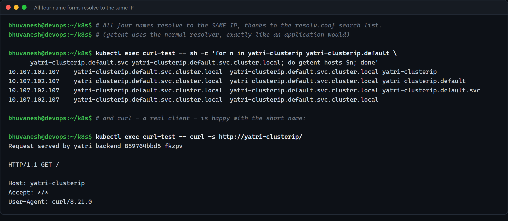

```
$ kubectl exec curl-test -- sh -c 'for n in yatri-clusterip yatri-clusterip.default \
      yatri-clusterip.default.svc yatri-clusterip.default.svc.cluster.local; do getent hosts $n; done'

10.107.102.107   yatri-clusterip.default.svc.cluster.local   yatri-clusterip
10.107.102.107   yatri-clusterip.default.svc.cluster.local   yatri-clusterip.default
10.107.102.107   yatri-clusterip.default.svc.cluster.local   yatri-clusterip.default.svc
10.107.102.107   yatri-clusterip.default.svc.cluster.local
```

**All four forms → the same IP, and all four canonicalise to the same FQDN.** The search list
is doing the work; the FQDN is what they all actually mean.

### A debugging trap worth knowing

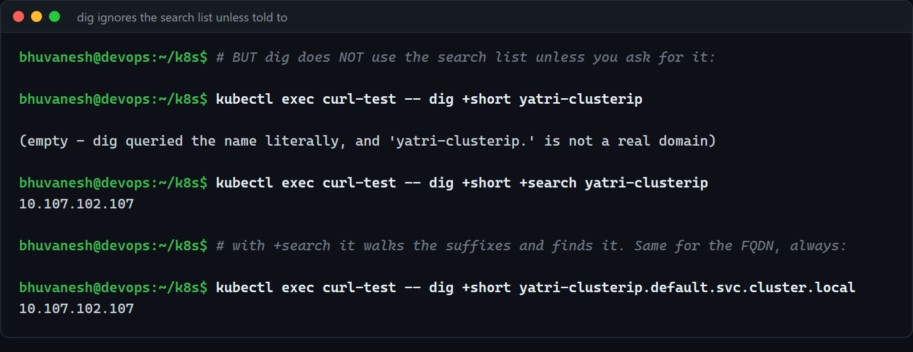

```
$ kubectl exec curl-test -- dig +short yatri-clusterip
(empty)

$ kubectl exec curl-test -- dig +short +search yatri-clusterip
10.107.102.107
```

**`dig` does not use the search list unless you pass `+search`.** I hit this while writing this
up: `dig` said the short name did not resolve, while `curl` to the very same name worked fine.
`dig` queries the name literally; `curl`, and every normal application, goes through the libc
resolver and therefore through the search list.

The practical rule: **when debugging cluster DNS, always test with the FQDN**, or use
`nslookup`/`getent`/`curl` rather than bare `dig`. Otherwise you will convince yourself DNS is
broken when it is not.

## Namespaces are a real boundary

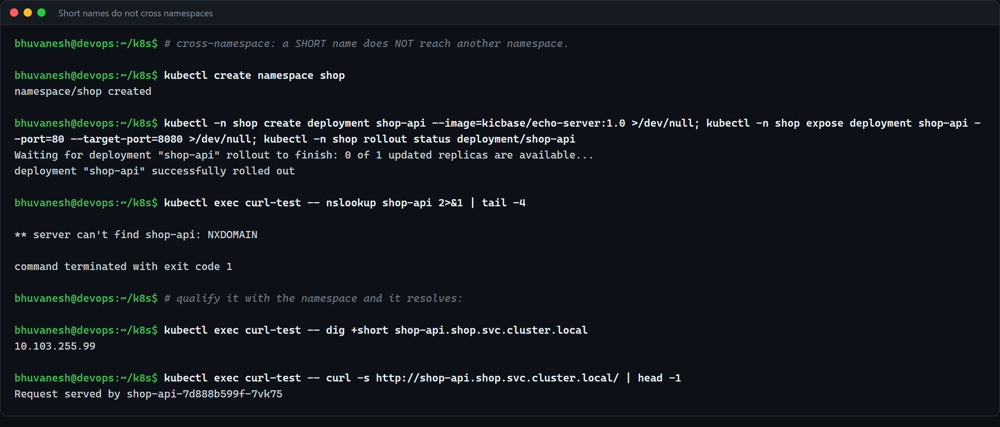

A `shop-api` Service was created in a new `shop` namespace. From a Pod in `default`:

```
$ kubectl exec curl-test -- nslookup shop-api
** server can't find shop-api: NXDOMAIN

$ kubectl exec curl-test -- dig +short shop-api.shop.svc.cluster.local
10.103.255.99

$ kubectl exec curl-test -- curl -s http://shop-api.shop.svc.cluster.local/
Request served by shop-api-7d888b599f-7vk75
```

The short name **fails**, because the search list starts with `default.svc.cluster.local` —
*this* Pod's namespace. Qualify it with the namespace and it works immediately.

This is not access control (DNS will happily tell anyone about any Service — that is what
NetworkPolicy is for), but it does mean **a short name is always namespace-relative**. A chart
that hardcodes `postgres` breaks the moment it is deployed somewhere else; `postgres.data.svc.cluster.local`
does not.

## Why any of this is needed

Without cluster DNS you would have to know Pod IPs, which change constantly. With it:

| Without DNS | With CoreDNS |
| ----------- | ------------ |
| Hardcode `10.244.0.46` | Use `yatri-clusterip` |
| Breaks on every Pod restart | Survives restarts, rescheduling, rolling updates |
| Needs a service registry (Consul, etcd) bolted on | Built in, zero configuration |
| Config differs per environment | Same name in dev, staging and prod |

And **"automatic"** is literal. Creating a Service is the entire configuration step:

```bash
kubectl apply -f 01-clusterip.yaml     # <- this is all of it
```

No DNS record was written, no zone file edited, nothing reloaded. CoreDNS is *watching the API
server*, so the record existed the moment the Service object did — that is why the very next
command could already resolve it.

---

# Part 4 — Headless DNS + StatefulSet, in practice

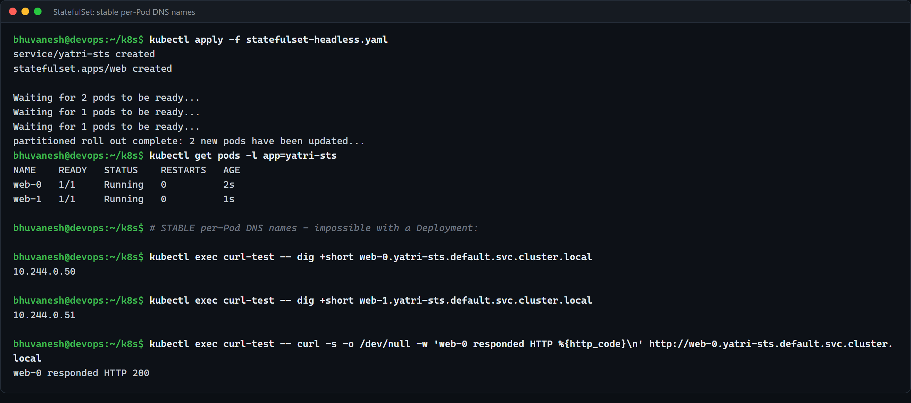

```
$ kubectl get pods -l app=yatri-sts
web-0   1/1   Running
web-1   1/1   Running

$ dig +short web-0.yatri-sts.default.svc.cluster.local   ->  10.244.0.50
$ dig +short web-1.yatri-sts.default.svc.cluster.local   ->  10.244.0.51
$ curl web-0.yatri-sts.default.svc.cluster.local         ->  HTTP 200
```

`web-0` and `web-1` — ordinals, not random hashes — and **each Pod has its own DNS name**.
This is only possible because the Service is headless and the StatefulSet names it in
`serviceName`.

And the identity survives deletion:

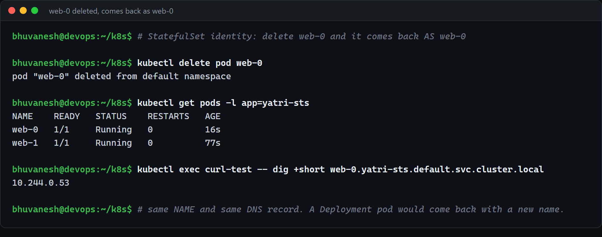

```
$ kubectl delete pod web-0
$ kubectl get pods -l app=yatri-sts
web-0   1/1   Running   0   16s        <- same name

$ dig +short web-0.yatri-sts.default.svc.cluster.local
10.244.0.53                            <- new IP, same NAME
```

**The IP changed; the name did not.** That is the entire value proposition of a StatefulSet,
and it closes the loop on the Session 10 homework question about what "created in a particular
manner" meant. A Deployment Pod would have come back as `yatri-backend-859764bbd5-<newhash>` —
a name nothing could have predicted or addressed.

---

## Cleanup

```bash
kubectl delete -f . --ignore-not-found
kubectl delete -f dns-test/
kubectl delete namespace shop
```

## Summary

| Homework item | Status |
| ------------- | ------ |
| Research FQDN — what it is, why it matters | Done — Part 3 |
| Research CoreDNS — what it is, the Corefile | Done — Part 3 |
| How internal DNS resolution actually works | Done — Part 3 (`resolv.conf`, search list, `ndots:5`) |
| Why it is needed / how it resolves automatically | Done — Part 3 |
| ClusterIP | Done — Part 2 |
| NodePort | Done — Part 2 |
| LoadBalancer | Done — Part 2 (`<pending>`, explained) |
| ExternalName | Done — Part 2 |
| Headless | Done — Part 2 and Part 4 |
| `dns-test/` hands-on | Done — used throughout Part 3 |
