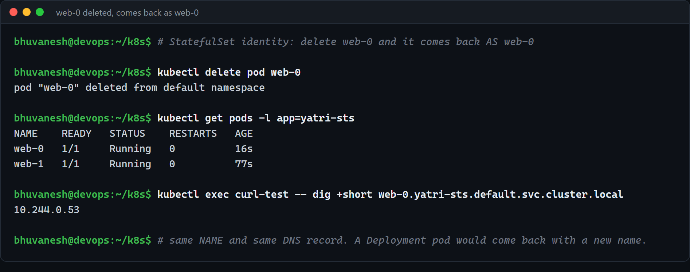
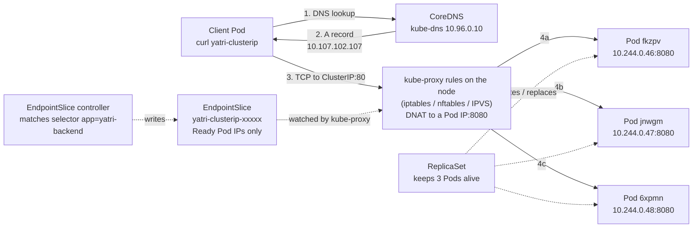
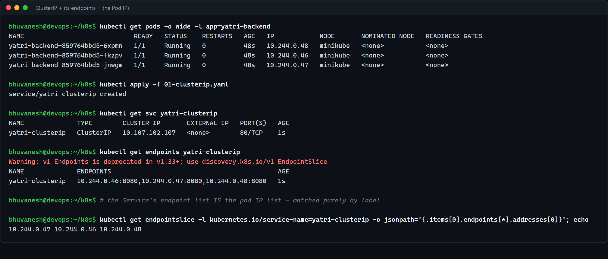

# Workload and Service Comparisons (Session 11, Task 2)

**Name:** Bhuvanesh M S
**Enrollment number:** 24bcs10134

Three comparisons the Session 11 brief asks for:

1. [Deployment vs ReplicaSet](#1-deployment-vs-replicaset)
2. [Deployment vs DaemonSet vs StatefulSet](#2-deployment-vs-daemonset-vs-statefulset)
3. [ReplicaSet vs Service](#3-replicaset-vs-service)

The first two build on my own Session 10 write-ups
([Part 6, Q1 and Q2](../session10-k8s-core-objects/README.md#part-6--written-answers)), which
were backed by real cluster output (the ReplicaSet scaling, the V1 to V4 rolling updates and
the targeted rollback). I have not repeated those screenshots here; I have extended the tables
with the points the Session 11 brief asks for explicitly (Pod management, networking, storage)
and linked back to the evidence. The third comparison is new and uses the Services from this
session.

Reference: https://kubernetes.io/docs/concepts/workloads/controllers/

---

## 1. Deployment vs ReplicaSet

### Purpose

- A **ReplicaSet** has one job: make sure **N Pods matching a selector exist**, right now.
  If one dies it creates another; if there is one too many it deletes one.
- A **Deployment** manages **ReplicaSets over time**. Its job is to change *what* the Pods are
  running (image, env, resources) safely, keep a history of those changes, and let me go back.

### Side by side

|  | ReplicaSet | Deployment |
| - | ---------- | ---------- |
| **Purpose** | Keep N identical Pods alive | Declarative updates for Pods and ReplicaSets |
| **Manages** | Pods directly (ownerReference `ReplicaSet/<name>`) | ReplicaSets, which manage the Pods (ownerReference `Deployment/<name>`) |
| **Pod management** | Counts Pods matching its selector, creates/deletes to reach `replicas` | Creates one ReplicaSet per Pod-template version, identified by `pod-template-hash` |
| **Self-healing** | Yes | Yes (through its current ReplicaSet) |
| **Scaling** | `kubectl scale rs ...` | `kubectl scale deploy ...` (scales the current ReplicaSet), works with an HPA |
| **Rolling updates** | **No.** Editing `.spec.template` does not touch running Pods | **Yes.** `RollingUpdate` (default, `maxSurge` 25% / `maxUnavailable` 25%) or `Recreate` |
| **Revision history** | No | Yes, old ReplicaSets are kept scaled to 0 (`revisionHistoryLimit`, default 10) |
| **Rollback** | No | `kubectl rollout undo [--to-revision=N]` |
| **Pause / resume a rollout** | No | `kubectl rollout pause / resume` |
| **Written by hand?** | Almost never | Yes, this is what you deploy |

### The relationship

```
Deployment yatri-backend
 ├── ReplicaSet yatri-backend-7ddb9c65cb   (revision 1, scaled to 0 after the update)
 └── ReplicaSet yatri-backend-859764bbd5   (revision 2, current)
      ├── Pod yatri-backend-859764bbd5-fkzpv
      ├── Pod yatri-backend-859764bbd5-jnwgm
      └── Pod yatri-backend-859764bbd5-6xpmn
```

A rolling update is literally the Deployment controller **scaling the new ReplicaSet up and
the old one down**, a few Pods at a time, within the `maxSurge` / `maxUnavailable` budget. A
rollback is the same thing in reverse: the old ReplicaSet still exists at 0 replicas, so the
controller just scales it back up. That is why the rollback in Session 10 Part 4 brought back
the original `7ddb9c65cb` hash rather than creating a new one.

One-line answer, as I wrote in Session 10: **a ReplicaSet answers "how many?", a Deployment
answers "how many, and how do I change what they are running?"**

---

## 2. Deployment vs DaemonSet vs StatefulSet

All three keep Pods running from a template. They differ in **how many** Pods, **where**
they go and **whether a Pod has an identity**.

| | **Deployment** | **StatefulSet** | **DaemonSet** |
| - | -------------- | --------------- | ------------- |
| **Question it answers** | "Run N interchangeable copies" | "Run N copies, each with a stable identity" | "Run one copy on every (matching) node" |
| **Typical use cases** | Stateless web / API tiers, workers | Databases, Kafka, ZooKeeper, etcd, anything with a leader or per-member disk | Log shippers (Fluent Bit), node-exporter, CNI agents, `kube-proxy`, CSI node plugins |
| **Pod creation** | All at once, through a ReplicaSet | Ordered by default (`OrderedReady`): `web-0`, then `web-1` once `web-0` is Ready. `podManagementPolicy: Parallel` turns this off | One Pod per node, created when the node joins (respects `nodeSelector`, affinity, taints/tolerations) |
| **Pod names** | Random: `yatri-backend-859764bbd5-fkzpv` | Ordinal and stable: `web-0`, `web-1` | Generated, one per node |
| **Scaling** | Set `replicas` (or an HPA) | Set `replicas`; scale-down removes the **highest ordinal first** | No `replicas` field: you scale the **cluster**, not the DaemonSet |
| **Rolling update** | `RollingUpdate` / `Recreate` | `RollingUpdate` one Pod at a time in **reverse ordinal order** (supports `partition` for staged rollouts), or `OnDelete` | `RollingUpdate` node by node (`maxUnavailable` default 1), or `OnDelete` |
| **Networking** | One normal Service; every Pod is behind one virtual IP | A **headless Service** (named in `serviceName`) gives each Pod its own DNS record: `web-0.yatri-sts.default.svc.cluster.local` | Usually no Service. Often `hostNetwork` or a `hostPort` because the agent is about the node itself |
| **Storage** | Usually none, or one shared volume | `volumeClaimTemplates`: **one PVC per Pod** (`data-web-0`), re-attached to the same ordinal, and **not deleted** on scale-down by default | Usually a `hostPath` into the node (`/var/log`, `/proc`) |
| **Identity across restarts** | None, a replacement is a new Pod | Same name, same DNS name, same PVC (the IP can still change) | Tied to its node |
| **Examples in this repo** | `backend-deployment.yaml` (session 11), all of session 10 | `statefulset-headless.yaml` (session 11, Part 4) | `../session10-k8s-core-objects/daemonset/` |

The proof for the StatefulSet row is in this session's own README, Part 4: after
`kubectl delete pod web-0`, the Pod came back as `web-0` with a **new IP but the same DNS
name**.



### The mental test (from Session 10)

- Are the replicas **interchangeable**? -> **Deployment.**
- Does replica #2 need to still be replica #2 tomorrow, with the same disk? -> **StatefulSet.**
- Is this an **agent that belongs to the node**, not to the application? -> **DaemonSet.**

---

## 3. ReplicaSet vs Service

These two are often confused because both "point at" the same Pods using the same label
selector. They do completely different jobs and never talk to each other directly.

### What each one is responsible for

| | **ReplicaSet** | **Service** |
| - | -------------- | ----------- |
| **API group** | `apps/v1` (workload) | `v1` (networking) |
| **Responsibility** | **Existence**: keep N Pods running | **Reachability**: give those Pods one stable address |
| **Creates Pods?** | Yes | **Never** |
| **Selector used for** | Counting and owning Pods | Choosing which Pods receive traffic |
| **Cares about readiness?** | Only for status counters | **Yes**: only **Ready** Pods are put in the EndpointSlice |
| **What it gives you** | Pod names and Pod IPs that keep changing | A stable virtual IP (ClusterIP) and DNS name: `yatri-clusterip.default.svc.cluster.local` |
| **Load balancing** | None | Yes, kube-proxy spreads connections across Pods |
| **Exposes outside the cluster?** | No | Optionally (`NodePort`, `LoadBalancer`) |
| **Controller behind it** | ReplicaSet controller (kube-controller-manager) | EndpointSlice controller (kube-controller-manager) + kube-proxy on every node + CoreDNS for the name |
| **Without the other** | Pods run, but clients have to chase Pod IPs | A Service with no matching Pods has **empty endpoints** and connections fail |

### Why a Service is required

A ReplicaSet keeps the **count** right, but it keeps it right by **replacing** Pods, and every
replacement has a new name and a new IP. In Session 10 the rolling update replaced three IPs in
80 seconds. Nothing that hardcodes a Pod IP survives that.

A Service solves exactly the problem the ReplicaSet creates:

1. **Stable address.** The ClusterIP and DNS name do not change for the life of the Service,
   however many times the Pods are replaced.
2. **Load balancing.** Clients connect to one address; connections are spread across all
   Ready Pods (13 / 9 / 8 in this session's 30-request test).
3. **Only healthy backends.** A Pod failing its readiness probe is removed from the endpoints,
   so it stops getting traffic without being killed.
4. **Decoupling.** The client does not know or care whether a ReplicaSet, a Deployment or a
   StatefulSet is behind it, or how many Pods there are.

### How traffic actually reaches a Pod



Step by step:

1. The client resolves the Service name. CoreDNS answers from the live API state with the
   **ClusterIP** (a headless Service would return the Pod IPs instead).
2. The client opens a connection to `ClusterIP:port`. That IP is not on any interface; it is
   only a match rule.
3. **kube-proxy** (a DaemonSet on every node) has already programmed the node's packet rules
   from the Service and its **EndpointSlices**. iptables is the default on Linux; nftables
   mode is also available in current releases, and IPVS is the older alternative. The rule
   picks one backend and **DNATs** the packet to `PodIP:targetPort`.
4. The packet is routed over the CNI network to that Pod. Replies are un-NATed on the way back
   by conntrack, so the client only ever sees the ClusterIP.

Meanwhile, completely independently, the **EndpointSlice controller** watches Pods matching
the Service selector and keeps the slice up to date with the Ready ones, and the **ReplicaSet**
keeps creating Pods to replace the ones that die. The ReplicaSet and the Service never refer
to each other: **the labels are the only link**. That is why a typo in the selector gives the
classic "Service has no endpoints" bug (Session 10 Part 5 and
`../session-11-kubernetes-services/troubleshooting/empty-endpoints.yaml`).

The evidence for this flow is in this session's README, Part 1 (EndpointSlice IPs equal Pod
IPs) and Part 2 (load balancing):



### One-line answer

**A ReplicaSet makes sure the Pods exist; a Service makes sure they can be found.** You need
both: the ReplicaSet without a Service gives you Pods nobody can reliably reach, and a Service
without Pods gives you a stable address with nothing behind it.
