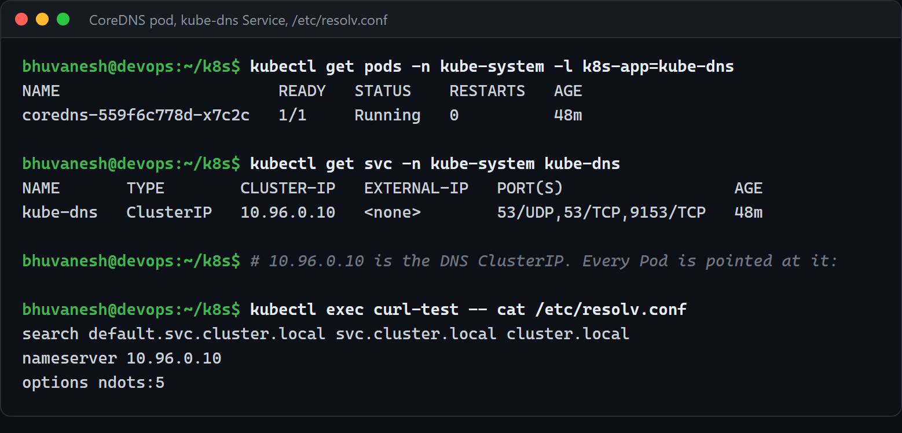
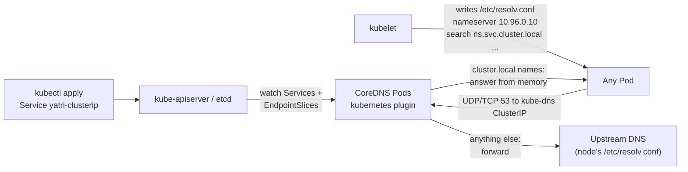
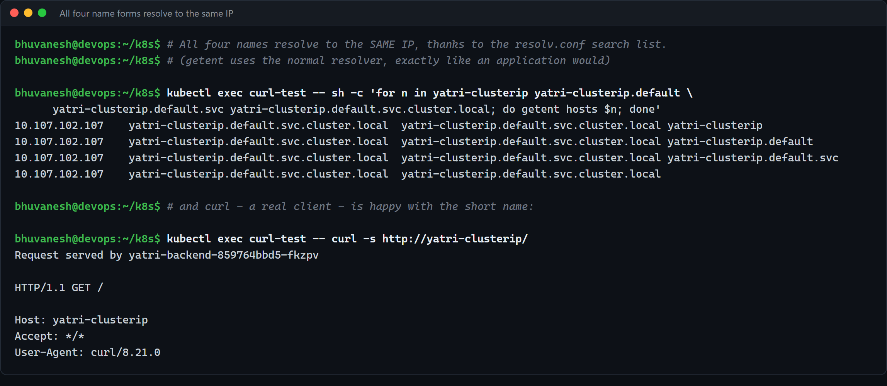
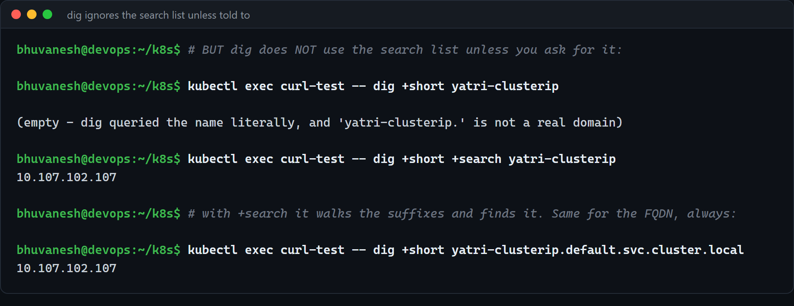
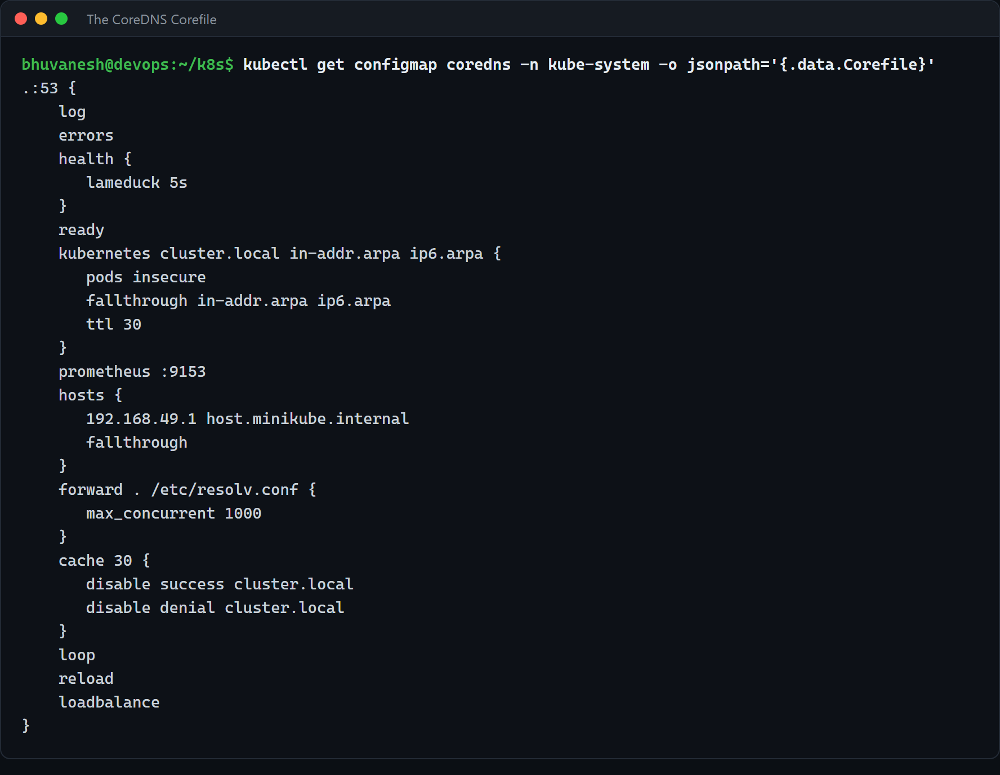
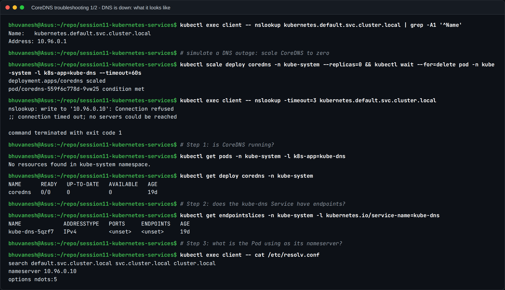
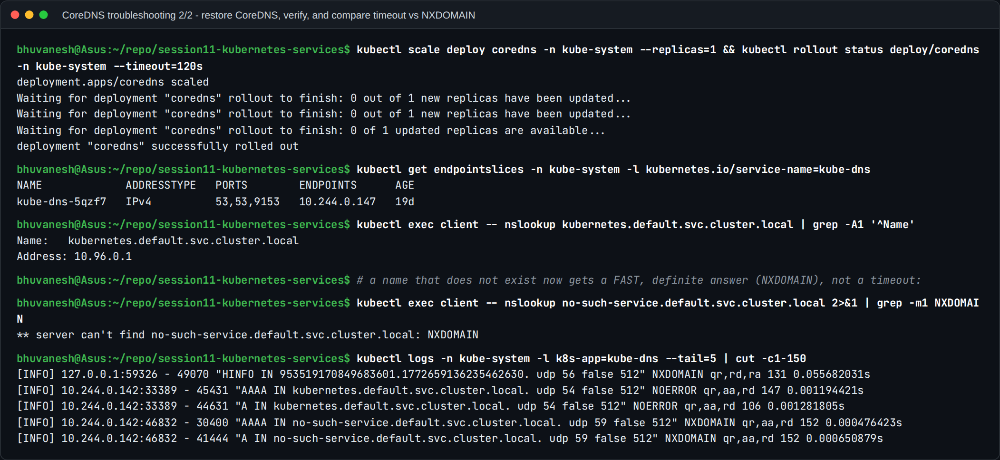

# CoreDNS (Session 11, Task 4)

**Name:** Bhuvanesh M S
**Enrollment number:** 24bcs10134

Standalone write-up for Task 4. The screenshots are from my Session 11 run (minikube v1.39.0,
Kubernetes v1.37.0) and are also walked through in
[Part 3 of the main README](../README.md#part-3--fqdn-and-coredns). The naming side (what the
names look like) is in [../fqdn/README.md](../fqdn/README.md).

References:

- https://kubernetes.io/docs/tasks/administer-cluster/coredns/
- https://kubernetes.io/docs/tasks/administer-cluster/dns-debugging-resolution/
- https://coredns.io/plugins/

---

## 1. What is CoreDNS

**CoreDNS is the DNS server that runs inside the cluster and answers cluster names** such as
`yatri-clusterip.default.svc.cluster.local`. It is:

- a DNS server written in Go, built entirely out of **plugins** chained together by a config
  file called the **Corefile**;
- a CNCF graduated project;
- the default cluster DNS since Kubernetes v1.13, where it replaced the older **kube-dns**.
  For compatibility the Service in front of it is still called `kube-dns` and its Pods still
  carry the label `k8s-app=kube-dns`.

It is **not part of the control plane**. It is an **addon**: an ordinary Deployment in
`kube-system`, behind an ordinary ClusterIP Service, configured by an ordinary ConfigMap.



```
$ kubectl get pods -n kube-system -l k8s-app=kube-dns
coredns-559f6c778d-x7c2c   1/1   Running

$ kubectl get svc -n kube-system kube-dns
kube-dns   ClusterIP   10.96.0.10   53/UDP,53/TCP,9153/TCP
```

Port 53 over **both UDP and TCP** (TCP is used when an answer is too big for UDP), and 9153
for Prometheus metrics.

---

## 2. Why Kubernetes uses it

| Need | How CoreDNS meets it |
| ---- | -------------------- |
| Pod IPs change constantly; clients need stable names | The `kubernetes` plugin answers from a **watch on the API server**, so records appear and change the moment Services and EndpointSlices do. No zone files |
| Pods also need to resolve the internet (`github.com`, `pypi.org`) | The `forward` plugin sends everything that is not a cluster name to the upstream resolver |
| DNS is on the hot path of almost every request | `cache`, and it is lightweight enough to run several replicas (and a NodeLocal DNSCache can be added on big clusters) |
| Operators need to see and change its behaviour | Health, readiness and Prometheus endpoints built in; the Corefile is a ConfigMap and `reload` applies edits without a restart |
| One tool, many jobs | Everything is a plugin: rewrites, stub domains for a corporate DNS, extra hosts entries, query logging |

Compared to the old kube-dns (which was three containers: kubedns, dnsmasq and a sidecar),
CoreDNS is a single binary in a single container, which is the main practical reason it
replaced it.

---

## 3. How service discovery works

Kubernetes gives a Pod two ways to find a Service:

1. **DNS (the one that matters).** Every Service gets `<svc>.<ns>.svc.cluster.local`
   automatically.
2. **Environment variables.** The kubelet injects `YATRI_CLUSTERIP_SERVICE_HOST` /
   `..._SERVICE_PORT` for every Service that **already existed when the Pod started**. Services
   created later are invisible this way, which is why DNS is the method everyone actually
   uses.

The DNS path has three moving parts, none of which I configured by hand:



- **The API server** is the source of truth.
- **CoreDNS** keeps an in-memory copy of all Services and EndpointSlices through a watch, and
  answers from that.
- **The kubelet** points every Pod at CoreDNS by writing `/etc/resolv.conf` into it at
  creation time. It takes the nameserver IP from its own `clusterDNS` setting, which is why
  `10.96.0.10` is fixed at cluster creation, before CoreDNS has even started.

So "creating a Service" is the entire DNS configuration step. The record exists as soon as
CoreDNS's watch sees the new object.

---

## 4. How a DNS query is resolved

From the `curl-test` Pod in `default`, resolving `yatri-clusterip`:

```
$ kubectl exec curl-test -- cat /etc/resolv.conf
search default.svc.cluster.local svc.cluster.local cluster.local
nameserver 10.96.0.10
options ndots:5
```

1. **In the Pod: the libc resolver applies `ndots` and `search`.** `yatri-clusterip` has 0 dots,
   fewer than 5, so the search suffixes are tried **in order** before the bare name.
2. **First candidate:** `yatri-clusterip.default.svc.cluster.local`, sent as a UDP query to
   `10.96.0.10:53`.
3. **On the node:** `10.96.0.10` is itself a ClusterIP, so kube-proxy rules DNAT the query to
   one of the CoreDNS Pods.
4. **In CoreDNS, the plugin chain runs:** `cache` (miss) then `kubernetes`, which owns the
   `cluster.local` zone, finds the Service in its in-memory copy and returns an **A record
   `10.107.102.107` with TTL 30**.
5. **Back in the Pod**, the resolver stops at the first success and hands the IP to curl.

If the name were `api.github.com` (2 dots, fewer than 5), steps 2 to 4 would happen for each
search suffix and return **NXDOMAIN** each time (the `kubernetes` plugin is authoritative for
`cluster.local`). Only then is `api.github.com` itself sent; it is not a cluster name, so
`forward` sends it to the upstream resolver and `cache` keeps the answer.

That is the well-known `ndots:5` cost: external names cost several wasted queries (twice that
if the client asks for A and AAAA). Ending a name with a dot (`api.github.com.`) skips the
search list entirely.

All four ways of writing the same Service resolve to the same FQDN:



**The `dig` trap.** `dig` does not use the search list unless you pass `+search`, so a short
name looks broken under `dig` while `curl` to the same name works:



When debugging, query the full FQDN (or use `nslookup` / `getent hosts`, which go through the
normal resolver path).

---

## 5. CoreDNS configuration: the Corefile

The Corefile lives in the `coredns` ConfigMap in `kube-system`:

```bash
kubectl get configmap coredns -n kube-system -o yaml
```



```
.:53 {
    errors
    health { lameduck 5s }
    ready
    kubernetes cluster.local in-addr.arpa ip6.arpa {
       pods insecure
       fallthrough in-addr.arpa ip6.arpa
       ttl 30
    }
    prometheus :9153
    forward . /etc/resolv.conf { max_concurrent 1000 }
    cache 30
    loop
    reload
    loadbalance
}
```

`.:53` means "this server block handles **every** zone (`.` is the root) on port 53". Inside
it, each line enables a plugin. The order in the file does not decide the execution order
(that is fixed when CoreDNS is compiled), but each query passes through the chain until a
plugin answers it.

| Plugin | What it does | Why it is there |
| ------ | ------------ | --------------- |
| `errors` | Logs errors that happen while serving a query to stdout | So failures show up in `kubectl logs` |
| `health { lameduck 5s }` | Serves `http://:8080/health`. On shutdown, keeps answering for 5 more seconds ("lame duck") | Liveness probe target; the lame-duck period lets in-flight queries finish during a rolling update |
| `ready` | Serves `http://:8181/ready`, which returns 200 once all plugins report ready (for example, the `kubernetes` plugin has synced with the API) | Readiness probe target, so a CoreDNS Pod only joins the `kube-dns` endpoints when it can actually answer |
| `kubernetes cluster.local in-addr.arpa ip6.arpa` | **The Kubernetes integration.** Answers Service, Pod and reverse (PTR) records for those zones from a watch on the API | This is what makes it cluster DNS rather than a generic DNS server |
| `pods insecure` (inside `kubernetes`) | Answers dashed-IP Pod records (`10-244-0-46.default.pod.cluster.local`) without checking that such a Pod exists | Backwards compatibility with kube-dns. `pods verified` checks the Pod exists; `pods disabled` turns them off |
| `fallthrough in-addr.arpa ip6.arpa` (inside `kubernetes`) | If a reverse lookup is not a cluster IP, pass it to the next plugin instead of returning NXDOMAIN | So reverse lookups for non-cluster IPs reach `forward` |
| `ttl 30` (inside `kubernetes`) | TTL on the answers it gives | Clients cannot cache a stale Pod IP for long |
| `prometheus :9153` | Exposes metrics at `http://:9153/metrics` (request counts, latency, cache hits, response codes) | Monitoring; the reason `kube-dns` publishes port 9153 |
| `forward . /etc/resolv.conf { max_concurrent 1000 }` | Sends any query not answered above to the upstream servers listed in the CoreDNS Pod's own `/etc/resolv.conf` (inherited from the node). `max_concurrent` caps in-flight upstream queries | External names from inside Pods; the cap protects CoreDNS's memory if upstream is slow |
| `cache 30` | Caches answers for up to 30 seconds (positive and negative) | Cuts load on both the `kubernetes` plugin and upstream |
| `loop` | At startup sends a random query to itself; if it comes back through `forward`, there is a forwarding loop and CoreDNS **halts** | A loop would otherwise burn CPU and memory forever. Halting turns it into an obvious `CrashLoopBackOff` |
| `reload` | Checks the Corefile periodically (about every 30s) and applies changes gracefully | Editing the ConfigMap takes effect without restarting the Pods (after the ConfigMap volume itself updates, which can take up to a minute) |
| `loadbalance` | Randomises the order of A / AAAA records in each answer | Spreads clients across the IPs of a headless Service, where there is no kube-proxy to do it |

Plugins that are **not** in this Corefile but worth knowing: `log` (logs every query, see
step 8 below), `hosts` (static entries; minikube uses it for `host.minikube.internal`),
`rewrite` (rename queries) and extra server blocks such as `corp.example:53 { forward . 10.0.0.53 }`
for a stub domain.

---

## 6. How to troubleshoot DNS issues

A checklist in the order I would actually work through it. Each step either finds the fault
or rules a layer out.

### Live run: breaking DNS and walking the checklist

I simulated a DNS outage by scaling CoreDNS to zero, then followed the steps below.



- **Symptom:** `nslookup kubernetes.default...` worked before. With CoreDNS at 0 replicas it
  gives `connection timed out; no servers could be reached`. A **timeout** (not NXDOMAIN)
  means nobody is answering.
- **Step 1:** no Pods with `k8s-app=kube-dns`; the `coredns` Deployment is `0/0`.
- **Step 2:** the `kube-dns` EndpointSlice has **no endpoints**, so the Service IP leads
  nowhere.
- **Step 3:** the Pod's `/etc/resolv.conf` still says `nameserver 10.96.0.10`, which is
  correct. The client config is fine; the server side is missing.



- **Fix:** scale CoreDNS back to 1. The EndpointSlice shows `10.244.0.147` on ports
  53/53/9153 (DNS over UDP and TCP, plus metrics).
- **Verify:** `kubernetes.default.svc.cluster.local` resolves to `10.96.0.1` again.
- **The key distinction:** a name that doesn't exist now gets an immediate **NXDOMAIN**. The
  CoreDNS logs (`[INFO] ... "A IN no-such-service..." NXDOMAIN`) show each query, its type,
  answer code and latency (well under 1 ms). NXDOMAIN means "DNS works, the name is wrong";
  a timeout means "DNS itself is broken".


### Step 1: Is CoreDNS running and Ready?

```bash
kubectl get pods -n kube-system -l k8s-app=kube-dns -o wide
kubectl get deploy coredns -n kube-system
```

Expect every Pod `1/1 Running`. `CrashLoopBackOff` usually means the `loop` plugin found a
forwarding loop or the Corefile has a syntax error (step 2 shows which).

### Step 2: What do its logs say?

```bash
kubectl logs -n kube-system -l k8s-app=kube-dns --tail=50
```

| Log line | Meaning |
| -------- | ------- |
| `[FATAL] plugin/loop: Loop (127.0.0.1:... -> :53) detected` | The node's `/etc/resolv.conf` points at a local stub such as `127.0.0.53` (systemd-resolved), so `forward` sends queries back to CoreDNS. Fix: point the kubelet's `resolvConf` at the real upstream file (for example `/run/systemd/resolve/resolv.conf`) or forward to a real upstream IP |
| `plugin/errors: ... i/o timeout` on upstream queries | CoreDNS cannot reach the upstream resolver: a node / firewall / VPC DNS problem, not a cluster one |
| `Failed to watch ... Unauthorized` / `connection refused` to the API | CoreDNS cannot reach the API server, so its records go stale |
| `plugin/reload: Running configuration SHA512 = ...` | Normal, a Corefile change was loaded |

### Step 3: Does the `kube-dns` Service have endpoints?

```bash
kubectl get svc -n kube-system kube-dns
kubectl get endpointslice -n kube-system -l kubernetes.io/service-name=kube-dns
```

The Service IP must match the `nameserver` in Pods (`10.96.0.10` here), and the EndpointSlice
must list the CoreDNS Pod IPs on port 53. Empty endpoints means the Pods are not Ready (back
to step 1).

### Step 4: Is the Pod pointed at the right place?

```bash
kubectl exec <pod> -- cat /etc/resolv.conf
```

Check `nameserver` is the `kube-dns` ClusterIP, the first `search` entry is the Pod's own
namespace, and `options ndots:5`. If the nameserver is the node's resolver instead, the Pod
has `dnsPolicy: Default` (or is `hostNetwork: true` without `dnsPolicy: ClusterFirstWithHostNet`).

### Step 5: Query from a debug Pod, from the outside in

```bash
# a throwaway Pod with dig/nslookup (the official debugging image)
kubectl run dnsutils --rm -it --restart=Never \
  --image=registry.k8s.io/e2e-test-images/jessie-dnsutils:1.3 -- sh

# or the netshoot Pod from this session: kubectl exec -it curl-test -- sh

nslookup kubernetes.default                          # always exists: tests DNS end to end
dig +short yatri-clusterip.default.svc.cluster.local # full FQDN: no search-list ambiguity
dig @10.96.0.10 yatri-clusterip.default.svc.cluster.local   # ask the Service IP explicitly
dig @<coredns-pod-ip> yatri-clusterip.default.svc.cluster.local  # bypass kube-proxy
dig +short github.com                                # tests the forward / upstream path
```

How to read the combinations:

| Cluster names | External names | Most likely problem |
| ------------- | -------------- | ------------------- |
| Work | Work | DNS is fine; the bug is in the app, the port or the name it uses |
| Work | Fail | Upstream: `forward` target unreachable, node DNS, egress firewall |
| Fail | Fail | CoreDNS itself, the `kube-dns` Service, or the network path to it (steps 1 to 3, step 7) |
| `@<pod-ip>` works, `@10.96.0.10` fails | | kube-proxy / Service rules on that node |

### Step 6: Read the answer, not just "it failed"

| Result | What it means | Where to look |
| ------ | ------------- | ------------- |
| `NXDOMAIN` | **CoreDNS answered**: the name does not exist | Typo, wrong namespace (short name from another namespace), Service not created, or `dig` without `+search` |
| `NOERROR` with no answer | The name exists but not for that record type | e.g. asking AAAA on an IPv4-only cluster, or SRV for an unnamed port |
| `SERVFAIL` | CoreDNS tried and failed, usually upstream | CoreDNS logs (step 2), upstream reachability |
| **Timeout** / `connection timed out; no servers could be reached` | **Nobody answered.** The query never got a reply | CoreDNS down, empty endpoints, kube-proxy, or a **NetworkPolicy dropping port 53** |

The NXDOMAIN-versus-timeout split is the most useful single fact: NXDOMAIN proves the whole DNS
path works and the **name** is wrong; a timeout means the **path** is broken.

### Step 7: Is a NetworkPolicy blocking DNS?

As soon as a namespace has a default-deny **egress** policy, Pods in it cannot reach CoreDNS
unless DNS is explicitly allowed, and every lookup times out. Both UDP **and TCP** 53 are
needed (TCP for large answers):

```bash
kubectl get networkpolicy -A
```

```yaml
apiVersion: networking.k8s.io/v1
kind: NetworkPolicy
metadata:
  name: allow-dns-egress
  namespace: shop
spec:
  podSelector: {}
  policyTypes: [Egress]
  egress:
    - to:
        - namespaceSelector:
            matchLabels:
              kubernetes.io/metadata.name: kube-system
          podSelector:
            matchLabels:
              k8s-app: kube-dns
      ports:
        - protocol: UDP
          port: 53
        - protocol: TCP
          port: 53
```

(Policy ports refer to the **Pod's** port after DNAT, which is 53 for CoreDNS. On clusters where
the CoreDNS container listens on a different port, use that one.)

### Step 8: Watch the queries with the `log` plugin

When the above is not enough, make CoreDNS log every query:

```bash
kubectl -n kube-system edit configmap coredns
# add a line containing just:   log
# inside the .:53 { ... } block, e.g. right after "errors"
```

`reload` picks it up without a restart (allow up to a minute or two for the ConfigMap to
propagate), then:

```bash
kubectl logs -n kube-system -l k8s-app=kube-dns -f
# [INFO] 10.244.0.49:41234 - 5512 "A IN yatri-clusterip.default.svc.cluster.local. udp 70 false 1232" NOERROR qr,aa,rd 116 0.0003s
```

Each line shows the **client Pod IP**, the exact **name asked** (so the search-list expansion
is visible), the record type, the **response code** and the latency. If the query never appears
in the log, it never reached CoreDNS (back to step 7). Remove `log` again afterwards: on a busy
cluster it is a lot of output.

### Step 9: The `ndots` / search pitfalls

| Symptom | Cause | Fix |
| ------- | ----- | --- |
| Short name works in one namespace, NXDOMAIN in another | The search list starts with the **Pod's own** namespace | Use `<svc>.<ns>` or the full FQDN |
| External lookups slow, CoreDNS busy with NXDOMAINs | `ndots:5` tries every search suffix first | Use a trailing dot (`api.github.com.`), or lower `ndots` in the Pod's `dnsConfig` |
| `dig short-name` empty but the app works | `dig` ignores the search list | `dig +search`, or the FQDN |
| A name with 5+ dots that should have been a cluster name fails | It is treated as absolute and the search list is never tried | Write the full cluster FQDN |

Lowering `ndots` for one workload:

```yaml
spec:
  dnsConfig:
    options:
      - name: ndots
        value: "2"
```

---

## Summary

- CoreDNS is the cluster's DNS server: an addon Deployment in `kube-system`, behind the
  `kube-dns` Service at `10.96.0.10`, configured by the `coredns` ConfigMap.
- The `kubernetes` plugin answers cluster names from a live watch on the API; `forward` handles
  everything else; `cache`, `loop`, `reload`, `loadbalance`, `health`, `ready` and `prometheus`
  keep it fast and operable.
- The Pod side is the kubelet-written `/etc/resolv.conf`: `nameserver`, `search` and `ndots`.
- Troubleshooting is a layer-by-layer walk: CoreDNS Pods and logs, `kube-dns` endpoints, the
  Pod's `resolv.conf`, queries from a debug Pod, the response code (NXDOMAIN versus timeout),
  NetworkPolicy on port 53, and finally the `log` plugin.
