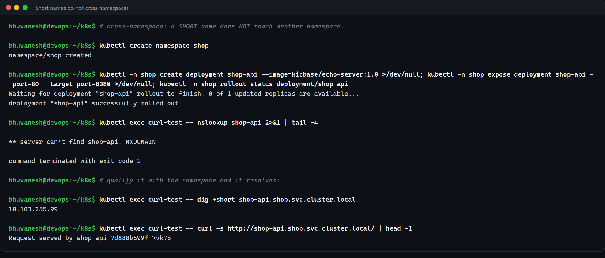
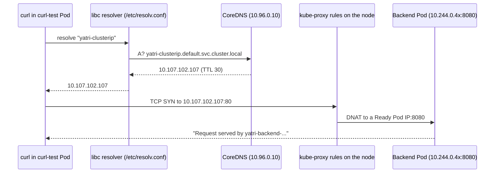
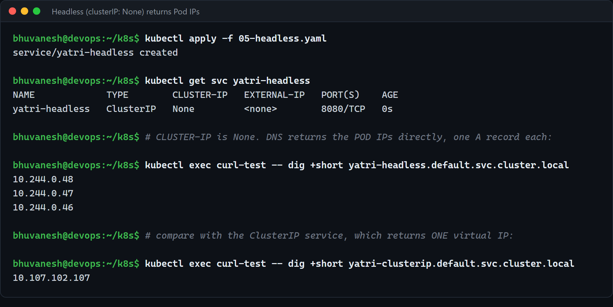
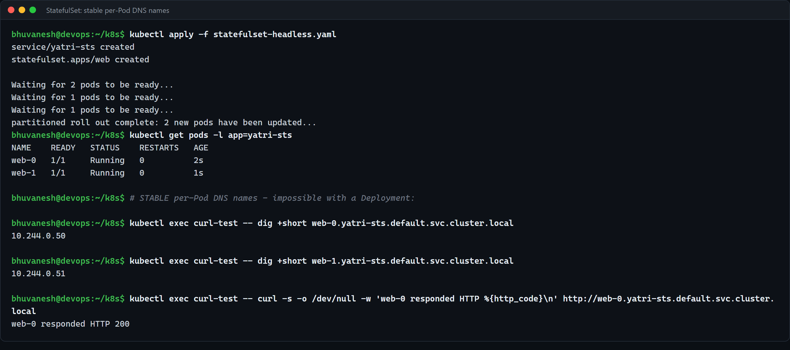

# FQDN in Kubernetes (Session 11, Task 3)

**Name:** Bhuvanesh M S
**Enrollment number:** 24bcs10134

This is the standalone write-up for Task 3. The live evidence (all screenshots below) comes
from my Session 11 run on minikube with Kubernetes v1.37.0 and is also walked through in
[Part 3 of the main README](../README.md#part-3--fqdn-and-coredns). The DNS server side of the
story is in [../coredns/README.md](../coredns/README.md).

Reference: https://kubernetes.io/docs/concepts/services-networking/dns-pod-service/

---

## 1. What is an FQDN

A **Fully Qualified Domain Name** is a domain name written out completely, from the host all
the way up to the DNS root, so that it means exactly one thing no matter where you ask from.

| Name | Fully qualified? | Why |
| ---- | ---------------- | --- |
| `yatri-clusterip` | No | A short name. What it means depends on which namespace the asking Pod is in |
| `yatri-clusterip.default` | No | Better, but still relies on the search list to add `.svc.cluster.local` |
| `yatri-clusterip.default.svc.cluster.local` | Yes, in practice | Every label is there, so it is unambiguous anywhere in the cluster |
| `yatri-clusterip.default.svc.cluster.local.` | Yes, strictly | The trailing dot is the DNS root. It also tells the resolver **not** to try the search list |

The trailing-dot detail matters later (section 4): a name ending in `.` is treated as absolute
and goes straight to CoreDNS with no search-list expansion.

---

## 2. Kubernetes Service DNS

Every Service gets a DNS record **automatically**, the moment the Service object is created.
Nobody writes a zone file. CoreDNS watches the API server (Services and EndpointSlices) and
answers from that live state.

What the record resolves to depends on the Service type:

| Service type | Record for `<svc>.<ns>.svc.cluster.local` | Evidence |
| ------------ | ----------------------------------------- | -------- |
| ClusterIP / NodePort / LoadBalancer | **A** (or AAAA) record: the one virtual ClusterIP | `yatri-clusterip` -> `10.107.102.107` |
| Headless (`clusterIP: None`) | **One A record per Ready Pod**: the Pod IPs themselves | `yatri-headless` -> `10.244.0.46/47/48` |
| ExternalName | **CNAME** to the external name | `external-db` -> `www.kubernetes.io` |

Plus **SRV records** for every **named** port (section 6).

---

## 3. The DNS naming convention

```
<service-name> . <namespace> . svc . <cluster-domain>
      |              |          |          |
      |              |          |          +-- cluster.local unless the cluster was built otherwise
      |              |          +------------- "svc" = a Service record ("pod" = a Pod record)
      |              +------------------------ the namespace the Service lives in
      +--------------------------------------- metadata.name of the Service
```

and for a Pod behind a headless Service (a StatefulSet Pod, or any Pod that sets `hostname`
and `subdomain`):

```
<pod-hostname> . <headless-service> . <namespace> . svc . <cluster-domain>
     web-0     .     yatri-sts      .   default   . svc .  cluster.local
```

The rules that follow from it:

- Service names must be valid **DNS labels** (lowercase, digits, `-`, max 63 characters).
  That is why Kubernetes rejects `Yatri_Backend` as a Service name.
- `cluster.local` is the default **cluster domain**. It is set on the kubelet
  (`clusterDomain`) and in the CoreDNS `kubernetes` plugin; the two must agree.

---

## 4. Namespace-based DNS

The namespace is part of the name, and the **search list** in every Pod's `/etc/resolv.conf`
is what makes short names work inside a namespace:

```
search default.svc.cluster.local svc.cluster.local cluster.local
nameserver 10.96.0.10
options ndots:5
```

The first search entry is **the Pod's own namespace**. So from a Pod in `default`:

| You type | Resolver tries | Result |
| -------- | -------------- | ------ |
| `yatri-clusterip` | `yatri-clusterip.default.svc.cluster.local` | Found (same namespace) |
| `yatri-clusterip.default` | `yatri-clusterip.default.default.svc.cluster.local` (NXDOMAIN), then `yatri-clusterip.default.svc.cluster.local` | Found |
| `shop-api` | `shop-api.default.svc.cluster.local` ... | **NXDOMAIN**: it lives in `shop` |
| `shop-api.shop` | ... `shop-api.shop.svc.cluster.local` | Found |
| `shop-api.shop.svc.cluster.local` | 4 dots < `ndots:5`, so the search list is tried first, then the name as-is | Found (after wasted lookups) |
| `shop-api.shop.svc.cluster.local.` | Exactly that name, no search list | Found, in one query |

All four forms of the same-namespace name resolve to the same IP and canonicalise to the same
FQDN:


And the cross-namespace case, where the short name fails and the qualified name works:



**Namespaces are a naming boundary, not a security boundary.** Any Pod can resolve and (by
default) connect to any Service in any namespace if it uses the right name. Blocking that is
the job of NetworkPolicy, not DNS.

A Pod's DNS behaviour can be changed per Pod with `dnsPolicy` (`ClusterFirst` is the default;
`Default` uses the node's resolver; `None` plus `dnsConfig` lets you write your own,
including a lower `ndots`).

---

## 5. Pod-to-Service communication

What happens when the `curl-test` Pod runs `curl http://yatri-clusterip/`:



1. The application asks the normal libc resolver; nothing Kubernetes-specific is in the image.
2. The resolver applies `ndots`/`search` and sends the query to the `nameserver`, which is the
   `kube-dns` Service ClusterIP.
3. CoreDNS answers from its watch on the API server.
4. The application connects to the ClusterIP; kube-proxy's rules rewrite the destination to
   one of the Pods in the Service's EndpointSlice.

For a **headless** Service, step 3 returns the Pod IPs directly and step 4 is skipped: the
client connects to a Pod IP and there is no kube-proxy load balancing.



---

## 6. Examples of Kubernetes FQDNs

All examples use the default `cluster.local` domain and the objects from this session.

| Record | Form | Example from this session | Resolves to |
| ------ | ---- | ------------------------- | ----------- |
| Service (ClusterIP) **A** | `<svc>.<ns>.svc.cluster.local` | `yatri-clusterip.default.svc.cluster.local` | `10.107.102.107` (the ClusterIP) |
| Service in another namespace **A** | `<svc>.<ns>.svc.cluster.local` | `shop-api.shop.svc.cluster.local` | `10.103.255.99` |
| Headless Service **A** | `<svc>.<ns>.svc.cluster.local` | `yatri-headless.default.svc.cluster.local` | All Ready Pod IPs (`10.244.0.46`, `.47`, `.48`) |
| Headless Pod record **A** | `<pod-hostname>.<svc>.<ns>.svc.cluster.local` | `web-0.yatri-sts.default.svc.cluster.local` | That one Pod's IP (`10.244.0.50`, later `10.244.0.53`) |
| **SRV** for a named port | `_<port-name>._<protocol>.<svc>.<ns>.svc.cluster.local` | `_http._tcp.yatri-headless.default.svc.cluster.local` | One SRV per Pod: port `8080` + a target name per Pod |
| **SRV** on a normal Service | same form | `_http._tcp.yatri-clusterip.default.svc.cluster.local` | One SRV: port `80`, target `yatri-clusterip.default.svc.cluster.local` |
| Pod **A** record (dashed IP) | `<pod-ip-with-dashes>.<ns>.pod.cluster.local` | `10-244-0-46.default.pod.cluster.local` | `10.244.0.46` |
| Pod behind a Service **A** | `<pod-ip-with-dashes>.<svc>.<ns>.svc.cluster.local` | `10-244-0-46.yatri-headless.default.svc.cluster.local` | `10.244.0.46` |
| ExternalName **CNAME** | `<svc>.<ns>.svc.cluster.local` | `external-db.default.svc.cluster.local` | CNAME `www.kubernetes.io.` (then the client resolves that) |
| The DNS Service itself | `kube-dns.kube-system.svc.cluster.local` | | `10.96.0.10` |
| The API server | `kubernetes.default.svc.cluster.local` | | The first IP of the Service CIDR (`10.96.0.1` on minikube) |

Notes on the less common rows:

- **SRV records only exist for named ports.** `05-headless.yaml` and `01-clusterip.yaml` name
  their port `http`, so they get `_http._tcp...`. `statefulset-headless.yaml` uses an unnamed
  port, so `yatri-sts` has no SRV record. SRV is how a client discovers the **port** as well as
  the host, which some clients (Kafka, Cassandra, LDAP, SIP) use.
- **Dashed-IP Pod records** are answered because the CoreDNS `kubernetes` plugin is configured
  with `pods insecure` (visible in the Corefile in the CoreDNS doc). They are rarely useful,
  because you already need the IP to build the name; their real use is giving TLS certificates
  something name-shaped. Do not build anything on them.
- The **headless Pod record** is the useful one. It exists because the StatefulSet's
  `serviceName: yatri-sts` makes each Pod's hostname `web-N` and subdomain `yatri-sts`. The
  name survives a Pod being deleted and recreated, even though the IP does not:



### Commands to check each record type

From the `dns-test/` netshoot Pod (`curl-test`):

```bash
kubectl exec curl-test -- dig +short yatri-clusterip.default.svc.cluster.local
kubectl exec curl-test -- dig +short yatri-headless.default.svc.cluster.local
kubectl exec curl-test -- dig +short web-0.yatri-sts.default.svc.cluster.local
kubectl exec curl-test -- dig +short SRV _http._tcp.yatri-headless.default.svc.cluster.local
kubectl exec curl-test -- dig +short 10-244-0-46.default.pod.cluster.local
kubectl exec curl-test -- dig +short CNAME external-db.default.svc.cluster.local
```

Use the full name (or `dig +search`) with `dig`: it does **not** apply the search list on its
own. That trap is shown in [../coredns/README.md](../coredns/README.md#4-how-a-dns-query-is-resolved).

---

## Summary

- An FQDN is the complete, unambiguous name. In Kubernetes it is
  `<svc>.<ns>.svc.cluster.local` for Services and
  `<pod>.<svc>.<ns>.svc.cluster.local` for Pods behind a headless Service.
- Short names work only because the kubelet writes a **search list** starting with the Pod's
  own namespace into every Pod.
- Across namespaces, use at least `<svc>.<ns>`; in shared config (Helm charts, connection
  strings) use the full FQDN so it does not depend on where it runs.
- The records are created and updated automatically from the API; creating the Service is the
  whole configuration step.
