# Kubernetes Ingress, ConfigMaps & Secrets (Homework Submission)

**Name:** Bhuvanesh M S
**Enrollment number:** 24bcs10134
**Environment:** Ubuntu 26.04 LTS on WSL 2 (Windows 11) · minikube v1.39.0 (docker driver) ·
Kubernetes v1.37.0 · ingress-nginx controller v1.15.1

Resources:

- https://kubernetes.io/docs/concepts/configuration/configmap/
- https://kubernetes.io/docs/concepts/configuration/secret/
- https://kubernetes.io/docs/concepts/services-networking/ingress/
- https://kubernetes.github.io/ingress-nginx/

---

## Homework tasks

1. **ConfigMaps** — create them, and inject them into Pods both as **environment variables**
   and as **mounted files**.
2. **Secrets** — the same, and understand how a Secret actually differs from a ConfigMap.
3. **Ingress** — enable the controller and route by **path** and by **host**, then terminate
   **TLS** at the Ingress using a `kubernetes.io/tls` Secret.

### Files in this folder

```
session12-k8s-ingress-configmap-secrets/
├── 01-configmap.yaml                     scalars + whole-file values
├── 02-secret.yaml                        stringData vs data
├── 03-pod-env-from-configmap-secret.yaml injection as env vars
├── 04-pod-volume-mounts.yaml             injection as files
├── 05-nginx-configmap-volume.yaml        nginx serving a page from a ConfigMap
├── 06-apps-for-ingress.yaml              two apps + two Services to route between
├── 07-ingress-path-based.yaml            /shop and /admin
├── 08-ingress-host-based.yaml            shop.yatri.local and admin.yatri.local
└── 09-ingress-tls.yaml                   HTTPS termination
```

---

# Part 1 — ConfigMaps

## Creating one

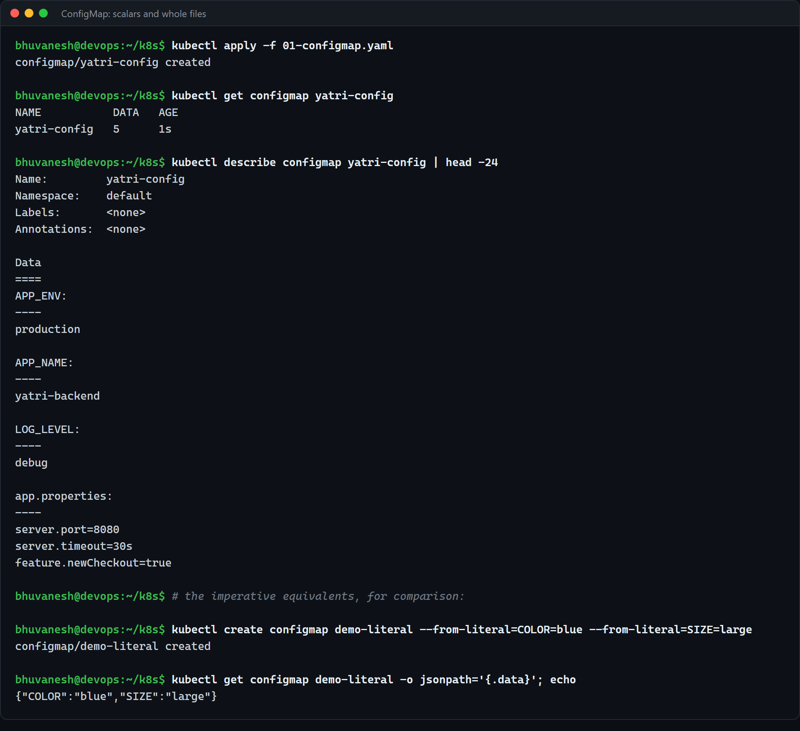

A ConfigMap holds **non-secret** configuration as key/value pairs. Two shapes of value are
worth knowing, and `01-configmap.yaml` has both:

```yaml
data:
  APP_NAME: "yatri-backend"       # a scalar -> becomes an env var nicely
  LOG_LEVEL: "debug"
  app.properties: |               # a whole FILE -> becomes a file in a volume
    server.port=8080
    server.timeout=30s
```

`DATA 5` in `kubectl get` is the number of **keys**, not bytes.

The imperative forms do the same thing without a file:

```bash
kubectl create configmap demo-literal --from-literal=COLOR=blue --from-literal=SIZE=large
kubectl create configmap demo-file    --from-file=app.properties
```

→ `{"COLOR":"blue","SIZE":"large"}`

`--from-file` uses the **filename as the key** and the file contents as the value, which is
exactly the `app.properties:` shape above written by hand.

## Injecting as environment variables

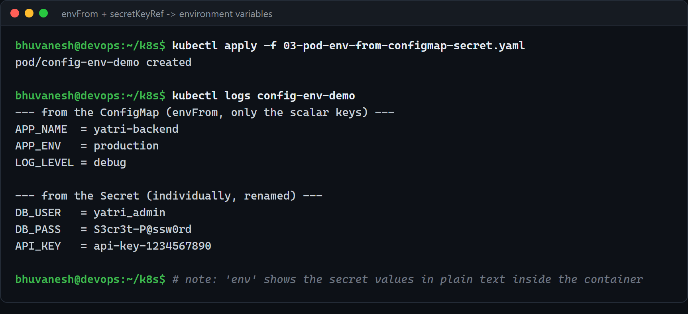

```yaml
envFrom:
  - configMapRef:
      name: yatri-config      # pull in EVERY key at once
env:
  - name: DB_USER             # or pull one key, under a different name
    valueFrom:
      secretKeyRef:
        name: yatri-secret
        key: DB_USERNAME
```

Output from inside the container:

```
APP_NAME  = yatri-backend
APP_ENV   = production
LOG_LEVEL = debug
DB_USER   = yatri_admin
DB_PASS   = S3cr3t-P@ssw0rd
API_KEY   = api-key-1234567890
```

Two things to note:

- **`envFrom` only imported the three scalar keys.** `app.properties` and `index.html` were
  skipped, because a multi-line value makes a poor environment variable and their key names
  (with a `.` in them) are not valid env var names anyway.
- **`valueFrom` renames.** The Secret key is `DB_USERNAME`, the variable is `DB_USER`. This
  matters when the app expects a specific variable name you cannot change.

## Injecting as files

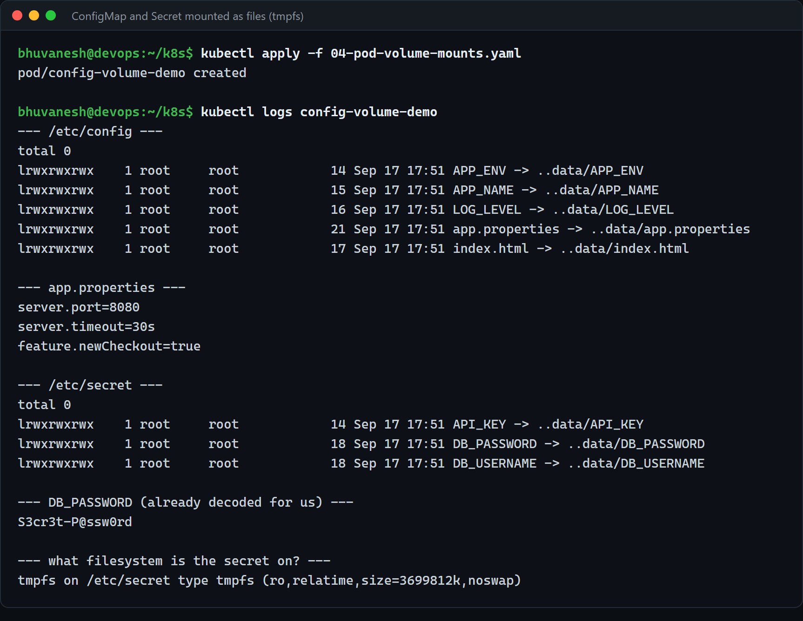

```yaml
volumes:
  - name: config-vol
    configMap:
      name: yatri-config
containers:
  - volumeMounts:
      - name: config-vol
        mountPath: /etc/config
        readOnly: true
```

**Each key becomes a file**, named after the key, containing the value:

```
$ ls -l /etc/config
APP_ENV -> ..data/APP_ENV
APP_NAME -> ..data/APP_NAME
LOG_LEVEL -> ..data/LOG_LEVEL
app.properties -> ..data/app.properties
index.html -> ..data/index.html

$ cat /etc/config/app.properties
server.port=8080
server.timeout=30s
feature.newCheckout=true
```

**They are symlinks, not regular files.** That is deliberate. The kubelet writes a new
timestamped directory and then flips one symlink, so an update is **atomic** — a process
reading the file never catches it half-written.

## Env vars vs files — which to use

| | Environment variables | Mounted files |
| - | -------------------- | ------------- |
| Update while running | **No** — fixed at container start | **Yes** — the file changes underneath |
| Multi-line / whole config files | Awkward | Natural |
| Visible in `kubectl describe pod` | **Yes** | No |
| Leaks into child processes and crash dumps | **Yes** | No |
| Best for | 12-factor style settings | Config files, certs, keys |

**The update behaviour is the one that actually decides it**, and it is worth proving:

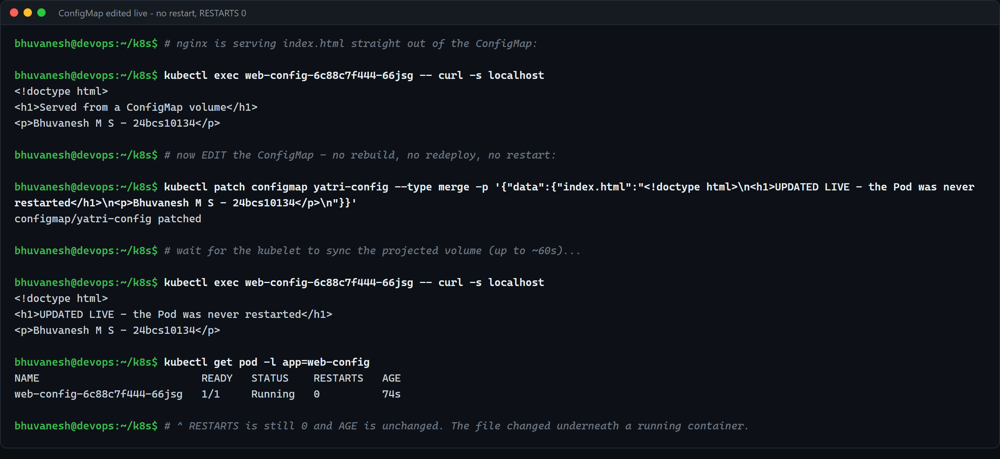

An nginx Deployment serving `index.html` straight out of the ConfigMap volume:

```
$ kubectl exec web-config-... -- curl -s localhost
<h1>Served from a ConfigMap volume</h1>
```

Then the **ConfigMap** is edited — the Deployment is not touched at all:

```bash
kubectl patch configmap yatri-config --type merge -p '{"data":{"index.html":"..."}}'
```

```
$ kubectl exec web-config-... -- curl -s localhost
<h1>UPDATED LIVE - the Pod was never restarted</h1>

$ kubectl get pod -l app=web-config
web-config-6c88c7f444-66jsg   1/1   Running   0   74s
```

**`RESTARTS` is still 0 and the AGE did not reset.** The file changed underneath a running
container. No image rebuild, no redeploy, no restart.

Two honest caveats:

- It is **not instant.** The kubelet syncs projected volumes on a period (about a minute by
  default), so there is a lag.
- **The application still has to notice.** nginx re-reads `index.html` per request so it "just
  worked"; an app that reads its config once at startup will keep using the old values until
  it is restarted. The usual trick is to hash the ConfigMap into a Pod-template annotation so
  that changing it triggers a rolling update deliberately.

---

# Part 2 — Secrets

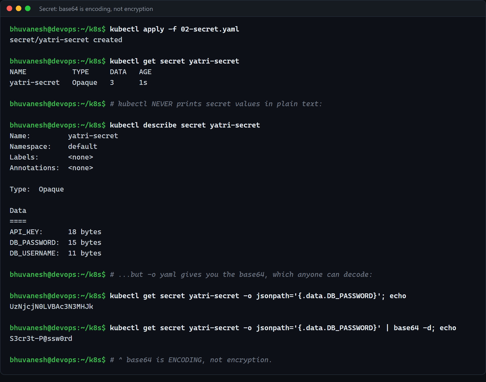

```yaml
stringData:                     # plain text in; Kubernetes base64-encodes it for you
  DB_PASSWORD: "S3cr3t-P@ssw0rd"
data:                           # you supply the base64 yourself
  API_KEY: YXBpLWtleS0xMjM0NTY3ODkw
```

`stringData` is write-only sugar — it never appears when you read the object back; everything
comes back under `data`, base64-encoded.

## The single most important thing about Secrets

kubectl is careful not to print them:

```
$ kubectl describe secret yatri-secret
API_KEY:      18 bytes
DB_PASSWORD:  15 bytes
DB_USERNAME:  11 bytes
```

Only the **sizes**. But:

```
$ kubectl get secret yatri-secret -o jsonpath='{.data.DB_PASSWORD}'
UzNjcjN0LVBAc3N3MHJk

$ kubectl get secret yatri-secret -o jsonpath='{.data.DB_PASSWORD}' | base64 -d
S3cr3t-P@ssw0rd
```

**base64 is encoding, not encryption.** It is there so arbitrary binary can live in a JSON
field, and nothing more. Anyone who can `get` the Secret can read it with one extra command,
and by default it is stored **unencrypted in etcd**.

So a Secret is not "a ConfigMap that is safe". What it actually gives you over a ConfigMap is:

1. **RBAC can be scoped to it separately** — you can grant `get configmaps` without granting
   `get secrets`.
2. **kubectl and the API avoid printing the values** (as above), so they stay out of terminal
   scrollback and CI logs.
3. **They are only distributed to nodes that run a Pod that needs them**, not to every node.
4. **Mounted Secrets are held in `tmpfs`** — RAM, never written to the node's disk:

   ```
   $ mount | grep /etc/secret
   tmpfs on /etc/secret type tmpfs (ro,relatime,size=3699812k,noswap)
   ```

   `noswap` too, so it cannot be paged out to disk either.
5. They are the **integration point for the real solutions** — encryption at rest
   (`EncryptionConfiguration`), Sealed Secrets, External Secrets Operator, Vault. Those tools
   all end up producing a Secret; the Secret is the interface, not the security boundary.

Note also that in the volume mount, `/etc/secret/DB_PASSWORD` already contains
`S3cr3t-P@ssw0rd` in plain text — **the application never has to decode base64.** That is only
the wire/storage format.

And a practical rule from all of this: **never commit a Secret manifest to git.**
`02-secret.yaml` in this folder contains deliberately fake values for the homework.

---

# Part 3 — Ingress

## Why it exists

From Session 11: a NodePort gives you an ugly high port on every node; a LoadBalancer gives
you a real external IP **but one per Service**. Ten services means ten load balancers, ten
IPs, ten bills — and still no path routing, no name-based virtual hosting and no TLS.

**An Ingress is one entry point that routes HTTP by hostname and path.** It works at **L7**;
Services work at L4. That is the whole difference.

An Ingress object on its own does **nothing**. It is a set of rules that an **Ingress
controller** has to read and act on:

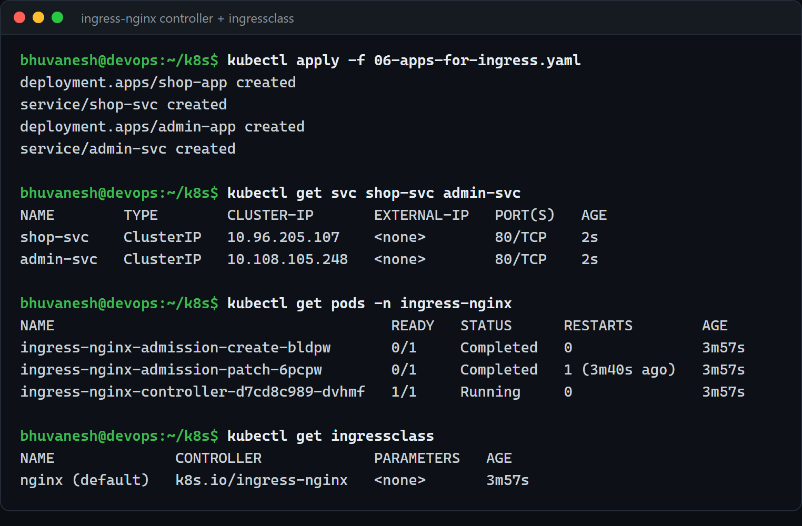

```bash
minikube addons enable ingress
```

```
NAME                                       READY   STATUS
ingress-nginx-controller-d7cd8c989-dvhmf   1/1     Running

NAME              CONTROLLER             PARAMETERS   AGE
nginx (default)   k8s.io/ingress-nginx   <none>
```

The controller is just **a Pod running nginx** that watches the API for Ingress objects and
rewrites its own nginx config. `ingressClassName: nginx` in each manifest is what claims a
rule for this controller — a cluster can run several.

## Path-based routing

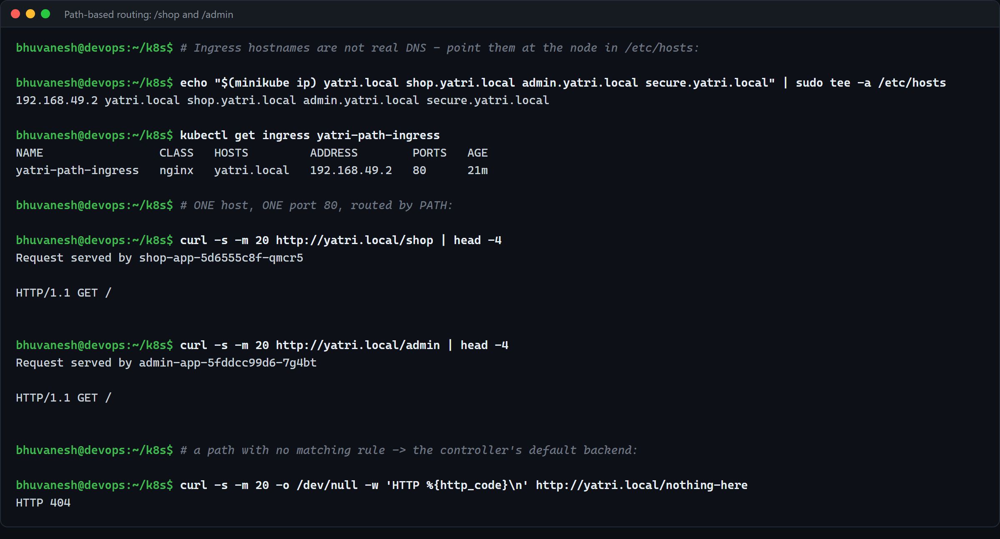

```
$ curl http://yatri.local/shop
Request served by shop-app-5d6555c8f-qmcr5

$ curl http://yatri.local/admin
Request served by admin-app-5fddcc99d6-7g4bt

$ curl http://yatri.local/nothing-here
HTTP 404
```

**One hostname, one port 80, two different Services**, chosen by path. Unmatched paths fall
through to the controller's default backend and get a 404.

The `rewrite-target` annotation is the subtle part:

```yaml
annotations:
  nginx.ingress.kubernetes.io/rewrite-target: /$2
...
- path: /shop(/|$)(.*)
```

The capture group `(.*)` is `$2`, so `/shop/orders` reaches the backend as `/orders`.
**Without this, the backend receives `/shop/orders` and has to know it is mounted under
`/shop`** — which defeats the point of routing. (Note this annotation is
`nginx.ingress.kubernetes.io/...`, i.e. **controller-specific**; Traefik or HAProxy use their
own. Only `spec` is portable across controllers.)

> The hostnames here are not real DNS. They are pointed at the Minikube node in
> `/etc/hosts`:
> ```bash
> echo "$(minikube ip) yatri.local shop.yatri.local admin.yatri.local secure.yatri.local" | sudo tee -a /etc/hosts
> ```

## Host-based routing

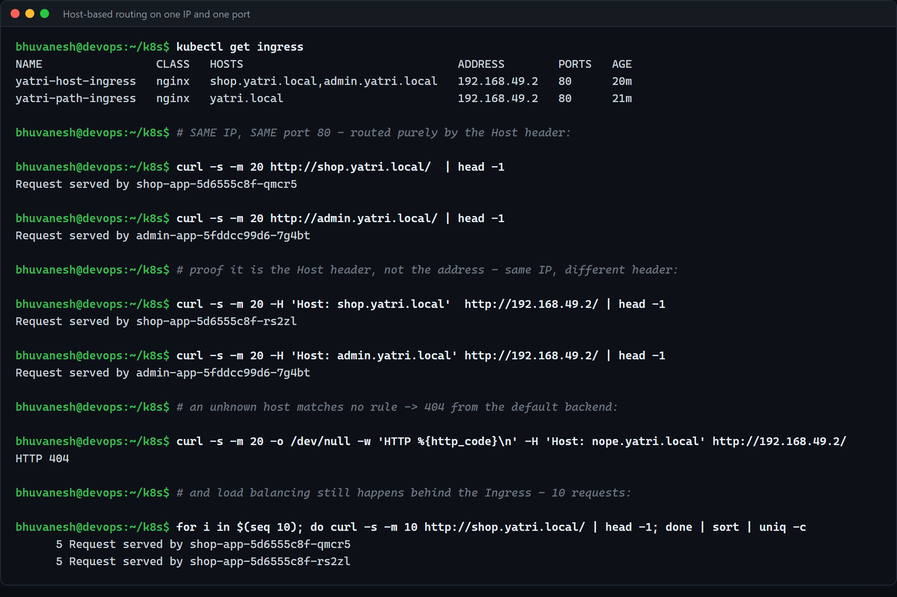

```
$ curl http://shop.yatri.local/     -> Request served by shop-app-5d6555c8f-qmcr5
$ curl http://admin.yatri.local/    -> Request served by admin-app-5fddcc99d6-7g4bt
```

and the part that actually proves the mechanism — **the same IP, the same port, only the
header differs**:

```
$ curl -H 'Host: shop.yatri.local'  http://192.168.49.2/   -> shop-app-5d6555c8f-rs2zl
$ curl -H 'Host: admin.yatri.local' http://192.168.49.2/   -> admin-app-5fddcc99d6-7g4bt
$ curl -H 'Host: nope.yatri.local'  http://192.168.49.2/   -> HTTP 404
```

The routing decision is made **from the HTTP `Host` header**, nothing else. This is ordinary
name-based virtual hosting, and it is exactly what a NodePort or LoadBalancer Service cannot
do — they stop at IP and port, which is all L4 has.

Load balancing still happens underneath:

```
$ for i in $(seq 10); do curl -s http://shop.yatri.local/ | head -1; done | sort | uniq -c
   5 Request served by shop-app-5d6555c8f-qmcr5
   5 Request served by shop-app-5d6555c8f-rs2zl
```

## TLS termination

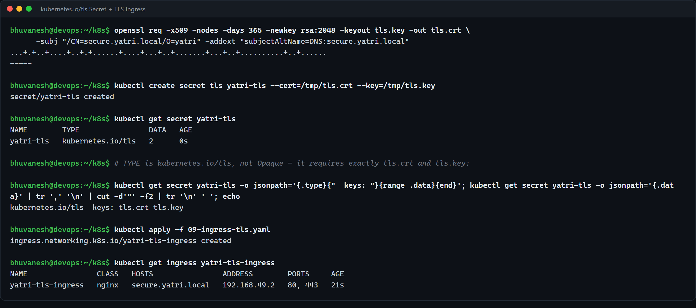

```bash
openssl req -x509 -nodes -days 365 -newkey rsa:2048 -keyout tls.key -out tls.crt \
  -subj "/CN=secure.yatri.local/O=yatri" -addext "subjectAltName=DNS:secure.yatri.local"

kubectl create secret tls yatri-tls --cert=tls.crt --key=tls.key
```

```
NAME        TYPE                DATA
yatri-tls   kubernetes.io/tls   2

type = kubernetes.io/tls   keys: tls.crt tls.key
```

**This is where Ingress and Secrets meet.** The type is `kubernetes.io/tls`, not `Opaque`, and
that type is *validated*: it must contain exactly the keys `tls.crt` and `tls.key`. The Ingress
then only has to name it:

```yaml
tls:
  - hosts: [secure.yatri.local]
    secretName: yatri-tls
```

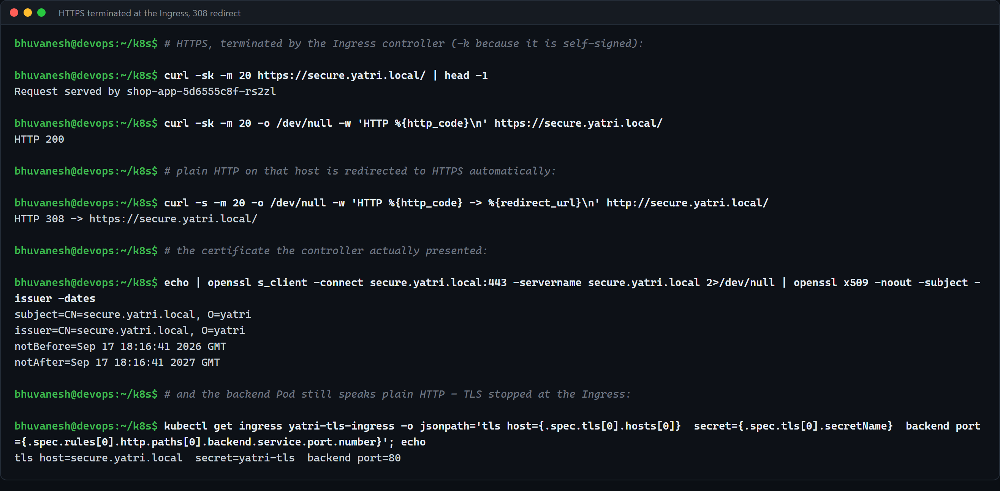

```
$ curl -k https://secure.yatri.local/
Request served by shop-app-5d6555c8f-rs2zl                 # HTTP 200

$ curl http://secure.yatri.local/
HTTP 308 -> https://secure.yatri.local/                    # automatic redirect

$ openssl s_client -connect secure.yatri.local:443 -servername secure.yatri.local | openssl x509 -noout -subject -issuer -dates
subject=CN=secure.yatri.local, O=yatri
issuer=CN=secure.yatri.local, O=yatri
notBefore=Sep 17 18:16:41 2026 GMT
notAfter=Sep 17 18:16:41 2027 GMT
```

What this shows:

- `PORTS 80, 443` on the Ingress once `tls:` is present.
- **`subject` == `issuer`** — self-signed, which is why `curl` needs `-k`.
- The **308 redirect is automatic.** ingress-nginx adds `ssl-redirect` by default as soon as a
  host has TLS configured. Nothing in my YAML asked for it.
- **The backend Service port is still 80, plain HTTP.** TLS is *terminated* at the Ingress —
  decrypted there, then forwarded in the clear inside the cluster. So the certificate lives in
  exactly one place instead of in every application image, and rotating it is one
  `kubectl create secret tls`. In production you would use cert-manager to issue and renew
  from Let's Encrypt into this same Secret, and the Ingress would not change at all.

---

# Part 4 — A real problem I had to debug

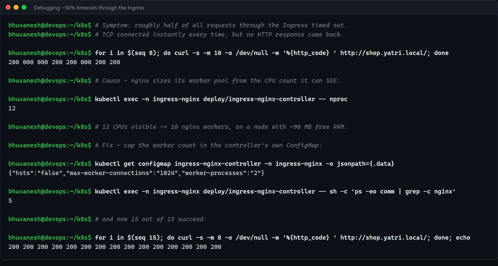

Worth writing down, because it was the only thing in this session that genuinely did not work.

**Symptom.** Roughly half of all requests through the Ingress timed out:

```
$ for i in $(seq 8); do curl -s -m 10 -o /dev/null -w '%{http_code} ' http://shop.yatri.local/; done
200 000 000 200 200 000 200 200
```

**What I ruled out.** `time_connect` was ~0.001s on *every* request including the failures —
so TCP was being accepted every time and the network path was fine. The controller Pod was
`1/1 Running` with no restarts. Flushing conntrack changed nothing. Running the same requests
**from inside the cluster** against the controller's ClusterIP failed at the same ~50% rate,
which ruled out the WSL → Docker-bridge path and pointed squarely at the controller itself.
And the controller's access log only ever contained the **successful** requests — so the
failures never reached nginx's request handling at all.

**Cause.**

```
$ kubectl exec -n ingress-nginx deploy/ingress-nginx-controller -- nproc
12
```

nginx defaults to `worker_processes auto`, i.e. one worker per visible CPU. The container was
seeing the **WSL host's 12 CPUs**, not a cgroup limit, so it started **10 workers** on a node
with about **90 MB of free RAM**. Workers share the listening socket and take turns accepting;
the wedged ones accepted connections they could never serve. That is exactly the signature —
instant TCP connect, then silence, on a fraction of requests proportional to how many workers
were stuck.

**Fix** — cap the worker pool in the controller's own ConfigMap (which is itself a nice
closing example of Part 1: the controller is configured by a ConfigMap, and `reload` picks the
change up with no restart):

```bash
kubectl patch configmap ingress-nginx-controller -n ingress-nginx --type merge \
  -p '{"data":{"worker-processes":"2","max-worker-connections":"1024"}}'
```

```
{"hsts":"false","max-worker-connections":"1024","worker-processes":"2"}

$ ps -eo comm | grep -c nginx
5

$ for i in $(seq 15); do curl -s -m 8 -o /dev/null -w '%{http_code} ' http://shop.yatri.local/; done
200 200 200 200 200 200 200 200 200 200 200 200 200 200 200
```

**15 out of 15.** The lesson generalises well beyond nginx: **a container that sets its
concurrency from `nproc` will get it badly wrong unless it is given a CPU limit it can
actually see.** The same bug hits JVM heap sizing, Go's `GOMAXPROCS` and most thread pools.
This is a concrete reason to always set resource **limits**, not just requests — the point
that Session 10's `05-resources.yaml` was making in the abstract.

---

## Cleanup

```bash
kubectl delete -f .
kubectl delete secret yatri-tls
minikube addons disable ingress
```

## Summary

| Homework item | Status |
| ------------- | ------ |
| Create ConfigMaps (declarative and imperative) | Done — Part 1 |
| ConfigMap → environment variables (`envFrom`) | Done — Part 1 |
| ConfigMap → mounted files, and live update | Done — Part 1 |
| Create Secrets (`stringData` vs `data`) | Done — Part 2 |
| Secret → env vars and → files; base64 vs encryption; tmpfs | Done — Part 2 |
| Enable the Ingress controller | Done — Part 3 |
| Path-based routing (+ `rewrite-target`) | Done — Part 3 |
| Host-based routing | Done — Part 3 |
| TLS termination with a `kubernetes.io/tls` Secret | Done — Part 3 |
| Debugging notes | Part 4 |
