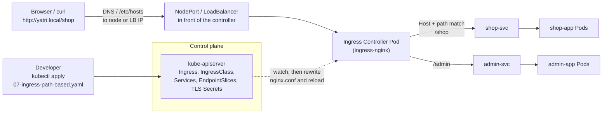

# Ingress vs Ingress Controller (Session 12, Task 4)

**Name:** Bhuvanesh M S
**Enrollment number:** 24bcs10134

Part 3 of the [main README](README.md#part-3--ingress) shows both pieces working on minikube
(path routing, host routing, TLS). This document is the written comparison the brief asks for.

References:

- https://kubernetes.io/docs/concepts/services-networking/ingress/
- https://kubernetes.io/docs/concepts/services-networking/ingress-controllers/
- https://gateway-api.sigs.k8s.io/

---

## 1. What is an Ingress

An **Ingress** is a Kubernetes **API object** (`networking.k8s.io/v1`, kind `Ingress`) that
describes **HTTP and HTTPS routing rules** from outside the cluster to Services inside it:

- **host** rules: `shop.yatri.local` -> `shop-svc`, `admin.yatri.local` -> `admin-svc`;
- **path** rules: `/shop` -> `shop-svc`, `/admin` -> `admin-svc`;
- **TLS**: which hostnames to serve over HTTPS, and which `kubernetes.io/tls` Secret holds the
  certificate;
- a **default backend** for requests that match nothing;
- `ingressClassName`: which controller should implement it.

It is **only data**. Applying an Ingress stores a record in etcd and that is all. It opens no
port, starts no process and routes no packet.

## 2. What is an Ingress Controller

An **Ingress Controller** is the **running software** that makes Ingress objects real. It is
usually a Deployment (or DaemonSet) of reverse-proxy Pods plus a Service that exposes them,
and it runs a control loop:

1. **Watch** the API for Ingress objects with its class, plus the Services, EndpointSlices and
   TLS Secrets they reference.
2. **Translate** them into its own proxy configuration (an `nginx.conf`, Envoy config, HAProxy
   config, or a cloud load balancer's rules).
3. **Serve** the traffic: terminate TLS, match host and path, and forward to the backend Pods.
4. **Write back** the address it is reachable on into the Ingress `status`, which is the
   `ADDRESS` column in `kubectl get ingress`.

On my minikube cluster this was `ingress-nginx-controller` in the `ingress-nginx` namespace,
enabled with `minikube addons enable ingress`, and the `IngressClass` named `nginx` pointing at
controller `k8s.io/ingress-nginx`.

The controller is **not** part of Kubernetes. kube-controller-manager ships controllers for
Deployments, ReplicaSets, Jobs and so on, but **no Ingress controller**. You always install one
(or your cloud or distribution installs one for you).

## 3. The difference

| | **Ingress** | **Ingress Controller** |
| - | ----------- | ---------------------- |
| **What it is** | An API resource (YAML) | A program running in Pods (or a cloud service driven by Pods) |
| **Role** | Declares **what** routing you want | Implements **how** it happens |
| **Analogy** | The routing table / the config file | The router / the web server that reads it |
| **Created with** | `kubectl apply -f 07-ingress-path-based.yaml` | Helm chart, manifests, or an addon (`minikube addons enable ingress`) |
| **How many** | One per app or team, as many as you like | Usually one or two per cluster, each with an `IngressClass` |
| **Lives in** | The app's namespace | Its own namespace (`ingress-nginx`, `traefik`, `kube-system`) |
| **Portable?** | `spec` is portable; **annotations** are controller-specific (e.g. `nginx.ingress.kubernetes.io/rewrite-target`) | Not portable, each one has its own features and config |
| **Consumes resources?** | No, it is a few hundred bytes in etcd | Yes, CPU, memory, a load balancer or NodePort |
| **If it is missing** | The controller has nothing to route, requests get the default backend (404) | Ingress objects are accepted but **nothing happens**: no `ADDRESS`, no traffic |
| **Who usually owns it** | Application developers | Platform / cluster operators |

## 4. Why both are required

Kubernetes deliberately separates the **API** from the **implementation**, the same pattern as
`Service type: LoadBalancer` (the API) and the cloud-controller-manager (the implementation):

- **Without a controller**, an Ingress is a wish list nobody reads. I can `kubectl apply` it
  without errors, but it never gets an address and no request reaches the backends.
- **Without Ingress objects**, the controller is a running proxy with no routes; every request
  gets its default backend (the `404` I saw for `/nothing-here` in Part 3).
- **The separation is the point.** Developers write the same standard Ingress in every
  environment; the platform team picks the implementation (nginx on minikube, an AWS ALB on EKS,
  a Google load balancer on GKE) and can change it without every team rewriting their YAML.
  `ingressClassName` is the join between the two, and lets several controllers coexist in one
  cluster (say, a public one and an internal one).

### How a request flows

The dotted line is the controller's **control loop**; the solid lines are the **data path**.
One detail worth knowing: ingress-nginx reads the Service's EndpointSlices and by default
forwards straight to the **Pod IPs**, not through the Service's ClusterIP. The Service is used
to find the Pods, which is why a Service with no endpoints gives a `503` from the controller.

## 5. Examples of Ingress Controllers

| Controller | Based on | Notes |
| ---------- | -------- | ----- |
| **ingress-nginx** (`kubernetes/ingress-nginx`) | NGINX | The community controller used in this session (minikube's `ingress` addon). In November 2025 Kubernetes SIG Network announced its **retirement**: best-effort maintenance until **March 2026**, after which no further releases, bug fixes or security patches. Existing installations keep running, but new work should use another controller or Gateway API. Not to be confused with F5's separately maintained **NGINX Ingress Controller** (`nginx/kubernetes-ingress`) |
| **Traefik** | Traefik proxy | Popular default in lightweight distributions such as k3s; also supports its own CRDs and Gateway API |
| **HAProxy** | HAProxy | Kubernetes ingress controllers maintained by the HAProxy community and HAProxy Technologies |
| **Contour** | Envoy | CNCF project; supports Ingress, its own `HTTPProxy` CRD and Gateway API |
| **AWS Load Balancer Controller** | AWS ALB / NLB | Runs in the cluster but provisions a real **Application Load Balancer** for each Ingress (or group of Ingresses), and NLBs for `LoadBalancer` Services. The proxy is AWS's, not a Pod |
| **GKE Ingress** | Google Cloud Load Balancing | Built into GKE; an Ingress becomes a Google Cloud Application Load Balancer. Same "the controller programs a cloud LB" model as AWS |

Two broad families, which is a useful way to remember them:

- **In-cluster proxy** (ingress-nginx, Traefik, HAProxy, Contour): traffic passes through
  controller Pods inside the cluster.
- **Cloud load balancer** (AWS Load Balancer Controller, GKE Ingress): the controller Pod is
  only a control loop; traffic goes through the cloud provider's load balancer straight to the
  nodes or Pods.

## 6. Gateway API: the successor model

The Ingress API is stable but **feature-frozen**: it is not deprecated, but new routing
features are going into **Gateway API** instead (GA since v1.0 in October 2023, installed as
CRDs). It fixes the main weaknesses of Ingress:

| Ingress | Gateway API |
| ------- | ----------- |
| One object mixes infrastructure and routing | Split by role: `GatewayClass` (infra provider), `Gateway` (the listener, owned by the platform team), `HTTPRoute` / `GRPCRoute` (routes, owned by app teams) |
| HTTP/HTTPS only | HTTP, gRPC, and TCP/UDP/TLS routes (some still experimental) |
| Header matching, traffic splitting, rewrites need **controller-specific annotations** | Header/query matching, weighted backends (canary), redirects and rewrites are in the **standard spec** |
| Cross-namespace sharing is ad hoc | Explicit cross-namespace attachment and `ReferenceGrant` |

Many of the controllers above (Contour, Traefik, Istio, Cilium, Envoy Gateway, NGINX Gateway
Fabric, GKE) implement Gateway API, and the
`ingress2gateway` tool from Kubernetes SIGs helps convert existing Ingress YAML. The
**concept** stays the same, which is the point of this document: a declarative resource that
describes routing, and a controller that implements it.

## Summary

- **Ingress** = the rules (an API object). **Ingress Controller** = the program that enforces
  them. Neither does anything useful without the other.
- `ingressClassName` / `IngressClass` connects a rule to a controller.
- `spec` is portable across controllers; annotations are not.
- ingress-nginx, which this session used, is retired as of March 2026; Gateway API is the
  direction Kubernetes networking is heading.
