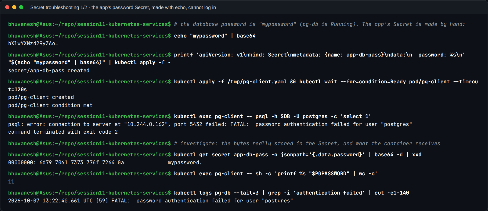
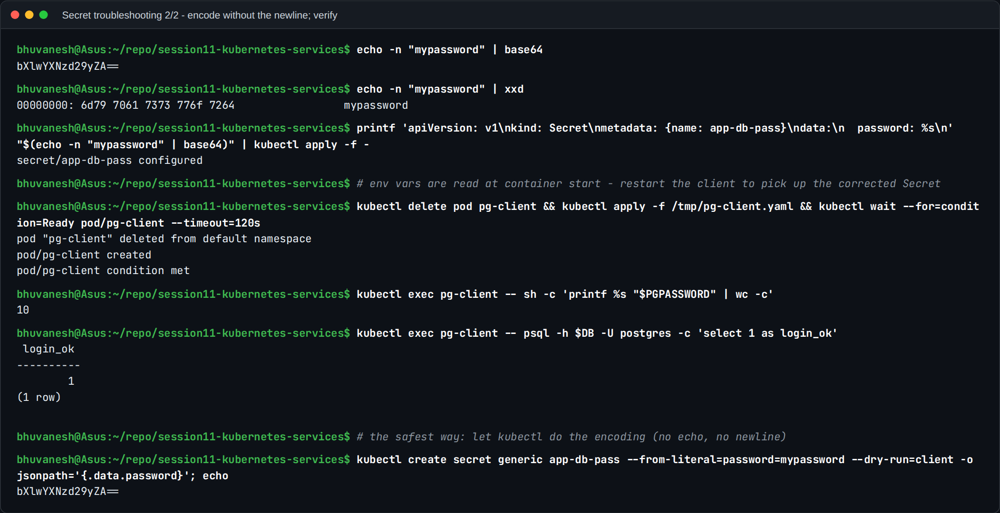

# Troubleshooting: the Trailing-Newline Secret Bug (Session 12, Task 5)

**Name:** Bhuvanesh M S
**Enrollment number:** 24bcs10134

Based on the instructor's scenario in
[`session-12-ingress-configmaps-secrets/troubleshooting/secret-base64-gotcha.md`](../../session-12-ingress-configmaps-secrets/troubleshooting/secret-base64-gotcha.md).

---

## 1. Problem statement

- **Symptom:** the PostgreSQL Pod rejects the application with
  `FATAL: password authentication failed for user "yatri_admin"`.
- **What the developer says:** "The password is correct. I generated the Secret value with
  `echo "mypassword" | base64`."
- **What is actually stored:** `mypassword` **plus a newline**: 11 bytes, not 10. The database
  compares byte for byte and is right to reject it.

Nothing errors anywhere: the YAML is valid, the Secret is created, the Pod starts and the
environment variable is set. The bug only shows up as a failed login, which is why it is
notorious.

## 2. Why `echo` adds `\n`

`echo` prints its arguments **followed by a newline**. That is its normal behaviour; it is
what makes the shell prompt appear on the next line. When the output is piped, the newline goes
into the pipe like any other byte, so `base64` faithfully encodes it:

```
echo "mypassword"      ->  m y p a s s w o r d \n     (11 bytes)
echo -n "mypassword"   ->  m y p a s s w o r d        (10 bytes)
```

## 3. Seeing the invisible byte: `xxd` and `od -c`

A terminal does not show a trailing newline, so you need a byte-level view:

```
$ echo "mypassword" | xxd
00000000: 6d79 7061 7373 776f 7264 0a              mypassword.

$ echo -n "mypassword" | xxd
00000000: 6d79 7061 7373 776f 7264                 mypassword
```

The last byte `0a` is ASCII 10, the line feed (`\n`). `xxd` prints it as `.` in the text column.
`od -c` is often clearer because it names the character, and it is available on minimal
images where `xxd` is not:

```
$ echo "mypassword" | od -c
0000000   m   y   p   a   s   s   w   o   r   d  \n
0000013

$ echo -n "mypassword" | od -c
0000000   m   y   p   a   s   s   w   o   r   d
0000012
```

(The final offset is in octal: `13` = 11 bytes, `12` = 10 bytes.) `wc -c` gives the same
answer as a single number.

## 4. The two base64 strings

| Command | Bytes encoded | base64 |
| ------- | ------------- | ------ |
| `echo "mypassword" \| base64` | `mypassword\n` (11) | `bXlwYXNzd29yZAo=` |
| `echo -n "mypassword" \| base64` | `mypassword` (10) | `bXlwYXNzd29yZA==` |

Once you know the pattern, the **`o=` / `K` / `Cg==` endings are a hint that a newline was
encoded** (`Cg==` is what a lone `\n` encodes to). It is a hint, not a rule: the ending depends
on the length and the last characters. The reliable check is to decode and look at the bytes.

### Checking a Secret that is already in the cluster

```bash
# the stored value, byte by byte
kubectl get secret yatri-db-secret -o jsonpath='{.data.POSTGRES_PASSWORD}' | base64 -d | od -c

# what the container actually received
kubectl exec <pod> -- sh -c 'printf %s "$POSTGRES_PASSWORD" | od -c'
```

If the output ends in `\n`, that is the bug. (`kubectl describe secret` also gives it away: it
reports the size, and `11 bytes` for a 10-character password is the tell.)

### Live reproduction

The **database** was set up correctly with `kubectl create secret --from-literal` (no
newline). The **application's** Secret was then made the way the bug happens, with `echo`
piped into `base64`.



- `echo "mypassword" | base64` gives `bXlwYXNzd29yZAo=`. The trailing `o=` is the giveaway.
- The client Pod running `psql` with that Secret as `PGPASSWORD` gets **`FATAL: password
  authentication failed for user "postgres"`**, and the database logs the same failure.
- **Investigation:** decoding the Secret and piping to `xxd` shows the bytes
  `6d79 7061 7373 776f 7264 0a`, i.e. the password **plus `0a` (newline)**. Inside the
  container, `printf %s "$PGPASSWORD" | wc -c` counts **11** characters for a 10-letter
  password.



- `echo -n` gives `bXlwYXNzd29yZA==`, and `xxd` shows no `0a`.
- Env vars from Secrets are read **when the container starts**, so the client Pod had to be
  recreated after fixing the Secret. Then `wc -c` gives **10**, and `psql` returns
  `login_ok = 1`.
- `kubectl create secret --from-literal` produces the correct `bXlwYXNzd29yZA==` without any
  hand-encoding. That's the habit that prevents this bug.

A side finding from my first attempt: I initially gave the newline password to the
**PostgreSQL server itself**, and logins still worked. As far as I can tell, the official
image's entrypoint initialises the password from a file and keeps only the first line, so
the trailing newline gets dropped. The bug bites when the newline reaches the **client**
side, which is what the reproduction above does.


## 5. Fixes

| Fix | Example | Why it works |
| --- | ------- | ------------ |
| `echo -n` | `echo -n "mypassword" \| base64` | `-n` suppresses the trailing newline |
| `printf` (most portable) | `printf '%s' "mypassword" \| base64` | `printf` never adds a newline unless you write `\n`. Prefer it in scripts: `echo -n` is not portable to every `sh` |
| `kubectl create secret --from-literal` | `kubectl create secret generic yatri-db-secret --from-literal=POSTGRES_PASSWORD=mypassword` | kubectl takes the literal value exactly as given and does the base64 itself. **No newline is added**, and there is no manual encoding step to get wrong |
| `stringData` in the manifest | `stringData:`<br/>`  POSTGRES_PASSWORD: "mypassword"` | Plain text in, the API server encodes it. Use a quoted scalar: a block scalar (`\|`) keeps a trailing newline, `\|-` strips it |

Two related traps:

- **`--from-file` keeps the file's content exactly, including its final newline.** Most
  editors end a file with `\n`, so `--from-file=password.txt` has the same bug. Write the file
  with `printf '%s' ... > password.txt`, or use `--from-literal`.
- **GNU `base64` wraps output at 76 characters.** Long values (certificates, JSON keys) end up
  with line breaks inside the encoded string. Use `base64 -w0` for a single line.

After fixing the Secret, the Pods still have the old value if it was injected as an **env
var** (read only at container start): restart them with
`kubectl rollout restart deployment/<name>`.

## 6. Lesson

The general rule is **never hand-encode secrets when the tooling can do it for you.**
`--from-literal`, `stringData`, or an external secret manager (see
[../secrets-and-git.md](../secrets-and-git.md)) all remove the manual `base64` step, and with
it this whole class of bug. When a credential "is correct but does not work", check the bytes,
not the characters.
