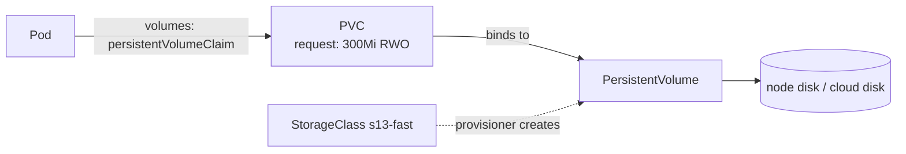
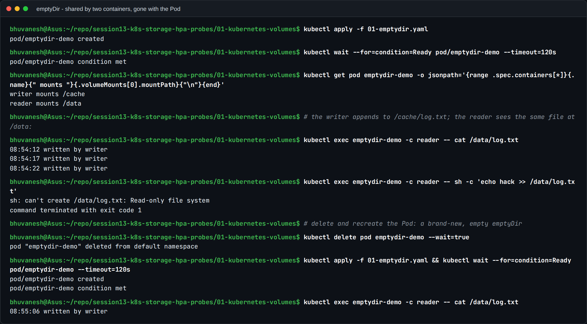
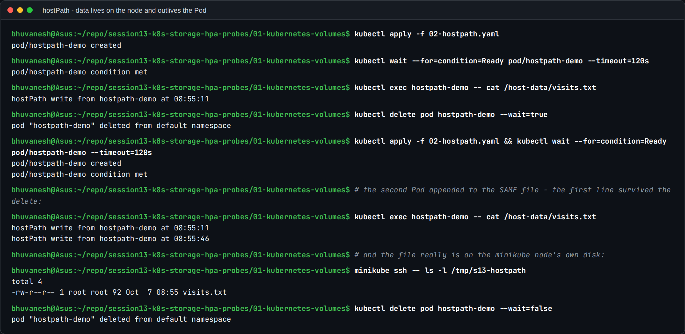
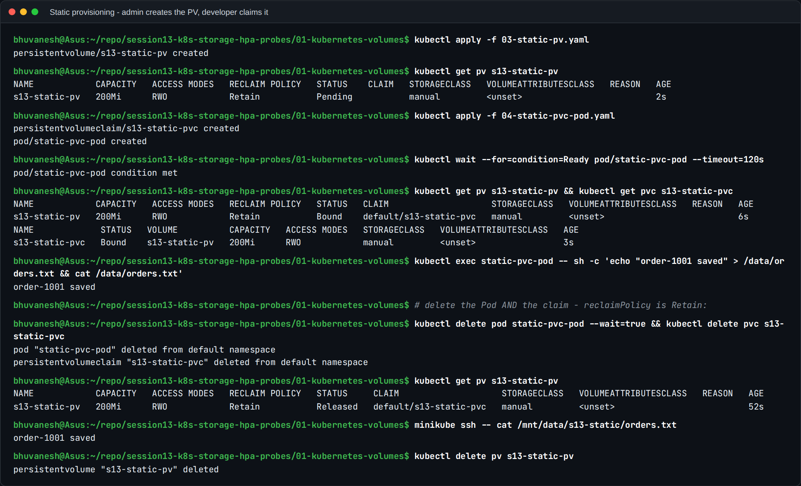
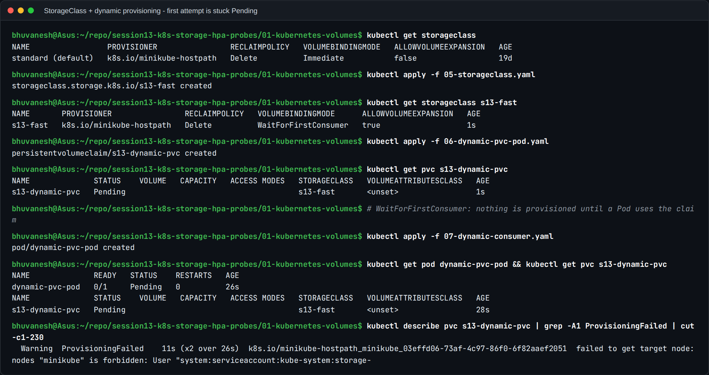
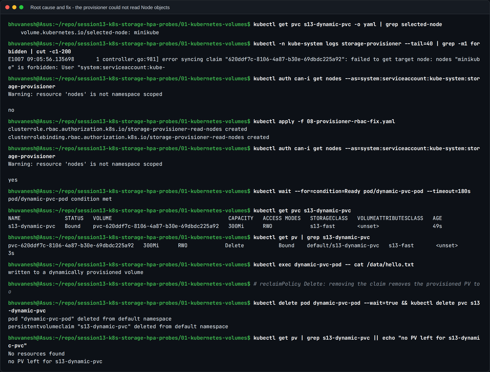

# Task 1: Kubernetes Volumes

A container's filesystem is **ephemeral**. Anything written inside it disappears when the
container restarts, and two containers in the same Pod can't see each other's files.
Volumes fix both problems. This page covers the six storage concepts from the session,
each with a manifest from this folder and the real output from my minikube cluster.

| Concept | Lifetime of the data | Who creates it | Typical use |
| --- | --- | --- | --- |
| `emptyDir` | Same as the **Pod** | Kubelet, when the Pod starts | Scratch space, cache, sharing files between sidecars |
| `hostPath` | Same as the **node's disk** | Already on the node | Node agents (log collectors, monitoring); single-node labs |
| PersistentVolume (PV) | Independent of any Pod | An admin (static) or a provisioner (dynamic) | The actual piece of storage in the cluster |
| PersistentVolumeClaim (PVC) | Until the claim is deleted | The developer | "I need 1Gi, RWO", requested by the app |
| StorageClass | n/a (it's a template) | The admin | Describes *how* to create PVs: provisioner, reclaim policy, binding mode |
| Dynamic provisioning | Depends on the reclaim policy | The provisioner, automatically | The normal way storage is handed out in real clusters |



---

## 1. emptyDir

An `emptyDir` is created **empty** when the Pod is scheduled. Every container in the Pod can
mount it, and it is deleted when the Pod is deleted. A container restart does **not** wipe
it; only removing the Pod does.

Manifest: [01-emptydir.yaml](01-emptydir.yaml). A `writer` container appends a timestamp
every 5 seconds to `/cache/log.txt`. A `reader` container mounts the **same** volume
read-only at a different path, `/data`.

```yaml
volumes:
  - name: shared-cache
    emptyDir:
      sizeLimit: 50Mi        # the Pod is evicted if it writes more than this
```



What the output shows:
- The two containers mount the volume at different paths (`/cache` and `/data`), yet the
  reader sees every line the writer wrote. That's how sidecar patterns share files.
- `readOnly: true` is enforced: the reader gets `Read-only file system` when it tries to write.
- After `kubectl delete pod` and re-creating it, the log starts again with **one** line. The
  old data went with the old Pod.
- Variant: `emptyDir: { medium: Memory }` backs the volume with RAM (tmpfs). It's faster,
  but it counts against the container's memory limit.

## 2. hostPath

`hostPath` mounts a directory from the **node's** own filesystem into the Pod. Data survives
the Pod but is tied to that one node. If the Pod is rescheduled onto another node, it sees a
different, empty directory. It also gives the Pod access to the host, so it's a security
risk and most production clusters restrict it (Pod Security "baseline" forbids it).

Manifest: [02-hostpath.yaml](02-hostpath.yaml), with `type: DirectoryOrCreate` on `/tmp/s13-hostpath`.



What the output shows:
- The first Pod wrote one line. It was deleted, and a second Pod appended to the **same**
  file, so both lines are there.
- `minikube ssh -- ls -l /tmp/s13-hostpath` proves the file is on the minikube node's disk,
  owned by root.
- Where it's legitimately used: DaemonSets such as log collectors (mounting `/var/log`) and
  node-exporter (mounting `/proc` and `/sys`).

## 3. PersistentVolume and PersistentVolumeClaim (static provisioning)

These two objects split **who provides storage** from **who uses it**:

- A **PersistentVolume** is a cluster-level object (not namespaced) representing real
  storage: size, access modes, reclaim policy, and where the data actually is.
- A **PersistentVolumeClaim** is a namespaced *request*: "I need at least 100Mi, mountable
  read-write by one node." Kubernetes finds a matching PV and **binds** the two one-to-one.
- The Pod only ever references the **claim**, so the same Pod spec works on any cluster.

| Access mode | Short | Meaning |
| --- | --- | --- |
| ReadWriteOnce | RWO | Read-write by a single **node** |
| ReadOnlyMany | ROX | Read-only by many nodes |
| ReadWriteMany | RWX | Read-write by many nodes (needs NFS, EFS, CephFS...) |
| ReadWriteOncePod | RWOP | Read-write by a single **Pod** |

| Reclaim policy | What happens to the PV when the PVC is deleted |
| --- | --- |
| `Retain` | The PV becomes `Released` and **the data is kept** for an admin to recover |
| `Delete` | The PV and the underlying storage are deleted |

Manifests: [03-static-pv.yaml](03-static-pv.yaml) (the admin's PV: 200Mi, `storageClassName: manual`,
`Retain`) and [04-static-pvc-pod.yaml](04-static-pvc-pod.yaml) (the developer's 100Mi claim
plus a Pod using it).



What the output shows:
- The PV starts unbound, with no `CLAIM`. After the PVC is applied, both show **`Bound`**,
  and the PV's `CLAIM` column names `default/s13-static-pvc`.
- The claim asked for 100Mi but shows 200Mi: a claim binds to a **whole** PV that is at
  least as large as the request.
- After deleting the Pod **and** the PVC, the PV goes to **`Released`**, not deleted,
  because of `Retain`. `minikube ssh -- cat .../orders.txt` shows the data is still on disk.
- A `Released` PV is not re-bound automatically; an admin has to clean it up or remove its
  `claimRef`. I deleted it at the end.

## 4. StorageClass

A **StorageClass** is a template for creating PVs on demand. It names a **provisioner**
(the plugin that creates the storage), a **reclaim policy**, a **volume binding mode**, and
whether volumes can be expanded.

```yaml
apiVersion: storage.k8s.io/v1
kind: StorageClass
metadata:
  name: s13-fast
provisioner: k8s.io/minikube-hostpath     # on AWS this would be ebs.csi.aws.com
reclaimPolicy: Delete
volumeBindingMode: WaitForFirstConsumer
allowVolumeExpansion: true
```

| Binding mode | When the PV is created |
| --- | --- |
| `Immediate` | As soon as the PVC is created, before any Pod uses it |
| `WaitForFirstConsumer` | Only when a Pod using the PVC is scheduled, so the volume is created in the **same zone/node** as the Pod. This is the recommended mode for zonal cloud disks such as EBS. |

minikube ships one class, `standard (default)`, and the `(default)` marker means a PVC with
no `storageClassName` gets it. On EKS the equivalent would be a `gp3` class using the EBS CSI driver.

## 5. Dynamic provisioning, and a real problem I hit with it

With dynamic provisioning **nobody writes a PV**. The PVC names a StorageClass, and the
provisioner creates a PV sized to the request. Manifests: [05-storageclass.yaml](05-storageclass.yaml),
[06-dynamic-pvc-pod.yaml](06-dynamic-pvc-pod.yaml) (the claim) and
[07-dynamic-consumer.yaml](07-dynamic-consumer.yaml) (the Pod).



**The problem.** The PVC correctly stayed `Pending` with the event `WaitForFirstConsumer`,
which is expected until a Pod uses it. But once the Pod was created, both stayed **Pending**.
The PVC events showed:

```
ProvisioningFailed  failed to get target node: nodes "minikube" is forbidden:
User "system:serviceaccount:kube-system:storage-provisioner" cannot get resource "nodes"
```

**Investigation and root cause.**



1. `kubectl get pvc -o yaml` shows the scheduler did its part: it added the annotation
   `volume.kubernetes.io/selected-node: minikube`.
2. With that annotation present, the provisioner must **read the Node object** to create the
   volume on that node. The provisioner's own log shows the same `forbidden` error.
3. `kubectl auth can-i get nodes --as=system:serviceaccount:kube-system:storage-provisioner`
   answers **`no`**. minikube's provisioner ServiceAccount has no RBAC permission to read
   Nodes. The default `standard` class uses `Immediate` binding, which never sets
   `selected-node`, so this only shows up with `WaitForFirstConsumer`.

**Fix.** [08-provisioner-rbac-fix.yaml](08-provisioner-rbac-fix.yaml) adds a ClusterRole with
`get/list/watch` on `nodes` and binds it to that ServiceAccount. `auth can-i` then answers
**`yes`**, and with nothing else changed:
- the Pod became Ready,
- the PVC became **`Bound`** to an auto-created PV named `pvc-620ddf7c-...` (the PVC's UID),
- the Pod read back `written to a dynamically provisioned volume`,
- deleting the PVC deleted the PV too (`reclaimPolicy: Delete`, so `no PV left`).

**Lesson:** when a PVC is stuck `Pending`, read the PVC **events** first. They name the
component that failed and why. `kubectl auth can-i --as=<serviceaccount>` is the quickest way
to confirm an RBAC root cause.

## 6. Which one should I use?

| Need | Use |
| --- | --- |
| Temporary files, cache, sidecar hand-off | `emptyDir` (`medium: Memory` for speed) |
| A node agent that must read the host | `hostPath`, ideally read-only, in a DaemonSet |
| Application data that must survive restarts and rescheduling | PVC + StorageClass (dynamic provisioning) |
| Pre-existing storage you must reuse (an existing NFS export or disk) | A static PV + PVC with matching `storageClassName` |
| Each replica needs its own disk (databases) | A StatefulSet with `volumeClaimTemplates` |

## Commands used

```bash
kubectl apply -f 01-emptydir.yaml
kubectl exec emptydir-demo -c reader -- cat /data/log.txt
kubectl apply -f 02-hostpath.yaml && minikube ssh -- ls -l /tmp/s13-hostpath
kubectl apply -f 03-static-pv.yaml -f 04-static-pvc-pod.yaml
kubectl get pv,pvc
kubectl delete pvc s13-static-pvc && kubectl get pv      # -> Released (Retain)
kubectl get storageclass
kubectl apply -f 05-storageclass.yaml -f 06-dynamic-pvc-pod.yaml -f 07-dynamic-consumer.yaml
kubectl describe pvc s13-dynamic-pvc                     # read the events
kubectl auth can-i get nodes --as=system:serviceaccount:kube-system:storage-provisioner
kubectl apply -f 08-provisioner-rbac-fix.yaml
```
