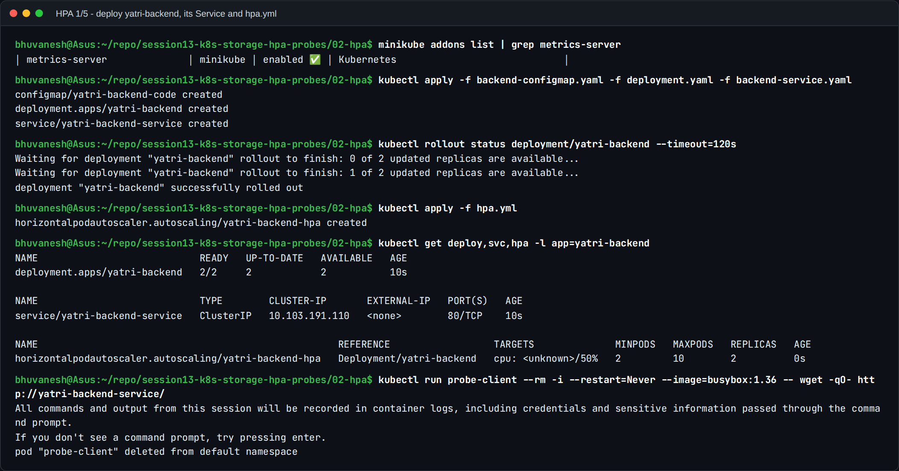
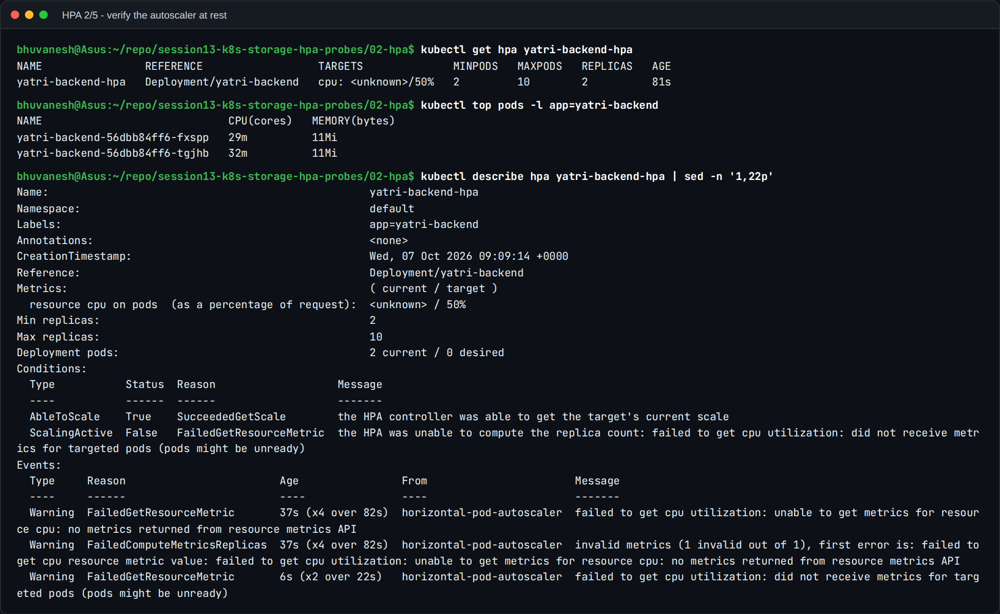
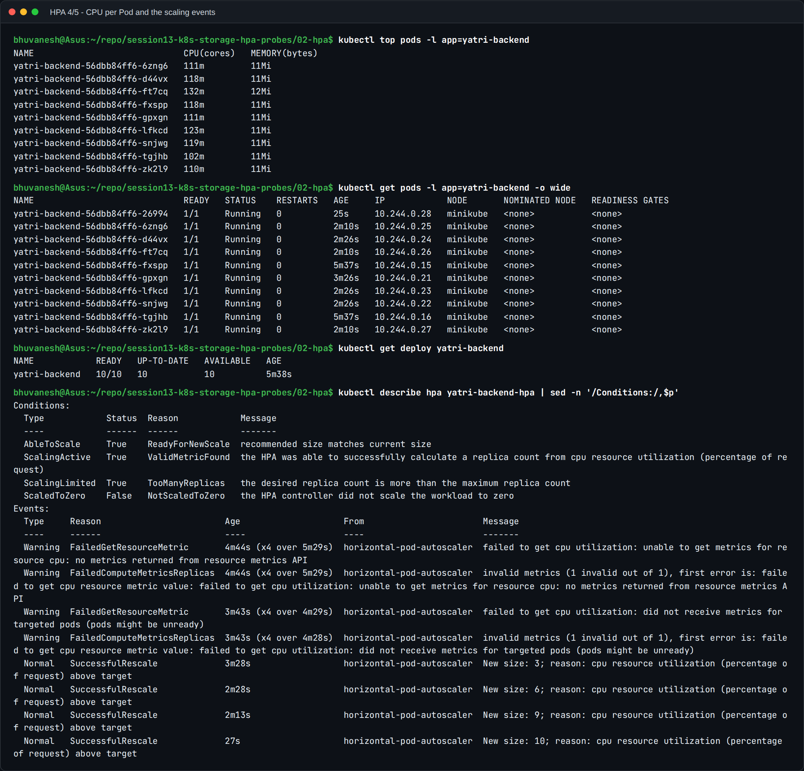
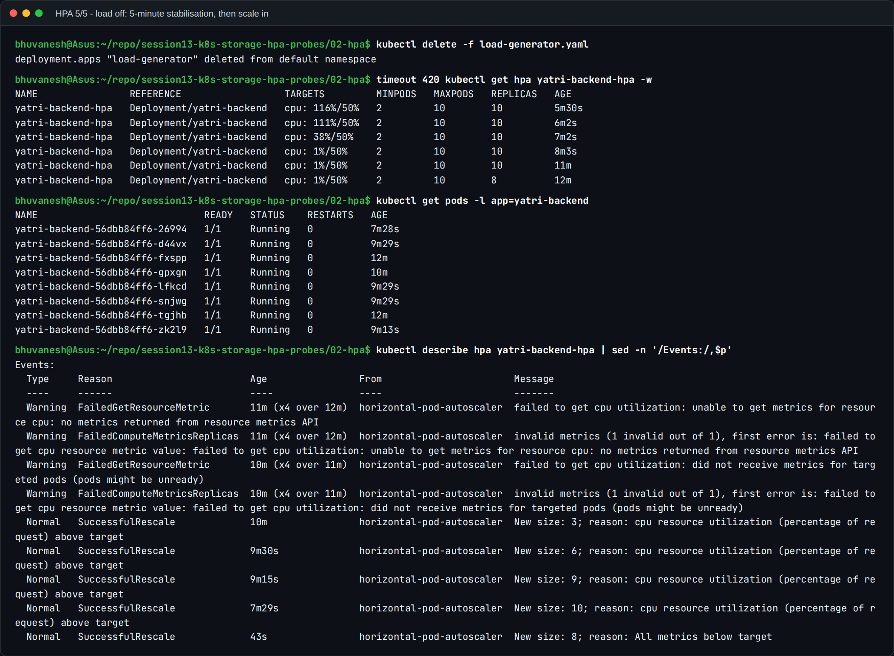
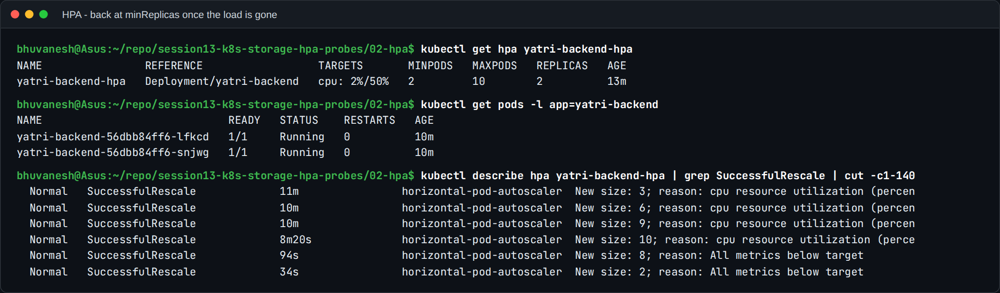

# Task 2: HPA Hands-on

A **HorizontalPodAutoscaler** watches a metric, here average CPU as a percentage of each
Pod's CPU **request**, and changes a Deployment's `replicas` to keep that metric near a
target. This task uses the class's `hpa.yml` unchanged and drives it with real load.

## Files

| File | What it is |
| --- | --- |
| [hpa.yml](hpa.yml) | **From class, unchanged.** `yatri-backend-hpa`: min 2, max 10, target 50% CPU |
| [backend-service.yaml](backend-service.yaml) | **From class, unchanged.** ClusterIP `yatri-backend-service`, port 80 → targetPort 5000 |
| [deployment.yaml](deployment.yaml) | The `yatri-backend` Deployment that `hpa.yml` targets: 2 replicas, `requests.cpu: 100m`, probes on `/healthz` |
| [backend-configmap.yaml](backend-configmap.yaml) | The app: a small Python server on port 5000. `/healthz` is cheap; `/` does real CPU work per request |
| [load-generator.yaml](load-generator.yaml) | 3 busybox Pods looping `wget` against the Service, inside the cluster |
| [load_generator.sh](load_generator.sh) | The class script (10 curl workers through a port-forward), kept for reference |

The class folder had the HPA and the Service but no Deployment, so I wrote one that fits
them. It listens on 5000 to match `targetPort`, uses the `app: yatri-backend` labels, and
has a CPU-heavy `/` so load actually turns into CPU usage. Plain nginx serving a static page
barely uses CPU, so it would never cross 50%.

## How the HPA calculates replicas

```
desiredReplicas = ceil( currentReplicas × currentUtilisation / targetUtilisation )
utilisation     = Pod CPU usage / Pod CPU request
```

With `requests.cpu: 100m` and a 50% target, the HPA aims for about **50m per Pod**. That's
why `resources.requests.cpu` is mandatory: without a request there's nothing to divide by,
and the HPA shows `<unknown>` forever. CPU usage comes from **metrics-server**, enabled with
`minikube addons enable metrics-server`.

## Step 1: Deploy the application and configure the HPA

```bash
kubectl apply -f backend-configmap.yaml -f deployment.yaml -f backend-service.yaml
kubectl rollout status deployment/yatri-backend
kubectl apply -f hpa.yml
kubectl get deploy,svc,hpa -l app=yatri-backend
```



- The Deployment is `2/2`, the Service has ClusterIP port 80, and the HPA exists with
  `MINPODS 2 / MAXPODS 10`.
- A throwaway busybox Pod called the Service by name and got a reply from one of the Pods,
  so the app works through the Service before any load is added.

## Step 2: Verify the HPA

```bash
kubectl get hpa yatri-backend-hpa
kubectl top pods -l app=yatri-backend
kubectl describe hpa yatri-backend-hpa
```



- About 80 seconds after creation, `TARGETS` still showed **`cpu: <unknown>/50%`** and the
  condition `ScalingActive False ... FailedGetResourceMetric ... no metrics returned`. That
  is the normal warm-up: metrics-server scrapes every 15 seconds and needs a full window of
  samples for every target Pod before the HPA trusts the number.
- `kubectl top pods` already had values (around 30m), so metrics-server itself was working.
  The HPA was simply not ready yet. If `<unknown>` lasts for minutes, the usual causes are a
  missing CPU request or metrics-server not running.

## Step 3: Deploy the load generator and watch CPU and Pods

```bash
kubectl apply -f load-generator.yaml
kubectl get hpa yatri-backend-hpa -w
```


The real watch output, read top to bottom:

| HPA age | CPU (of 50% target) | Replicas | What happened |
| --- | --- | --- | --- |
| 1m26s | `<unknown>` | 2 | Metrics still warming up |
| 2m01s | 60% | 2 | First real reading: above target |
| 2m16s | 60% | **3** | `ceil(2 × 60/50) = 3` |
| 3m01s | **219%** | 3 | Load fully ramped up; 3 Pods can't absorb it |
| 3m17s | 219% | **6** | Scale-up happens in steps: the default `behavior.scaleUp` policies cap how many Pods are added per 15 s period |
| 3m32s | 219% | **9** | Next step |
| 4m02s | 162% | 9 | More Pods share the load, so the average drops |
| 5m17s | 116% | **10** | Capped at `maxReplicas` |



- `kubectl top pods`: all 10 Pods are busy at about **100–130m each**, roughly 116% of
  their 100m request. That's still above target, so the HPA wants more Pods.
- `ScalingLimited True TooManyReplicas`: the HPA **wants** more than 10 but `maxReplicas`
  stops it. In production, that condition is the alert that `maxReplicas` or the node
  capacity needs raising.
- The events list every decision: `New size: 3`, `6`, `9`, `10`, each with the reason
  `cpu resource utilization (percentage of request) above target`.

## Step 4: Remove the load and observe scale-down

```bash
kubectl delete -f load-generator.yaml
kubectl get hpa yatri-backend-hpa -w
```



- CPU fell from 116% to **1% within about 2 minutes**, yet the replica count stayed at
  **10** for roughly 5 more minutes before stepping to 8.
- This is the **scale-down stabilisation window** (default 300 s). The HPA uses the
  *highest* recommendation from the last 5 minutes, so a short dip in traffic doesn't
  remove Pods that would be needed again moments later. Scale-up has no such delay.



- A minute later it settled at **2 replicas** (`New size: 2; reason: All metrics below
  target`). It never goes below `minReplicas`.

## What I learned

1. **Requests drive autoscaling.** Utilisation is measured against the CPU *request*, not
   the limit and not the node's capacity.
2. **Scaling up is fast and in steps; scaling down is deliberately slow.** The run shows
   both: 2 to 10 in about 3 minutes, then a 5-minute hold before scaling down.
3. **`<unknown>` right after creation is normal.** It only becomes a problem if it persists.
4. **Watch `ScalingLimited`.** Hitting `maxReplicas` under load means the app is
   under-provisioned even though the HPA is "working".
5. **The tuning knobs are in `spec.behavior`.** For example, a shorter
   `scaleDown.stabilizationWindowSeconds` for bursty jobs, or a `policies` block to limit
   how many Pods are added per minute.

## Useful commands

```bash
kubectl get hpa                       # TARGETS and REPLICAS at a glance
kubectl get hpa -w                    # watch decisions live
kubectl top pods                      # CPU/memory per Pod (metrics-server)
kubectl describe hpa yatri-backend-hpa   # conditions + scaling events with reasons
kubectl get pods -l app=yatri-backend -o wide
```
