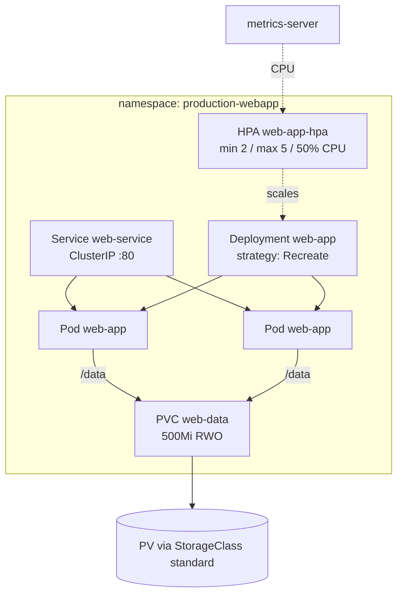
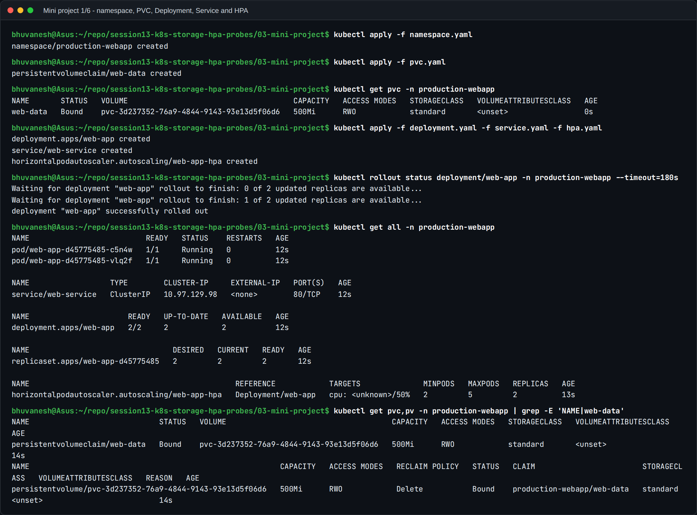
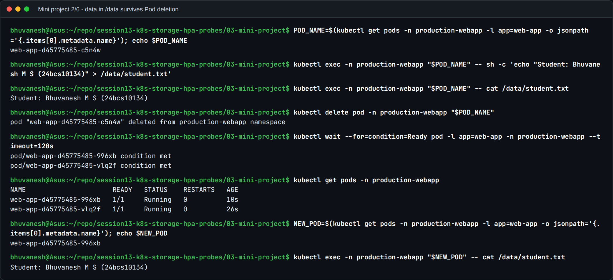
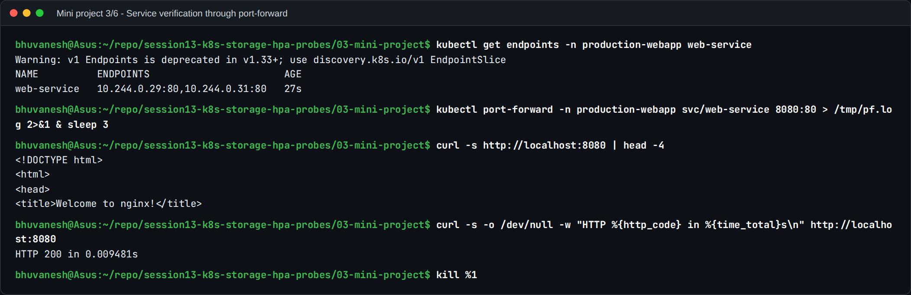
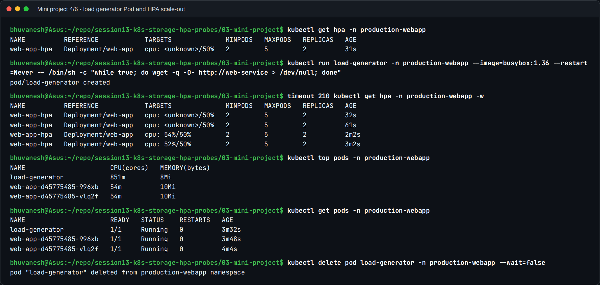
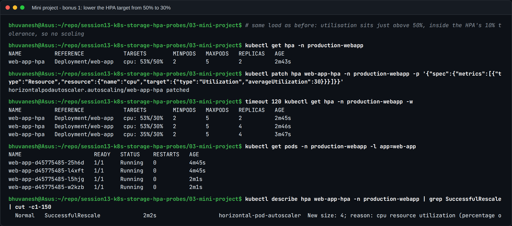
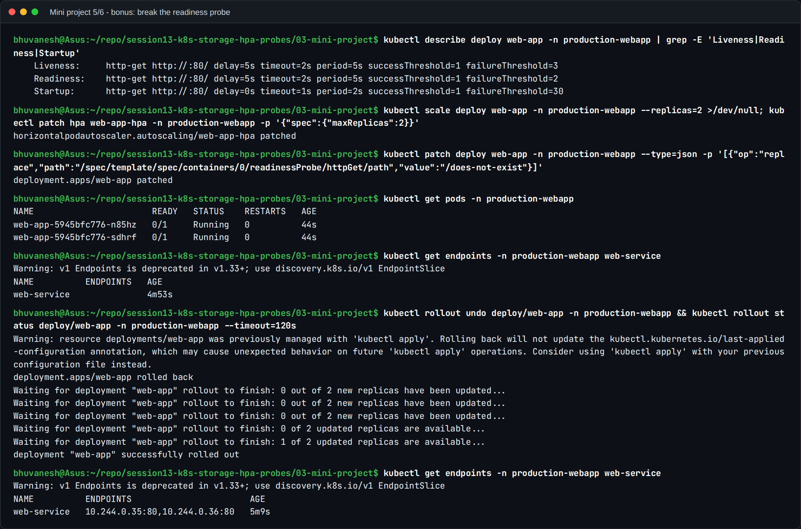
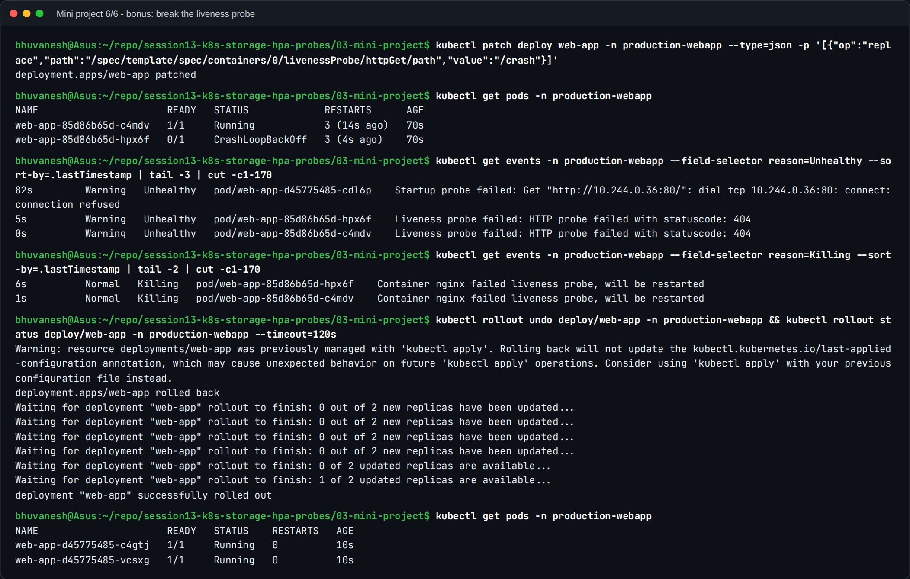

# Task 3: Mini Project, a production-ready web app

The Session 13 capstone combines the three topics of the session in one namespace:
**persistent storage** (PVC), **elastic scaling** (HPA) and **health checks** (startup,
readiness and liveness probes). I used the class manifests unchanged and ran every
verification task from the brief, plus all three bonus challenges.

## Architecture



| File | Purpose |
| --- | --- |
| [namespace.yaml](namespace.yaml) | Dedicated namespace `production-webapp` |
| [pvc.yaml](pvc.yaml) | `web-data`: 500Mi, ReadWriteOnce, default StorageClass |
| [deployment.yaml](deployment.yaml) | nginx:1.27, 2 replicas, `Recreate`, CPU/memory requests and limits, `/data` mount, three probes |
| [service.yaml](service.yaml) | ClusterIP `web-service` on port 80 |
| [hpa.yaml](hpa.yaml) | `web-app-hpa`: 2 to 5 replicas at 50% CPU |

**Why `strategy: Recreate`?** The PVC is `ReadWriteOnce`. With a rolling update, new Pods
start while old ones still hold the volume. On a multi-node cluster a new Pod on another node
could not attach it and would hang in `ContainerCreating`. `Recreate` stops the old Pods
first. The cost is a few seconds of downtime per rollout, which is visible in the bonus
challenges below.

## Step 1: Deploy everything

```bash
kubectl apply -f namespace.yaml
kubectl apply -f pvc.yaml
kubectl apply -f deployment.yaml -f service.yaml -f hpa.yaml
kubectl get all -n production-webapp
```



- The PVC went **`Bound`** immediately: the `standard` class uses `Immediate` binding and
  provisioned `pvc-3d237352-...` (500Mi, `Delete` reclaim policy).
- Both Pods are `1/1 Running` behind one ReplicaSet. The HPA shows `<unknown>/50%` for the
  first minute while metrics-server collects samples.

## Verification 1: Storage persistence



- I wrote `Student: Bhuvanesh M S (24bcs10134)` to `/data/student.txt` in Pod `...c5n4w`, then
  **deleted that Pod**.
- The Deployment replaced it with `...996xb`. Reading the file from the new Pod returns the
  same line, so the data lives on the PersistentVolume, not in the container.

## Verification 2: Service



- `web-service` has two endpoints, one per ready Pod.
- Through `kubectl port-forward svc/web-service 8080:80`, `curl` returns the nginx welcome page
  with **HTTP 200** in about 9 ms.

## Verification 3: Trigger HPA scaling

```bash
kubectl run load-generator -n production-webapp --image=busybox:1.36 --restart=Never \
  -- /bin/sh -c "while true; do wget -q -O- http://web-service; done"
kubectl get hpa -n production-webapp -w
```



**What actually happened:** CPU rose to **54%, then 52%, against the 50% target, and the HPA
did not scale.** That's correct behaviour, not a failure:

- The HPA has a default **tolerance of 10%**. It only acts when `current/target` falls
  outside 0.9 to 1.1. Here 54/50 = **1.08**, inside the band, so it keeps 2 replicas. This
  stops replica counts flapping around the target.
- `kubectl top pods` shows why the load stayed low: the **load generator** was at **851m**
  CPU, busier than both nginx Pods together (54m each). One busybox `wget` loop can't push
  nginx much harder. In real tests you'd run several generators, as in Task 2.

### Bonus challenge 1: lower the target to 30%



With the same load (53%), I patched the target to 30%. Within **one second** the HPA scaled
**2 → 4**: `ceil(2 × 53 / 30) = ceil(3.53) = 4`. Utilisation then fell to 35% as four Pods
shared the work. A lower target means earlier, more aggressive scaling, at the price of
running more Pods.

## Probes: what each one does

| Probe | Question it answers | On failure | In this Deployment |
| --- | --- | --- | --- |
| **Startup** | Has the app finished starting? | Container restarted; liveness and readiness don't run until it passes | `GET /` every 2 s, up to 30 failures (60 s budget) |
| **Readiness** | Should this Pod receive traffic **right now**? | Pod removed from Service endpoints; **not** restarted | `GET /` every 5 s, 2 failures |
| **Liveness** | Is the process still healthy? | Container **restarted** by the kubelet | `GET /` every 5 s, 3 failures |

### Bonus challenge 2: break the readiness probe



- After changing the readiness path to `/does-not-exist`, both new Pods are **`Running` but
  `0/1` READY**, and `web-service` has **no endpoints at all**. The containers are fine, but
  Kubernetes won't send them traffic.
- Because of `Recreate`, the old healthy Pods were already gone, so this was a **full
  outage**. A rolling update would have kept the old Pods serving, because new Pods that never
  become ready block the rollout.
- `kubectl rollout undo` restored the probe and the two endpoints came back.

### Bonus challenge 3: break the liveness probe



- With the liveness path set to `/crash`, nginx answers **404**. After 3 failures the kubelet
  logs `Container nginx failed liveness probe, will be restarted`.
- After 70 seconds both Pods had **3 restarts**, and one was already in **`CrashLoopBackOff`**:
  the kubelet waits longer between each restart.
- The lesson: a liveness probe that is wrong is worse than none. It turns a healthy app into
  a restart loop. Liveness should check "is the process alive", and should never depend on
  downstream services.
- `kubectl rollout undo` fixed it and both Pods returned to `1/1 Running` with 0 restarts.

## Troubleshooting notes (from the brief, confirmed above)

| Symptom | Check | Cause seen / fix |
| --- | --- | --- |
| PVC `Pending` | `kubectl describe pvc` | No default StorageClass, or the provisioner failing (see Task 1, section 5, for an RBAC example) |
| HPA `<unknown>/50%` | `kubectl top pods`, `describe hpa` | Normal for about 1 minute; otherwise metrics-server is off or there's no `requests.cpu` |
| HPA doesn't scale at 54%/50% | `describe hpa` | Inside the 10% tolerance; lower the target or add load |
| Running but `0/1`, empty endpoints | `kubectl get endpoints`, Pod events | Readiness probe failing |
| Restarts climbing, `CrashLoopBackOff` | `kubectl get events --field-selector reason=Unhealthy` | Liveness probe failing |
