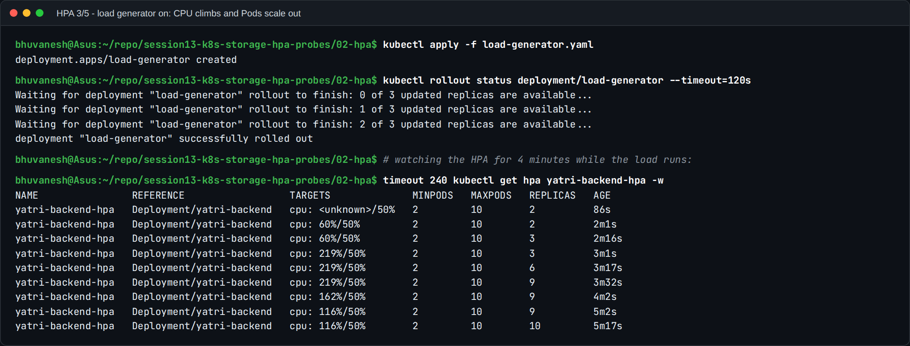

# Kubernetes Storage, HPA & Probes (Homework Submission)

**Name:** Bhuvanesh M S (24bcs10134)
**Environment:** minikube v1.39.0 (Kubernetes v1.37.0, Docker driver) on WSL 2 Ubuntu 26.04, with the
`metrics-server`, `storage-provisioner` and `default-storageclass` addons.

Every screenshot in this submission is real terminal output from that cluster.

## Homework tasks

| # | Task | Where | Status |
| --- | --- | --- | --- |
| 1 | Kubernetes Volumes: emptyDir, hostPath, PV, PVC, StorageClass, dynamic provisioning, with practical examples | [01-kubernetes-volumes/README.md](01-kubernetes-volumes/README.md) | Done: 8 manifests, 5 screenshots |
| 2 | HPA hands-on with `hpa.yml`: deploy, configure, verify, load generator, CPU, scaling | [02-hpa/README.md](02-hpa/README.md) | Done: scaled 2 → 10 → 2, 6 screenshots |
| 3 | Mini project: PVC + HPA + probes | [03-mini-project/README.md](03-mini-project/README.md) | Done, plus all 3 bonus challenges, 7 screenshots |

## Folder structure

```
session13-k8s-storage-hpa-probes/
├── README.md                     <- this page
├── 01-kubernetes-volumes/
│   ├── README.md                 <- Task 1 documentation
│   ├── 01-emptydir.yaml          02-hostpath.yaml
│   ├── 03-static-pv.yaml         04-static-pvc-pod.yaml
│   ├── 05-storageclass.yaml      06-dynamic-pvc-pod.yaml
│   ├── 07-dynamic-consumer.yaml  08-provisioner-rbac-fix.yaml
├── 02-hpa/
│   ├── README.md                 <- Task 2 documentation
│   ├── hpa.yml                   <- from class, unchanged
│   ├── backend-service.yaml      <- from class, unchanged
│   ├── deployment.yaml  backend-configmap.yaml
│   ├── load-generator.yaml  load_generator.sh
├── 03-mini-project/
│   ├── README.md                 <- Task 3 documentation
│   └── namespace.yaml pvc.yaml deployment.yaml service.yaml hpa.yaml
└── images/                       <- 18 screenshots
```

## Highlights

**Task 1: Volumes.** Each volume type is demonstrated by what happens to the data when the
Pod is deleted. emptyDir data is wiped. hostPath data survives on the node. A `Retain`
static PV goes `Released` with the data kept. A `Delete` dynamic PV disappears with its claim.

Dynamic provisioning with `WaitForFirstConsumer` got stuck `Pending` on minikube. I traced it
through the PVC events and `kubectl auth can-i` to a missing RBAC permission (the provisioner
couldn't read Node objects), fixed it with a ClusterRole, and documented the full
troubleshooting path.


**Task 2: HPA.** I used the class's `hpa.yml` (min 2, max 10, 50% CPU) against a CPU-bound
`yatri-backend` and an in-cluster load generator. CPU went to **219%** of target, and the HPA
stepped **2 → 3 → 6 → 9 → 10** in about 3 minutes, hit `ScalingLimited: TooManyReplicas`, and
after the load was removed held for the 5-minute stabilisation window before returning to **2**.



**Task 3: Mini project.** Data in `/data` survived deleting the Pod. The Service answered HTTP
200. The single load-generator Pod pushed CPU to 54% against 50%, inside the HPA's 10%
tolerance, so it correctly did *not* scale until the target was lowered to 30% (bonus 1:
2 → 4). Breaking the readiness probe removed every endpoint without restarting anything.
Breaking the liveness probe caused restarts and `CrashLoopBackOff`.

## Commands used across the session

```bash
minikube addons enable metrics-server
kubectl apply -f <file>.yaml
kubectl get pv,pvc,storageclass
kubectl describe pvc <name>                 # events explain Pending claims
kubectl auth can-i <verb> <resource> --as=system:serviceaccount:<ns>:<sa>
kubectl get hpa -w
kubectl top pods
kubectl describe hpa <name>                 # conditions + rescale events
kubectl get endpoints <service>
kubectl get events --field-selector reason=Unhealthy
kubectl rollout undo deploy/<name>
minikube ssh -- <command>                   # look at the node's disk
```

## What I learned

1. **The lifetime of data decides the volume type.** Pod lifetime means emptyDir; node
   lifetime means hostPath; independent of everything means a PV via a PVC.
2. **PVC events are the first place to look** when storage is stuck, and RBAC problems show
   up there clearly.
3. **HPA utilisation is relative to the CPU request**, scale-up is quick and stepwise,
   scale-down waits 5 minutes, and small deviations within 10% are ignored on purpose.
4. **Readiness controls traffic and liveness controls restarts.** Getting either wrong has
   very different symptoms: an empty endpoints list versus a restart loop.
