# Kubernetes Troubleshooting (Homework Submission)

**Name:** Bhuvanesh M S (24bcs10134)
**Environment:** minikube v1.39.0 (Kubernetes v1.37.0) on WSL 2 Ubuntu 26.04, metrics-server enabled.

Every screenshot is real output from that cluster. The broken workloads were really deployed,
investigated, fixed and verified, in that order.

## Homework tasks

| # | Task | Where | Status |
| --- | --- | --- | --- |
| 1 | Hands-on with `get`, `describe`, `logs`, `exec`, `events`, `explain`, `top`, `get -o wide` | [Task 1](#task-1-the-troubleshooting-commands) | Done, 9 screenshots |
| 2 | Troubleshoot CrashLoopBackOff, ImagePullBackOff, ErrImagePull, Pending, ContainerCreating, Service connectivity, DNS, Pod networking, configuration | [Task 2](#task-2-troubleshooting-common-issues) | Done: all 9, plus OOMKilled, 19 screenshots |
| 3 | Kubernetes troubleshooting mini project | [Task 3](#task-3-mini-project) | Done, all questions answered, 6 screenshots |

```
session14-k8s-troubleshooting/
├── 01-commands/demo-app.yaml          healthy app used for Task 1
├── 02-issues/                         one folder per issue: broken.yaml + the fix
│   ├── 01-crashloopbackoff/   02-imagepullbackoff/   03-pending/
│   ├── 04-containercreating/  05-service-connectivity/ 06-dns/
│   ├── 07-pod-networking/     08-configuration/       09-oomkilled/
├── 03-mini-project/                   the class mini project manifests
└── images/                            34 screenshots
```

Several broken manifests come straight from the class `scenarios/` folder (the "triage
gauntlet"): CrashLoop, ImagePull, Pending, DNS and OOMKilled. I wrote the
ContainerCreating, Service, Pod-networking and configuration cases myself, because the
brief lists them but the class folder had no example.

## My troubleshooting method

```
get  ->  describe  ->  events  ->  logs  ->  exec  ->  test  ->  fix  ->  verify
(what state?) (why? the object's own story) (what did the app say?) (look inside) (prove it)
```

The STATUS column of `kubectl get` already narrows things down a lot:

| STATUS | Meaning | First place to look |
| --- | --- | --- |
| `Pending` | Not scheduled to a node yet | `describe pod` → `FailedScheduling` event |
| `ContainerCreating` (stuck) | Scheduled, but the kubelet can't finish setting up (volumes, network, image) | `describe pod` → `FailedMount` and similar events |
| `ErrImagePull` / `ImagePullBackOff` | The image can't be pulled | `describe pod` → `Failed to pull image` |
| `CreateContainerConfigError` | Config referenced by the Pod is missing or wrong | `describe pod` → `Error: couldn't find key...` |
| `CrashLoopBackOff` / `Error` | The container starts and then exits | `logs` (and `logs --previous`) and the exit code |
| `OOMKilled` | Killed for going over its memory limit | `describe` → `Reason: OOMKilled`, exit code 137 |
| `Running` but `0/1` | Started, but failing its readiness probe | probe events, `get endpoints` |
| `Running 1/1` but unreachable | It's a Service, DNS or networking problem, not a Pod problem | `get endpointslices`, `exec` + `wget` / `nslookup` |

---

## Task 1: The troubleshooting commands

A healthy two-replica nginx app (`shop`) plus a Service, from
[01-commands/demo-app.yaml](01-commands/demo-app.yaml), was used to practise each command.

### `kubectl get`: what exists, and what state is it in?

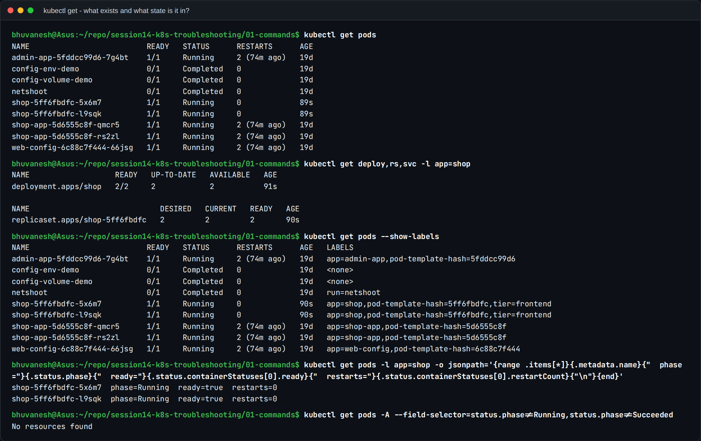

- `get pods` gives the quick health view: READY, STATUS, RESTARTS and AGE. Restart counts
  are often the first clue. (The other Pods in the list are left over from the Session 12
  homework on the same cluster.)
- `-l app=shop` filters by **label**, and `--show-labels` prints the labels. Labels are what
  Services and ReplicaSets use to find Pods, so this matters for Service debugging later.
- `-o jsonpath` extracts exact fields (phase, ready, restart count) for scripts.
- `--field-selector=status.phase!=Running,...` across `-A` is the quickest way to ask
  "is anything unhealthy anywhere in the cluster?". Here the answer is: nothing.

### `kubectl get -o wide`, and other output formats

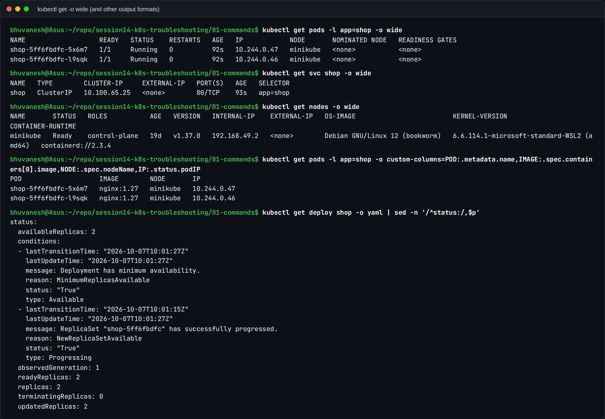

- `-o wide` adds the **Pod IP and node**, which you need for any networking problem.
  For Services it adds the **selector**; for nodes, the internal IP, OS, kernel and runtime.
- `-o custom-columns` builds your own table: Pod, image, node, IP.
- `-o yaml | sed -n '/^status:/,$p'` shows the controller's own view: `Available`,
  `NewReplicaSetAvailable`, and the replica counts.

### `kubectl describe`: the full story of one object

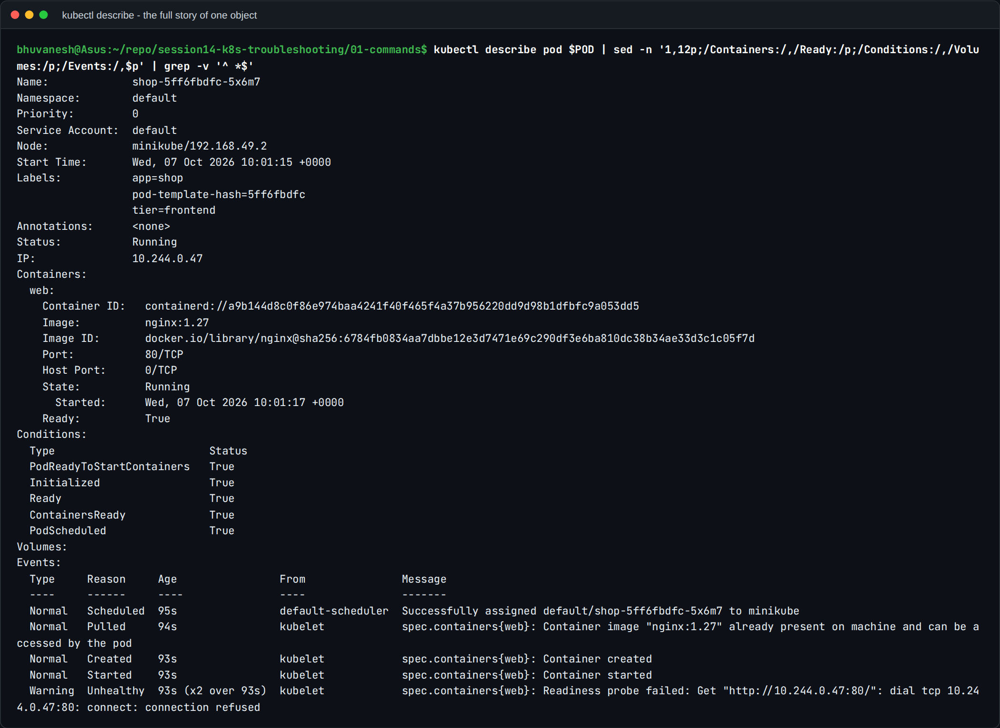

- For a Pod it shows the node, IP, labels, the exact image digest, container `State`, the
  five **conditions** (`PodScheduled` → `Initialized` → `ContainersReady` → `Ready`) and,
  most importantly, the **Events** at the bottom.
- Even this healthy Pod has a `Readiness probe failed ... connection refused` warning
  from its first second, before nginx was listening. Without that context a warning can
  look alarming, so always read events alongside their age and count.

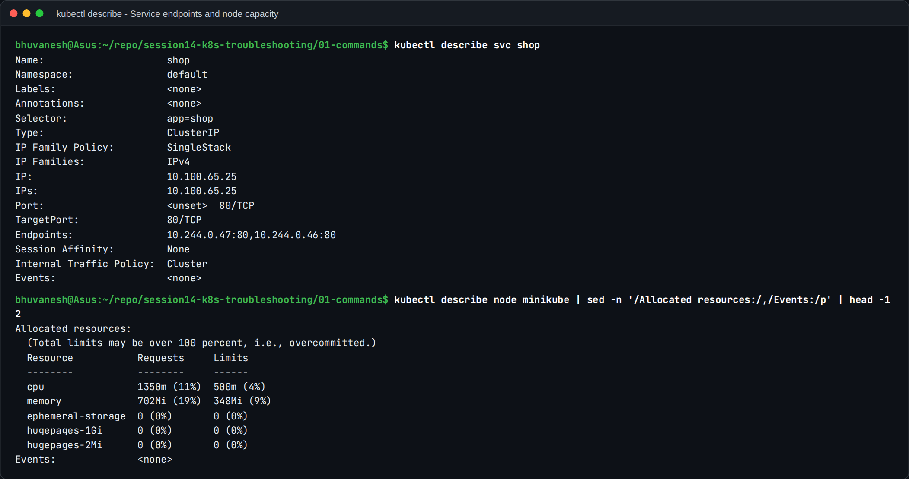

- `describe svc` shows `Selector`, `TargetPort` and **`Endpoints`**: the three fields behind
  almost every Service problem in Task 2.
- `describe node` → `Allocated resources` shows the node has 11% of its CPU and 19% of its
  memory **requested**. That's what the scheduler compares against, and why the 500-core Pod
  in Task 2 stays Pending.

### `kubectl logs`: what the application printed

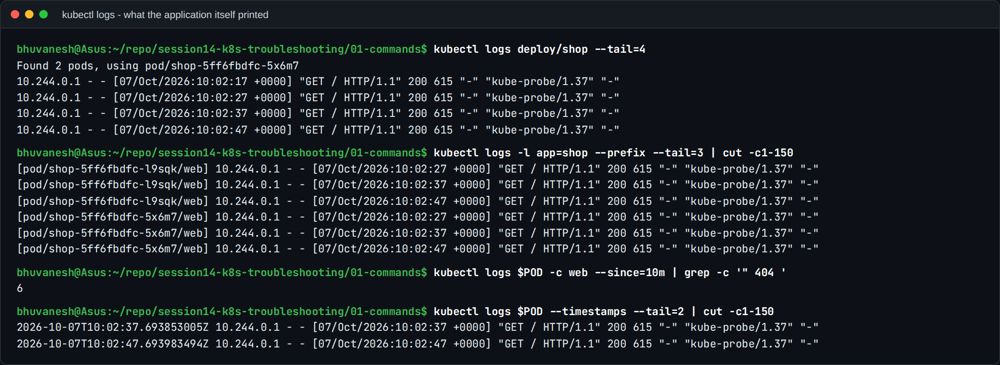

- `logs deploy/shop` picks one Pod of the Deployment for you (`Found 2 pods, using ...`).
- `-l app=shop --prefix` reads **every** Pod and labels each line with its Pod and container.
- `--since=10m | grep -c '" 404 '` counted the **6** requests to a missing page I sent
  earlier. Logs answer questions about the app, not about Kubernetes.
- `--timestamps` adds the kubelet's timestamp, and `-c` chooses a container in multi-container
  Pods. `--previous` reads the **last crashed** container (used in Task 2).

### `kubectl exec`: run commands inside the container

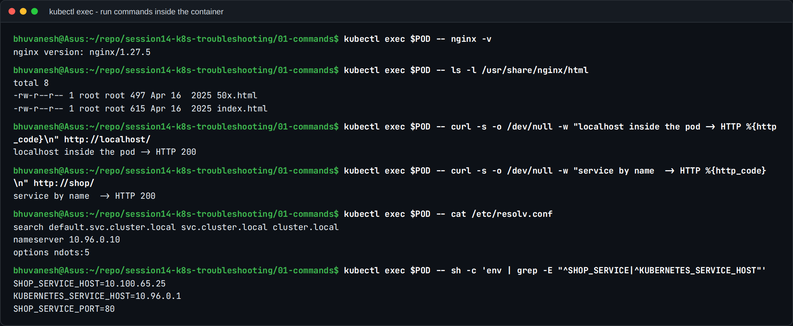

- Comparing `curl localhost` (works, HTTP 200) with `curl http://shop/` (also HTTP 200)
  separates "is the app up?" from "does the Service/DNS path work?".
- `/etc/resolv.conf` shows how DNS works inside a Pod: nameserver `10.96.0.10` (CoreDNS),
  the search domains `default.svc.cluster.local svc.cluster.local cluster.local`, and
  `ndots:5`.
- The kubelet also injects `SHOP_SERVICE_HOST`/`PORT` environment variables for Services
  that existed when the Pod started.

### `kubectl events`: what the cluster did

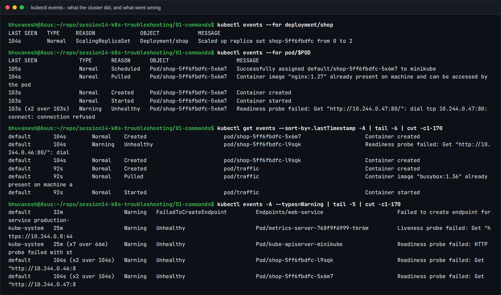

- `kubectl events --for deployment/shop` shows the Deployment's story: `ScalingReplicaSet`,
  scaled from 0 to 2. `--for pod/...` shows Scheduled → Pulled → Created → Started.
- `get events --sort-by=.lastTimestamp` gives a time-ordered feed. Without sorting, events
  come back in no useful order.
- `--types=Warning -A` is a quick cluster-wide "what's going wrong right now" view.
- Events are kept for about an hour by default, so investigate soon after an incident.

### `kubectl explain`: built-in API documentation

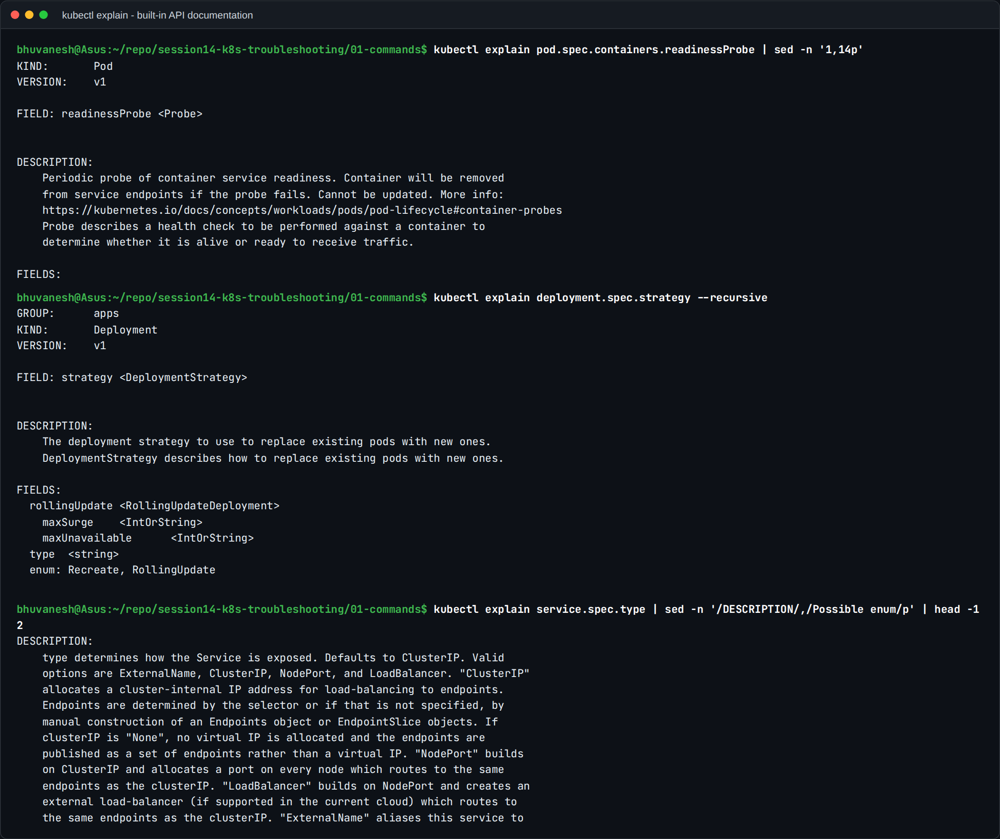

When a YAML field is wrong or unknown, `explain` answers from the cluster's own API schema
instead of a web search. `--recursive` shows the whole tree: for example, `strategy` has
`rollingUpdate.maxSurge/maxUnavailable` and `type: Recreate | RollingUpdate`.

### `kubectl top`: live CPU and memory

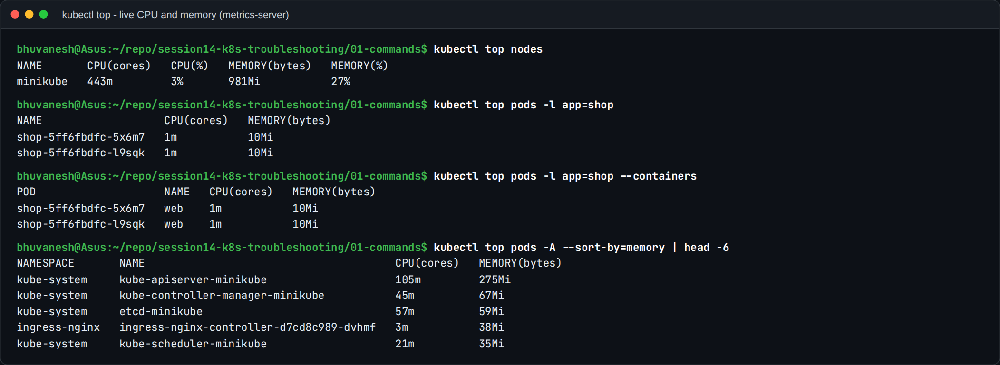

- Needs **metrics-server**. Without it, `top` answers `Metrics API not available`.
- Each `shop` Pod uses about 1m CPU and 10Mi memory, far below its 50m/32Mi requests.
- `--sort-by=memory -A` puts the API server (275Mi) at the top, which shows where the
  cluster's own memory goes.
- This is the command to run for OOMKilled and throttling problems, and for HPA (Session 13).

---

## Task 2: Troubleshooting common issues

Each issue follows **identify → investigate → root cause → fix → verify**. A long-running
busybox Pod called `client` was used to test from **inside** the cluster, the way another
application would connect.

### Issue 1: CrashLoopBackOff

**Problem:** [scenario-1 `broken.yaml`](02-issues/01-crashloopbackoff/broken.yaml), a Python
app that keeps restarting.

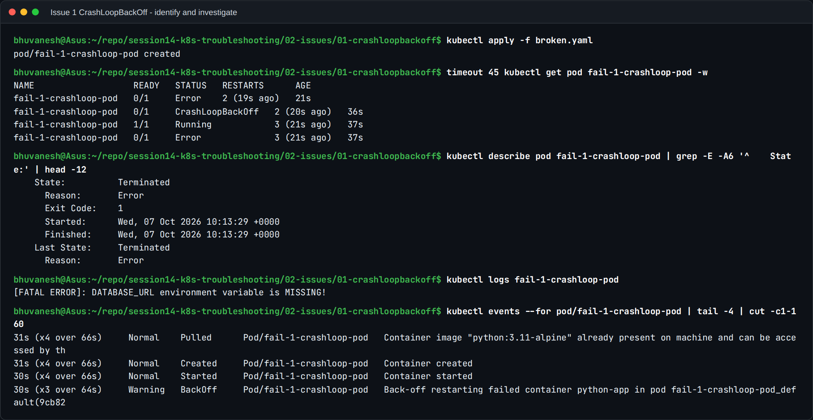

- **Identify:** `get -w` shows the cycle: `Error` → **`CrashLoopBackOff`** → `Running` →
  `Error`, with restarts climbing. `CrashLoopBackOff` isn't the error itself. It's the
  kubelet **waiting** longer before each restart (10 s, 20 s, 40 s, up to 5 minutes).
- **Investigate:** `describe` shows `Terminated`, **`Exit Code: 1`**, and it finished in
  the same second it started. The app exits by itself; Kubernetes isn't killing it.
- **Root cause:** `kubectl logs` gives it directly: **`[FATAL ERROR]: DATABASE_URL
  environment variable is MISSING!`**

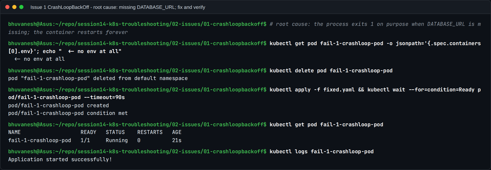

- **Fix:** [fixed.yaml](02-issues/01-crashloopbackoff/fixed.yaml) adds the `DATABASE_URL`
  environment variable. In production it would come from a Secret.
- **Verify:** `1/1 Running`, **0 restarts** after 21 s, and the log says `Application
  started successfully!`.

### Issue 2: ErrImagePull and ImagePullBackOff

**Problem:** [scenario-2 `broken.yaml`](02-issues/02-imagepullbackoff/broken.yaml), image
`yatri-api-service:v999-invalid-tag-does-not-exist`.

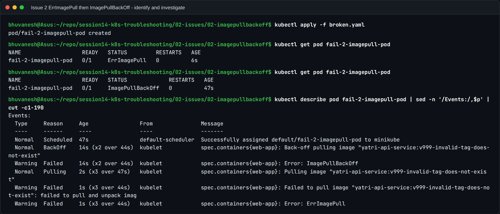

- **ErrImagePull vs ImagePullBackOff:** at 6 s the status was **`ErrImagePull`**, meaning a
  pull attempt just failed. At 47 s it was **`ImagePullBackOff`**: the kubelet is waiting
  before retrying. Same problem, two phases. The events show both, alternating:
  `Pulling` → `Failed ... ErrImagePull` → `Back-off pulling image` → `ImagePullBackOff`.
- **Root cause:** a name with no registry is resolved as `docker.io/library/yatri-api-service`,
  which doesn't exist, and neither does that tag. Other common causes are a typo in the
  tag, a private registry without `imagePullSecrets`, or rate limits.

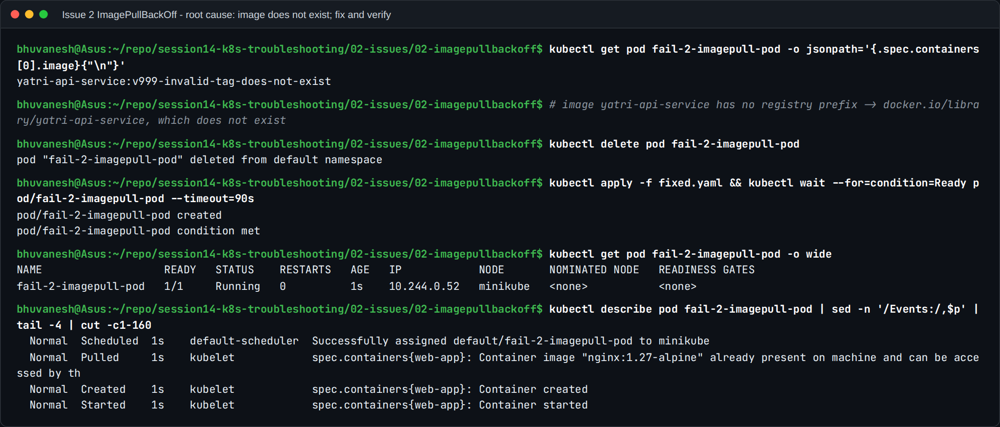

- **Fix and verify:** point at an image that exists (`nginx:1.27-alpine`). The Pod is
  Running within a second, and the events now say `Pulled ... Created ... Started`.

### Issue 3: Pending

Two different reasons a Pod can't be scheduled, deployed side by side:
[scenario-3 `broken.yaml`](02-issues/03-pending/broken.yaml) (requests **500 CPUs and
1000Gi**) and the class's [nodeSelector Pod](02-issues/03-pending/broken-nodeselector.yaml)
(`kubernetes.io/hostname: node-that-does-not-exist`).

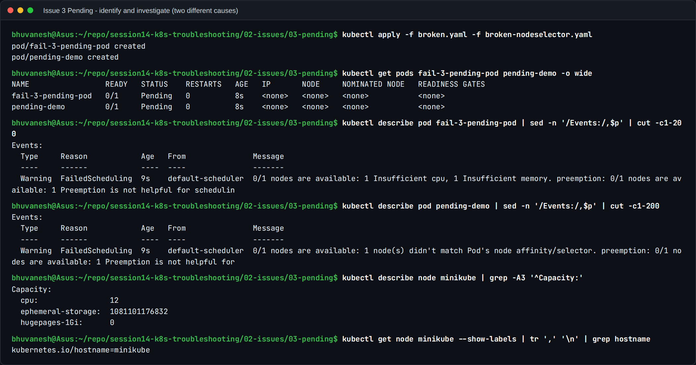

- **Identify:** both are `Pending` with no IP and no node. Pending means **the scheduler
  hasn't placed it**, so it isn't the app or the image.
- **Investigate:** the `FailedScheduling` events say exactly why:
  - `0/1 nodes are available: 1 Insufficient cpu, 1 Insufficient memory`. The node's
    `Capacity` is **12 CPUs**, so a 500-CPU request can never fit.
  - `1 node(s) didn't match Pod's node affinity/selector`. The only node is labelled
    `kubernetes.io/hostname=minikube`.
- Other common Pending causes include taints without tolerations, an unbound PVC (see the
  Session 13 RBAC example), and a ResourceQuota.

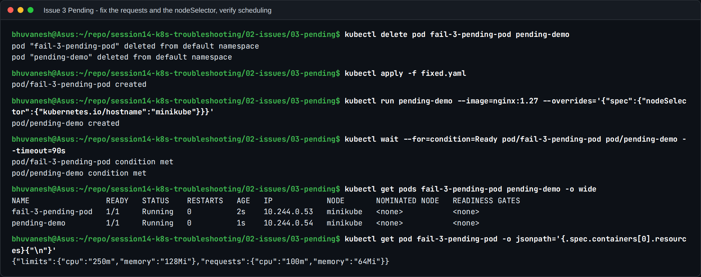

- **Fix:** request `100m`/`64Mi` (with limits), and select the real hostname `minikube`.
- **Verify:** both Pods are scheduled to `minikube` and Running within a second.

### Issue 4: Stuck in ContainerCreating

**Problem:** [broken.yaml](02-issues/04-containercreating/broken.yaml) mounts a ConfigMap
called `report-settings` that was never created.

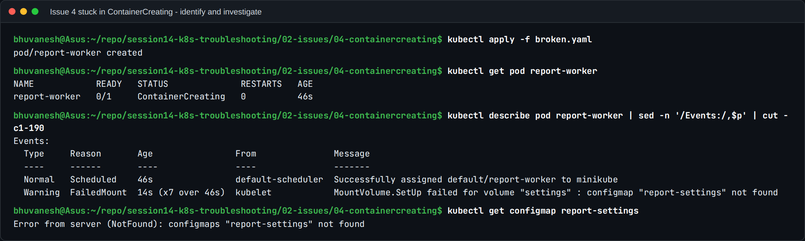

- **Identify:** `ContainerCreating` for 46 s. The Pod *was* scheduled, but the container
  never started.
- **Investigate:** the event `FailedMount (x7): MountVolume.SetUp failed for volume
  "settings" : configmap "report-settings" not found`. The kubelet keeps retrying the mount.
  `get configmap` confirms `NotFound`.
- **Root cause:** a missing dependency. A Secret, a PVC, or a CNI network problem gives the
  same symptom, with a different event message.

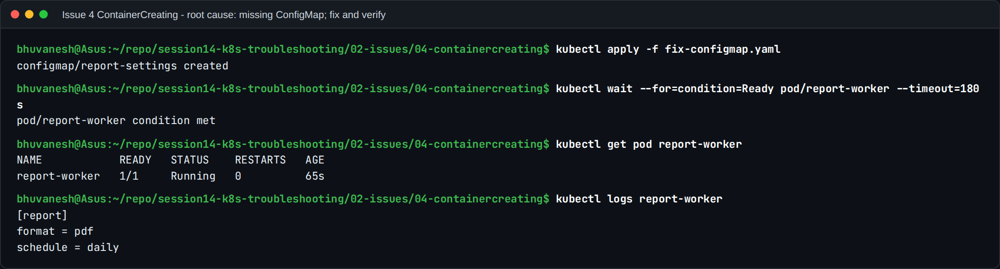

- **Fix:** create the ConfigMap ([fix-configmap.yaml](02-issues/04-containercreating/fix-configmap.yaml)).
  The Pod didn't need to be deleted: on its next retry the kubelet mounted the volume and
  started the container.
- **Verify:** `1/1 Running`, and the logs print the mounted `settings.ini`.

### Issue 5: Service connectivity

**Problem:** two `payments` Pods (label `app=payments`, listening on **8080**) behind
[broken-service.yaml](02-issues/05-service-connectivity/broken-service.yaml). This Service
has **two** mistakes, a realistic situation where fixing the first doesn't fix the outage.

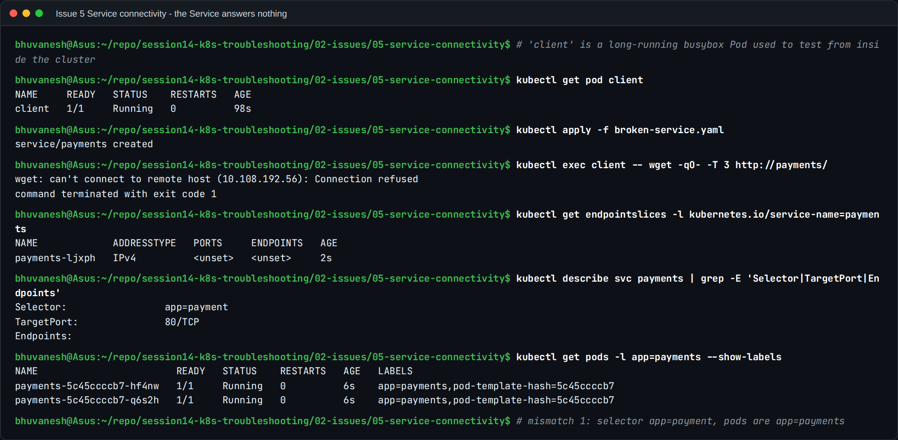

- **Identify:** from the `client` Pod, `wget http://payments/` gives `Connection refused`.
  The Pods themselves are `Running 1/1`.
- **Investigate:** the EndpointSlice has **no endpoints**. `describe svc` shows `Selector:
  app=payment`, and `get pods --show-labels` shows **`app=payments`**.
- **Root cause 1:** the selector doesn't match the Pod label (missing "s"), so the Service
  selects nothing.

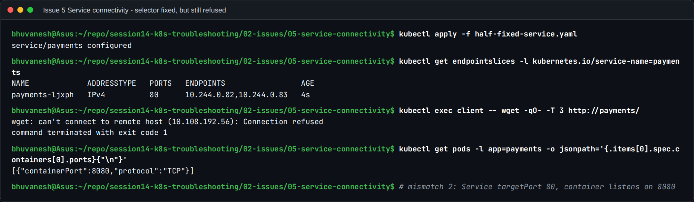

- After fixing the selector, the EndpointSlice **does** list both Pod IPs, but on port
  **80**. Still `Connection refused`.
- **Root cause 2:** `targetPort: 80`, but the container listens on **8080**, as the Pod's
  `ports` shows.

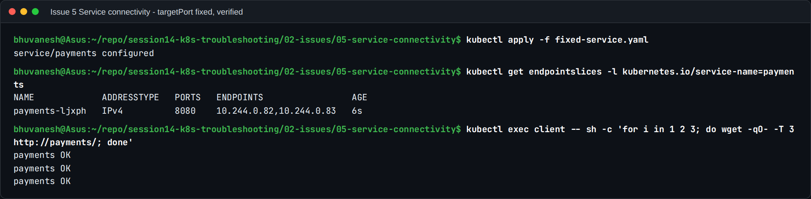

- **Fix and verify:** `targetPort: 8080`. The endpoints are now `...:8080`, and three
  requests all return `payments OK`.

**Checklist for "Service doesn't work":** endpoints empty → selector/labels (or no Ready
Pods). Endpoints present but refused → targetPort. Timeouts → NetworkPolicy or the app.

### Issue 6: DNS

**Problem:** [scenario-4 `broken.yaml`](02-issues/06-dns/broken.yaml), a client that calls
`postgres-db-wrong-name.production.svc.cluster.local`. A real `postgres-db` Service runs in
the `production` namespace ([database.yaml](02-issues/06-dns/database.yaml)).

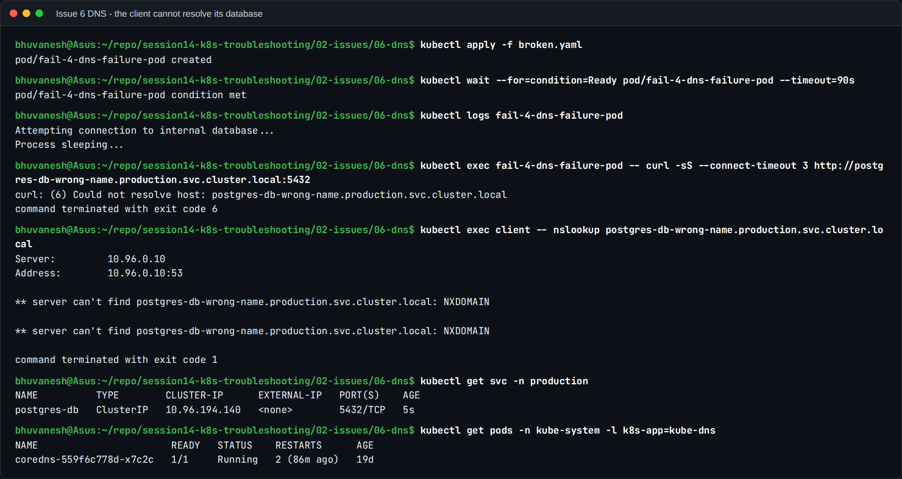

- **Identify:** the Pod is Running, but its own log and a manual `curl` give **`Could not
  resolve host`** (curl exit code 6).
- **Investigate:** `nslookup` from `client` gets an answer from `10.96.0.10` (CoreDNS), and
  the answer is **`NXDOMAIN`**: DNS works, the name simply doesn't exist. CoreDNS is
  `1/1 Running`, and `get svc -n production` shows the real name is **`postgres-db`**.
- **Root cause:** a wrong hostname in the application config. If CoreDNS itself were broken,
  the query would **time out** instead of returning NXDOMAIN.

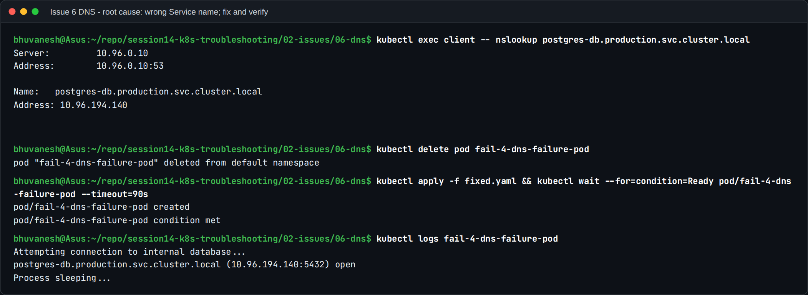

- **Fix and verify:** `postgres-db.production.svc.cluster.local` resolves to the Service IP
  `10.104.35.70`, and the fixed Pod logs `postgres-db.production.svc.cluster.local
  (10.104.35.70:5432) open`.
- Kubernetes DNS form: `<service>.<namespace>.svc.cluster.local`. A short name like
  `postgres-db` only works from inside the **same** namespace.

### Issue 7: Pod networking

**Problem:** [broken.yaml](02-issues/07-pod-networking/broken.yaml): an `inventory` API
that is `Running 1/1` and has an endpoint, yet nobody can reach it.

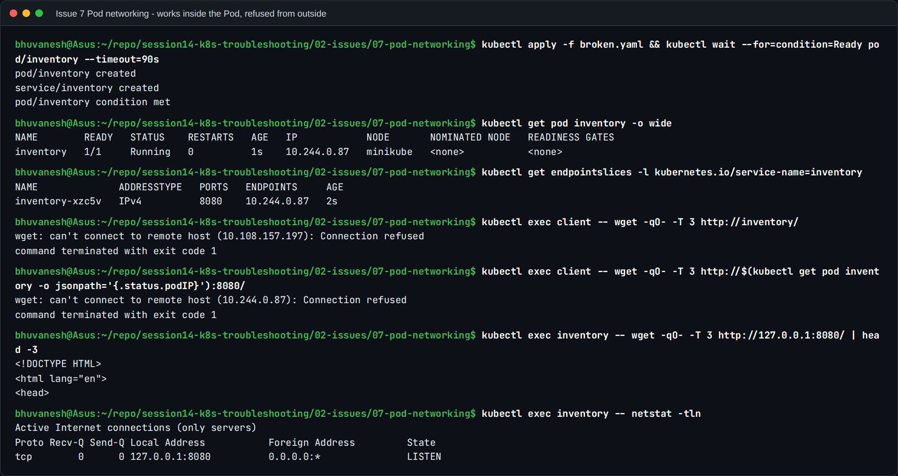

- **Identify:** `Connection refused`, both through the Service **and** directly to the Pod IP
  `10.244.0.87:8080`. Since the Pod IP itself refuses, it isn't a Service problem.
- **Investigate:** `kubectl exec inventory -- wget http://127.0.0.1:8080/` **works**, so the
  app is up. `netstat -tln` inside the Pod shows the cause: **`127.0.0.1:8080 LISTEN`**.
- **Root cause:** the server is bound to **loopback only**. Traffic arriving on the Pod's
  network interface (its Pod IP) has nothing listening. "Works inside the container,
  refused from outside" is the classic sign of this, and it's very common with dev servers
  (Flask, Vite, etc.) that default to `127.0.0.1`.

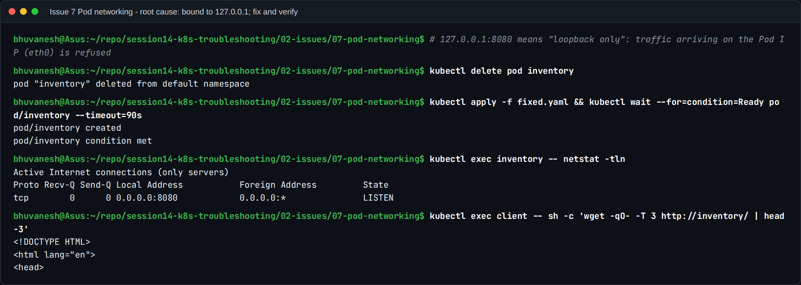

- **Fix and verify:** bind to `0.0.0.0`. `netstat` shows `0.0.0.0:8080`, and the request
  through the Service returns the page.

### Issue 8: Configuration (CreateContainerConfigError)

**Problem:** [broken.yaml](02-issues/08-configuration/broken.yaml) reads key `PAYMENT_URL`
from the ConfigMap `checkout-config`.

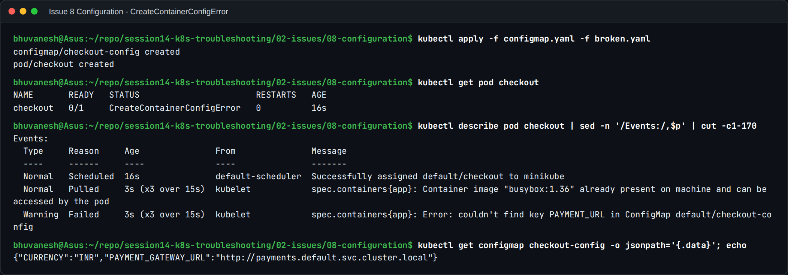

- **Identify:** status **`CreateContainerConfigError`**: the kubelet can't build the
  container's configuration.
- **Investigate:** event `Error: couldn't find key PAYMENT_URL in ConfigMap
  default/checkout-config`. Printing the ConfigMap's data shows the real key is
  **`PAYMENT_GATEWAY_URL`**.
- **Root cause:** a typo in the key name. The same status appears for a missing Secret, a
  missing Secret key, or a missing ConfigMap referenced by `envFrom`.

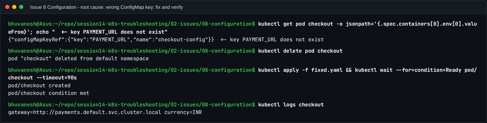

- **Fix and verify:** reference `PAYMENT_GATEWAY_URL`. The Pod starts and prints
  `gateway=http://payments.default.svc.cluster.local currency=INR`.
- To make a key optional instead, `configMapKeyRef.optional: true` lets the Pod start
  without it.

### Bonus issue: OOMKilled

**Problem:** [scenario-5 `broken.yaml`](02-issues/09-oomkilled/broken.yaml) allocates about
200 MB with a **20Mi** memory limit.

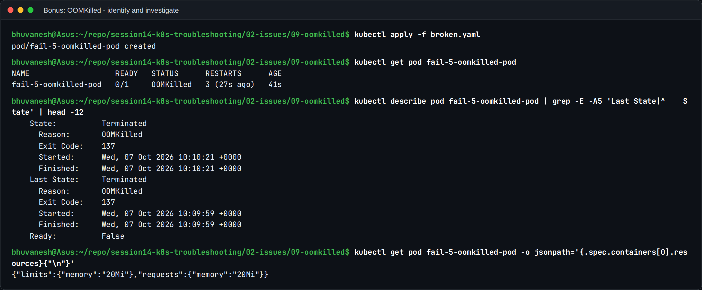

- **Identify:** status `OOMKilled`, with 3 restarts within 41 s.
- **Investigate:** `describe` shows `Reason: OOMKilled`, **`Exit Code: 137`** (128 + 9, i.e.
  killed by SIGKILL). The limit is 20Mi.
- **Root cause:** the container used more memory than its limit, so the kernel's OOM killer
  ended it. CPU over its limit is only **throttled**; memory over its limit is **killed**.

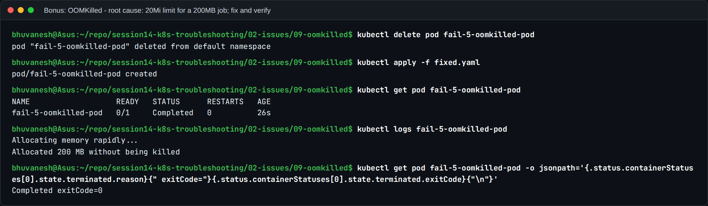

- **Fix and verify:** a limit that fits the job (320Mi, with a 256Mi request). It completes:
  `Allocated 200 MB without being killed`, `Completed exitCode=0`. The other valid fix is
  changing the code to use less memory.

### Troubleshooting summary

| Problem | What I saw | Command that found it | Root cause | Fix |
| --- | --- | --- | --- | --- |
| CrashLoopBackOff | `Error`/`CrashLoopBackOff`, restarts climbing | `kubectl logs` | App exits 1 without `DATABASE_URL` | Provide the env var |
| ErrImagePull / ImagePullBackOff | `ErrImagePull` then `ImagePullBackOff` | `describe pod` events | Image/tag doesn't exist | Use a real image:tag |
| Pending | `Pending`, no node | `describe pod` → `FailedScheduling` | 500 CPU request; nodeSelector to a non-existent node | Sensible requests; correct node label |
| ContainerCreating | Stuck 46 s+ | `describe pod` → `FailedMount` | ConfigMap volume missing | Create the ConfigMap |
| Service connectivity | `Connection refused` | `get endpointslices`, `describe svc`, `--show-labels` | Selector typo **and** wrong targetPort | `app=payments`, `targetPort: 8080` |
| DNS | `Could not resolve host`, NXDOMAIN | `exec client -- nslookup`, `get svc -n` | Wrong Service name | Correct FQDN |
| Pod networking | Refused on Pod IP, works on localhost | `exec -- netstat -tln` | App bound to 127.0.0.1 | Bind 0.0.0.0 |
| Configuration | `CreateContainerConfigError` | `describe pod` events | Wrong ConfigMap key | Correct key |
| OOMKilled | `OOMKilled`, exit 137 | `describe pod` | 20Mi limit for a 200MB job | Raise the limit (or use less memory) |

---

## Task 3: Mini project

The class mini project ([03-mini-project/](03-mini-project/)): a two-replica nginx
`troubleshooting-app`, `troubleshooting-service`, and a deliberately broken Pod.

### Steps 1-4: deploy and check the application and Service

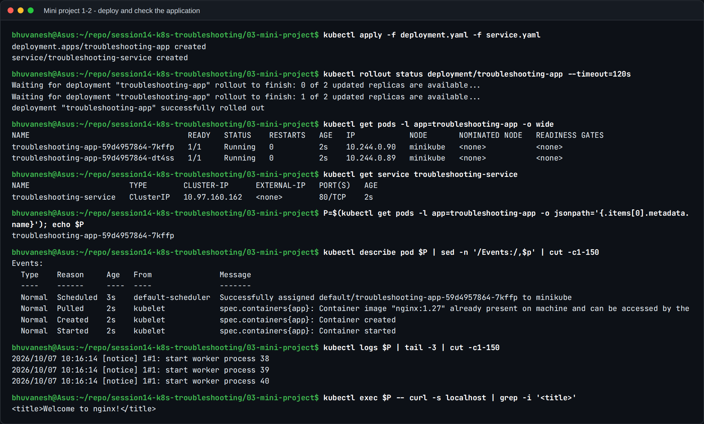

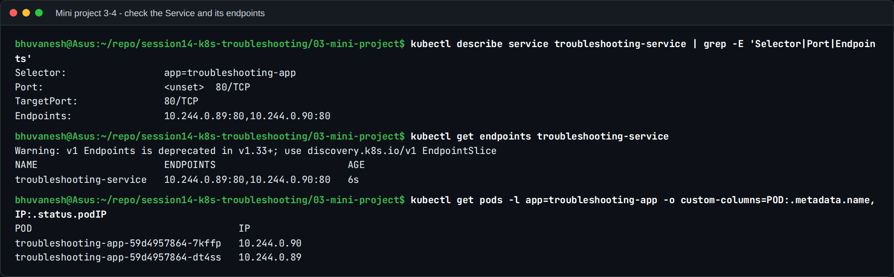

Both Pods are Running. `describe` shows clean events, the logs show nginx startup, and `curl
localhost` inside the Pod returns `<title>Welcome to nginx!</title>`. The Service's
`Endpoints` are exactly the two Pod IPs, so selector, port and Pods all agree.

### Steps 5-7: the broken Pod (investigated before changing any YAML)

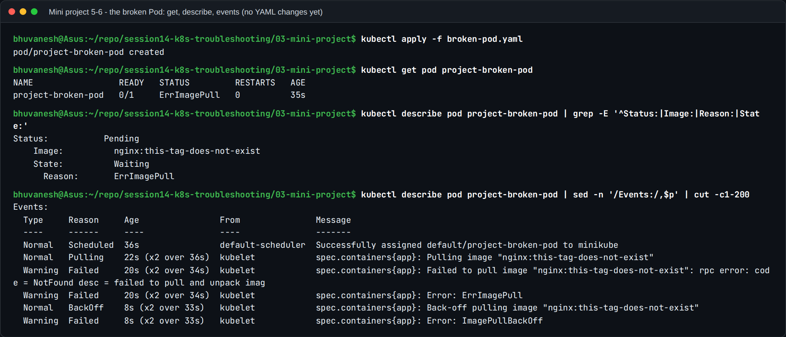

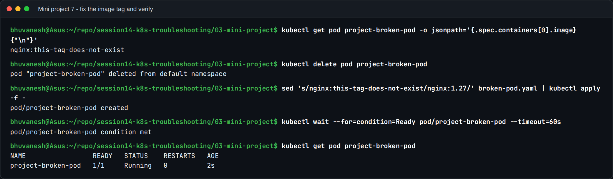

**Question 1: What is the Pod status?**
`ErrImagePull`, alternating with `ImagePullBackOff`. The Pod phase is `Pending`, and the
container is `Waiting`.

**Question 2: What is the actual error?**
`Failed to pull image "nginx:this-tag-does-not-exist": rpc error: code = NotFound` and then
`Error: ErrImagePull` / `Back-off pulling image`.

**Question 3: Which command helped you find the reason?**
`kubectl describe pod project-broken-pod`, specifically its **Events** section. `kubectl get`
only shows the status, not the reason.

**Question 4: What is wrong with the image?**
The repository `nginx` exists, but the **tag** `this-tag-does-not-exist` doesn't, so the
registry returns NotFound.

**Question 5: How would you fix it?**
Use a tag that exists, e.g. `nginx:1.27`. I recreated the Pod with that image and it went to
`1/1 Running`. For a Deployment, `kubectl set image deployment/<name> app=nginx:1.27` would
roll it out.

### Steps 8-9: the Service selector challenge

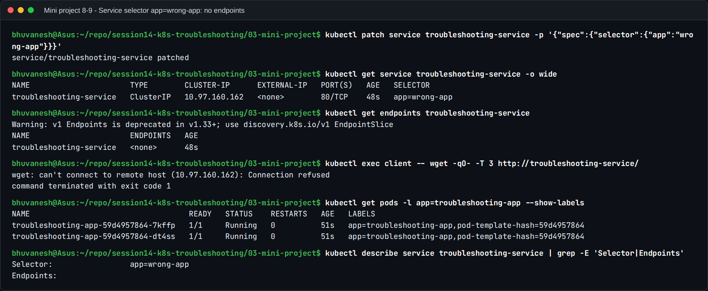

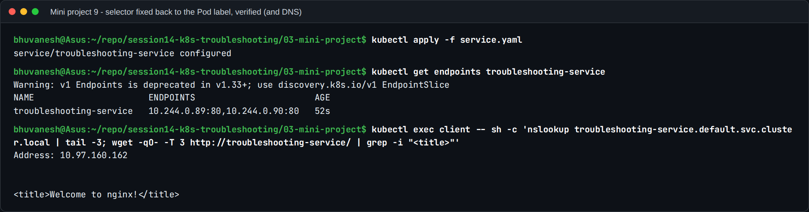

With the selector changed to `app: wrong-app`, the Service still exists and still has a
ClusterIP, but `ENDPOINTS` is **`<none>`** and requests get `Connection refused`.
`--show-labels` shows the Pods are `app=troubleshooting-app`, and `describe service` shows
`Selector: app=wrong-app`: a mismatch. After re-applying the original `service.yaml`, both
endpoints returned, and from the client Pod
`troubleshooting-service.default.svc.cluster.local` resolved to the ClusterIP
`10.97.160.162` and served the nginx page.

### Troubleshooting table

| Problem | What I saw | Command I used | Root cause | Fix |
| :--- | :--- | :--- | :--- | :--- |
| **Broken Pod** | `0/1 ErrImagePull`, Pod phase `Pending` | `kubectl get pod`, `kubectl describe pod` (Events) | Image tag does not exist | Recreate with `nginx:1.27` |
| **Service Problem** | Service has a ClusterIP but `ENDPOINTS <none>`, connection refused | `kubectl get endpoints`, `kubectl get pods --show-labels`, `kubectl describe service` | Selector `app=wrong-app` matches no Pod | Selector back to `app=troubleshooting-app` |
| **Image Problem** | `Failed to pull image ... NotFound`, then back-off | `kubectl describe pod` | `nginx:this-tag-does-not-exist` isn't in the registry | Use an existing tag |

### README questions

1. **What does `kubectl get` tell us?** What objects exist and their current state in one
   line each: for Pods READY, STATUS, RESTARTS and AGE; with `-o wide` also IP and node. It
   answers "what is happening?", not "why?".
2. **What is the difference between `get` and `describe`?** `get` is a summary, possibly of
   many objects. `describe` is one object in full detail: spec, status, conditions and,
   crucially, the **events** that explain why it's in that state.
3. **Why do we use `kubectl logs`?** To read what the **application** printed to stdout and
   stderr. Kubernetes can say a container exited with code 1; only the logs say *why*
   (`DATABASE_URL ... MISSING`). `--previous` shows the crashed instance's logs.
4. **When would you use `kubectl exec`?** To test from inside the container: is the app
   listening (`netstat`, `curl localhost`)? Can it reach a Service or resolve a name? Are the
   env vars and mounted files what I expect? It's how I separated an app problem from a
   network problem in Issue 7.
5. **What does `CrashLoopBackOff` mean?** The container keeps starting and exiting, and the
   kubelet is waiting longer and longer (up to 5 minutes) before restarting it again. It's a
   symptom; the cause is in the logs and exit code.
6. **What does `ImagePullBackOff` mean?** Pulling the image failed (`ErrImagePull`), and the
   kubelet is backing off before retrying. Causes: wrong name or tag, private registry
   without credentials, rate limits, no network to the registry.
7. **Why can a Pod remain `Pending`?** The scheduler can't find a node that satisfies it:
   not enough CPU or memory for its requests, a nodeSelector or affinity that no node
   matches, taints without tolerations, an unbound PVC, or a quota. The `FailedScheduling`
   event names the reason.
8. **Why can a Service have no endpoints?** Its selector matches no Pods (label mismatch,
   wrong namespace), or the matching Pods aren't Ready (failing readiness probes), or there
   are no Pods at all.
9. **What is the relationship between a Service selector and Pod labels?** The Service has no
   list of Pods. It continuously selects every **Ready** Pod whose labels match its selector
   and publishes their IPs as endpoints. One wrong character in either breaks the link.
10. **What is Kubernetes DNS?** CoreDNS, running in `kube-system` behind the ClusterIP
    `10.96.0.10`, which every Pod uses as its nameserver. It gives each Service a name like
    `<service>.<namespace>.svc.cluster.local`, so apps use stable names instead of
    changing IPs.

## What I learned

1. **Read the STATUS first; it tells you which layer to investigate.** Pending means
   scheduling, ContainerCreating means kubelet setup, CrashLoop means the app, and
   unreachable-but-Running means the network path.
2. **Events explain Kubernetes; logs explain the application.** Most problems here were
   solved by one of those two lines.
3. **Problems stack.** The Service had two independent bugs, and fixing the first changed the
   symptom without ending the outage.
4. **Test from where the client is.** `exec` from a Pod in the cluster, compared with
   `exec` into the target itself, splits app, Service, DNS and network problems apart.
