# Helm (Homework Submission)

**Name:** Bhuvanesh M S (24bcs10134)
**Environment:** Helm v4.3.0, minikube v1.39.0 (Kubernetes v1.37.0) on WSL 2 Ubuntu 26.04.

Every screenshot is real output. The browser screenshots of the page were taken with
Playwright from inside the minikube network, while each revision was live.

## Homework tasks

| # | Task | Where | Status |
| --- | --- | --- | --- |
| 1 | Practise `helm create, install, list, status, get, upgrade, history, rollback, uninstall, repo, search` | [Task 1](#task-1-helm-commands) | Done: all 11, plus `lint`, `template`, `test`, `show` |
| 2 | Rollback workflow: install → upgrade → verify → upgrade again → verify → rollback → verify | [Task 2](#task-2-the-rollback-workflow) | Done, verified in the browser at every step |
| 3 | Helm mini project (`notes-chart`) | [Task 3](#task-3-mini-project-notes-chart) | Done: steps 8-15 |

## Files

```
session15-helm/
├── webapp/                     my chart (helm create webapp, then customised)
│   ├── Chart.yaml              appVersion 1.27-alpine
│   ├── values.yaml             2 replicas, NodePort 30085, resources, page.{title,version,color,message}
│   └── templates/
│       ├── configmap.yaml      NEW - renders index.html from .Values.page and .Release
│       ├── deployment.yaml     + mounts the page, + checksum/page annotation
│       ├── service.yaml        + optional fixed nodePort
│       └── ...                 the rest as generated (helpers, SA, HPA, ingress, test)
├── values-v2.yaml              upgrade 1: 3 replicas, page v2 (green)
├── values-v3.yaml              upgrade 2: nginx:1.28-alpine, page v3 (red)
├── 03-mini-project/notes-chart/   the class mini-project chart
└── images/                     21 screenshots
```

### What I changed in the generated chart, and why

- **`templates/configmap.yaml` (new):** builds the web page from values: `page.version`,
  `page.message`, `page.color`, plus `.Release.Name`, `.Release.Revision` and the image tag.
  Every revision is therefore visibly different in a browser, which makes "verify" an actual
  check rather than just reading `helm history`.
- **`checksum/page` Pod annotation:** `{{ include (print $.Template.BasePath "/configmap.yaml") . | sha256sum }}`.
  Without it, an upgrade that only changes the ConfigMap leaves the Pod template unchanged,
  so the Deployment wouldn't roll and nginx would keep serving the old page. With it, any
  page change changes the Pod template, so Pods roll automatically. This is a standard Helm
  pattern.
- **NodePort 30085** in `values.yaml`, plus a small `if` in `service.yaml`, so the page is
  always at `http://$(minikube ip):30085`.
- **Resource requests and limits** instead of the generated `resources: {}`.

---

## Task 1: Helm commands

### `helm create`

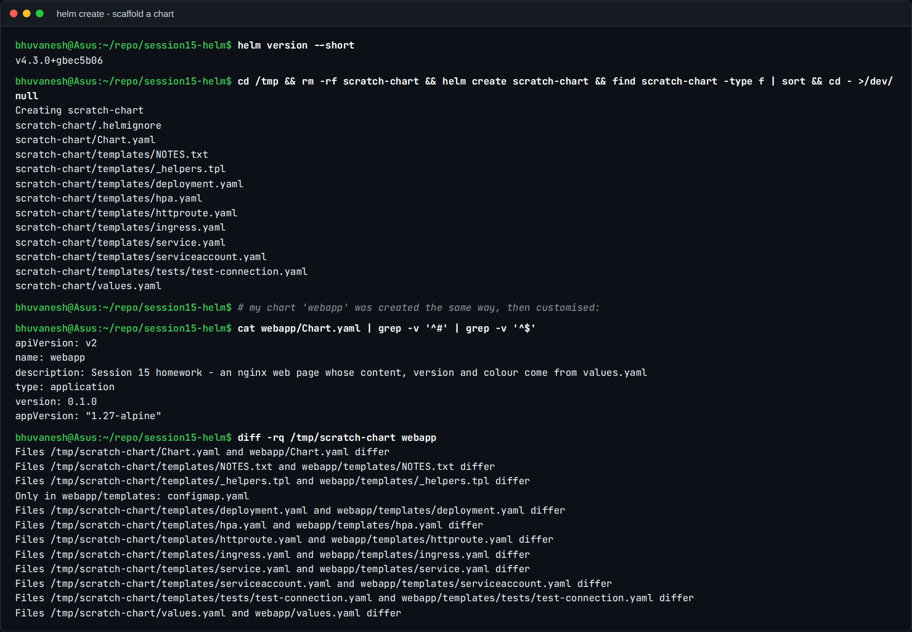

`helm create` generates a working chart: `Chart.yaml` (metadata), `values.yaml` (defaults),
and `templates/` with a Deployment, Service, ServiceAccount, HPA, Ingress, HTTPRoute, a
`_helpers.tpl` of naming and label functions, `NOTES.txt` (printed after install), and a
`tests/` Pod. The `diff` shows that my `webapp` chart started from this, with
`configmap.yaml` as the one new file.

### `helm lint` and `helm template` (before installing)

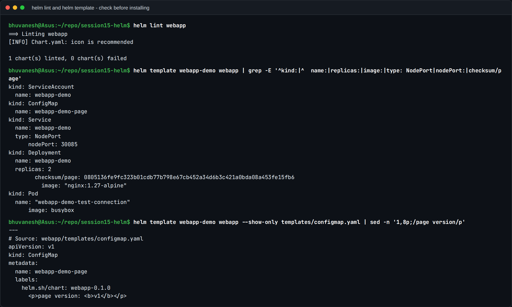

- `lint`: `1 chart(s) linted, 0 chart(s) failed`. The only note is that an icon is
  recommended.
- `template` renders the YAML **locally without touching the cluster**, the quickest way to
  check that `{{ }}` expressions produce what you expect: `replicas: 2`, `nodePort: 30085`,
  image `nginx:1.27-alpine` (from `appVersion`), and the checksum annotation.
  `--show-only` renders a single template.

### `helm install`

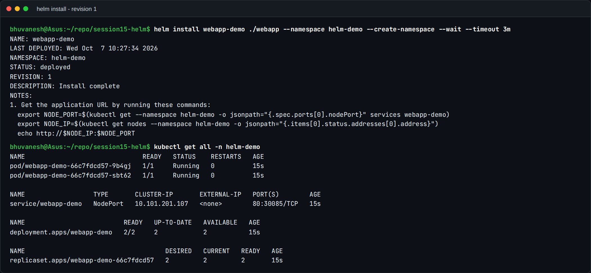

`helm install webapp-demo ./webapp -n helm-demo --create-namespace --wait`: release name,
chart path, a namespace created on demand, and `--wait` so Helm only reports success once
the Pods are Ready. Helm prints `STATUS: deployed`, `REVISION: 1` and the chart's NOTES.

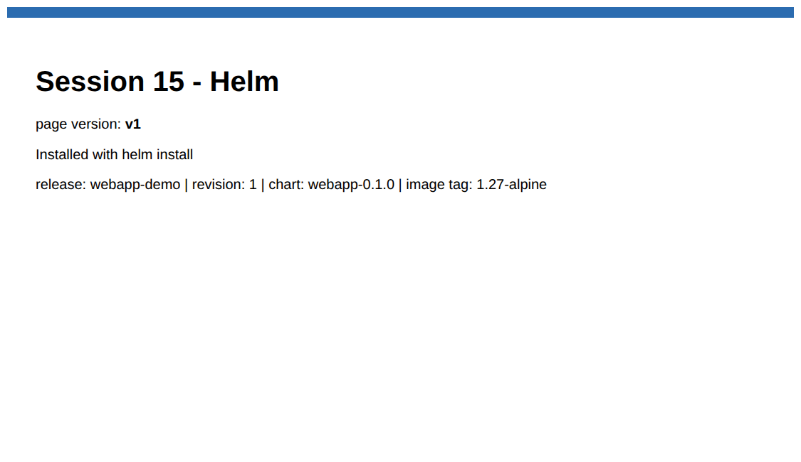

### `helm list` and `helm status`

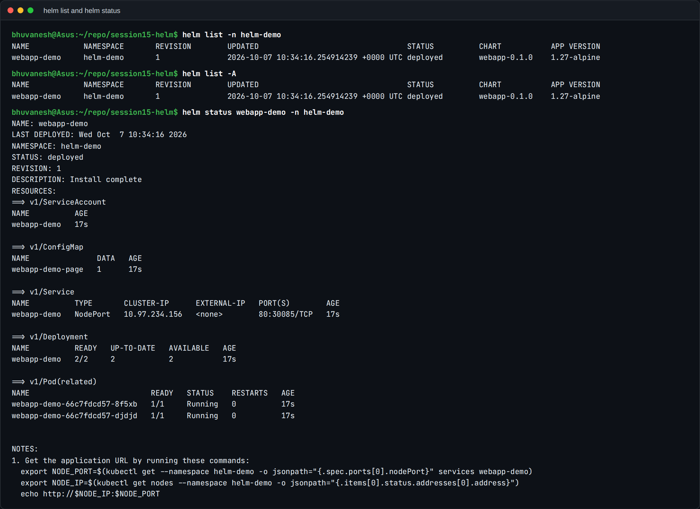

`list` shows the releases in a namespace (`-A` for all): name, revision, status, chart and
app version. `status` shows one release in detail, including the live resources it owns and
the NOTES.

### `helm get`

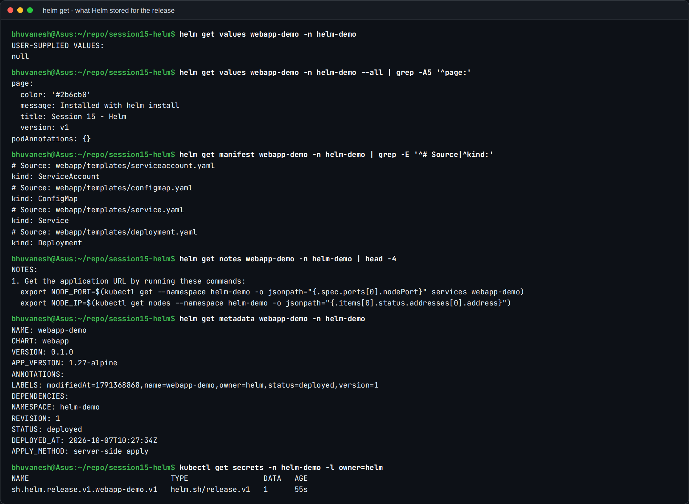

- `get values` shows only the **user-supplied** values (`null` after a plain install), while
  `--all` merges in the chart defaults.
- `get manifest` is exactly the YAML Helm applied; `get notes` and `get metadata` give the
  rest. Helm 4 also reports `APPLY_METHOD: server-side apply`.
- **Where Helm keeps all this:** a Secret named `sh.helm.release.v1.webapp-demo.v1`, of type
  `helm.sh/release.v1`, in the release's namespace. There's one per revision, and that's what
  `history` and `rollback` read.

### `helm repo` and `helm search`

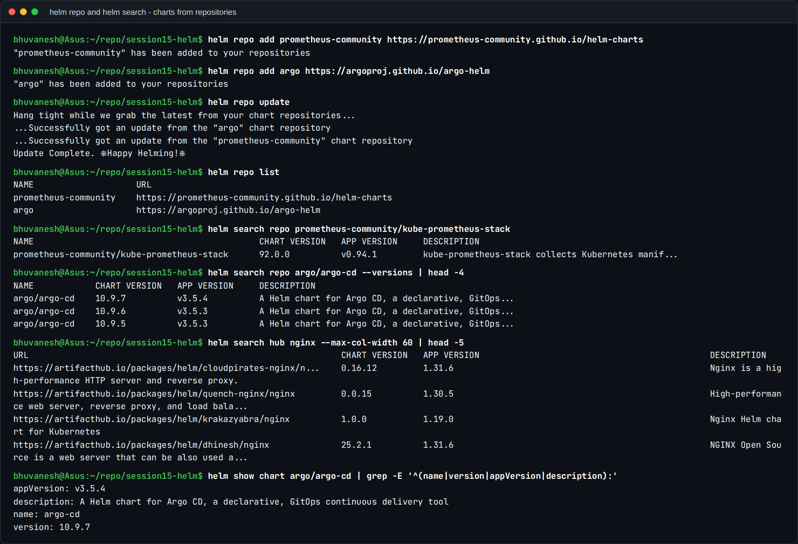

- `repo add` registers chart repositories (prometheus-community and argo, which I'll use in
  Session 20), `repo update` refreshes their indexes, and `repo list` shows them.
- `search repo` searches the added repos: `kube-prometheus-stack` 92.0.0, and `argo/argo-cd`
  10.9.7 (app v3.5.4), with `--versions` for older releases.
- `search hub` searches **Artifact Hub**, the public catalogue, without adding a repo.
  `show chart` prints a chart's metadata before installing it.

`upgrade`, `history`, `rollback`, `test` and `uninstall` are shown in Task 2.

---

## Task 2: The rollback workflow

```
install (rev 1, v1)  ->  upgrade -f values-v2 (rev 2, v2)  ->  verify
                     ->  upgrade -f values-v3 (rev 3, v3)  ->  verify
                     ->  rollback to 2        (rev 4 = copy of rev 2)  ->  verify
```

### 1. Install, then verify

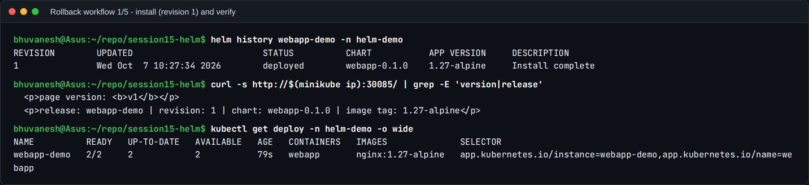

`history` shows a single revision, `Install complete`. `curl` on the NodePort returns
`page version: v1 ... revision: 1`, and the Deployment runs 2 replicas of `nginx:1.27-alpine`.

### 2. Upgrade to v2, then verify

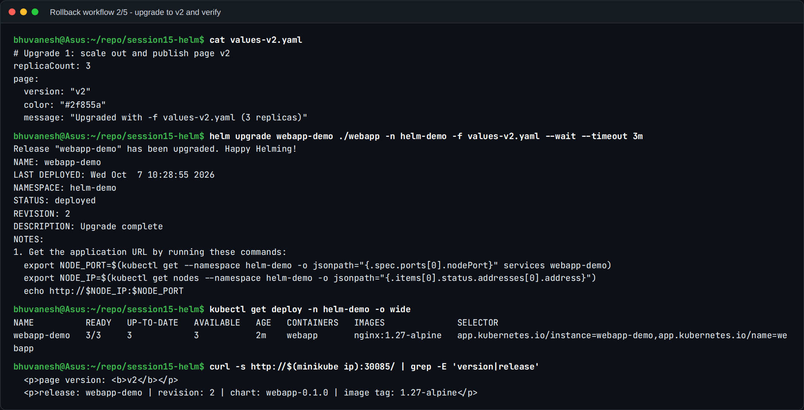


`helm upgrade -f values-v2.yaml` gives `REVISION: 2`. The Deployment is now `3/3`, and the
page says **v2** in green. The Pods rolled even though the image didn't change, thanks to
the checksum annotation.

### 3. Upgrade again to v3, then verify

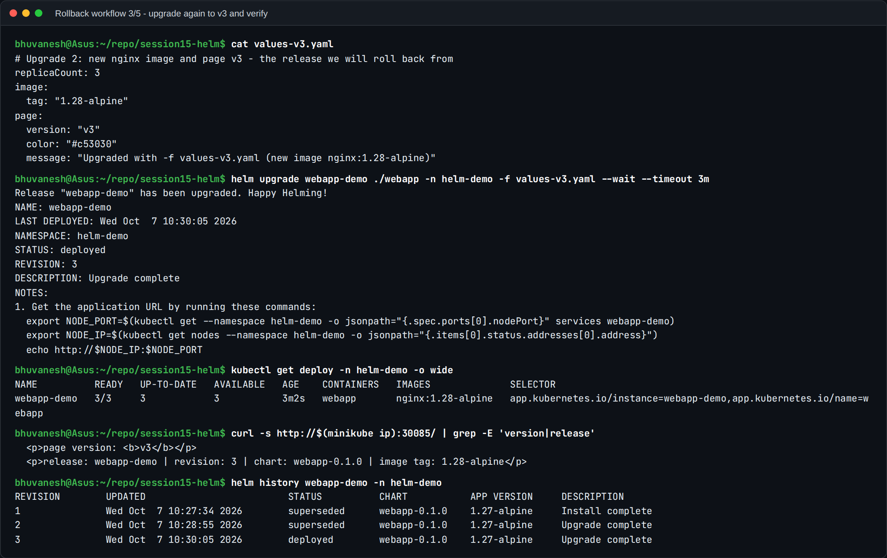

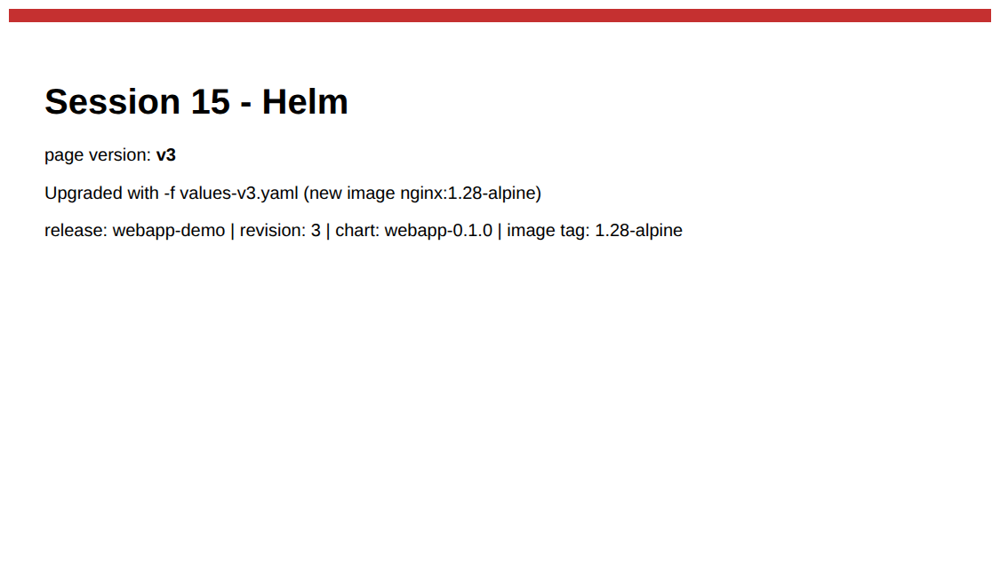

`REVISION: 3`. The image is now **`nginx:1.28-alpine`** and the page shows **v3** in red.
`history` lists revisions 1 and 2 as `superseded` and 3 as `deployed`.

### 4. Rollback to revision 2

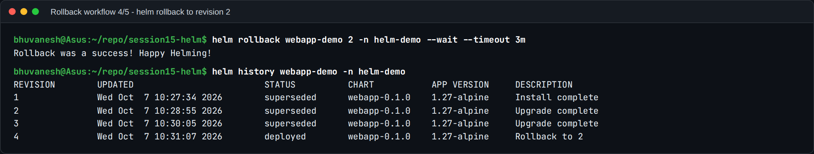

`Rollback was a success!` The key detail in `history` is that the rollback didn't delete
revision 3 or rewind the counter. It created **revision 4**, described as **`Rollback to 2`**.
History is append-only, so a rollback is itself an auditable event, and you can roll back the
rollback.

### 5. Verify

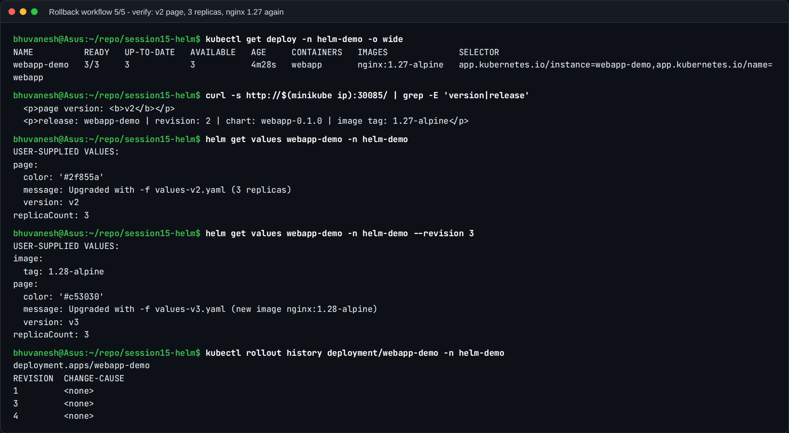

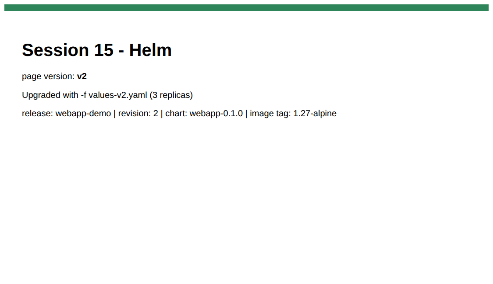

- The Deployment is back on **`nginx:1.27-alpine`** with 3 replicas, and the page is **v2**
  in green again. The image and the config were both restored, because Helm rolls back the
  **whole release**, not just one field.
- The page says `revision: 2`, not 4. That's correct, and it shows what a rollback actually
  is: Helm re-applies the **stored manifest of revision 2** exactly as it was rendered then,
  including the `{{ .Release.Revision }}` it baked in at the time.
- `get values` (current) shows the v2 values, while `get values --revision 3` still shows
  the v3 values. Every revision's inputs are kept.
- `kubectl rollout history` shows the Deployment's own revisions (1, 3, 4). Kubernetes reused
  ReplicaSet revision 2's template for the rollback, so it was renumbered. Helm history and
  Deployment history are separate things.

### `helm test` and `helm uninstall`

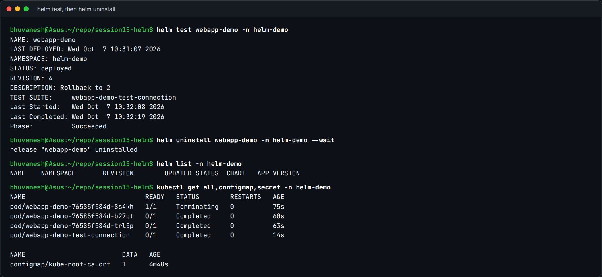

`helm test` ran the chart's `test-connection` Pod (a busybox `wget` against the Service):
`Phase: Succeeded`. `helm uninstall --wait` removed the release; afterwards `helm list` is
empty, and only Pods still finishing termination and the namespace's default
`kube-root-ca.crt` remain. The release Secrets are gone too.

---

## Task 3: Mini project (`notes-chart`)

The class mini project, built exactly as in the brief:
[03-mini-project/notes-chart](03-mini-project/notes-chart). It's nginx representing a Notes
app, a ConfigMap injected with `envFrom`, a NodePort Service on 30090, and `values.yaml`
(development: 1 replica, nginx 1.24) vs `values-prod.yaml` (production: 3 replicas, nginx 1.25).

### Steps 8-9: lint and render

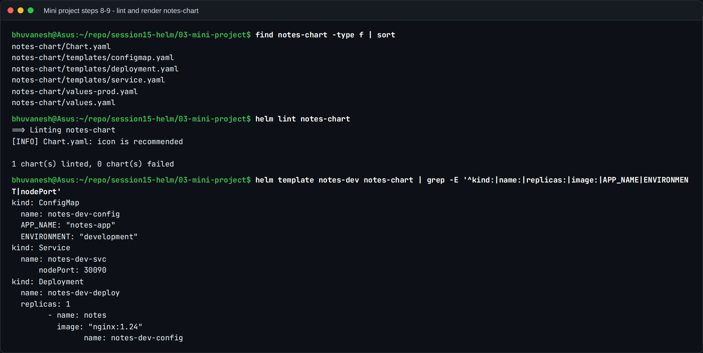

Lint passes, and `helm template` shows every `{{ }}` replaced: `notes-dev-config`,
`notes-dev-svc` with `nodePort: 30090`, and `notes-dev-deploy` with `replicas: 1` and
`nginx:1.24`.

### Step 10: install (development)

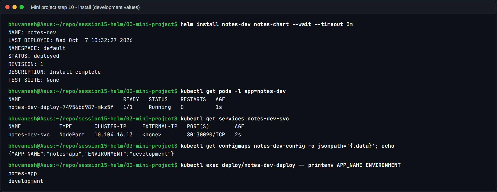

One Pod Running, the Service on `80:30090`, and the ConfigMap data **inside the container**:
`APP_NAME=notes-app`, `ENVIRONMENT=development`.

### Steps 11-12: upgrade to production values, history

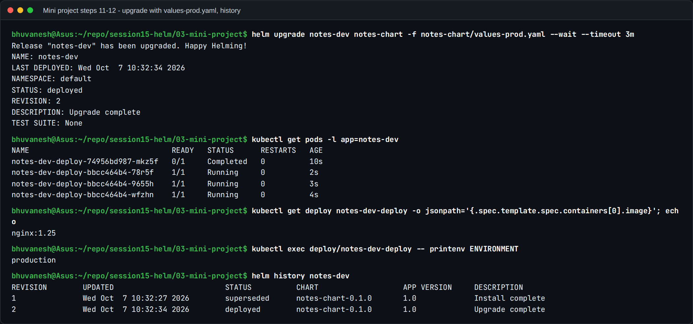

Three new Pods on `nginx:1.25`, with `ENVIRONMENT=production`. History shows revision 1
`superseded` and revision 2 `deployed`.

### Step 13: simulate a bad upgrade

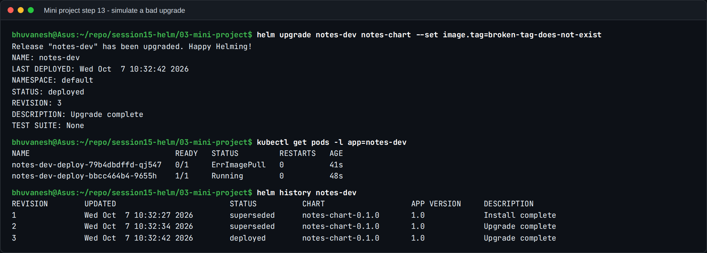

The most important lesson of the mini project: **Helm reported `STATUS: deployed` for a
broken release.** Without `--wait`, Helm only checks that the API server **accepted** the
manifests, not that the Pods start. The new Pod is in `ErrImagePull`.

Two more details from the real output:

- One **old** Pod (`bbcc464b4-9655h`) is still serving. The Deployment's rolling update won't
  remove old Pods until new ones are Ready, so the app stayed partly up.
- Because `--set` was used **without** `-f values-prod.yaml` or `--reuse-values`, this
  upgrade also silently reset the release to the chart's default values (1 replica,
  development). `helm upgrade` starts from the chart defaults each time unless told
  otherwise.

### Steps 14-15: rollback to revision 2, then clean up

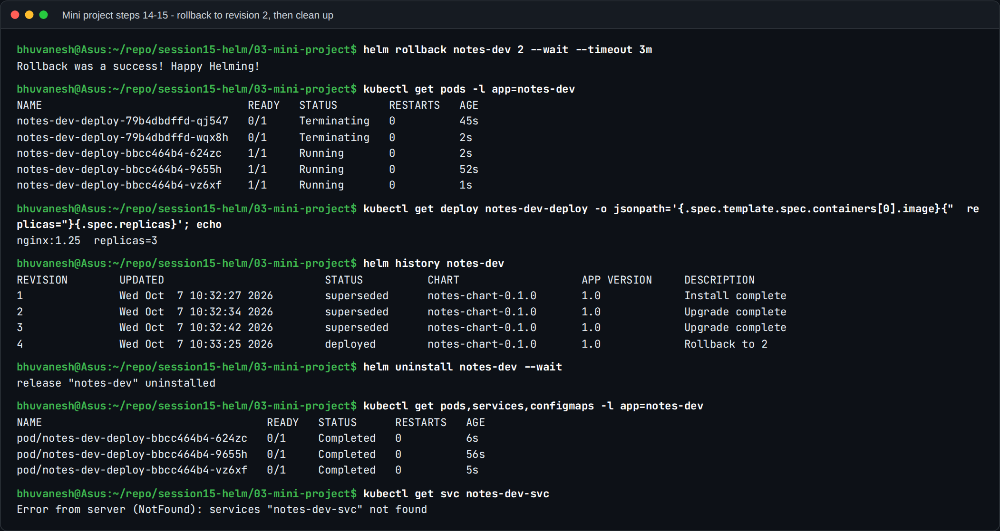

`helm rollback notes-dev 2` creates revision 4, `Rollback to 2`. The broken Pods are
`Terminating`, and three healthy Pods run `nginx:1.25` with `replicas=3`: the full
production configuration, not just the image, is back. `helm uninstall` then removed the
Deployment, Service and ConfigMap (`services "notes-dev-svc" not found`).

| What I practised | Result |
| --- | --- |
| Created a Helm chart from scratch | `notes-chart` lints with 0 failures |
| Used `values.yaml` and `values-prod.yaml` | dev: 1 × nginx 1.24 / prod: 3 × nginx 1.25 |
| Deployed with `helm install` | revision 1, Running |
| Upgraded with different values | revision 2, 3 Pods, `ENVIRONMENT=production` |
| Simulated a bad upgrade | revision 3 "deployed" but `ErrImagePull` |
| Rolled back to a healthy revision | revision 4 = Rollback to 2, all healthy |
| Cleaned up with `helm uninstall` | all resources gone |

## What I learned

1. **A chart is a template plus defaults; a release is a chart plus values plus a revision
   history** stored as Secrets in the cluster.
2. **Always use `--wait` (or `--atomic`, which rolls back automatically) in pipelines.** Without
   it, "deployed" only means "accepted by the API server", as the mini project's broken
   revision 3 shows.
3. **Rollbacks create new revisions and restore everything**: image, replicas, config. They
   do it by re-applying the stored rendered manifest, not by recomputing the old values.
4. **`helm upgrade` doesn't remember your earlier `-f` files.** Pass the same values files
   every time, or use `--reuse-values` deliberately.
5. **Config-only changes need the checksum-annotation trick**, or the Pods never see the new
   ConfigMap.
