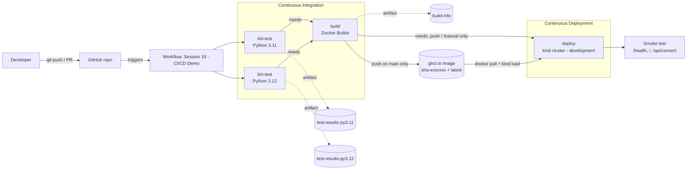

# Session 16 - CI/CD with GitHub Actions

| | |
|---|---|
| **Name** | Bhuvanesh M S |
| **Enrollment** | 24bcs10134 |
| **Topic** | Session 16 - CI/CD & GitHub Actions |
| **Workflow** | [`.github/workflows/session16-cicd.yml`](../.github/workflows/session16-cicd.yml) |
| **Image** | `ghcr.io/bhuvanesh66/session16-cicd-demo` |

## Overview

For this assignment I built a small **unit converter web API** in Python (Flask) and wrapped it
in a complete CI/CD pipeline on GitHub Actions. Every push to `main` that touches this folder:

1. **lints and tests** the code on Python 3.11 and 3.12 (CI),
2. **builds a Docker image** and pushes it to GitHub Container Registry (CI),
3. **deploys** that exact image to a Kubernetes cluster (a throwaway `kind` cluster on the runner)
   and smoke-tests it over HTTP (CD).

The session folders `01-ci-vs-cd` to `10-final-cicd-pipeline` ended with "test, then build an
artifact, then you are ready for CD". This project takes the next step they point at: the
artifact is a container image and the CD stage actually deploys it.

### The application

| Endpoint | What it returns |
|---|---|
| `GET /` | HTML page showing the app version and the git SHA it was built from |
| `GET /health` | `{"status": "ok", "version": ..., "git_sha": ..., ...}` - used by Docker `HEALTHCHECK` and Kubernetes probes |
| `GET /api/units` | Supported units per category (length, mass, temperature) |
| `GET /api/convert?category=length&value=5&from=km&to=mi` | The converted value, or HTTP 400 with an error message |

The version and SHA come from the `APP_VERSION` and `GIT_SHA` build args that the pipeline passes
to `docker build`, so the running pod itself shows which commit it came from.

## Pipeline diagram



On a **pull request** only the CI part runs: tests and an image build, but nothing is pushed and
nothing is deployed. On a **push to `main`** or a **manual run** the full CI + CD pipeline runs.

## Concepts, mapped to the workflow

Line numbers refer to [`.github/workflows/session16-cicd.yml`](../.github/workflows/session16-cicd.yml).

### CI vs CD

- **Continuous Integration (CI)** means every change is automatically built and tested so that
  broken code is caught right after it is pushed. Here that is the `lint-test` job
  ([L42-L126](../.github/workflows/session16-cicd.yml#L42-L126)) and the `build` job
  ([L129-L228](../.github/workflows/session16-cicd.yml#L129-L228)).
- **Continuous Delivery / Deployment (CD)** means a change that passed CI is automatically
  released to an environment. Here that is the `deploy` job
  ([L231-L351](../.github/workflows/session16-cicd.yml#L231-L351)): it deploys to the
  `development` environment with no manual approval, which is continuous *deployment*. Adding a
  required reviewer on the GitHub environment would turn it into continuous *delivery*
  (the release is ready, a human presses the button).
- The split is enforced by the condition on line 234: CD only runs on `push` or
  `workflow_dispatch`, never for pull requests.

### CI/CD pipeline

The pipeline is the chain `lint-test -> build -> deploy`. The order comes from `needs:`
(line 131 `needs: lint-test`, line 233 `needs: build`). If any test fails, `build` is skipped,
and therefore `deploy` is skipped as well - broken code can never reach the cluster. The build
job also passes the exact image reference to the deploy job through job `outputs`
(lines 137-139 -> line 243), so CD deploys exactly what CI built.

### GitHub Actions

GitHub Actions is the CI/CD service built into GitHub. It reads YAML files from
`.github/workflows/`, and runs them on events. The workflow reuses published actions with
`uses:` instead of writing everything by hand, for example `actions/checkout@v7` (line 52),
`actions/setup-python@v7` (line 55), `docker/build-push-action@v7` (line 179) and
`helm/kind-action@v1` (line 250).

### Workflow

The whole file is one workflow, named on line 7 (`Session 16 - CI/CD Demo`). Its triggers are in
`on:` (lines 9-20):

- `push` to `main` and `pull_request` against `main`, each with a `paths` filter so that only
  changes to `session16-cicd-github-actions/**` or the workflow file itself start a run (other
  homework folders in this repo do not trigger it);
- `workflow_dispatch` so I can start it manually from the Actions tab.

Workflow-level settings: default `permissions: contents: read` (lines 23-24), a `concurrency`
group so two runs for the same branch do not overlap (lines 27-29), shared `env` values
(lines 31-33) and `defaults.run.working-directory` (lines 35-38) so every `run:` step executes
inside this folder.

### Jobs

A job is a group of steps that runs on its own fresh runner. This workflow has three:

| Job | Lines | Stage | Runs when |
|---|---|---|---|
| `lint-test` | [42-126](../.github/workflows/session16-cicd.yml#L42-L126) | CI | always (matrix: 2 parallel copies) |
| `build` | [129-228](../.github/workflows/session16-cicd.yml#L129-L228) | CI | after `lint-test` passes |
| `deploy` | [231-351](../.github/workflows/session16-cicd.yml#L231-L351) | CD | after `build`, only on push / manual run |

`lint-test` uses a **matrix** (lines 46-49) so the same job runs twice in parallel, once on
Python 3.11 and once on 3.12. Each job also asks only for the permissions it needs
(`packages: write` for `build` on line 136, `packages: read` for `deploy` on line 241).

### Steps

Steps are the individual commands inside a job, executed in order. A step either runs a shell
command (`run:`) or calls an action (`uses:`). For example in `lint-test`: checkout (line 51),
set up Python (54), show runner info (61), install dependencies (68), lint (73), test (78),
write summary (87), upload artifact (119). Some steps have conditions: `if: always()` (line 88)
writes the test summary even when tests fail, and `if: failure()` (line 328) only prints debug
information when the deploy breaks.

### Runners

Every job declares `runs-on: ubuntu-latest` (lines 44, 132, 235), which is a GitHub-hosted
Ubuntu virtual machine that is created for the job and thrown away afterwards. The step
"Show runner information" (lines 61-66) prints the runner OS, architecture, name and workspace.
The deploy job shows how much a runner can do: it has Docker preinstalled, so `helm/kind-action`
can start a full Kubernetes cluster inside it (lines 249-252).

### Secrets

Two kinds of secrets are used, and neither value is ever printed:

1. **`secrets.GITHUB_TOKEN`** - created automatically by GitHub for every run. The build job
   uses it to log in to `ghcr.io` and push the image (line 166); the deploy job uses it to pull
   the image back (line 259). Its power is limited by the `permissions:` blocks.
2. **`secrets.DEMO_API_KEY`** - a repository secret I created myself
   (Settings -> Secrets and variables -> Actions, or `gh secret set DEMO_API_KEY`).
   The step "Create Kubernetes Secret from repository secret" (lines 268-281) receives it as an
   environment variable, prints only its *length*, and turns it into a Kubernetes `Secret`.
   `k8s/deployment.yaml` injects that Secret into the pods as the `DEMO_API_KEY` env var, and
   the smoke test confirms the pod sees a value of the right length. If the secret is not set,
   the step emits a warning instead of failing. GitHub masks secret values as `***` in logs.

### Artifacts

Artifacts are files a job saves so they can be downloaded after the run (or used by later jobs).
Uploaded with `actions/upload-artifact`:

| Artifact | Uploaded at | Contents |
|---|---|---|
| `test-results-py3.11`, `test-results-py3.12` | lines 119-126 | `junit.xml` (JUnit test report) and `coverage.xml` (coverage report) |
| `build-info` | lines 223-228 | `build-info.txt`: version, commit, image, tags, digest |

The artifact names include `matrix.python-version` so the two matrix jobs do not collide.
The Docker image pushed to GHCR is the main deployable artifact of the pipeline.

### Build

The build job (lines 129-228) uses Docker Buildx with layer caching in the GitHub Actions cache
(`cache-from/cache-to: type=gha`, lines 189-190). `docker/metadata-action` generates the tags
`sha-<short-sha>` and, on the default branch, `latest` (lines 168-175).
`docker/build-push-action` builds from this folder's `Dockerfile` and passes `APP_VERSION`
(`1.0.<run number>`) and `GIT_SHA` as build args (lines 177-190). The image is only pushed when
the event is not a pull request (line 183).

The [`Dockerfile`](Dockerfile) is multi-stage (wheels are built in a `builder` stage), uses
`python:3.12-slim`, runs as a non-root user with numeric UID 10001, has a `HEALTHCHECK` on
`/health`, exposes port 8000 and serves the app with gunicorn.

### Test

The test step (lines 78-85) runs `pytest` with `pytest-cov`. There are 23 tests in
[`tests/`](tests): unit tests for the conversion logic (`test_converter.py`) and HTTP tests for
every endpoint using Flask's test client (`test_api.py`). Coverage must stay at or above 80 %
(`fail_under` in [`pyproject.toml`](pyproject.toml)), otherwise the job fails. Before the tests,
`ruff` checks lint and formatting (lines 73-76). After the tests, a small Python script reads
`junit.xml` and writes a table of passed / failed / skipped counts and the coverage percentage
into the run's **job summary** via `$GITHUB_STEP_SUMMARY` (lines 87-117).

There is a second level of testing in CD: the deploy job waits for the Kubernetes rollout
(readiness probes must pass, line 289) and then smoke-tests the live service through
`kubectl port-forward` (lines 291-319), checking `/health`, that `/` shows the commit SHA, and
`/api/convert`.

### Pipeline execution

1. I push a commit to `main` that changes something under `session16-cicd-github-actions/`.
2. GitHub matches the `push` trigger and the `paths` filter and queues the workflow.
3. Two `lint-test` jobs start in parallel on fresh runners; each uploads its test artifact and
   writes a summary.
4. When both pass, `build` builds the image, pushes `sha-<sha>` and `latest` to GHCR and uploads
   `build-info`.
5. `deploy` starts a kind cluster, pulls the image, creates the Secret, applies `k8s/`, waits for
   2/2 replicas, runs the smoke test and writes a deployment summary.
6. The run page shows the job graph, logs per step, summaries and downloadable artifacts.

Screenshots of real runs are in the [Pipeline execution screenshots](#pipeline-execution-screenshots)
section below.

## Run it locally

Requirements: Python 3.11+ and Docker.

```bash
cd session16-cicd-github-actions

# 1. Virtual environment and dependencies
python -m venv .venv
source .venv/bin/activate          # Windows PowerShell: .venv\Scripts\Activate.ps1
pip install -r requirements-dev.txt

# 2. Lint and test (same commands as the CI job)
ruff check .
ruff format --check .
pytest --cov --cov-report=term-missing

# 3. Run the app without Docker
python -m app.main                  # http://localhost:8000

# 4. Build and run the container
docker build --build-arg APP_VERSION=1.0.0-local --build-arg GIT_SHA=$(git rev-parse --short HEAD) \
  -t session16-cicd-demo:local .
docker run -d --name s16 -p 8000:8000 session16-cicd-demo:local
curl http://localhost:8000/health
curl "http://localhost:8000/api/convert?category=temperature&value=100&from=c&to=f"
docker ps --filter name=s16          # STATUS shows (healthy) after the HEALTHCHECK passes
docker rm -f s16
```

Deploying the same manifests to any cluster (for example minikube):

```bash
sed "s|IMAGE_PLACEHOLDER|ghcr.io/bhuvanesh66/session16-cicd-demo:latest|" k8s/deployment.yaml | kubectl apply -f -
kubectl apply -f k8s/service.yaml
kubectl rollout status deployment/session16-cicd-demo
kubectl port-forward service/session16-cicd-demo 8080:80
```

## Project structure

```text
devops-heros/
├── .github/workflows/
│   └── session16-cicd.yml        # CI/CD workflow (lint-test -> build -> deploy)
└── session16-cicd-github-actions/
    ├── app/
    │   ├── __init__.py
    │   ├── converter.py          # pure conversion logic
    │   └── main.py               # Flask app: /, /health, /api/units, /api/convert
    ├── tests/
    │   ├── conftest.py           # Flask test client fixture
    │   ├── test_api.py           # HTTP endpoint tests
    │   └── test_converter.py     # unit tests for the conversion logic
    ├── k8s/
    │   ├── deployment.yaml       # 2 replicas, probes on /health, resources, Secret env
    │   └── service.yaml          # ClusterIP service on port 80 -> 8000
    ├── screenshots/              # pipeline execution screenshots
    ├── Dockerfile                # multi-stage, non-root, HEALTHCHECK, gunicorn
    ├── .dockerignore
    ├── .gitignore
    ├── pyproject.toml            # ruff, pytest and coverage settings
    ├── requirements.txt          # runtime dependencies (Flask, gunicorn)
    ├── requirements-dev.txt      # + pytest, pytest-cov, ruff
    └── README.md
```

## Pipeline execution screenshots

### Workflow run summary (all jobs green)

<!-- SHOT: 01-actions-run-summary -->

### CI - lint-test job

<!-- SHOT: 02-lint-test-job -->

### CI - build job

<!-- SHOT: 03-build-job -->

### CD - deploy job

<!-- SHOT: 04-deploy-job -->

### Artifacts

<!-- SHOT: 05-artifacts -->

### Image in GitHub Container Registry

<!-- SHOT: 06-ghcr-package -->

### Local tests

<!-- SHOT: 07-local-tests -->

### Local Docker run

<!-- SHOT: 08-local-docker -->
