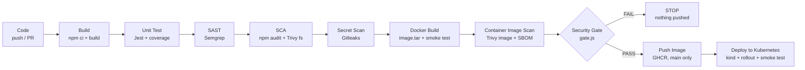

# Session 17 - Complete CI/CD & DevSecOps Pipeline

| | |
|---|---|
| **Name** | Bhuvanesh M S |
| **Enrollment** | 24bcs10134 |
| **Session** | 17 - Complete CI/CD & DevSecOps |
| **Workflow** | [`.github/workflows/session17-devsecops.yml`](../.github/workflows/session17-devsecops.yml) |
| **Image** | `ghcr.io/bhuvanesh66/session17-devsecops-api` |

## Overview

For this assignment I built a small **Node.js (Express) Notes REST API** and a GitHub Actions pipeline that takes it from a commit all the way to a running Kubernetes Deployment. Security checks run as stages of the pipeline itself:

- **CI/CD:** build, unit tests with coverage, a Docker image, GitHub Container Registry (GHCR), and a Kubernetes deployment.
- **Security:** SAST (Semgrep), SCA (npm audit + Trivy filesystem), secret scanning (Gitleaks), container image scanning (Trivy) and one **security gate** that makes the PASS/FAIL decision.

The image is pushed and deployed only after every check has passed.

I used Python in session 16, so this time I picked Node.js to show the same ideas in a different ecosystem: `npm audit` instead of `pip-audit`, and Jest instead of pytest.

## Pipeline flow



The gate also has the SAST, SCA and secret-scan jobs in its `needs`, so it reads every report, not only the image scan.

## Stage map

| # | Stage | Job id | Tool | Configuration | What fails the gate |
|---|---|---|---|---|---|
| 1 | Build | `build` | Node 22, `npm ci`, `scripts/build.js` | `package.json`, `package-lock.json` | build error (job fails) |
| 2 | Unit Test | `unit-test` | Jest 30 + supertest + jest-junit | `package.json` (`jest` block, 80 % line threshold) | any failing test or coverage below the threshold (job fails) |
| 3 | SAST | `sast` | Semgrep 1.179.0 (`p/javascript`, `p/nodejsscan` + custom rules) | `security/semgrep-rules.yml`, `.semgrepignore` | any finding with severity `ERROR`, or a Semgrep run/config error |
| 4 | SCA | `sca` | `npm audit` + Trivy `fs` (v0.75.0) | `package-lock.json`, `security/.trivyignore` | any HIGH or CRITICAL advisory/CVE |
| 5 | Secret Scan | `secret-scan` | Gitleaks v8.30.1 (current files + git history of this folder) | `security/.gitleaks.toml` | any secret at all |
| 6 | Docker Build | `docker-build` | Buildx, `docker/build-push-action` | `Dockerfile`, `.dockerignore` | build error or failed container smoke test (job fails) |
| 7 | Container Image Scan | `image-scan` | Trivy `image` + CycloneDX SBOM | `security/.trivyignore` | any HIGH or CRITICAL CVE, or an embedded secret in the image |
| 8 | Security Gate | `security-gate` | `security/gate.js` | the policy is in the script header | the single PASS/FAIL decision |
| 9 | Push Image | `push-image` | `docker/login-action`, `docker push` | - | runs only after a PASS, on `main` |
| 10 | Deploy to Kubernetes | `deploy` | kind (`helm/kind-action`), kubectl, kustomize | `k8s/*.yaml` | rollout not ready in 180 s or failed smoke test |

## Project structure

```text
session17-devsecops-pipeline/
├── src/
│   ├── app.js              # Express app: /, /health, /api/notes CRUD
│   ├── notesStore.js       # in-memory store + input validation
│   └── server.js           # HTTP listener + graceful SIGTERM shutdown
├── tests/app.test.js       # 14 Jest + supertest tests
├── scripts/
│   ├── build.js            # syntax check + dist/ + build-info.json
│   └── test-summary.js     # writes the test/coverage table to the job summary
├── security/
│   ├── semgrep-rules.yml   # 5 custom SAST rules
│   ├── .gitleaks.toml      # Gitleaks config (default rules + narrow allowlist)
│   ├── .trivyignore        # accepted-risk list (empty)
│   ├── gate.js             # the security gate
│   └── scan-local.sh       # run every scan locally with Docker
├── k8s/
│   ├── namespace.yaml      # Pod Security Admission "restricted"
│   ├── serviceaccount.yaml # no API token mounted
│   ├── deployment.yaml     # hardened Deployment (2 replicas)
│   ├── service.yaml        # ClusterIP
│   ├── networkpolicy.yaml  # default deny + allow HTTP in / DNS out
│   └── kustomization.yaml  # image tag is pinned by the pipeline
├── Dockerfile              # multi-stage, non-root, healthcheck
├── .dockerignore
├── .semgrepignore
├── .gitignore
├── package.json
└── package-lock.json
```

## The application

| Method | Path | Description |
|---|---|---|
| GET | `/` | service name, version and list of endpoints |
| GET | `/health` | `{"status":"ok","uptimeSeconds":N}`, used by Docker and Kubernetes probes |
| GET | `/api/notes` | list all notes |
| POST | `/api/notes` | create a note `{"title": "...", "body": "..."}` |
| GET | `/api/notes/:id` | get one note (`id` must be a UUID) |
| PUT | `/api/notes/:id` | update `title` and/or `body` |
| DELETE | `/api/notes/:id` | delete a note |

I also put a few security basics into the app itself:

- `helmet` sets the security headers.
- `x-powered-by` is disabled.
- JSON bodies are capped at 10 kb.
- Inputs are validated: title 1-100 characters, body up to 1000.
- Notes live in a `Map`, so user input never becomes an object key and prototype pollution is not possible.
- IDs must be UUIDs.
- A central error handler never returns stack traces.

Run it locally:

```bash
cd session17-devsecops-pipeline
npm ci
npm test            # 14 tests + coverage
npm start           # http://localhost:3000
curl http://localhost:3000/health
curl -X POST http://localhost:3000/api/notes -H 'Content-Type: application/json' -d '{"title":"hello"}'
```

## Dockerfile

- **Multi-stage.** The `deps` stage runs `npm ci --omit=dev --ignore-scripts`, so the final image has only the production dependencies (express, helmet) and no install scripts ever run.
- **Base image `node:22-alpine`** plus `apk upgrade --no-cache`. Every build picks up the latest Alpine security fixes. In my local build this upgraded `libcrypto3`/`libssl3` to 3.5.9-r0 and `zlib` to 1.3.2-r1.
- **npm, npx, corepack and yarn are removed** from the runtime image. The app never needs them, and their bundled dependencies are a common source of image-scan findings.
- **Non-root:** `USER node` (uid 1000). The app files stay owned by root, so the process can read them but not change them.
- `HEALTHCHECK` calls `/health` using Node's built-in `fetch`, so no curl/wget is needed in the image. The image runs `EXPOSE 3000`.
- `.dockerignore` keeps tests, reports, k8s files, `.env*` and `.git` out of the build context.

## Security tools explained

| Scan | What it looks at | Question it answers | Tool here |
|---|---|---|---|
| **SAST** (Static Application Security Testing) | **my own source code**, without running it | "Did I write insecure code?" e.g. `eval`, command injection, hard-coded keys | Semgrep |
| **SCA** (Software Composition Analysis) | **third-party dependencies** in `package-lock.json` | "Am I using a library version with a known CVE?" | npm audit, Trivy fs |
| **Secret scanning** | **every file and the git history**, looking for credentials | "Did someone commit a password, token or private key?" | Gitleaks |
| **Container image scanning** | **the final built image**: Alpine OS packages, the Node runtime, `node_modules` | "Is the thing I'm about to ship vulnerable, even if my code is clean?" | Trivy image |

Each layer catches something the others miss. Clean source code can still ship a vulnerable OpenSSL inside the base image, and a perfectly patched image can still contain a hard-coded API key. That is why the pipeline runs all four scans.

### SAST - Semgrep

The instructor demo used CodeQL. I picked Semgrep because it lets me write **project-specific rules** in plain YAML next to the code. It also runs as a single container, so the exact same command works on my laptop and in CI. The job uploads its SARIF to **Security > Code scanning** as well, so findings show up on the right file and line, as in the CodeQL lesson.

Rulesets: `p/javascript` and `p/nodejsscan` from the Semgrep registry, plus my custom `security/semgrep-rules.yml`:

| Rule | Severity | Catches |
|---|---|---|
| `s17-no-eval` | ERROR | `eval`, `new Function`, `vm.runIn*` (CWE-95) |
| `s17-child-process-shell-injection` | ERROR | `exec`/`execSync` called with a template literal or string concatenation (CWE-78); `execFile` with an argument array is allowed |
| `s17-hardcoded-credential` | ERROR | variables/properties named like `secret`, `password`, `apiKey`, `accessKey`... assigned a string literal (CWE-798) |
| `s17-jwt-hardcoded-secret` | ERROR | `jwt.sign/verify` with a literal secret (CWE-798) |
| `s17-express-error-leaks-stack` | WARNING | sending `err.stack` to the client (CWE-209) |

I tested the custom rules against a deliberately bad file outside the repo. They reported 8 findings: 2 hard-coded credentials, 2 eval/Function, 2 command injections, 1 JWT literal secret and 1 stack leak. The safe `execFile('ls', [dir])` call was correctly **not** flagged.

### SCA - npm audit + Trivy fs

- `npm audit` checks the full lockfile, dev dependencies included, against the GitHub Advisory Database.
- `trivy fs` checks the same lockfile against Aqua's vulnerability DB, using `--ignore-unfixed`. HIGH or CRITICAL from either tool fails the gate.

Today `npm audit` reports **19 moderate** advisories. All of them are in Jest's dev-only chain (`sprintf-js` via `argparse` -> `js-yaml` -> `@istanbuljs/load-nyc-config`). They have no upstream fix, they never reach the production image (`npm audit --omit=dev` reports **0**), and they are below the HIGH threshold, so the gate reports them without blocking.

### Secret scanning - Gitleaks

Gitleaks runs twice:

1. `gitleaks dir` on the current files of this folder.
2. `gitleaks git --log-opts="HEAD -- session17-devsecops-pipeline .github/workflows/session17-devsecops.yml"` on **every commit that touched this project**. A secret that was committed and then "deleted" is still in history and still counts as leaked.

Both scans are **scoped to this project on purpose**. This is a shared course repository, and other session folders contain intentionally fake demo credentials, for example the Kubernetes Secret examples from session 12. I checked: a history scan of those folders reports `generic-api-key` and `kubernetes-secret-yaml` findings, which would fail the gate for reasons unrelated to this project.

`security/.gitleaks.toml` extends the full default rule set (`useDefault = true`) and allowlists only generated paths (`node_modules/`, `coverage/`, `dist/`, `reports/`) and `package-lock.json`, which contains integrity hashes rather than secrets. Reports use `--redact`, so a real secret would never be printed in the Actions log.

GitHub's own secret scanning and push protection are a second layer on top of this.

### Container image scanning - Trivy

The `image-scan` job scans the **exact tar file** produced by `docker-build`:

- Vulnerabilities and embedded secrets, HIGH/CRITICAL, `--ignore-unfixed` -> JSON report for the gate.
- An all-severity table for the job log.
- SARIF, uploaded to code scanning.
- A **CycloneDX SBOM** (`sbom.cdx.json`), uploaded as an artifact, which lists everything inside the image.

Trivy is pinned to v0.75.0, and `aquasecurity/trivy-action` is pinned to a **full commit SHA** (v0.36.0). Pinning to a commit rather than a movable tag protects the pipeline from a re-pointed tag, which is exactly how the trivy-action supply-chain compromise worked in 2026.

## Security gate logic

Every scanner runs in **report-only mode** (`--exit-code 0`, `|| true` for npm audit) and uploads a JSON report. The `security-gate` job is then the **single decision point**. It downloads all `reports-*` artifacts and runs `node security/gate.js reports`:

| Check | Report | Blocks when |
|---|---|---|
| SAST | `semgrep.json` | any result with severity `ERROR`, or any Semgrep error (for example an invalid rules file, since Semgrep itself exits 0 in that case) |
| SCA | `npm-audit.json` | `metadata.vulnerabilities.high + critical > 0` |
| SCA | `trivy-fs.json` | any vulnerability with severity HIGH or CRITICAL |
| Secrets | `gitleaks-*.json` | any entry at all |
| Image | `trivy-image.json` | any HIGH/CRITICAL vulnerability or any embedded secret |
| All | - | a report is **missing, empty or not valid JSON**. If a scan did not run, the gate must not pass. |

The script writes a Markdown table with counts per tool and PASS/FAIL to the **job summary** (`$GITHUB_STEP_SUMMARY`). On failure it adds a list of the blocking findings (rule id + file:line, CVE + package + fixed version, secret rule + file:line + commit), then exits 1.

The gate job uses `if: ${{ !cancelled() }}`, so it still produces a summary when an earlier job failed. Since missing reports count as FAIL, this can never turn into an accidental pass.

Why one gate instead of `--exit-code 1` on each scanner (as in the lesson examples)?

1. **All tools always run**, so one failing run shows the full picture instead of stopping at the first scanner.
2. **The policy lives in one reviewed file**, which is easy to change, for example to also block on MEDIUM.
3. **The summary page explains why the pipeline stopped**, so nobody has to dig through each job log.

I tested the gate both ways. Against the real local reports it prints **PASS**. Against a copy where I injected a Semgrep `ERROR`, a HIGH npm advisory, a Gitleaks finding and a CRITICAL image CVE, and deleted `trivy-fs.json`, it printed **FAIL** for all five checks and exited 1.

## Why the scanned image tar is what gets pushed

A common mistake is to scan one build and push another. For example, the image is rebuilt in the push job, or pushed by a tag that someone else moved in between. Then the image in the registry was never actually scanned.

In this pipeline:

1. `docker-build` builds **once** with Buildx and exports the image to `image.tar` (`outputs: type=docker,dest=...`), tagged `:<commit-sha>` and `:latest`. It records the image ID as a job output, runs a container smoke test (read-only, all capabilities dropped, `/health`), and uploads the tar as an artifact.
2. `image-scan` scans **that tar file** (`input: image.tar`).
3. `push-image` downloads **the same tar** and runs `docker load`. It **checks that the image ID matches** the ID recorded at build time, and only then pushes.
4. `deploy` loads **the same tar** into the kind node.

Nothing is rebuilt after the scan, so the bytes that passed the gate are the bytes in GHCR and in the cluster. The push job also writes the pushed **digest** to the job summary.

Pushing happens only for `push` / `workflow_dispatch` on `main`. Pull requests run every check up to and including the gate, but never publish.

## Kubernetes deployment

### Where it deploys

The lesson notes point out that a GitHub-hosted runner cannot reach a cluster running on a student laptop. So the `deploy` job creates a throw-away **kind** cluster *inside the runner* (`helm/kind-action`). That gives a real, repeatable `kubectl apply` + `rollout status` in every run without storing a kubeconfig secret.

A new GHCR package is private by default. Instead of giving the cluster registry credentials, the job side-loads the scanned tar into the node with `kind load image-archive` (`imagePullPolicy: IfNotPresent`). The job runs in the GitHub **environment `development`**, so protection rules or reviewers can be added later without changing the workflow.

Steps:

1. Pin the image tag: `sed` sets `newTag: <commit-sha>` in `k8s/kustomization.yaml`. The deployment never runs `:latest`.
2. Run `kubectl apply -k k8s`.
3. Run `kubectl rollout status deployment/notes-api --timeout=180s`.
4. Smoke test through the Service: `kubectl port-forward svc/notes-api 8080:80`, then `GET /health`, `POST /api/notes`, `GET /api/notes`.
5. Show `kubectl get all`, the NetworkPolicies and the running image, and write them to the job summary. On failure, print describe/events/logs.

To deploy to a real cluster instead, replace the kind step with a kubeconfig from a secret (`azure/setup-kubectl` + `KUBE_CONFIG`, as in the lesson). The rest of the job stays the same.

### Manifest hardening

| Setting | Where | Why |
|---|---|---|
| `pod-security.kubernetes.io/enforce: restricted` | `namespace.yaml` | the API server **rejects** any pod in the namespace that does not meet the "restricted" Pod Security Standard |
| `runAsNonRoot: true`, `runAsUser: 1000` | pod `securityContext` | matches `USER node`; the container can never run as root |
| `allowPrivilegeEscalation: false`, `privileged: false` | container | no setuid tricks |
| `capabilities.drop: [ALL]` | container | the Node process needs no Linux capabilities |
| `readOnlyRootFilesystem: true` + `emptyDir` on `/tmp` (16 Mi) | container | an attacker cannot change binaries or drop files; only `/tmp` is writable |
| `seccompProfile: RuntimeDefault` | pod | blocks dangerous syscalls |
| `automountServiceAccountToken: false` + own ServiceAccount | pod / SA | the app never calls the Kubernetes API, so no token is mounted |
| requests 50m / 64Mi, limits 250m / 128Mi | container | the scheduler can place the pod, and one pod cannot starve the node |
| startup, readiness and liveness probes on `/health` | container | traffic only goes to ready pods; hung pods are restarted |
| `replicas: 2`, `maxUnavailable: 0`, `maxSurge: 1` | Deployment | zero-downtime rolling update |
| `terminationGracePeriodSeconds: 20` + SIGTERM handler | pod / `server.js` | in-flight requests finish before the pod stops |
| NetworkPolicy: default-deny + allow TCP 3000 in, DNS out | `networkpolicy.yaml` | the API makes no outbound calls, so it gets none |
| `ClusterIP` Service | `service.yaml` | nothing is exposed outside the cluster |

I validated the manifests locally with `kubeconform -strict` (6 resources, all valid) and `trivy config` (Kubernetes manifests + Dockerfile). Trivy config raised 0 HIGH/CRITICAL findings, no Dockerfile findings, and 2 MEDIUM findings on the Deployment:

- **KSV-0013 ("use an image tag").** The file says `:latest`, but the pipeline always replaces it with the commit SHA before applying.
- **KSV-0125 ("trusted registry").** This would need a cluster-wide registry allowlist policy, which is out of scope for this assignment.

## Running every scan locally

Everything runs in Docker containers, so no scanners need to be installed. These are the same tools and versions as CI:

```bash
cd session17-devsecops-pipeline
bash security/scan-local.sh      # all scans + Docker build + gate, reports in ./reports
```

Or run them one by one:

```bash
# Unit tests + coverage
npm ci && npm test

# SAST
docker run --rm -v "$PWD:/src" -w /src semgrep/semgrep:1.179.0 semgrep scan --metrics=off \
  --config p/javascript --config p/nodejsscan --config security/semgrep-rules.yml .

# SCA
npm audit --audit-level=high
docker run --rm -v "$PWD:/src" -w /src aquasec/trivy:0.75.0 fs --scanners vuln \
  --severity HIGH,CRITICAL --ignore-unfixed --ignorefile security/.trivyignore --skip-dirs node_modules .

# Secret scan
docker run --rm -v "$PWD:/repo" ghcr.io/gitleaks/gitleaks:v8.30.1 dir /repo \
  --config /repo/security/.gitleaks.toml --redact --verbose

# Docker build + run
docker build -t session17-devsecops-api:local .
docker run --rm -d --name s17 --read-only --cap-drop ALL -p 3000:3000 session17-devsecops-api:local
curl http://localhost:3000/health && docker rm -f s17

# Image scan + SBOM
docker run --rm -v /var/run/docker.sock:/var/run/docker.sock aquasec/trivy:0.75.0 image \
  --severity HIGH,CRITICAL --ignore-unfixed session17-devsecops-api:local
docker run --rm -v /var/run/docker.sock:/var/run/docker.sock -v "$PWD:/out" aquasec/trivy:0.75.0 image \
  --format cyclonedx --output /out/reports/sbom.cdx.json session17-devsecops-api:local

# Gate (after the scans above wrote JSON into ./reports, see scan-local.sh)
node security/gate.js reports

# Lint the workflow (run from the repository root)
docker run --rm -v "$PWD:/repo" -w /repo rhysd/actionlint:1.7.12 .github/workflows/session17-devsecops.yml
```

### My local results (before the first push)

| Check | Result |
|---|---|
| Unit tests | 14 passed, 0 failed; coverage lines 98.87 %, statements 98.92 %, functions 94.73 %, branches 89.65 % |
| `npm audit` | 0 high, 0 critical; 19 moderate (dev-only Jest chain, see SCA); `--omit=dev`: 0 |
| Semgrep | 187 rules on the JS files: 7 findings, all `INFO`. These are nodejsscan "good practice" confirmations that `helmet` is used, so 0 `ERROR` |
| Trivy fs | 0 HIGH/CRITICAL (and 0 vulnerabilities of any severity in `package-lock.json`) |
| Gitleaks | 0 leaks |
| Docker image | built, ran as `uid=1000(node)` with `--read-only --cap-drop ALL`, `/health` OK, healthcheck `healthy`, npm not present; 63.9 MB content size |
| Trivy image | Alpine 3.24.2 (18 apk packages) + 70 npm packages (the app and its production dependencies): **0 vulnerabilities of any severity**; SBOM has 89 components |
| Security gate | **PASS** (5/5 checks) |
| actionlint | 0 issues |
| kubeconform | 6 resources valid |

<!-- SHOT: 10-local-scans -->

## Proof the gate works

The gate exists to **stop** a bad change, so it should be shown failing. On a branch, add a fake secret and a vulnerable dependency, then open a pull request against `main` (pull requests never push or deploy):

```bash
git switch -c demo/gate-fail
cd session17-devsecops-pipeline

# 1) A fake hard-coded credential (not a real key). It is generated on the fly so that no
#    key-shaped literal is stored in this README - Gitleaks caught exactly that on the first run.
KEY=$(head -c 64 /dev/urandom | base64 | tr -dc 'A-Za-z0-9' | head -c 28)
printf "'use strict';\nconst paymentApiKey = '%s'; // DEMO ONLY - fake\nmodule.exports = { paymentApiKey };\n" "$KEY" > src/config.js

# 2) A dependency with a known HIGH vulnerability (lodash 4.17.20, command injection CVE-2021-23337)
npm install lodash@4.17.20 --save-exact

git add -A && git commit -m "demo: gate should fail" && git push -u origin demo/gate-fail
# open a PR to main and watch the Security Gate job
```

I checked locally that each part is detected by the tool it targets:

- The fake key is reported by Gitleaks (`generic-api-key`) and by my Semgrep rule `s17-hardcoded-credential` (severity ERROR).
- `npm audit` reports `lodash` as **high**.

So the expected gate result is FAIL on SAST, SCA (npm audit, and Trivy fs) and Secret scan. `push-image` and `deploy` do not run. Afterwards, close the PR without merging and delete the branch. The fake key only exists in that branch's history.

<!-- SHOT: 09-gate-fail -->

## Pipeline execution

Workflow run graph (all ten jobs in order):

<!-- SHOT: 01-run-graph -->

Unit tests and coverage (job summary):

<!-- SHOT: 02-unit-tests -->

SAST - Semgrep:

<!-- SHOT: 03-sast -->

SCA - npm audit + Trivy fs:

<!-- SHOT: 04-sca -->

Secret scan - Gitleaks:

<!-- SHOT: 05-secret-scan -->

Container image scan - Trivy:

<!-- SHOT: 06-image-scan -->

Security gate summary:

<!-- SHOT: 07-security-gate-summary -->

Deploy to Kubernetes - rollout + smoke test:

<!-- SHOT: 08-deploy -->

## Workflow details

- **Triggers:** `push` and `pull_request` to `main`, filtered to `session17-devsecops-pipeline/**` and the workflow file, plus `workflow_dispatch`.
- **Least privilege:** the workflow default is `contents: read`. Only `sast` and `image-scan` get `security-events: write` (SARIF upload), and only `push-image` gets `packages: write`.
- **Concurrency:** a newer run on the same ref cancels the older one.
- **Caching:** setup-node caches npm with `cache-dependency-path: session17-devsecops-pipeline/package-lock.json`, Buildx uses the GHA layer cache, and Trivy caches its DB.
- **Artifacts:** `build-dist`, `unit-test-reports` (JUnit + coverage), `reports-sast`, `reports-sca`, `reports-secrets`, `docker-image` (1 day), `reports-image` (incl. SBOM), `security-gate-result`.
- **Action versions** (latest majors as of October 2026, checked with `gh api .../releases/latest`, all on the Node 24 runtime):
  - `actions/checkout@v7`, `actions/setup-node@v7`
  - `actions/upload-artifact@v7`, `actions/download-artifact@v8`
  - `docker/setup-buildx-action@v4`, `docker/build-push-action@v7`, `docker/login-action@v4`
  - `github/codeql-action/upload-sarif@v4`, `helm/kind-action@v1`
  - `aquasecurity/trivy-action@<sha> # v0.36.0`
