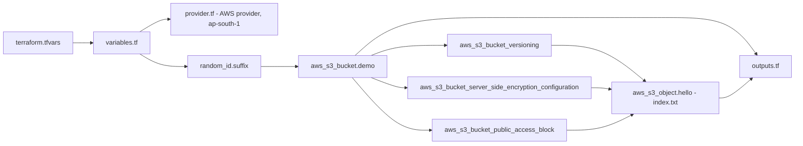

# Task 1 - Terraform S3 Demo

**Student:** Bhuvanesh M S | **Enrollment:** 24bcs10134 | **Session 18:** Terraform & Infrastructure as Code

In this task I used Terraform to create an Amazon S3 bucket in the `ap-south-1` (Mumbai) region and then walked through the complete Terraform workflow: `init`, `fmt`, `validate`, `plan`, `apply`, `show`, `output` and `destroy`.

The bucket is not just a bare bucket. I configured it the way a real bucket should be configured:

- a **globally unique name** (prefix + environment + random suffix)
- **versioning** enabled
- **default encryption** with SSE-S3 (AES256)
- **Block Public Access** with all four settings turned on
- one **sample object** (`index.txt`) uploaded by Terraform
- **default tags** (Project, Owner, Session, Environment, ManagedBy) applied to every resource

Everything stays inside the AWS Free Tier: a single private bucket holding one small text file.

---

## 1. Project structure

```text
terraform-s3-demo/
|-- provider.tf           # Terraform + provider version pins, AWS provider config
|-- variables.tf          # Input variables with types, descriptions, validation
|-- terraform.tfvars      # Actual values for the variables
|-- main.tf               # The resources (bucket, versioning, encryption, ...)
|-- outputs.tf            # Values printed after apply
|-- files/
|   `-- index.txt         # Sample file uploaded to the bucket
|-- .terraform.lock.hcl   # Exact provider versions (committed)
|-- .gitignore            # Ignores .terraform/, state files, crash logs
`-- README.md             # This file
```

### What each file does

| File | Purpose |
|------|---------|
| `provider.tf` | The `terraform {}` block requires Terraform CLI `>= 1.5.0` and pins the providers: `hashicorp/aws ~> 6.0` and `hashicorp/random ~> 3.6`. The `provider "aws"` block sets `region = var.aws_region` and `default_tags`. No credentials are written in code - Terraform reads them from the AWS CLI profile. |
| `variables.tf` | Declares `aws_region`, `bucket_prefix` and `environment`. Each has a `type`, a `description` and a `validation` block, so a bad value (for example an upper-case bucket prefix) fails before anything is sent to AWS. |
| `terraform.tfvars` | Supplies the values: `aws_region = "ap-south-1"`, `bucket_prefix = "bhuvanesh-devops-s18"`, `environment = "dev"`. Terraform loads this file automatically. |
| `main.tf` | Defines the resources (see the table below). |
| `outputs.tf` | Prints the bucket name, ARN, region, versioning status, object key, S3 URI and an AWS Console URL. |
| `files/index.txt` | The small text file that Terraform uploads into the bucket. |
| `.terraform.lock.hcl` | Created by `terraform init`. Records the exact provider versions and checksums so everyone gets the same providers. It is committed to Git. |
| `.gitignore` | Keeps `.terraform/`, `*.tfstate*`, `crash.log` and plan files out of Git. State files can contain sensitive data and must never be committed. |

### Resources in `main.tf`

| Resource | Why it is there |
|----------|-----------------|
| `random_id.suffix` | Generates 4 random bytes (8 hex characters). S3 bucket names are global across every AWS account, so the suffix avoids name clashes. |
| `aws_s3_bucket.demo` | The bucket itself. Name: `bhuvanesh-devops-s18-dev-<suffix>`. `force_destroy = true` lets `terraform destroy` delete it even though it contains an object and old versions. |
| `aws_s3_bucket_versioning.demo` | Turns versioning on (`Enabled`). |
| `aws_s3_bucket_server_side_encryption_configuration.demo` | Sets default encryption to SSE-S3 (`AES256`). |
| `aws_s3_bucket_public_access_block.demo` | Sets all four Block Public Access flags to `true`. |
| `aws_s3_object.hello` | Uploads `files/index.txt` as `index.txt`. The `etag = filemd5(...)` line makes Terraform re-upload the file if I edit it. |

> Since AWS provider v4, bucket settings such as versioning and encryption are separate resources instead of nested blocks inside `aws_s3_bucket`. That is why there are several small resources instead of one large one.

### How the pieces connect



Terraform works out this dependency graph by itself from the references (for example `bucket = aws_s3_bucket.demo.id`), so the bucket is always created first and destroyed last. I added an explicit `depends_on` to the object so it is uploaded only after versioning, encryption and the public access block are in place.

---

## 2. Prerequisites

| Tool | Check command |
|------|---------------|
| Terraform CLI 1.5 or newer | `terraform version` |
| AWS CLI v2 | `aws --version` |
| An AWS CLI profile with S3 permissions | `aws sts get-caller-identity --profile devops` |

I did not put any access keys in the Terraform code. I used a named AWS CLI profile and exported it before running Terraform:

```bash
export AWS_PROFILE=devops
export AWS_REGION=ap-south-1

aws sts get-caller-identity     # confirms which account/identity Terraform will use
```

In PowerShell the equivalent is `$env:AWS_PROFILE = "devops"` and `$env:AWS_REGION = "ap-south-1"`.

---

## 3. Terraform workflow

All commands are run from inside the `terraform-s3-demo/` folder.

```text
 write .tf files
       |
       v
 terraform init  -->  terraform fmt  -->  terraform validate
                                                |
                                                v
                                         terraform plan
                                                |
                                                v
                                         terraform apply  -->  real AWS resources
                                                |              + terraform.tfstate
                                                v
                               terraform show / terraform output
                                                |
                                                v
                                        terraform destroy
```

### Step 1 - `terraform init`

```bash
terraform init
```

**What it does:** Prepares the working directory. It downloads the `hashicorp/aws` and `hashicorp/random` providers into the hidden `.terraform/` folder and creates or reads `.terraform.lock.hcl`. Because no `backend` block is configured, state is stored locally in `terraform.tfstate`.

**What to look for:**
- lines saying it is installing `hashicorp/aws` (a 6.x version) and `hashicorp/random` (a 3.x version)
- a note about the dependency lock file
- the final green message saying Terraform has been successfully initialized

<!-- SHOT: 01-init -->

### Step 2 - `terraform fmt` and `terraform validate`

```bash
terraform fmt          # rewrite files into the standard style
terraform fmt -check   # only check; non-zero exit code if anything needs formatting
terraform validate     # check syntax, types and references
```

**What they do:**
- `fmt` rewrites `.tf` and `.tfvars` files into the canonical HashiCorp style (2-space indentation, aligned `=` signs). It prints the names of the files it changed, or nothing if every file was already formatted.
- `validate` checks the configuration for syntax errors, wrong argument names, wrong types and broken references. It does not contact AWS, so it works even without credentials.

**What to look for:**
- `terraform fmt` prints no file names (everything was already formatted)
- `terraform validate` prints the green `Success!` message saying the configuration is valid

<!-- SHOT: 02-fmt-validate -->

### Step 3 - `terraform plan`

```bash
terraform plan
```

**What it does:** Reads `terraform.tfvars`, checks the current state, compares the desired configuration with what already exists, and prints an execution plan. Nothing is changed in AWS.

**What to look for:**
- a `+` (create) symbol next to each of the six resources: `random_id.suffix`, `aws_s3_bucket.demo`, `aws_s3_bucket_versioning.demo`, `aws_s3_bucket_server_side_encryption_configuration.demo`, `aws_s3_bucket_public_access_block.demo` and `aws_s3_object.hello`
- `tags_all` on the bucket containing the default tags from `provider.tf` (Project, Owner, Session, Environment, ManagedBy)
- many values shown as `(known after apply)`, for example the bucket name, because the random suffix does not exist yet
- the summary line reporting 6 to add, 0 to change, 0 to destroy
- the "Changes to Outputs" section listing the outputs from `outputs.tf`

Optionally, the plan can be saved and exactly that plan applied later:

```bash
terraform plan -out=tfplan
terraform apply tfplan
```

<!-- SHOT: 03-plan -->

### Step 4 - `terraform apply`

```bash
terraform apply
```

**What it does:** Shows the plan again and asks for confirmation. After I type `yes`, Terraform creates the resources in dependency order and writes their real IDs and attributes into `terraform.tfstate`.

**What to look for:**
- the confirmation prompt, answered with `yes`
- `Creating...` and `Creation complete` lines for each resource: the random ID first, then the bucket, then the bucket settings, and the object last
- the summary line reporting 6 added, 0 changed, 0 destroyed
- the `Outputs:` section with the real bucket name (ending in an 8-character hex suffix), the ARN, `ap-south-1`, versioning status `Enabled`, object key `index.txt`, the S3 URI and the console URL
- a new `terraform.tfstate` file in the folder (ignored by Git)

<!-- SHOT: 04-apply -->

### Step 5 - `terraform show`

```bash
terraform show                          # human-readable view of the whole state
terraform state list                    # just the resource addresses
terraform state show aws_s3_bucket.demo # one resource in detail
```

**What it does:** `terraform show` prints everything Terraform recorded in the state file after apply. `terraform state list` lists the resource addresses, and `terraform state show <address>` prints a single resource.

**What to look for:**
- all six resources listed by `terraform state list`
- for the bucket: `arn`, `bucket`, `bucket_regional_domain_name`, `region = "ap-south-1"`, `force_destroy = true` and the `tags_all` map
- for the versioning resource: `status = "Enabled"`
- for the encryption resource: `sse_algorithm = "AES256"`
- for the object: `key = "index.txt"`, `content_type = "text/plain"`, an `etag` and a `version_id` (present because versioning is on)

<!-- SHOT: 05-show -->

### Step 6 - `terraform output`

```bash
terraform output                   # all outputs
terraform output bucket_name       # one output, in quotes
terraform output -raw bucket_name  # one output, no quotes (useful in scripts)
terraform output -json             # all outputs as JSON
```

**What it does:** Reads the output values from the state file without contacting AWS again.

**What to look for:** the same seven outputs that were printed at the end of `apply`. `-raw` prints the bucket name without quotes, which is how I pass it to the AWS CLI in the next step.

<!-- SHOT: 06-output -->

### Step 7 - Verify with the AWS CLI

Terraform says the bucket exists; this step checks it from the AWS side.

```bash
BUCKET=$(terraform output -raw bucket_name)

aws s3 ls | grep "$BUCKET"                            # bucket is listed
aws s3 ls "s3://$BUCKET/"                             # index.txt is inside
aws s3 cp "s3://$BUCKET/index.txt" -                  # print the file contents
aws s3api get-bucket-versioning   --bucket "$BUCKET"  # Status: Enabled
aws s3api get-bucket-encryption   --bucket "$BUCKET"  # SSEAlgorithm: AES256
aws s3api get-public-access-block --bucket "$BUCKET"  # all four flags true
aws s3api get-bucket-tagging      --bucket "$BUCKET"  # default tags
```

In PowerShell the first line is `$BUCKET = terraform output -raw bucket_name`.

**What to look for:**
- the bucket appears in `aws s3 ls` and contains `index.txt`
- `aws s3 cp ... -` prints the "Hello from Terraform!" text from `files/index.txt`
- versioning `Status` is `Enabled`
- encryption `SSEAlgorithm` is `AES256`
- `BlockPublicAcls`, `IgnorePublicAcls`, `BlockPublicPolicy` and `RestrictPublicBuckets` are all `true`
- the tag set includes `Owner = Bhuvanesh`, `Session = 18` and `ManagedBy = Terraform`

<!-- SHOT: 07-aws-cli-verify -->

### Step 8 - `terraform destroy`

```bash
terraform plan -destroy   # optional preview of what will be deleted
terraform destroy
```

**What it does:** Deletes every resource recorded in the state, in reverse dependency order: the object and the bucket settings first, then the bucket, then the random ID. `force_destroy = true` allows the bucket to be deleted even though it still holds object versions.

**What to look for:**
- a `-` (destroy) symbol next to all six resources
- the summary line reporting 0 to add, 0 to change, 6 to destroy
- the confirmation prompt, answered with `yes`
- `Destroying...` and `Destruction complete` lines
- the final message reporting 6 resources destroyed
- afterwards, `aws s3 ls` no longer lists the bucket and `terraform state list` prints nothing

<!-- SHOT: 08-destroy -->

---

## 4. Full command sequence

```bash
export AWS_PROFILE=devops
export AWS_REGION=ap-south-1
aws sts get-caller-identity

terraform init
terraform fmt
terraform validate
terraform plan
terraform apply
terraform show
terraform state list
terraform output
aws s3 ls "s3://$(terraform output -raw bucket_name)/"
terraform destroy
```

---

## 5. Design decisions

- **No hard-coded credentials.** The AWS provider uses the standard credential chain (`AWS_PROFILE`, environment variables, IAM Identity Center/SSO, or an instance role). Nothing secret is stored in the repository.
- **Version pinning.** `~> 6.0` allows any 6.x release of the AWS provider but not 7.0, which could contain breaking changes. The lock file pins the exact version that was tested.
- **Random suffix.** The AWS provider's own `bucket_prefix` argument would also produce a unique name, but `random_id` gives a short, readable suffix that I control and that stays the same on every later plan.
- **Encryption and public access set explicitly.** Since January 2023, S3 encrypts all new objects with SSE-S3 by default, and since April 2023 new buckets have Block Public Access turned on by default. I still declare both in code so the configuration documents the intent and Terraform will detect and fix it if someone changes these settings by hand.
- **`force_destroy = true` is for the demo only.** On a real bucket I would leave it `false` so Terraform refuses to delete a bucket that still contains data.
- **Local state.** For a team project I would move state into a remote backend (for example an S3 backend with state locking) so it is shared, versioned and protected.

## 6. Troubleshooting

| Problem | Likely cause and fix |
|---------|----------------------|
| `No valid credential sources found` | `AWS_PROFILE` is not set or the profile is not configured. Run `aws configure --profile devops` (or `aws sso login --profile devops` for SSO profiles). |
| `BucketAlreadyExists` | The name is already taken globally. Change `bucket_prefix` or run `terraform apply -replace=random_id.suffix` to generate a new suffix. |
| `AccessDenied` on public access block or tagging calls | The IAM identity is missing S3 permissions such as `s3:PutBucketPublicAccessBlock` or `s3:PutBucketTagging`. |
| Validation error on `bucket_prefix` | The prefix contains upper-case letters, underscores or dots. Use lowercase letters, digits and hyphens only. |
| Destroy fails with `BucketNotEmpty` | `force_destroy` was not `true` in the last apply. Set it, run `terraform apply`, then `terraform destroy`. |
