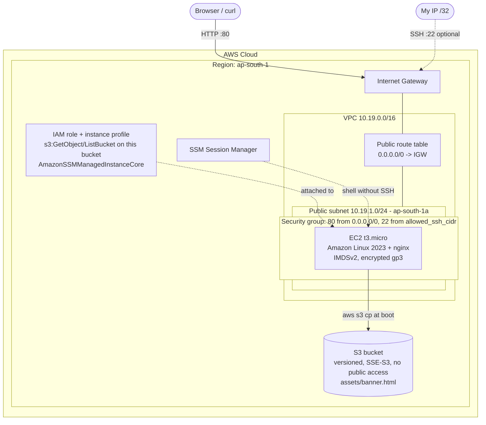
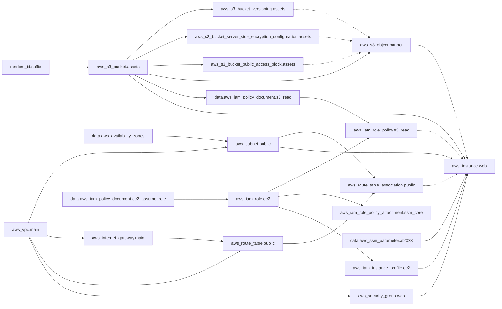

# Session 19 - Cloud & Terraform in Action

**Student:** Bhuvanesh M S | **Enrollment:** 24bcs10134 | **Session 19:** Cloud & Terraform in Action

## Overview

In this project I used Terraform to build a small but complete piece of AWS infrastructure in `ap-south-1` (Mumbai):

- a **VPC** (`10.19.0.0/16`) with a **public subnet**, an **Internet Gateway** and a **route table**
- a **security group** that allows HTTP from anywhere and SSH only from one IP address
- an **EC2 instance** (Amazon Linux 2023, `t3.micro`) that installs nginx at boot and serves a page
- a private, versioned, encrypted **S3 bucket** with one object (`assets/banner.html`)
- an **IAM role** that lets the instance read only that bucket, plus SSM Session Manager access

At boot the instance downloads the banner from S3 with its IAM role and puts it on the web page. That gives a real dependency chain: EC2 -> S3 object -> S3 bucket. The project covers providers, variables, resources, outputs, implicit and explicit dependencies, Terraform state, and the `plan` / `apply` / `destroy` workflow.

Everything is Free Tier friendly: one `t3.micro` with an 8 GiB gp3 volume, and one small S3 object.

---

## 1. Architecture



---

## 2. Project structure

```text
session19-terraform-cloud-project/
|-- versions.tf            # Terraform + provider version pins
|-- provider.tf            # AWS provider: region and default_tags
|-- variables.tf           # Input variables with validation blocks
|-- terraform.tfvars       # Values for the variables
|-- locals.tf              # Computed names, AZ lookup
|-- network.tf             # VPC, subnet, IGW, route table, association
|-- security.tf            # Web security group
|-- storage.tf             # random suffix, S3 bucket + settings, S3 object
|-- iam.tf                 # IAM role, S3 read policy, SSM policy, instance profile
|-- compute.tf             # AMI lookup (SSM parameter) and the EC2 instance
|-- outputs.tf             # Values printed after apply
|-- files/
|   |-- banner.html        # Uploaded to S3 as assets/banner.html
|   `-- user_data.sh.tftpl # Boot script template (nginx + aws s3 cp)
|-- .terraform.lock.hcl    # Exact provider versions (committed)
|-- .gitignore             # Ignores .terraform/, state files, plan files
`-- README.md
```

### File-by-file explanation

| File | What it does |
|------|--------------|
| `versions.tf` | Requires Terraform `>= 1.5.0` and pins `hashicorp/aws ~> 6.0` and `hashicorp/random ~> 3.6`. No backend block, so state is local. |
| `provider.tf` | Sets `region = var.aws_region` and `default_tags` (Project, Owner, Session, Environment, ManagedBy) that are added to every taggable resource. No credentials in code: I export `AWS_PROFILE=devops`. |
| `variables.tf` | Declares region, project name, environment, VPC and subnet CIDRs, AZ, `allowed_ssh_cidr`, instance type, root volume size, key name and bucket prefix. Validation blocks reject, for example, an SSH CIDR of `0.0.0.0/0`, a non-Free-Tier instance type or a root volume over 30 GiB. |
| `terraform.tfvars` | The values I use. `allowed_ssh_cidr` is a documentation placeholder (`203.0.113.10/32`) that has to be replaced with my own IP before SSH works. |
| `locals.tf` | Builds `name_prefix` (`s19-cloud-project-dev`), the bucket name with the random suffix, the object key, and picks the AZ (variable or first available AZ via `data.aws_availability_zones`). |
| `network.tf` | `aws_vpc.main` (DNS hostnames on), `aws_subnet.public` (`map_public_ip_on_launch = true`), `aws_internet_gateway.main`, `aws_route_table.public` with `0.0.0.0/0 -> IGW`, and `aws_route_table_association.public`. |
| `security.tf` | `aws_security_group.web`: port 80 from `0.0.0.0/0`, port 22 only from `var.allowed_ssh_cidr`, all egress. |
| `storage.tf` | `random_id.suffix`, `aws_s3_bucket.assets` (`force_destroy = true` for the demo), versioning, SSE-S3 encryption, public access block, and `aws_s3_object.banner`. |
| `iam.tf` | Role that EC2 can assume, an inline policy allowing only `s3:ListBucket` on the bucket and `s3:GetObject` on its objects, the AWS managed `AmazonSSMManagedInstanceCore` policy, and the instance profile. |
| `compute.tf` | Reads the latest AL2023 AMI from the public SSM parameter and creates `aws_instance.web`: IMDSv2 required, encrypted 8 GiB gp3 root volume, standard CPU credits, no key pair by default, and `user_data` rendered from the template. |
| `outputs.tf` | VPC, subnet, AZ, security group, instance ID, AMI, public IP, website URL, bucket name, object S3 URI and an `aws ssm start-session` command. |
| `files/user_data.sh.tftpl` | Installs nginx, reads instance ID / AZ / type via IMDSv2, copies the banner from S3 (with retries), and writes `index.html` ending with "Provisioned by Terraform - Session 19 - Bhuvanesh M S". |
| `files/banner.html` | Small HTML fragment that Terraform uploads to S3. |

---

## 3. Concepts mapped to the code

### Providers
`versions.tf` tells Terraform which plugins to download (`aws`, `random`) and which versions are allowed; `provider.tf` configures the AWS one. `terraform init` downloads them and records exact versions and checksums in `.terraform.lock.hcl`.

### Variables
`variables.tf` declares inputs with types, defaults and validation. `terraform.tfvars` is loaded automatically. A value can also be overridden on the command line, for example `terraform plan -var="allowed_ssh_cidr=198.51.100.7/32"`. Locals (`locals.tf`) are internal computed values, not inputs.

### Resources and data sources
Resources (`resource "aws_vpc" "main"`) are things Terraform creates and manages. Data sources (`data "aws_ssm_parameter" "al2023"`, `data "aws_availability_zones" "available"`, the two `aws_iam_policy_document`s) only read information.

The plan should create **17 resources**:

| Group | Resources | Count |
|-------|-----------|-------|
| Network | `aws_vpc.main`, `aws_subnet.public`, `aws_internet_gateway.main`, `aws_route_table.public`, `aws_route_table_association.public` | 5 |
| Security | `aws_security_group.web` | 1 |
| Storage | `random_id.suffix`, `aws_s3_bucket.assets`, `aws_s3_bucket_versioning.assets`, `aws_s3_bucket_server_side_encryption_configuration.assets`, `aws_s3_bucket_public_access_block.assets`, `aws_s3_object.banner` | 6 |
| IAM | `aws_iam_role.ec2`, `aws_iam_role_policy.s3_read`, `aws_iam_role_policy_attachment.ssm_core`, `aws_iam_instance_profile.ec2` | 4 |
| Compute | `aws_instance.web` | 1 |

### Outputs
`outputs.tf` exposes the useful IDs and the `website_url`. After apply they are stored in state and can be read with `terraform output` without calling AWS again.

### Implicit vs explicit dependencies
**Implicit:** when one resource references another's attribute, Terraform orders them automatically. Example: `aws_subnet.public` uses `vpc_id = aws_vpc.main.id`, so the VPC is created first and destroyed last.

**Explicit (`depends_on`):** used where a dependency exists but no attribute is referenced:

- `aws_instance.web` depends on `aws_s3_object.banner`, `aws_iam_role_policy.s3_read` and `aws_route_table_association.public`. The boot script copies the object from S3 using the role's permissions over the internet route, but the instance block only references the bucket name and a local key, so Terraform could otherwise start the instance before the object, the policy or the route exist.
- `aws_s3_object.banner` depends on the bucket versioning, encryption and public access block resources, so the object is versioned and encrypted from the first upload.

Dependency graph derived from the code (solid = attribute reference, dashed = `depends_on`):



`terraform graph` prints the same graph in DOT format.

### Terraform state
After `apply`, Terraform writes `terraform.tfstate`: a JSON file mapping each resource address (for example `aws_instance.web`) to the real AWS object (`i-...`) with all its attributes, plus output values and the provider used. On the next `plan` Terraform refreshes this state and compares it with the code to work out what to change.

I do not commit it (`.gitignore` excludes `*.tfstate*`) because it contains real account IDs, IPs and ARNs, can contain secrets in other projects, and two people with separate local copies would overwrite each other's changes.

The next step for a team would be a remote backend: state in a versioned, encrypted S3 bucket with locking (`use_lockfile = true` in recent Terraform versions, or a DynamoDB table in older setups), so everyone shares one state and two applies cannot run at once.

---

## 4. Prerequisites

| Tool | Check |
|------|-------|
| Terraform 1.5 or newer | `terraform version` |
| AWS CLI v2 | `aws --version` |
| AWS profile with VPC, EC2, IAM and S3 permissions | `aws sts get-caller-identity` |
| Session Manager plugin (only for `aws ssm start-session`) | `session-manager-plugin --version` |

```bash
export AWS_PROFILE=devops
export AWS_REGION=ap-south-1
aws sts get-caller-identity
```

In PowerShell: `$env:AWS_PROFILE = "devops"` and `$env:AWS_REGION = "ap-south-1"`.

Before applying, I set `allowed_ssh_cidr` in `terraform.tfvars` to my own IP (`curl https://checkip.amazonaws.com`, then add `/32`). This is only needed for SSH; SSM Session Manager works without port 22.

---

## 5. Command workflow

All commands are run inside `session19-terraform-cloud-project/`.

### Step 1 - `terraform init`

```bash
terraform init
```

Downloads the `aws` (6.x) and `random` (3.x) providers into `.terraform/` and uses `.terraform.lock.hcl`.

**Look for:** the provider install lines and "Terraform has been successfully initialized!".

<!-- SHOT: 01-init -->

### Step 2 - `terraform fmt` and `terraform validate`

```bash
terraform fmt -recursive
terraform fmt -check -recursive
terraform validate
```

`fmt` rewrites files into the standard style; `validate` checks syntax, types and references without calling AWS.

**Look for:** no file names printed by `fmt -check`, and "Success! The configuration is valid."

<!-- SHOT: 02-fmt-validate -->

### Step 3 - `terraform plan`

```bash
terraform plan -out=tfplan
```

Reads the data sources (AMI ID, AZs), compares the code with the (empty) state and saves the plan to `tfplan`. Nothing is created yet.

**Look for:**
- `+ create` for the 17 resources listed in section 3
- `Plan: 17 to add, 0 to change, 0 to destroy.`
- `(known after apply)` for IDs, the public IP and the bucket name
- `metadata_options` with `http_tokens = "required"`, the encrypted gp3 `root_block_device`, and `tags_all` containing the default tags
- the "Changes to Outputs" section

<!-- SHOT: 03-plan -->

### Step 4 - `terraform apply`

```bash
terraform apply tfplan
```

Applying a saved plan does not ask for confirmation, because the plan was already reviewed. Terraform creates resources in dependency order and writes `terraform.tfstate`.

**Look for:**
- VPC and bucket created early, the S3 object after the bucket settings, and `aws_instance.web` last
- `Apply complete! Resources: 17 added, 0 changed, 0 destroyed.`
- the `Outputs:` block with `public_ip`, `website_url`, `bucket_name` and `banner_object_uri`

<!-- SHOT: 04-apply -->

### Step 5 - Inspect the state

```bash
terraform state list
terraform state show aws_instance.web
terraform state show aws_s3_bucket.assets
```

**Look for:** all 17 resource addresses plus the data sources (`data.aws_ssm_parameter.al2023` and so on); for the instance, `instance_state = "running"`, the `public_ip`, `subnet_id`, `vpc_security_group_ids` and `http_tokens = "required"`.

<!-- SHOT: 05-state -->

### Step 6 - `terraform output`

```bash
terraform output
terraform output -raw website_url
```

Reads output values from the state.

**Look for:** the same values printed at the end of apply.

<!-- SHOT: 06-output -->

### Step 7 - Open the website

The instance needs a minute or two after apply to install nginx.

```bash
curl "$(terraform output -raw website_url)"
```

**Look for:** the instance ID, AZ, bucket name, the "Hello from Amazon S3" banner (this proves the EC2 -> S3 download through the IAM role worked) and the line "Provisioned by Terraform - Session 19 - Bhuvanesh M S". I also open the URL in a browser.

<!-- SHOT: 07-website -->

### Step 8 - Check from the AWS side

```bash
ID=$(terraform output -raw instance_id)
BUCKET=$(terraform output -raw bucket_name)

aws ec2 describe-instances --instance-ids "$ID" \
  --query "Reservations[0].Instances[0].[State.Name,InstanceType,PublicIpAddress,MetadataOptions.HttpTokens]" --output table
aws ec2 describe-vpcs --vpc-ids "$(terraform output -raw vpc_id)" --output table
aws ec2 describe-security-groups --group-ids "$(terraform output -raw security_group_id)" \
  --query "SecurityGroups[0].IpPermissions" --output table
aws s3 ls "s3://$BUCKET/assets/"
aws s3api get-bucket-versioning --bucket "$BUCKET"
aws s3api get-public-access-block --bucket "$BUCKET"
```

Optional shell without SSH: `aws ssm start-session --target "$ID"` (the `ssm_session_command` output prints it), then `sudo cat /var/log/user-data.log`.

**Look for:** state `running`, `t3.micro`, `HttpTokens = required`; ports 80 and 22 with the expected CIDRs; `banner.html` in the bucket; versioning `Enabled`; all four public access flags `true`.

<!-- SHOT: 08-aws-cli -->

### Step 9 - `terraform destroy`

```bash
terraform destroy
```

Deletes everything in reverse dependency order: the instance first, then IAM, S3 and the network, with the VPC last. `force_destroy = true` lets the versioned bucket be removed.

**Look for:** `Plan: 0 to add, 0 to change, 17 to destroy.`, the `yes` prompt, and `Destroy complete! Resources: 17 destroyed.` Afterwards `terraform state list` prints nothing.

<!-- SHOT: 09-destroy -->

### Full sequence

```bash
export AWS_PROFILE=devops
terraform init
terraform fmt -recursive && terraform validate
terraform plan -out=tfplan
terraform apply tfplan
terraform state list
terraform output
curl "$(terraform output -raw website_url)"
terraform destroy
```

---

## 6. Security decisions

- No credentials in code; the provider uses the AWS credential chain (`AWS_PROFILE`).
- SSH is never open to `0.0.0.0/0`; a validation rule rejects it. No key pair is created; SSM Session Manager is the preferred way in.
- IMDSv2 is required, which blocks the SSRF-style metadata theft that IMDSv1 allows.
- The root volume is encrypted, and the bucket is encrypted, versioned and fully private.
- The instance role can only list and read this one bucket.

## 7. Cost and cleanup

- `t3.micro` and up to 30 GiB of gp3 are Free Tier eligible (accounts on the newer credit-based Free Tier spend credits instead). `cpu_credits = "standard"` avoids T3 "unlimited" surplus charges.
- The public IPv4 address is billed per hour by AWS (about USD 0.005/hour) unless covered by Free Tier.
- S3 usage is a few kilobytes.
- I run `terraform destroy` as soon as the screenshots are taken and confirm with `terraform state list` and the AWS console that nothing is left.
