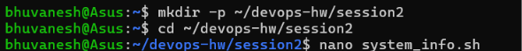
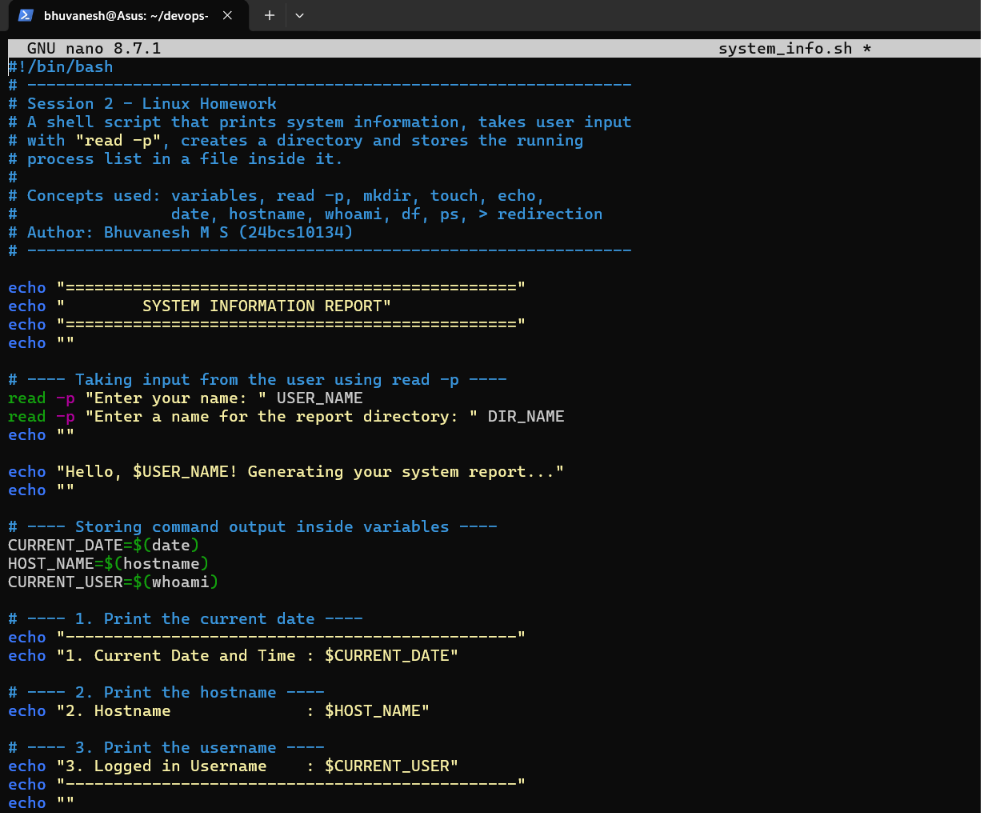
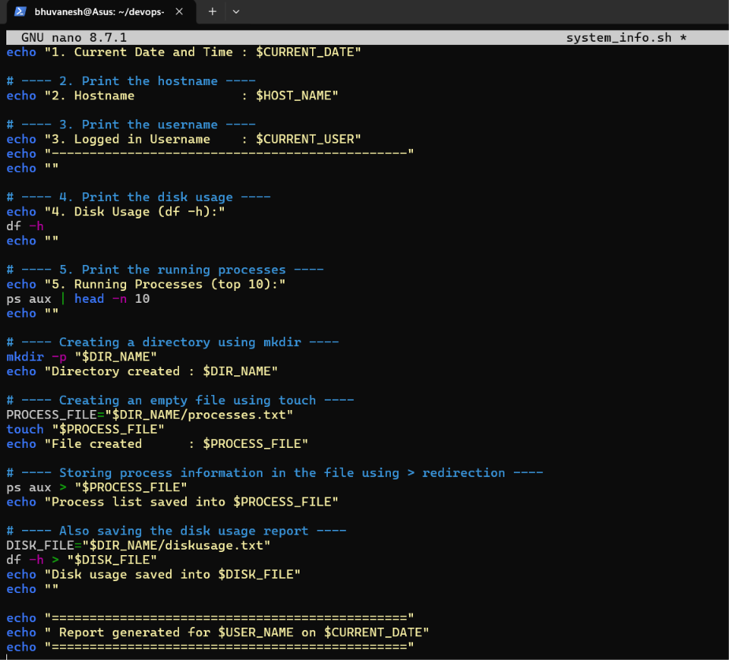
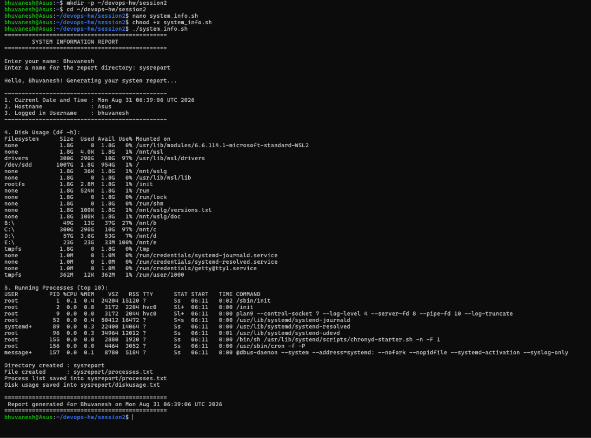
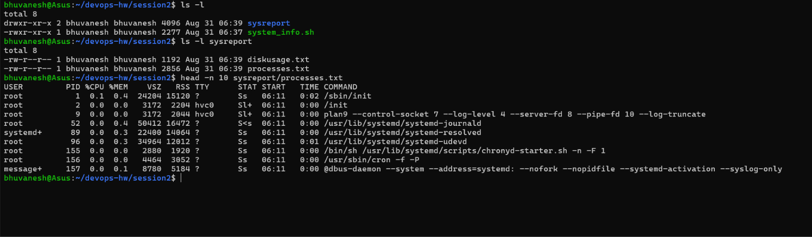

# Session 2 — Linux (Homework Submission)

**Name:** Bhuvanesh M S (24bcs10134)
**Environment used:** Ubuntu on WSL 2 (Windows 11)

## Task

Write a shell script that:

1. Prints the current date
2. Prints the hostname
3. Prints the username
4. Prints the disk usage
5. Prints the running processes

The script must use **variables**, take input using **`read -p`**, and **create a directory**
and store the process information in a **file** inside it — using `mkdir`, `touch`, `echo`,
`df`, `ps` and the `>` redirection operator.

---

## The Script

Full script: [system_info.sh](system_info.sh)

```bash
#!/bin/bash

echo "==============================================="
echo "        SYSTEM INFORMATION REPORT"
echo "==============================================="
echo ""

# ---- Taking input from the user using read -p ----
read -p "Enter your name: " USER_NAME
read -p "Enter a name for the report directory: " DIR_NAME
echo ""

echo "Hello, $USER_NAME! Generating your system report..."
echo ""

# ---- Storing command output inside variables ----
CURRENT_DATE=$(date)
HOST_NAME=$(hostname)
CURRENT_USER=$(whoami)

# ---- 1, 2, 3 : date, hostname, username ----
echo "-----------------------------------------------"
echo "1. Current Date and Time : $CURRENT_DATE"
echo "2. Hostname              : $HOST_NAME"
echo "3. Logged in Username    : $CURRENT_USER"
echo "-----------------------------------------------"
echo ""

# ---- 4. Disk usage ----
echo "4. Disk Usage (df -h):"
df -h
echo ""

# ---- 5. Running processes ----
echo "5. Running Processes (top 10):"
ps aux | head -n 10
echo ""

# ---- Creating a directory using mkdir ----
mkdir -p "$DIR_NAME"
echo "Directory created : $DIR_NAME"

# ---- Creating an empty file using touch ----
PROCESS_FILE="$DIR_NAME/processes.txt"
touch "$PROCESS_FILE"
echo "File created      : $PROCESS_FILE"

# ---- Storing process info in the file using > redirection ----
ps aux > "$PROCESS_FILE"
echo "Process list saved into $PROCESS_FILE"

# ---- Also saving the disk usage report ----
DISK_FILE="$DIR_NAME/diskusage.txt"
df -h > "$DISK_FILE"
echo "Disk usage saved into $DISK_FILE"
echo ""

echo "==============================================="
echo " Report generated for $USER_NAME on $CURRENT_DATE"
echo "==============================================="
```

---

## Execution — Step by Step (Screenshots)

### Step 1 — Creating the working directory and opening the editor

```bash
mkdir -p ~/devops-hw/session2
cd ~/devops-hw/session2
nano system_info.sh
```



### Step 2 — Writing the script in the nano editor

The first half of the script — the shebang, the `read -p` prompts, the variables holding
`date`, `hostname` and `whoami`, and tasks 1–3:



The second half — the disk usage and process listing, then `mkdir`, `touch` and the `>`
redirection that writes the process list into the file:



Saved with `Ctrl+O`, `Enter`, then closed with `Ctrl+X`.

### Step 3 — Making it executable and running it

```bash
chmod +x system_info.sh      # grant execute permission
./system_info.sh             # run the script
```



**Observations from the output:**

- The `read -p` prompts accepted the inputs `Bhuvanesh` and `sysreport`, and the greeting
  line `Hello, Bhuvanesh!` confirms the value was stored in the `USER_NAME` variable.
- **1. Date** — `Mon Aug 31 06:39:06 UTC 2026`, from the `CURRENT_DATE` variable.
- **2. Hostname** — `Asus`, from `HOST_NAME`.
- **3. Username** — `bhuvanesh`, from `CURRENT_USER`.
- **4. Disk usage** — `df -h` lists the Linux filesystems along with the Windows drives
  mounted by WSL (`/mnt/b`, `/mnt/c`, `/mnt/d`, `/mnt/e`), with the root filesystem
  `/dev/sdd` showing 1007G total and 1% used.
- **5. Processes** — `ps aux | head -n 10` shows the first 10 processes with their USER,
  PID, %CPU, %MEM and COMMAND columns, starting with PID 1 (`/sbin/init`).
- The closing lines confirm the directory `sysreport` was created, `processes.txt` was
  created with `touch`, and both `processes.txt` and `diskusage.txt` were written via `>`.
- The footer reuses the `$USER_NAME` and `$CURRENT_DATE` variables, showing that a variable
  can be read many times after being assigned once.

### Step 4 — Verifying the directory and files that were created

```bash
ls -l                                  # the new directory exists
ls -l sysreport                        # the two files inside it
head -n 10 sysreport/processes.txt     # confirm the content was written
```



**Observations from the output:**

- `ls -l` shows the `sysreport` directory (permissions begin with `d`) created by `mkdir`,
  alongside `system_info.sh`, whose `-rwxr-xr-x` permissions confirm that `chmod +x` worked.
- `ls -l sysreport` confirms both files exist and are **not empty** — `processes.txt` is
  2856 bytes and `diskusage.txt` is 1192 bytes, proving the `>` redirection wrote real data
  rather than leaving the file empty from `touch`.
- `head -n 10 sysreport/processes.txt` prints the stored process table, confirming the
  running-process information was successfully saved to a file inside the new directory.

---

## Concepts Used

| Requirement          | Where it is used in the script                            |
| -------------------- | --------------------------------------------------------- |
| Variables            | `USER_NAME`, `DIR_NAME`, `CURRENT_DATE`, `HOST_NAME`, `CURRENT_USER`, `PROCESS_FILE` |
| `read -p`            | Takes the user's name and the report directory name        |
| `echo`               | Prints all headings, labels and results                    |
| `date`               | Current date and time, stored in `CURRENT_DATE`            |
| `hostname`           | Machine name, stored in `HOST_NAME`                        |
| `whoami`             | Logged-in user, stored in `CURRENT_USER`                   |
| `df -h`              | Disk usage in human-readable form                          |
| `ps aux`             | List of running processes                                  |
| `mkdir`              | Creates the report directory from the user's input         |
| `touch`              | Creates the empty `processes.txt` file                     |
| `>` redirection      | `ps aux > processes.txt`, `df -h > diskusage.txt`          |

### Notes on a few details

- `#!/bin/bash` on the first line is the **shebang** — it tells the system which interpreter
  should run the file.
- `$(command)` is **command substitution**: it runs the command and stores its output in the
  variable, which is how `date`, `hostname` and `whoami` are captured.
- Variables are wrapped in quotes (`"$DIR_NAME"`) so that a directory name containing spaces
  is still handled as a single argument.
- `mkdir -p` does not fail if the directory already exists, so the script can be re-run safely.
- `>` **overwrites** the file each time, whereas `>>` would append to it.
- `chmod +x` is required before `./system_info.sh` will run, otherwise the shell reports
  *Permission denied*.
