# Monitoring, Observability & GitOps (Homework Submission)

**Name:** Bhuvanesh M S (24bcs10134)
**Environment:** minikube v1.39.0 (Kubernetes v1.37.0) on WSL 2 Ubuntu 26.04, Helm v4.3.0,
kube-prometheus-stack 92.0.0 (Prometheus Operator v0.94.1, Grafana 13.2.3), Argo CD (Helm chart `argo/argo-cd`).

Every screenshot is real terminal output from the cluster or from the live GitHub repository.

## Homework tasks

| # | Task | Where | Status |
| --- | --- | --- | --- |
| 1 | Monitoring: metrics, logs, alerts, CPU, memory, application health | [Task 1](#task-1-monitoring-demo) + [docs/01-monitoring.md](docs/01-monitoring.md) | Done: live demo, 9 screenshots |
| 2 | Observability: the three pillars, why, tools, Kubernetes observability | [docs/02-observability.md](docs/02-observability.md) | Done |
| 3 | GitOps: Git as source of truth, declarative config, reconciliation, workflow, Kubernetes + GitOps | [Task 3](#task-3-gitops-demo-with-argo-cd) + [docs/03-gitops.md](docs/03-gitops.md) | Done: live Argo CD demo driven by a real `git push` |

```
session20-monitoring-gitops/
├── docs/
│   ├── 01-monitoring.md          metrics, logs, alerts, CPU/memory, health - with PromQL and alert rules
│   ├── 02-observability.md       metrics vs logs vs traces, tools, Kubernetes observability
│   └── 03-gitops.md              GitOps principles, workflow, Argo CD vs Flux, secrets in GitOps
├── monitoring/
│   ├── kube-prometheus-stack-values.yaml   Prometheus + Alertmanager + Grafana, sized for minikube
│   ├── demo-app.yaml             podinfo (metrics + probes + JSON logs) + its ServiceMonitor
│   ├── alert-rules.yaml          PrometheusRule: PodinfoHighCPU, PodCrashLooping, PodinfoDown
│   ├── load-generator.yaml       traffic (including deliberate HTTP 500s)
│   ├── crashing-pod.yaml         a broken Pod that should trigger an alert
│   └── loki-values.yaml, alloy-values.yaml   log pipeline (see the note on memory below)
├── gitops/
│   ├── app/                      THE DESIRED STATE Argo CD watches (namespace, Deployment, Service)
│   ├── argocd-application.yaml   the Application (kept outside app/ on purpose)
│   └── argocd-values.yaml        Argo CD install values for a local lab
└── images/
```

---

## Task 1: Monitoring demo

### What was deployed

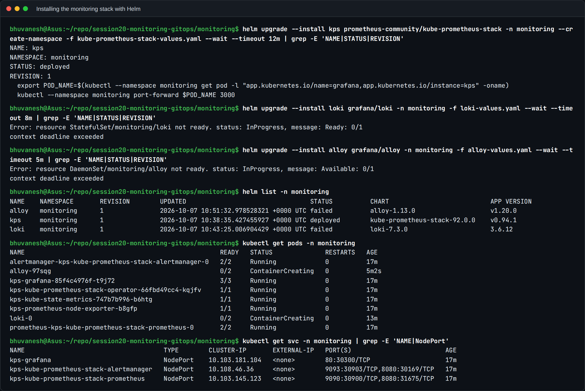

`kube-prometheus-stack` installed Prometheus, Alertmanager, Grafana, node-exporter (node
metrics) and kube-state-metrics (object state as metrics), plus the **Prometheus Operator**,
which turns `ServiceMonitor` and `PrometheusRule` objects into Prometheus configuration.

**An honest note about logs.** I also tried to install **Loki** (log storage) with **Grafana
Alloy** (the log collector that replaces Promtail). On this laptop (7.4 GB of RAM, of which
WSL gets about 3.5 GB) that pushed the minikube node to 96% of its memory limit. It started
swapping, the API server timed out, and even Prometheus' own scrapes of the kubelet failed.
The screenshot above shows the Loki and Alloy installs timing out. I removed them, raised the
node's memory limit with `docker update`, and demonstrated logs with `kubectl logs` and
podinfo's structured JSON logs instead. The Loki and Alloy values files are kept in
`monitoring/` because they are correct and would work on a node with more RAM.

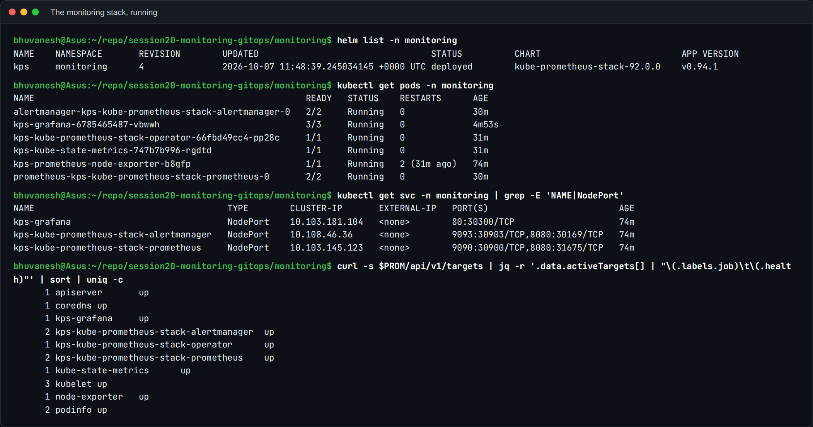

After the fix: one Helm release (`kps`), all Pods Running, Prometheus on NodePort 30900,
Grafana on 30300 and Alertmanager on 30903. **Every scrape target is `up`**: API server,
kubelet ×3 (including cAdvisor, which provides container CPU and memory), node-exporter,
kube-state-metrics, CoreDNS, and the two podinfo Pods.

### The application being monitored

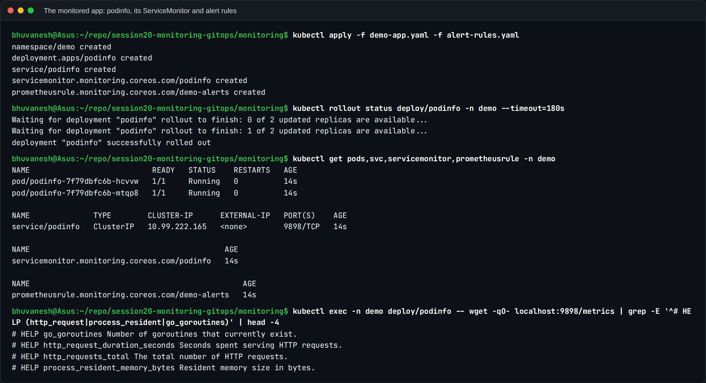

[podinfo](monitoring/demo-app.yaml) runs 2 replicas with liveness (`/healthz`) and readiness
(`/readyz`) probes, and exposes Prometheus metrics on `/metrics`: `http_requests_total`,
`http_request_duration_seconds`, `go_goroutines`, `process_resident_memory_bytes`, and more.
The **ServiceMonitor** tells Prometheus to scrape it every 15 s. No Prometheus config file was
edited; the Operator did it.

### Metrics: is it being scraped?

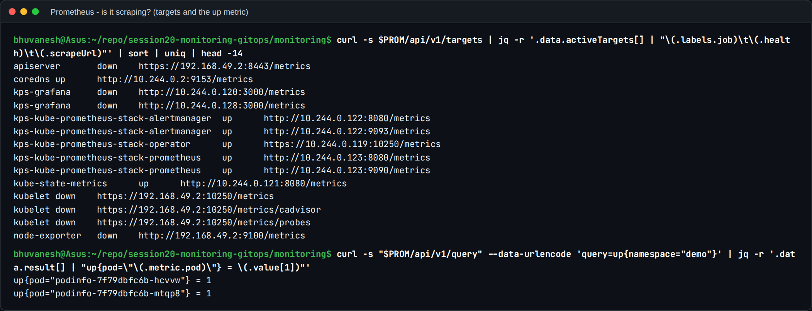

`up{namespace="demo"} = 1` for both Pods: Prometheus is scraping them. (This first capture
was taken while the node was overloaded, which is why some of the cluster's own targets show
`down`. That's the symptom that led me to the memory problem above. The later capture shows
them all `up`.)

### CPU and memory utilisation

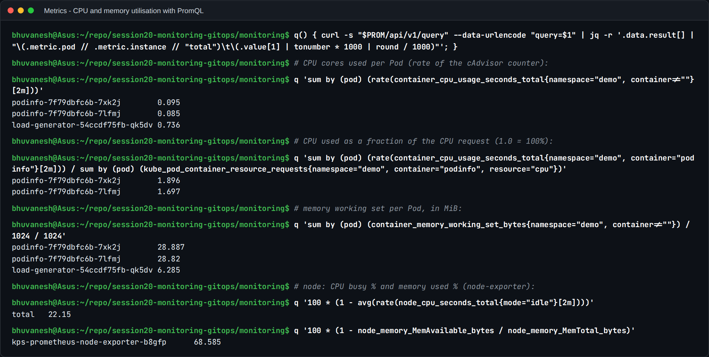

| Question | PromQL | Result |
| --- | --- | --- |
| CPU used per Pod | `sum by (pod) (rate(container_cpu_usage_seconds_total{namespace="demo",container!=""}[2m]))` | podinfo ≈ 0.085-0.095 cores each; the load generator 0.74 |
| CPU vs **request** | the above ÷ `kube_pod_container_resource_requests{resource="cpu"}` | **1.9 and 1.7, i.e. 190% and 170%** of the 50m request |
| Memory per Pod | `container_memory_working_set_bytes` / 1024² | about **29 MiB** per podinfo Pod (the limit is 96Mi) |
| Node CPU busy | `100 * (1 - avg(rate(node_cpu_seconds_total{mode="idle"}[2m])))` | 22% |
| Node memory used | `100 * (1 - MemAvailable / MemTotal)` | 68.6% |

`rate()` turns the ever-increasing CPU-seconds counter into cores used. `container!=""`
removes the Pod-level aggregate series so containers aren't double-counted. **Working set**
is the memory figure the kubelet uses for eviction and OOM decisions, which is why it's used
here rather than RSS or cache.

### Application health

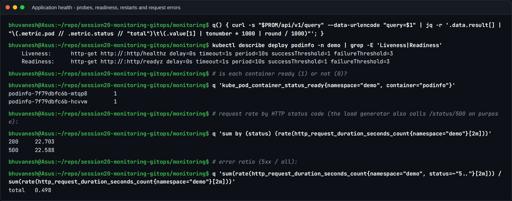

- **Probes**: liveness on `/healthz`, readiness on `/readyz`.
- `kube_pod_container_status_ready` is 1 for both Pods: they're in the Service.
- **Request rate by status code**: about 22.7 req/s of `200` and 22.6 req/s of `500`. The load
  generator calls `/status/500` on purpose, so the **error ratio is 0.498, almost 50%**.
  That's exactly the RED method (Rate, Errors, Duration) applied to a real service, and the
  kind of signal an alert should be built on.

### Logs

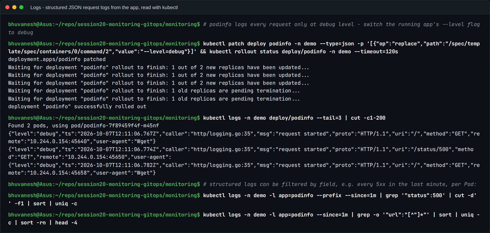

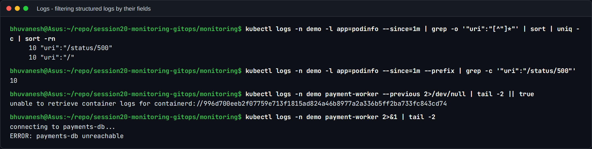

- podinfo only logs individual requests at **debug** level, so I patched its `--level` flag
  and rolled it out. Each request then produced a JSON line: level, timestamp, caller, `uri`,
  `method`, `remote` address.
- Because the logs are **structured**, they can be filtered by field: in one minute,
  10 requests to `/` and 10 to `/status/500`. With Loki the same question would be the LogQL
  `sum by (uri) (count_over_time({app="podinfo"} | json [1m]))`.
- The crashing `payment-worker` explains itself in its log: `ERROR: payments-db unreachable`.
  That's the line an on-call engineer would look for after an alert fires.

### Alerts

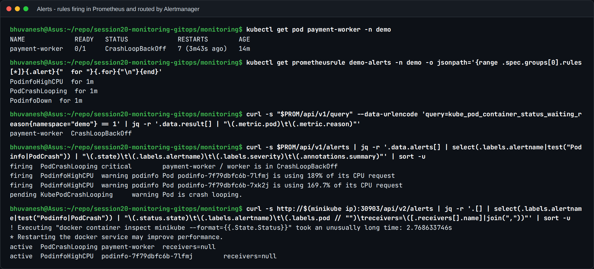

The [PrometheusRule](monitoring/alert-rules.yaml) defines three alerts, each with `for: 1m`
so brief spikes don't page anyone. Two of them fired for real:

| Alert | Why it fired | Severity |
| --- | --- | --- |
| **PodCrashLooping** | `payment-worker` was in `CrashLoopBackOff` (7 restarts); `kube_pod_container_status_waiting_reason{reason="CrashLoopBackOff"} == 1` | critical |
| **PodinfoHighCPU** | both podinfo Pods above 80% of their CPU request (189% and 170%) | warning |
| PodinfoDown | (not firing: both targets up) | critical |

Prometheus evaluates the rules and sends firing alerts to **Alertmanager**, where both show
as `active`. Alertmanager groups, deduplicates and routes them to receivers (Slack, email,
PagerDuty). Here the receiver is the chart's default `null`, because no real channel was
configured in this lab. kube-prometheus-stack's own built-in rule `KubePodCrashLooping` was
also `pending` for the same Pod. That's the value of a good default rule set.

### Grafana

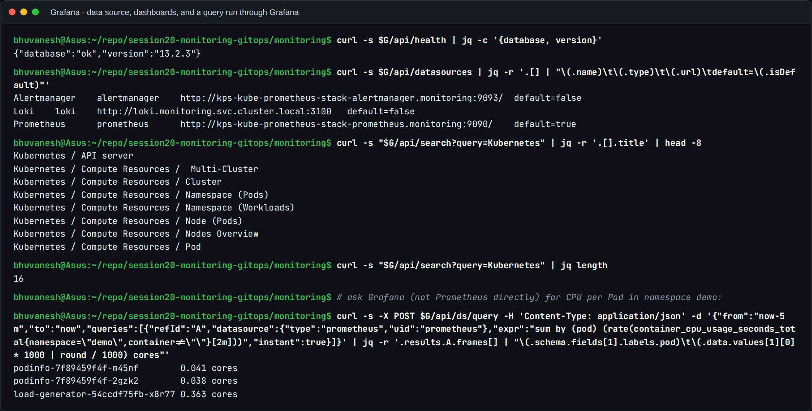

Grafana 13.2.3 is healthy, with **Prometheus as the default data source**, Alertmanager as a
second one, and **16 pre-built Kubernetes dashboards** provisioned by the chart (Compute
Resources by cluster, namespace, node, Pod and workload, API server, and more). The last
command asks **Grafana** for CPU per Pod in `demo`, and gets the same numbers Prometheus
reports, so the dashboards are reading live data. The `Loki` data source is still listed
because it's provisioned from values. It's unused since Loki was removed.

I also tried to screenshot the Grafana and Prometheus web UIs with a headless browser, but on
the overloaded node their JavaScript bundles never finished loading, which gave blank pages.
I didn't include those; the API output above is the same data.

---

## Task 2: Observability

Written up in [docs/02-observability.md](docs/02-observability.md):

- the three pillars: **metrics** (numbers over time), **logs** (discrete events) and
  **traces** (one request's journey across services);
- why observability is needed: microservices, unknown failure modes, short-lived Pods, MTTR;
- the common tools: Prometheus, Grafana, Loki, Alloy, Fluent Bit, ELK, Jaeger, Tempo,
  OpenTelemetry;
- Kubernetes observability, and how the pillars link up through shared labels and trace IDs.

The demo above covers the pillars in practice: Prometheus metrics, podinfo's structured logs,
and alerts built from both.

## Task 3: GitOps demo with Argo CD

**The idea:** Git holds the desired state, Kubernetes holds the actual state, and Argo CD runs
a loop that keeps making the actual state match Git. Nobody runs `kubectl apply` for the app.
The theory (OpenGitOps principles, pull vs push, Argo CD vs Flux, secrets in GitOps) is in
[docs/03-gitops.md](docs/03-gitops.md).

```
developer --git push--> GitHub (main: session20-monitoring-gitops/gitops/app)
                              ^  pull every 60 s
                              |
                         Argo CD (in the cluster) --apply / prune / self-heal--> namespace session20
```

### 1. Install Argo CD

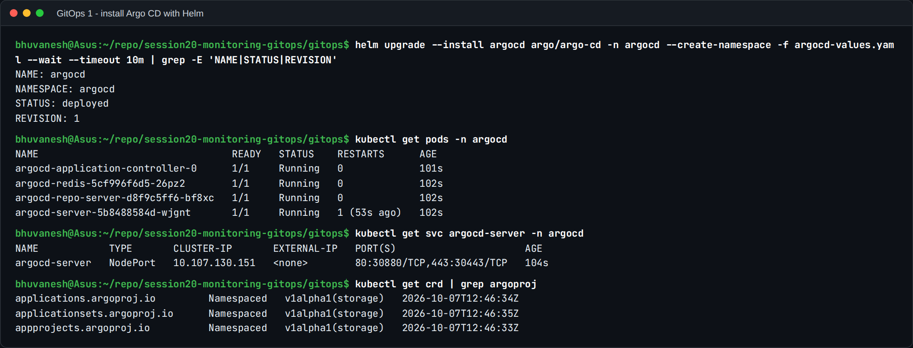

Argo CD was installed with Helm (`argo/argo-cd`, app v3.5.4) using
[gitops/argocd-values.yaml](gitops/argocd-values.yaml): the core components only (application
controller, repo server, API/UI server, Redis), the UI on NodePort 30880, and Git polled every
60 s instead of the default 3 minutes, to keep the demo short. Its CRDs (`Application`,
`ApplicationSet`, `AppProject`) are what make "an app" a Kubernetes object.

### 2. Point Argo CD at the Git repository

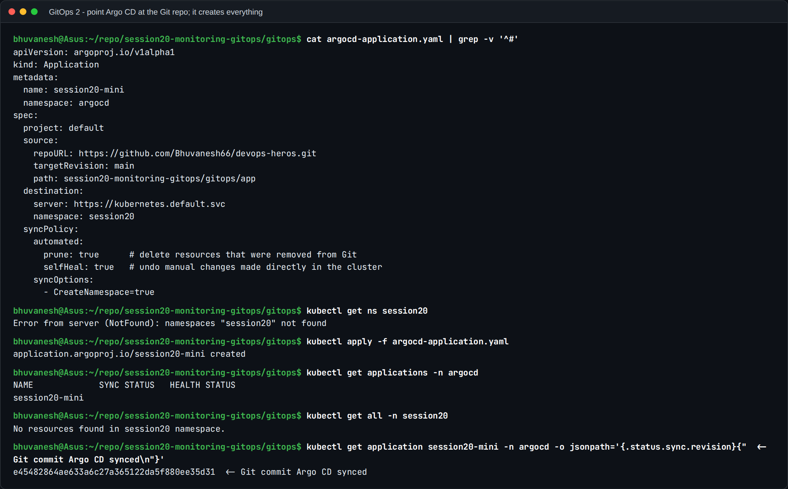

[gitops/argocd-application.yaml](gitops/argocd-application.yaml) says: keep namespace
`session20` identical to `session20-monitoring-gitops/gitops/app` on `main` of **this
repository**, with `automated` sync, `prune: true` and `selfHeal: true`. Before applying it,
the namespace didn't exist. Right after `kubectl apply` the status was still empty, because
Argo CD was cloning and rendering the repo.

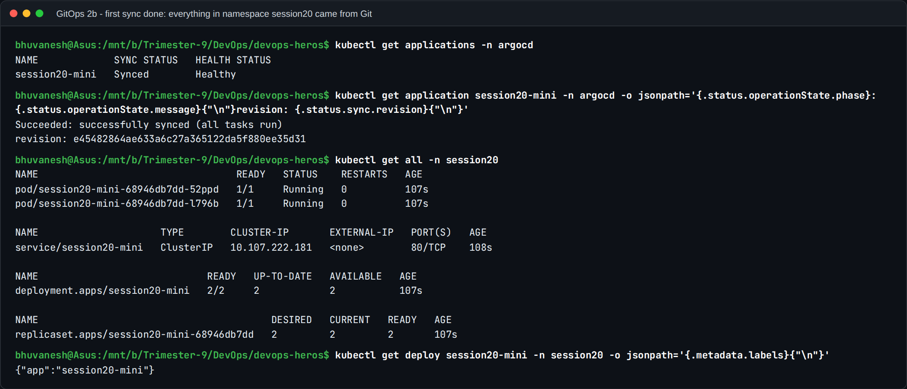

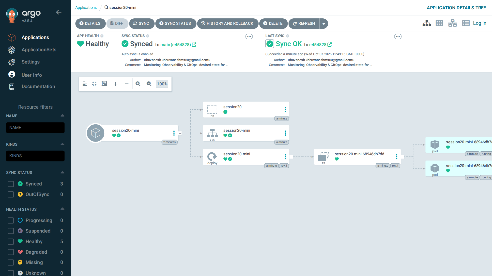

A moment later: **`Synced` / `Healthy`**, `successfully synced (all tasks run)`, at Git
commit `e454828`. The namespace, Service and 2-replica Deployment were all created by Argo CD
from Git. I never ran `kubectl apply` on them. The UI shows the same tree: Application →
namespace, Service, Deployment → ReplicaSet → 2 Pods.

### 3. Change the desired state, in Git only

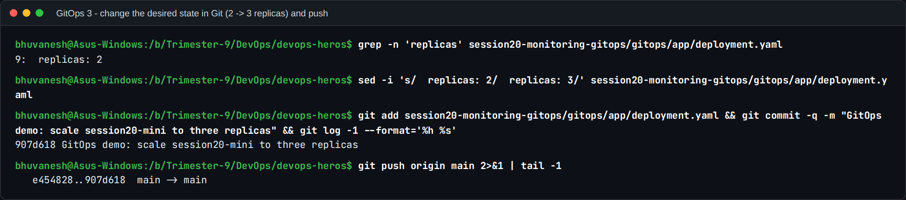

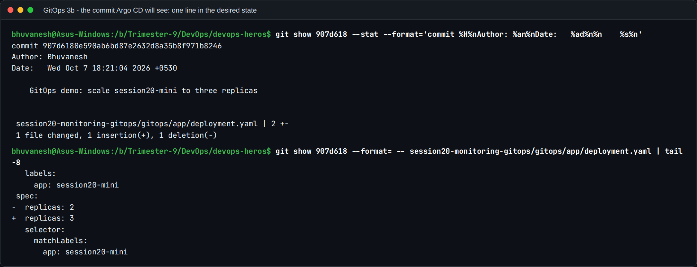

The **only** action: edit `replicas: 2` to `replicas: 3` in `gitops/app/deployment.yaml`,
commit (`907d618`, "GitOps demo: scale session20-mini to three replicas") and `git push`.
That commit is part of this repository's history: it is the GitOps change itself.

### 4. Argo CD notices and reconciles

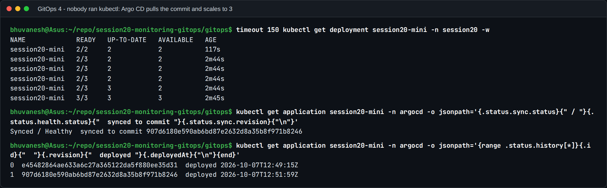

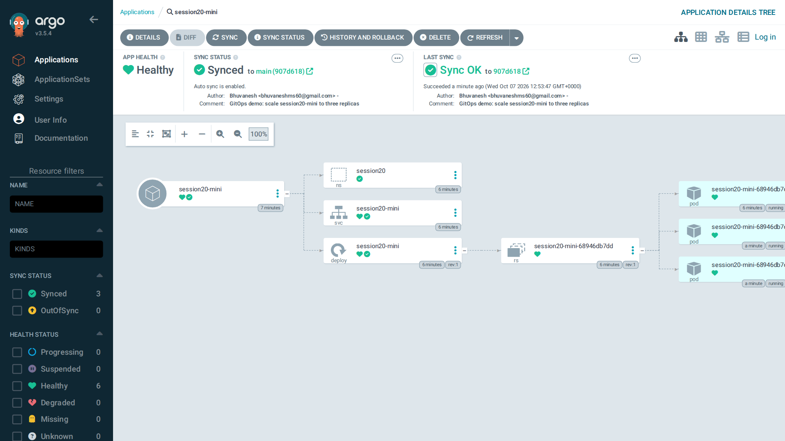

- Watching the Deployment: `2/2` → `2/3` → **`3/3`**, with no `kubectl` command. Argo CD
  pulled the new commit on its next poll and applied it.
- Status: `Synced / Healthy synced to commit 907d6180...`.
- Argo CD's **history** records both deployments: revision `e454828` at 12:49:15 and
  `907d618` at 12:51:59. That audit trail is the same thing as `git log`, and rolling back
  would just be a `git revert`.

### 5. Self-healing: manual drift is undone

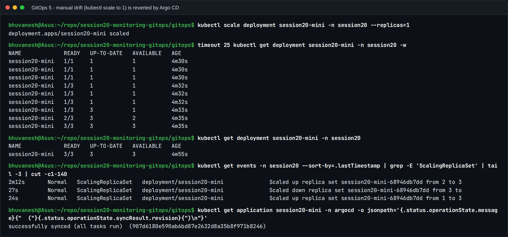

I scaled the Deployment **by hand** to 1 replica, the kind of "quick fix" GitOps is designed
to prevent. Within about **3 seconds** it was back at **3/3**. The events show
`Scaled down ... from 3 to 1` and then `Scaled up ... from 1 to 3`. Argo CD watches the live
objects, saw that they no longer matched Git, and because `selfHeal: true` it re-applied
Git's version. To really change the replica count, you change Git.

### 6. Observe

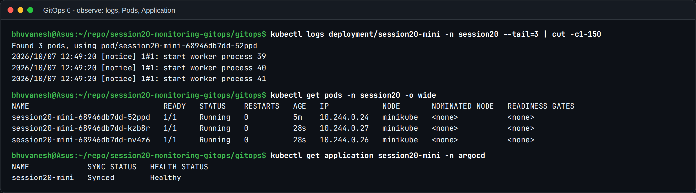

Three nginx Pods running, with logs readable as usual, and the Application `Synced` /
`Healthy`.

### Viva questions (from the class mini project)

1. **Monitoring vs observability:** monitoring watches known failure modes with predefined
   metrics and alerts. Observability is being able to ask new questions about unknown
   failures from the telemetry the system emits.
2. **Metrics vs logs vs traces:** numbers over time / individual events / the path of one
   request through many services.
3. **Prometheus:** a pull-based time-series database that scrapes `/metrics` endpoints,
   stores the samples, and evaluates PromQL queries and alert rules.
4. **Grafana:** the visualisation layer. Dashboards and Explore over data sources like
   Prometheus and Loki.
5. **GitOps:** operating infrastructure and apps by changing Git, while an in-cluster agent
   continuously reconciles the cluster to match it.
6. **Why Git is the source of truth:** it's versioned, reviewed (pull requests), auditable
   (who changed what and when) and revertible, and the cluster is made to follow it, not the
   other way round.
7. **What Argo CD does:** pulls manifests from Git, compares them with the live cluster,
   shows the difference, and applies, prunes and self-heals to remove it.
8. **Desired state:** what Git declares (here: 3 replicas of nginx:1.27-alpine).
9. **Actual state:** what is really running in the cluster right now.
10. **Reconciliation:** the continuous loop that compares desired and actual state and acts
    on any difference.
11. **Self-healing:** automatically reverting changes made directly in the cluster (my
    `kubectl scale --replicas=1`) back to what Git says.
12. **Changing replicas from 2 to 3 in Git:** after the push, Argo CD detects the new commit,
    marks the app OutOfSync, syncs, and the Deployment scales to 3, as shown in step 4.

## What I learned

1. **Requests make CPU numbers meaningful.** "0.09 cores" means little until it's compared
   with the 50m request: 190%, which is what the alert keys on.
2. **Alerts need a `for:` and a clear summary**, so they fire on real problems and tell the
   on-call person which Pod, and why.
3. **Structured logs are queryable data.** JSON fields can be counted and filtered, which is
   the basis of Loki's LogQL.
4. **Observability has a cost.** The full Loki + Alloy + Prometheus stack didn't fit next to
   the apps on a 3.5 GB node. Sizing the monitoring is part of designing it.
5. **In GitOps the commit is the deployment.** A one-line Git change scaled the app, a manual
   change was reverted in seconds, and both are visible in Argo CD's history.
