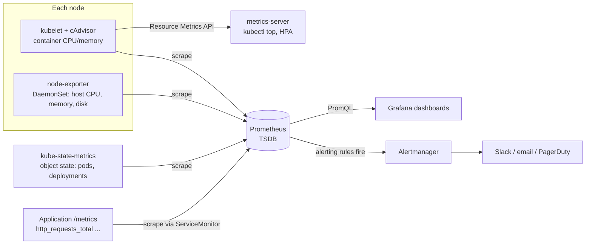
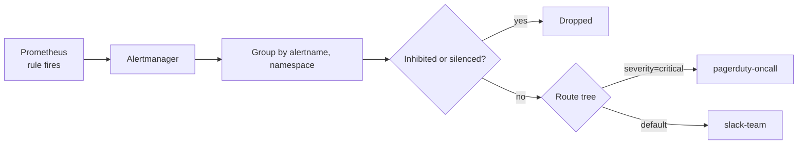

# Task 1 - Monitoring

**Student:** Bhuvanesh M S (24bcs10134)
**Session:** 20 - Monitoring, Observability and GitOps

In class, monitoring was framed as the question **"Is the system healthy?"**. In these notes I go through each
item the assignment lists (metrics, logs, alerts, CPU utilization, memory utilization, application health),
say what it means, and show how it is measured in Kubernetes. The examples use Prometheus and Grafana
(installed with `kube-prometheus-stack`) and an application running in the `demo` namespace.

---

## 1. The monitoring pipeline in Kubernetes

Before getting to each signal, this is where the numbers come from:



| Component | What it exposes | Used for |
|---|---|---|
| **cAdvisor** (built into the kubelet) | Per-container CPU, memory, network and filesystem usage (`container_*` metrics) | Pod/container resource usage |
| **kubelet** | Its own metrics plus the cAdvisor endpoint (`/metrics/cadvisor`) and probe results | Container usage, probe metrics |
| **node-exporter** | Host-level metrics (`node_*`): CPU, memory, disk, network, filesystem | Node utilization (the USE method) |
| **kube-state-metrics** | The *state* of Kubernetes objects (`kube_*`): replicas, pod phase, restarts, readiness, requests/limits | Health and capacity questions |
| **metrics-server** | Short-term CPU/memory through the Resource Metrics API (`metrics.k8s.io`) | `kubectl top`, HorizontalPodAutoscaler; it does **not** store history |
| **Prometheus** | Pull-based scraper and time-series database, queried with PromQL | History, dashboards, alerting |
| **Grafana** | Visualization on top of Prometheus (and Loki for logs) | Dashboards |
| **Alertmanager** | Deduplicates, groups, silences and routes alerts | Notifications |

As the instructor's material says: *Prometheus collects/stores metrics, Grafana visualizes metrics.*
`kube-prometheus-stack` installs all of the above (except metrics-server) plus the Prometheus Operator,
which adds the `ServiceMonitor`, `PodMonitor` and `PrometheusRule` CRDs.

---

## 2. Metrics

**What they are:** numeric measurements sampled over time ("how much / how often"). In Prometheus every
time series is identified by a metric name plus a set of labels:

```text
http_requests_total{namespace="demo", pod="web-7d9c", method="GET", status="200"}  1543
```

**Prometheus metric types**

| Type | Behaviour | Example | Typical query |
|---|---|---|---|
| Counter | Only goes up (resets on restart) | `http_requests_total` | `rate(http_requests_total[5m])` |
| Gauge | Goes up and down | `container_memory_working_set_bytes` | Use the value directly, or `avg_over_time` |
| Histogram | Bucketed observations (`_bucket`, `_sum`, `_count`) | `http_request_duration_seconds` | `histogram_quantile(0.95, ...)` |
| Summary | Quantiles computed on the client side | `go_gc_duration_seconds` | Read the `quantile` label |

**How Prometheus gets them:** it *pulls* (scrapes) an HTTP `/metrics` endpoint on every target at the
`scrape_interval`. In the Docker demo from class this was a static `prometheus.yml`. In Kubernetes with
the operator, I declare a `ServiceMonitor` instead:

```yaml
apiVersion: monitoring.coreos.com/v1
kind: ServiceMonitor
metadata:
  name: web
  namespace: demo
  labels:
    release: kube-prometheus-stack   # must match the Prometheus serviceMonitorSelector
spec:
  selector:
    matchLabels:
      app: web
  endpoints:
    - port: http          # named port on the Service
      path: /metrics
      interval: 30s
```

Useful check: `up` is `1` when the last scrape of a target succeeded and `0` when it failed.

---

## 3. Logs

**What they are:** timestamped event records ("what happened"). Containers write to stdout/stderr, the
container runtime saves that output to files on the node (under `/var/log/pods/`), and you can read it with:

```bash
kubectl logs deployment/web -n demo              # current logs
kubectl logs pod/web-7d9c -n demo --previous     # logs of the previous (crashed) container
kubectl logs -l app=web -n demo --since=10m -f   # follow every pod with a label
```

`kubectl logs` only reaches what is still on the node. For monitoring, logs are shipped to a central
store. In our setup that is **Loki**, with a node-level agent (Promtail or Grafana Alloy) running as a
DaemonSet. Logs can be monitored with LogQL queries that behave like metrics:

```logql
# error lines per pod over the last 5 minutes
sum by (pod) (count_over_time({namespace="demo"} |= "error" [5m]))
```

Logs explain *why* a metric changed. Task 2 covers them in more depth.

---

## 4. Alerts

**What they are:** rules that turn a condition on a signal into a notification. Monitoring is mainly
about alerting on known failure modes (from class: `IF error_rate > 5% THEN alert`).

In Prometheus an alerting rule has an expression, a `for` duration (how long it must stay true before it
fires), labels (such as `severity`) and annotations (human-readable text). An alert moves through
`inactive` -> `pending` (expression true, `for` not yet reached) -> `firing`.

### 4.1 PrometheusRule example

With kube-prometheus-stack, rules are Kubernetes objects. By default the stack's Prometheus only picks up
rules carrying the Helm release label, so I add `release: kube-prometheus-stack` (the release name the lead
installed).

```yaml
apiVersion: monitoring.coreos.com/v1
kind: PrometheusRule
metadata:
  name: demo-app-alerts
  namespace: demo
  labels:
    release: kube-prometheus-stack
spec:
  groups:
    - name: demo.rules
      rules:
        - alert: HighPodCPU
          expr: |
            sum by (namespace, pod) (
              rate(container_cpu_usage_seconds_total{namespace="demo", container!=""}[5m])
            )
            /
            sum by (namespace, pod) (
              kube_pod_container_resource_limits{namespace="demo", resource="cpu"}
            ) > 0.8
          for: 10m
          labels:
            severity: warning
          annotations:
            summary: "Pod {{ $labels.pod }} is using more than 80% of its CPU limit"
            description: "CPU usage / limit is {{ $value | humanizePercentage }} for 10 minutes."

        - alert: PodCrashLooping
          expr: |
            max_over_time(
              kube_pod_container_status_waiting_reason{namespace="demo", reason="CrashLoopBackOff"}[5m]
            ) >= 1
          for: 5m
          labels:
            severity: critical
          annotations:
            summary: "Container {{ $labels.container }} in {{ $labels.pod }} is crash looping"

        - alert: DemoTargetDown
          expr: up{namespace="demo"} == 0
          for: 5m
          labels:
            severity: critical
          annotations:
            summary: "Prometheus cannot scrape {{ $labels.instance }} (job {{ $labels.job }})"
```

```bash
kubectl apply -f prometheusrule.yaml
kubectl get prometheusrules -n demo
# then Prometheus UI -> Alerts (or Status -> Rules) shows the rule as inactive/pending/firing
```

kube-prometheus-stack already ships many default rules (for example `KubePodCrashLooping`, `TargetDown`,
`KubeDeploymentReplicasMismatch`, and the always-firing `Watchdog` that proves the alert pipeline works).

### 4.2 Alertmanager routing basics

Prometheus only *evaluates* rules. Alertmanager decides **who gets notified, how often, and grouped how**.



```yaml
# alertmanager.yaml (in kube-prometheus-stack this goes under alertmanager.config in values.yaml)
route:
  receiver: slack-team              # default receiver
  group_by: ["alertname", "namespace"]
  group_wait: 30s                   # wait to batch the first notification of a group
  group_interval: 5m                # wait before sending new alerts added to a group
  repeat_interval: 4h               # re-notify if still firing
  routes:
    - matchers:
        - severity = "critical"
      receiver: pagerduty-oncall
    - matchers:
        - alertname = "Watchdog"
      receiver: "null"

inhibit_rules:
  - source_matchers: [severity = "critical"]
    target_matchers: [severity = "warning"]
    equal: ["alertname", "namespace"]   # mute the warning if the critical one is firing

receivers:
  - name: "null"
  - name: slack-team
    slack_configs:
      - api_url: https://hooks.slack.com/services/REPLACE_ME
        channel: "#demo-alerts"
        send_resolved: true
  - name: pagerduty-oncall
    pagerduty_configs:
      - routing_key: REPLACE_ME
```

| Concept | Meaning |
|---|---|
| Route | Tree of matchers that picks a receiver; the first matching child wins unless `continue: true` |
| Grouping | Combines related alerts into a single notification |
| Inhibition | Suppresses some alerts while another alert is firing |
| Silence | Temporary mute created in the UI or with `amtool` (for example during maintenance) |

Good alerting practice: alert on **symptoms users feel** (errors, latency) rather than every cause, make
every page actionable, and link a runbook in the annotations.

---

## 5. CPU utilization

**What it is:** how much CPU time a container, pod or node uses. In Kubernetes CPU is measured in
**cores** (`1` = one vCPU, `500m` = half a core). The raw metric is a counter of CPU-seconds consumed, so I
take a `rate()` to get cores in use.

| Question | PromQL |
|---|---|
| CPU cores used per pod | `sum(rate(container_cpu_usage_seconds_total{namespace="demo",container!=""}[5m])) by (pod)` |
| Usage as % of the CPU **request** | `sum by (pod) (rate(container_cpu_usage_seconds_total{namespace="demo",container!=""}[5m])) / sum by (pod) (kube_pod_container_resource_requests{namespace="demo",resource="cpu"})` |
| CPU throttling ratio (hitting the limit) | `sum by (pod) (rate(container_cpu_cfs_throttled_periods_total{namespace="demo"}[5m])) / sum by (pod) (rate(container_cpu_cfs_periods_total{namespace="demo"}[5m]))` |
| Node CPU utilization % | `100 * (1 - avg by (instance) (rate(node_cpu_seconds_total{mode="idle"}[5m])))` |

Why `container!=""`: cAdvisor also reports a pod-level cgroup series with an empty `container` label.
Without the filter the pod total gets counted twice.

Quick check without Prometheus (needs metrics-server; on minikube: `minikube addons enable metrics-server`):

```bash
kubectl top pods -n demo
kubectl top nodes
```

Behaviour to remember: if a container goes over its CPU **limit**, it is **throttled**, not killed.
High throttling shows up as latency, not as restarts.

---

## 6. Memory utilization

**What it is:** bytes of memory a container is using. The metric that matters is
`container_memory_working_set_bytes`. It is what metrics-server and `kubectl top` report, and it is what
the kubelet looks at for eviction. Unlike `container_memory_usage_bytes`, it leaves out inactive page
cache that the kernel can reclaim.

| Question | PromQL |
|---|---|
| Working set per pod | `sum(container_memory_working_set_bytes{namespace="demo",container!=""}) by (pod)` |
| % of memory **limit** | `sum by (pod) (container_memory_working_set_bytes{namespace="demo",container!=""}) / sum by (pod) (kube_pod_container_resource_limits{namespace="demo",resource="memory"})` |
| Containers that were OOM-killed | `kube_pod_container_status_last_terminated_reason{namespace="demo",reason="OOMKilled"} == 1` |
| Node memory utilization % | `100 * (1 - node_memory_MemAvailable_bytes / node_memory_MemTotal_bytes)` |

Behaviour to remember: memory cannot be throttled. If a container goes over its memory **limit**, the
kernel **OOM-kills** it (exit code 137, reason `OOMKilled`) and the restart count goes up. So an alert on
working set at about 90% of the limit is an early warning before the crash.

| | CPU | Memory |
|---|---|---|
| Unit | cores / millicores | bytes (Mi, Gi) |
| Raw metric | `container_cpu_usage_seconds_total` (counter, use `rate`) | `container_memory_working_set_bytes` (gauge) |
| Over the limit | Throttled | OOMKilled and restarted |
| Compressible? | Yes | No |

---

## 7. Application health

Application health answers the question "can this app serve users right now?". In Kubernetes there are
three layers:

**1. Probes (kubelet checks inside the cluster)**

| Probe | Question | If it fails |
|---|---|---|
| `startupProbe` | Has the app finished starting? | Liveness/readiness are not run yet; after `failureThreshold` the container is restarted |
| `livenessProbe` | Is the process stuck/dead? | Container is **restarted** |
| `readinessProbe` | Can it take traffic right now? | Pod is **removed from Service endpoints** (not restarted) |

```yaml
containers:
  - name: web
    image: nginx:1.27-alpine
    ports:
      - containerPort: 80
    readinessProbe:
      httpGet: { path: /, port: 80 }
      periodSeconds: 5
      failureThreshold: 3
    livenessProbe:
      httpGet: { path: /, port: 80 }
      initialDelaySeconds: 10
      periodSeconds: 10
    resources:
      requests: { cpu: 100m, memory: 64Mi }
      limits:   { cpu: 250m, memory: 128Mi }
```

**2. Health in Prometheus**

| Signal | PromQL |
|---|---|
| Scrape target reachable | `up{namespace="demo"}` (1 = up, 0 = down) |
| Containers not ready | `kube_pod_container_status_ready{namespace="demo"} == 0` |
| Restarts in the last hour | `increase(kube_pod_container_status_restarts_total{namespace="demo"}[1h]) > 0` |
| Deployment missing replicas | `kube_deployment_status_replicas_available{namespace="demo"} < kube_deployment_spec_replicas{namespace="demo"}` |
| Pods stuck not Running | `sum by (pod, phase) (kube_pod_status_phase{namespace="demo", phase=~"Pending\|Failed\|Unknown"}) > 0` |

**3. User-facing health (black-box):** error rate and latency of real requests, or synthetic checks
with the Prometheus blackbox-exporter (`probe_success`). A pod can be `Running` and `Ready` while users
still get 500s, so this layer matters most.

```bash
kubectl get pods -n demo                       # READY column, STATUS, RESTARTS
kubectl describe pod <pod> -n demo             # probe failures appear under Events
kubectl get events -n demo --sort-by=.lastTimestamp
```

---

## 8. Methods: Golden Signals, USE, RED

These are checklists for deciding *what* to put on a dashboard and alert on.

| Method | Origin | Applies to | Signals |
|---|---|---|---|
| **Four Golden Signals** | Google SRE book | User-facing services | Latency, Traffic, Errors, Saturation |
| **USE** | Brendan Gregg | Resources (CPU, memory, disk, network) | Utilization, Saturation, Errors |
| **RED** | Tom Wilkie | Request-driven (micro)services | Rate, Errors, Duration |

RED in PromQL, assuming the app exposes `http_requests_total` and the histogram
`http_request_duration_seconds`:

```promql
# Rate - requests per second
sum(rate(http_requests_total{namespace="demo"}[5m]))

# Errors - fraction of 5xx responses
sum(rate(http_requests_total{namespace="demo", status=~"5.."}[5m]))
  / sum(rate(http_requests_total{namespace="demo"}[5m]))

# Duration - p95 latency in seconds
histogram_quantile(0.95,
  sum by (le) (rate(http_request_duration_seconds_bucket{namespace="demo"}[5m])))
```

USE for a node: utilization = node CPU % (section 5); saturation = `node_load1` compared with the core
count, or CPU throttling for containers; errors = `node_network_receive_errs_total` and disk errors.

How I would lay out a Grafana dashboard for the demo app:

```text
+------------------------+------------------------+
| Requests/sec  (Rate)   | Error %  (Errors)      |
+------------------------+------------------------+
| p95 latency (Duration) | Pods ready / desired   |
+------------------------+------------------------+
| CPU vs limit per pod   | Memory vs limit per pod|
+------------------------+------------------------+
| Restarts (1h)          | Firing alerts          |
+------------------------+------------------------+
```

---

## Key takeaways

- Monitoring answers "is it healthy?" for **known** failure modes, using metrics, logs and alerts.
- Container CPU/memory come from **cAdvisor in the kubelet**, host metrics from **node-exporter**, object
  state from **kube-state-metrics**. **metrics-server** only powers `kubectl top` and HPA, with no history.
- CPU over the limit gets **throttled**. Memory over the limit gets **OOM-killed**. Watch
  `container_memory_working_set_bytes`, not total usage.
- Always filter `container!=""` on cAdvisor metrics to avoid counting pod-level series twice.
- Health has layers: probes (restart vs remove from Service), `up` and `kube_pod_container_status_ready`
  in Prometheus, and user-facing error rate and latency.
- Rules are `PrometheusRule` objects (with the label the operator selects on). **Alertmanager** groups,
  inhibits, silences and routes them.
- Golden Signals / USE / RED tell me which few metrics deserve a dashboard panel or an alert.

---

## Interview questions

**Q1. What is the difference between metrics-server and Prometheus?**
metrics-server keeps only the latest CPU/memory samples in memory and serves them through the Resource
Metrics API for `kubectl top` and the HPA. Prometheus scrapes many exporters, stores history in a TSDB,
supports PromQL, and evaluates alert rules. They do different jobs, and clusters usually run both.

**Q2. Why use `rate()` with `container_cpu_usage_seconds_total`?**
It is a counter of total CPU-seconds since the container started, so the raw value only grows.
`rate(...[5m])` gives the per-second increase averaged over 5 minutes, which is the number of cores in
use. `rate` also handles counter resets when a container restarts.

**Q3. What happens when a container exceeds its CPU limit, compared with its memory limit?**
CPU is compressible, so the container is throttled by CFS quota and becomes slower. Memory is not, so the
container is OOM-killed (exit code 137) and restarted according to the pod's restart policy.

**Q4. What is the difference between liveness and readiness probes?**
A failing liveness probe makes the kubelet restart the container. A failing readiness probe only removes
the pod from Service endpoints until it passes again. Using liveness where readiness belongs can lead to
restart loops when a dependency is slow.

**Q5. What does the `for` field in an alert rule do, and what does Alertmanager add on top of it?**
`for` keeps the alert in `pending` until the expression has been true for that long, which filters out
short spikes. Alertmanager then groups related alerts, deduplicates them, applies inhibitions and silences,
and routes them to receivers such as Slack or PagerDuty using matchers. It also controls re-notification
with `repeat_interval`.
