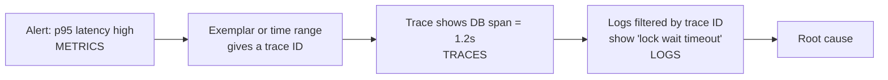
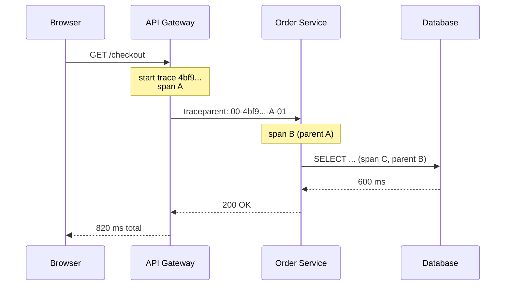
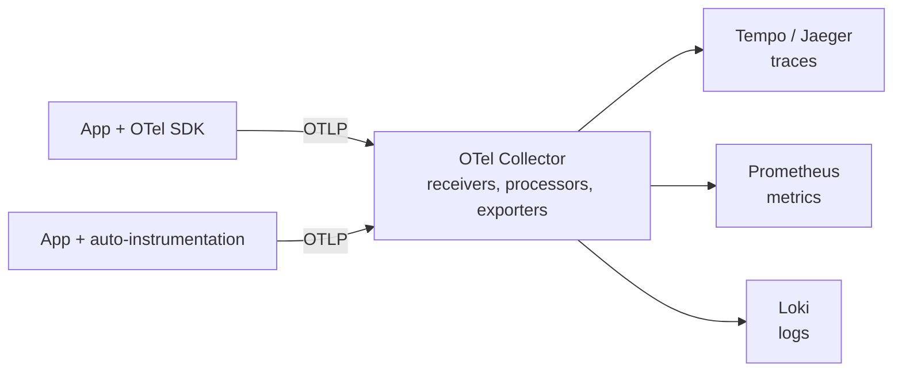
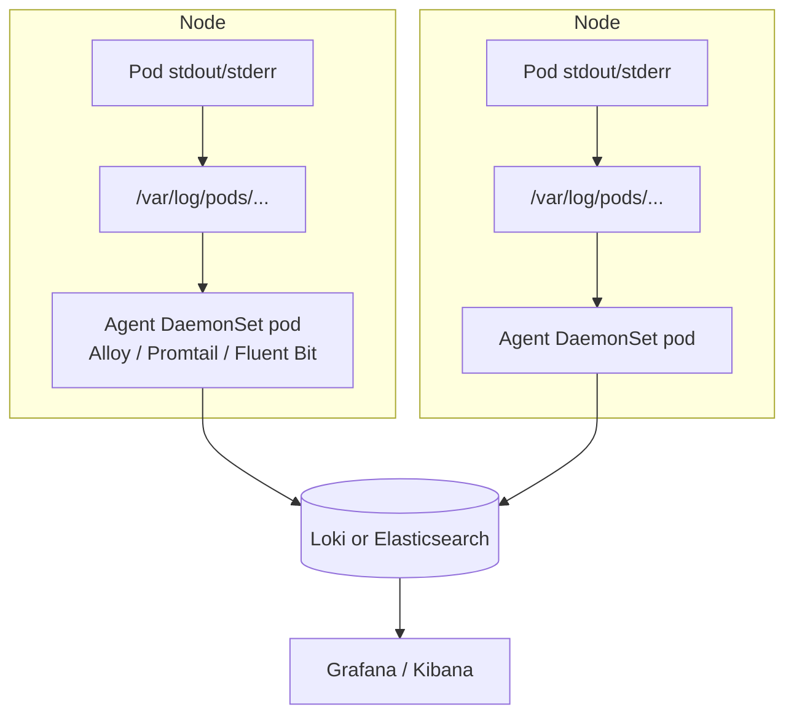
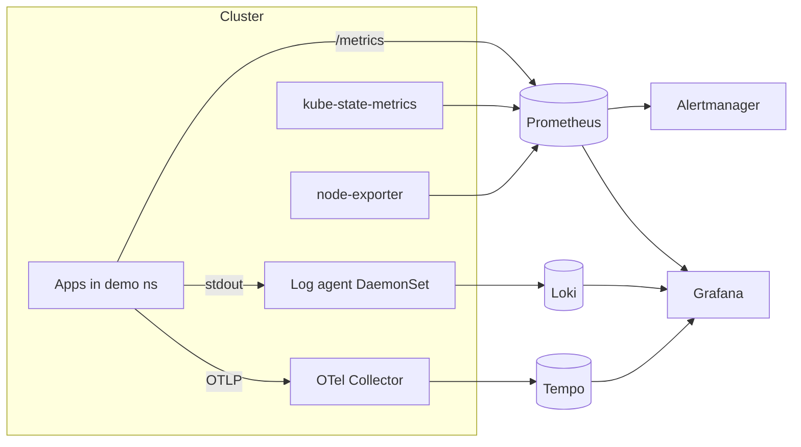

# Task 2 - Observability

**Student:** Bhuvanesh M S (24bcs10134)
**Session:** 20 - Monitoring, Observability and GitOps

Monitoring asks "is something wrong?". Observability asks **"why is the system behaving this way?"**. A
system is observable when I can work out its internal state from the telemetry it emits, including for
problems nobody predicted. This document covers the three pillars, why observability is needed, the
tools, and how it applies to Kubernetes.

---

## 1. The three pillars

Instructor's one-line summary: **Metrics = numbers, Logs = events, Traces = journey.**

| Pillar | Answers | Shape | Cost profile | Example tool |
|---|---|---|---|---|
| Metrics | How much? How often? Is it getting worse? | Numeric time series with labels | Cheap and fast to query; aggregated | Prometheus |
| Logs | What exactly happened? | Timestamped text or JSON events | Volume grows with traffic | Loki, Elasticsearch |
| Traces | Where did this request spend its time? | Tree of timed spans for one request | Usually sampled | Jaeger, Tempo |



### 1.1 Metrics

Metrics are aggregated numbers sampled at intervals, for example `http_requests_total` or
`container_memory_working_set_bytes`. They are what I alert on, because they are cheap to store for a
long time and fast to query.

**Cardinality** is the number of unique time series, meaning every unique combination of label values.

```text
http_requests_total{method, status, path}
  5 methods x 10 status codes x 50 paths = 2,500 series per pod
  x 20 pods                              = 50,000 series
```

Every series uses memory in Prometheus. Labels with unbounded values (user ID, email, request ID, full
URL with IDs) cause a **cardinality explosion**. Rule I follow: labels should have a small, bounded set of
values. High-cardinality detail belongs in logs and traces.

### 1.2 Logs

Logs are discrete events with context. They are the most detailed signal and also the most expensive.

**Unstructured vs structured logging**

```text
2026-10-07 10:15:02 ERROR payment failed for order 8812 after 3 retries
```

```json
{"ts":"2026-10-07T10:15:02Z","level":"error","service":"payment","msg":"payment failed",
 "order_id":"8812","retries":3,"trace_id":"4bf92f3577b34da6a3ce929d0e0e4736"}
```

Structured (JSON) logs can be filtered by field without fragile regex, and they carry a `trace_id`, which
is what links logs to traces. With Loki, LogQL can parse them at query time:

```logql
{namespace="demo", app="payment"} | json | level="error" | order_id="8812"
```

Loki only indexes the **labels** (namespace, app, pod), not the log content, so Loki labels need to stay
low-cardinality just like Prometheus labels. `order_id` stays inside the log line.

Logging good practices: write to stdout/stderr (the twelve-factor approach), use consistent levels,
never log secrets or personal data, and add a request or trace ID to every line.

### 1.3 Traces

A **trace** records the path of one request through every service it touches. It is made of **spans**.

| Term | Meaning |
|---|---|
| Trace | The whole request; identified by a 16-byte **trace ID** |
| Span | One unit of work (an HTTP call, a DB query) with start time, duration, attributes, status; 8-byte **span ID** |
| Parent span | The span that caused this one; spans form a tree |
| Context propagation | Passing trace ID + parent span ID across process boundaries (HTTP headers, message metadata) |
| Sampling | Keeping only a share of traces (head-based: decide at start; tail-based: decide after seeing the whole trace, e.g. keep all errors) |

**Context propagation** uses the W3C Trace Context `traceparent` header
(`version-traceid-parentid-flags`):

```text
traceparent: 00-4bf92f3577b34da6a3ce929d0e0e4736-00f067aa0ba902b7-01
```



This matches the instructor's example: the trace shows that the database took 600 ms of the 820 ms, which
a single latency metric cannot tell me.

---

## 2. Why observability is required

| Reason | Explanation |
|---|---|
| **Unknown unknowns** | Dashboards and alerts cover failures someone predicted. New failure modes need ad-hoc questions ("only users on Android in region X, only since the 14:00 deploy?"), which needs rich, high-cardinality data. |
| **Microservices / distributed systems** | One user request may cross 10+ services, queues and databases. Without traces, every team's metrics can look fine while the request is slow. |
| **Ephemeral infrastructure** | Pods are rescheduled and deleted; their local logs disappear. Telemetry must be shipped off the node. |
| **MTTR (mean time to recovery)** | Moving from alert -> trace -> log quickly reduces the time spent investigating. |
| **Deploy confidence** | Frequent releases (CI/CD, GitOps) are only safe if I can see their effect immediately and roll back. |
| **SLOs** | Service level objectives and error budgets are computed from telemetry. |

### Monitoring vs observability

| Monitoring | Observability |
|---|---|
| Is something wrong? | Why is it wrong? |
| Known failure modes, predefined dashboards | Explore unknown problems with arbitrary queries |
| Mostly metrics + alerts | Metrics + logs + traces, correlated |
| Something you *do* | A property the system *has* (it emits enough telemetry) |
| Output: alert / dashboard | Output: root cause |

They work together: monitoring tells me *that* something is wrong, and observability lets me find *why*.

---

## 3. Common tools

| Category | Tools | Notes |
|---|---|---|
| Metrics | **Prometheus**, Thanos / Mimir / VictoriaMetrics (long-term, scale-out) | Pull-based, PromQL |
| Visualization | **Grafana** | Data sources for Prometheus, Loki, Tempo, Jaeger, Elasticsearch, CloudWatch... |
| Log storage | **Loki** (label-indexed, LogQL), **Elasticsearch / OpenSearch** (full-text indexed) | Loki is cheaper; Elasticsearch searches arbitrary text faster |
| Log collectors | **Promtail** (deprecated in favour of Alloy), **Grafana Alloy**, **Fluent Bit**, Fluentd, Logstash | Usually a DaemonSet on every node |
| Log stacks | **ELK** = Elasticsearch + Logstash + Kibana; **EFK** = Elasticsearch + Fluentd/Fluent Bit + Kibana; **PLG** = Promtail + Loki + Grafana | |
| Tracing backends | **Jaeger**, **Grafana Tempo**, **Zipkin** | Tempo stores traces in object storage, looked up by trace ID |
| Instrumentation standard | **OpenTelemetry** (SDKs + APIs + OTLP protocol) and the **OTel Collector** | Vendor-neutral; CNCF project |
| Commercial / managed | Datadog, New Relic, Dynatrace, AWS CloudWatch + X-Ray, Google Cloud Operations, Azure Monitor | Agent-based, all three pillars in one place |

### OpenTelemetry and the Collector

OpenTelemetry (OTel) is a standard for *producing and transporting* telemetry. It does not store
anything. Apps are instrumented once with the OTel SDK (or auto-instrumentation), and the **Collector**
receives, processes and exports the data to any backend, so changing the backend does not require
re-instrumenting the code.



```yaml
# otel-collector-config.yaml (minimal)
receivers:
  otlp:
    protocols:
      grpc:
        endpoint: 0.0.0.0:4317
      http:
        endpoint: 0.0.0.0:4318

processors:
  memory_limiter:
    check_interval: 1s
    limit_percentage: 80
  batch: {}

exporters:
  otlp/tempo:
    endpoint: tempo.monitoring.svc:4317
    tls:
      insecure: true
  debug: {}

service:
  pipelines:
    traces:
      receivers: [otlp]
      processors: [memory_limiter, batch]
      exporters: [otlp/tempo, debug]
```

---

## 4. Kubernetes observability

### 4.1 Built-in signals

```bash
kubectl top nodes                                   # needs metrics-server
kubectl top pods -n demo --containers
kubectl get events -n demo --sort-by=.lastTimestamp # scheduling, probe failures, OOMKills, image pulls
kubectl describe pod <pod> -n demo                  # state, last termination reason, events
kubectl logs <pod> -n demo --previous               # logs of the crashed container
kubectl get --raw /metrics | head                   # API server's own Prometheus metrics
```

**Events** are an easily overlooked signal. They record *why* the cluster did something
(`FailedScheduling`, `BackOff`, `Unhealthy`, `Killing`), but by default they are kept for only about an
hour. Shipping them to the log store keeps them for later.

### 4.2 The metrics layer

| Component | Runs as | Provides |
|---|---|---|
| metrics-server | Deployment | Live CPU/memory for `kubectl top` and HPA |
| kubelet / cAdvisor | Built into each node | Container resource metrics |
| node-exporter | DaemonSet | Host OS metrics |
| kube-state-metrics | Deployment | Object state (replicas, readiness, restarts, requests/limits) |
| **kube-prometheus-stack** (Helm) | Operator + CRDs | Prometheus, Alertmanager, Grafana, node-exporter, kube-state-metrics, default dashboards and rules |

```bash
helm repo add prometheus-community https://prometheus-community.github.io/helm-charts
helm repo update
helm install kube-prometheus-stack prometheus-community/kube-prometheus-stack \
  --namespace monitoring --create-namespace
kubectl get pods -n monitoring
```

### 4.3 Logging architecture: node-level agent

Kubernetes has no built-in log storage. The common pattern is a **node-level logging agent running as a
DaemonSet**. It reads container log files from each node and forwards them with Kubernetes metadata
(namespace, pod, container, labels) attached.



Other patterns: a **sidecar** container that streams a log file the app writes to disk, or the app
pushing logs directly to a backend. The DaemonSet approach is preferred because the application does not
need any changes.

```bash
helm repo add grafana https://grafana.github.io/helm-charts
helm install loki grafana/loki -n monitoring -f loki-values.yaml   # single-binary mode for a lab
# plus an agent chart (grafana/alloy or grafana/promtail) as a DaemonSet
```

### 4.4 Tracing with the OpenTelemetry Operator

The **OpenTelemetry Operator** manages Collectors as Kubernetes resources (`OpenTelemetryCollector` CR) and
can inject auto-instrumentation into pods through an `Instrumentation` CR and an annotation, so the
application image does not need to change:

```yaml
apiVersion: opentelemetry.io/v1alpha1
kind: Instrumentation
metadata:
  name: default
  namespace: demo
spec:
  exporter:
    endpoint: http://otel-collector.monitoring.svc:4318
  propagators: [tracecontext, baggage]
  sampler:
    type: parentbased_traceidratio
    argument: "0.25"
---
# on the Deployment's pod template:
metadata:
  annotations:
    instrumentation.opentelemetry.io/inject-java: "true"   # also -python, -nodejs, -dotnet, -go
```

### 4.5 Putting it together



---

## 5. Correlating the three pillars

The pillars are most useful when I can jump from one to another during the same investigation.

| Link | How it works |
|---|---|
| **Shared labels** | Use the same `namespace`, `pod`, `app`, `service` labels in Prometheus and Loki, so Grafana can show metrics and logs for the same pod and time range side by side (Explore split view). |
| **Trace ID in logs** | The OTel SDK (or a logging library integration) adds `trace_id`/`span_id` to every log line. Grafana's Loki data source has **derived fields** that turn that ID into a link to the trace in Tempo/Jaeger. |
| **Logs from a trace** | Tempo's "trace to logs" setting queries Loki for lines with the same trace ID and time window. |
| **Exemplars** | A histogram sample can carry an exemplar, a trace ID of one real request in that bucket. Grafana draws exemplars as dots on the latency graph; clicking one opens that trace. Prometheus stores them when started with `--enable-feature=exemplar-storage`. |
| **Metrics from traces** | Tempo's metrics-generator (or the Collector's span metrics connector) creates RED metrics from spans. |

A typical investigation:

1. **Alert:** p95 latency of `checkout` > 1s (metric).
2. **Grafana panel:** click an exemplar dot on the slow bucket -> opens trace `4bf92f...`.
3. **Trace:** the `SELECT orders` span takes 1.2s of the 1.4s total.
4. **Logs:** "Logs for this span" -> `lock wait timeout exceeded` in the order-db proxy.
5. **Fix**, then confirm on the same latency panel that p95 is back to normal.

---

## Key takeaways

- Observability is the ability to explain **why** the system behaves as it does, including for failures
  nobody predicted. Monitoring covers the known failures.
- **Metrics** are cheap and good for alerting but must stay low-cardinality. **Logs** hold detail and should
  be structured JSON with a trace ID. **Traces** show where a request spent its time across services.
- Context propagation (`traceparent` header) is what joins spans from different services into one trace.
- OpenTelemetry standardises instrumentation and transport; the Collector separates apps from backends.
- In Kubernetes: metrics-server for `kubectl top`, kube-state-metrics + node-exporter + cAdvisor for
  Prometheus, a DaemonSet agent for logs, the OTel Operator for traces. kube-prometheus-stack + Loki +
  Tempo/Jaeger with Grafana covers all three.
- The real benefit comes from **correlation**: shared labels, trace IDs in logs, and exemplars, which
  shorten MTTR.

---

## Interview questions

**Q1. What is the difference between monitoring and observability?**
Monitoring watches predefined signals and alerts on known failure conditions ("is it broken?").
Observability is a property of the system: it emits enough correlated metrics, logs and traces that
engineers can answer new questions about its internal state ("why is it broken?") without shipping new
code. In practice monitoring is built on top of observable telemetry.

**Q2. What is high cardinality and why is it a problem in Prometheus?**
Cardinality is the number of unique label-value combinations, and each combination is its own time series
held in memory and on disk. Labels such as `user_id` or a raw URL path create millions of series, which
slows queries and can make Prometheus run out of memory. Keep labels bounded and put per-request detail in
logs or trace attributes.

**Q3. Explain trace, span and context propagation.**
A trace is the full record of one request, identified by a trace ID. Spans are timed operations inside it
(HTTP handler, DB query) with parent-child relationships. Context propagation passes the trace ID and the
current span ID to downstream services, usually in the W3C `traceparent` header, so each service's spans
join the same trace.

**Q4. How do logs get from a pod to Loki or Elasticsearch?**
The container writes to stdout/stderr, the runtime writes that to log files on the node, and a logging
agent running as a DaemonSet (Alloy, Promtail, Fluent Bit) tails those files. It adds Kubernetes metadata
as labels and pushes the entries to the backend. Grafana or Kibana then queries the backend.

**Q5. What is an exemplar?**
An exemplar is a sample attached to a metric data point (usually a histogram bucket) that carries the
trace ID of one real request that contributed to it. In Grafana I can click a dot on a latency graph and
open the exact slow trace, which links metrics to traces directly.
