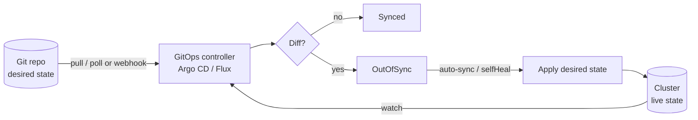
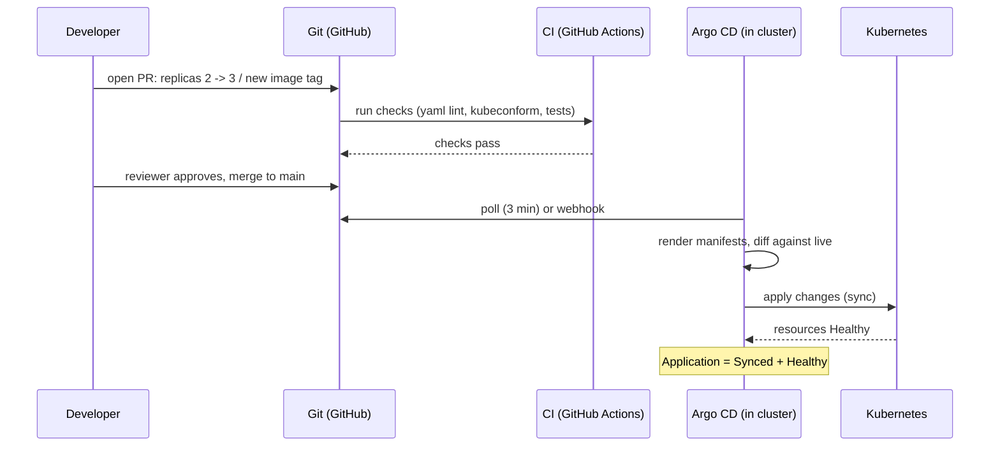
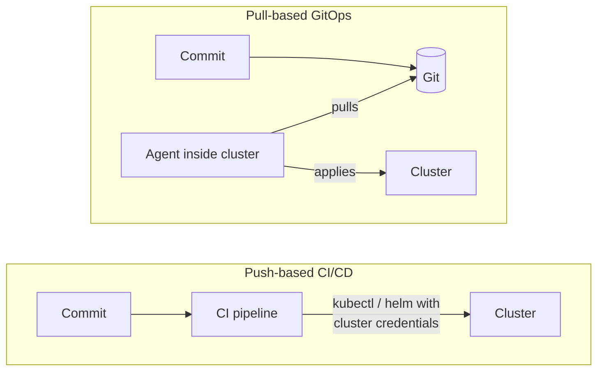
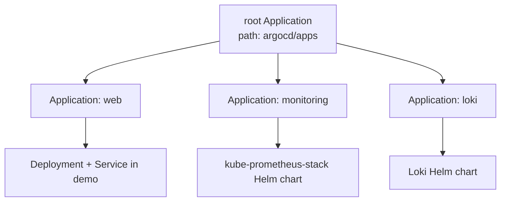

# Task 3 - GitOps

**Student:** Bhuvanesh M S (24bcs10134)
**Session:** 20 - Monitoring, Observability and GitOps

In class, GitOps was summed up as:

```text
Git        = desired state
Kubernetes = actual state
Argo CD    = keeps them synchronized (the reconciler)
```

Below I go through each required topic. The Argo CD examples follow the same structure as the class demo
(`session20-monitoring-observability-gitops/07-argocd` and `08-mini-project`).

---

## 1. What is GitOps?

GitOps is an operating model where **the desired state of the whole system (apps and infrastructure) is
stored declaratively in Git**, and **a software agent running in the target environment continuously pulls
that state and reconciles the live system to match it**.

The term was introduced by Weaveworks in 2017. The vendor-neutral definition is maintained by the
**OpenGitOps** project (CNCF), whose four principles are covered in section 9.

| Without GitOps | With GitOps |
|---|---|
| `kubectl apply` from laptops or CI | Merge a pull request; an agent applies it |
| Cluster state may differ from any file | Git is the reference; differences are flagged and corrected |
| "Who changed this?" -> nobody knows | `git log` / `git blame` |
| Rollback = rerun an old pipeline and hope | Rollback = `git revert` |
| CI needs cluster-admin credentials | Only the in-cluster agent has cluster access |

---

## 2. Git as the source of truth

"Source of truth" means that **if Git and the cluster disagree, Git is right**. The cluster is a
running copy of what Git declares.

What Git provides (from the class material): **history, review, diffs, rollback point, collaboration,
audit trail.**

| Git feature | GitOps benefit |
|---|---|
| Commits | Every change to production is versioned with author and timestamp |
| Pull requests | Peer review and CI checks (lint, `kubeconform`, policy) before anything reaches the cluster |
| Branch protection | Enforces approvals; nobody pushes to `main` directly |
| `git revert` | Rollback is a normal, audited change |
| Cloning the repo | Disaster recovery: a new cluster plus the same repo gives the same environment |

Typical repository layout (the exact structure is an engineering choice):

```text
gitops-repo/
|-- apps/
|   |-- web/
|   |   |-- base/                 # deployment.yaml, service.yaml, kustomization.yaml
|   |   `-- overlays/
|   |       |-- dev/              # replicas: 1, image tag dev
|   |       `-- prod/             # replicas: 3, resource limits
|-- infrastructure/               # ingress-nginx, cert-manager, monitoring
`-- argocd/
    |-- root-app.yaml             # App of Apps entry point
    `-- apps/                     # one Argo CD Application per app/environment
```

Many teams keep **application source code** and **deployment manifests** in separate repositories. CI
builds the image from the code repo and then updates the image tag in the config repo with a commit.

---

## 3. Declarative configuration

**Imperative:** a list of commands that say *how* to get there.
**Declarative:** a description of *what* the end state should be. The tool works out the steps.

```bash
# Imperative - the result depends on the current state and on who ran what
kubectl create deployment web --image=nginx:1.27-alpine
kubectl scale deployment web --replicas=3
kubectl set image deployment/web nginx=nginx:1.28-alpine
```

```yaml
# Declarative - the full desired state, can be applied repeatedly with the same result
apiVersion: apps/v1
kind: Deployment
metadata:
  name: web
  namespace: demo
spec:
  replicas: 3
  selector:
    matchLabels: { app: web }
  template:
    metadata:
      labels: { app: web }
    spec:
      containers:
        - name: nginx
          image: nginx:1.28-alpine
          ports:
            - containerPort: 80
```

Declarative config is a prerequisite for GitOps: a controller can only compare desired and actual state
if the desired state is written down completely. Plain YAML, **Kustomize** and **Helm** charts all work,
because Argo CD and Flux render them into manifests.

---

## 4. Continuous reconciliation

Kubernetes controllers already work as control loops (observe -> diff -> act). GitOps adds one more loop
whose desired state comes from Git.



| Term | Meaning |
|---|---|
| **Pull-based** | The agent runs *inside* the cluster and fetches from Git. Nothing outside needs cluster credentials. |
| **Drift** | The live state differs from Git (someone ran `kubectl edit`, or a resource was deleted). |
| **Drift detection** | Argo CD marks the Application `OutOfSync` and shows a diff in the UI / `argocd app diff`. |
| **Self-heal** | With `selfHeal: true` Argo CD reverts drift automatically. |
| **Prune** | With `prune: true` resources deleted from Git are deleted from the cluster. |
| **Polling interval** | Argo CD checks Git every 3 minutes by default (`timeout.reconciliation` in `argocd-cm`); a Git webhook makes it immediate. |

The class demo of self-heal (`08-mini-project` step 8):

```bash
kubectl scale deployment session20-mini -n session20 --replicas=1   # create drift
kubectl get deployment session20-mini -n session20 -w               # Argo CD returns it to 3
```

---

## 5. GitOps workflow



1. **Change**: edit YAML in a branch (scale, bump image tag, add a ConfigMap).
2. **Pull request**: CI validates the manifests; a teammate reviews the diff.
3. **Merge**: `main` now holds the new desired state; this commit is the audit record.
4. **Sync**: the controller detects the new commit and applies it.
5. **Verify**: Argo CD reports Sync and Health status; monitoring (Task 1) confirms the app behaves.
6. **Rollback**: `git revert <sha>` and merge, which goes through the same loop.

For application releases the loop starts in the code repo: CI builds and pushes `web:1.4.2`, then
commits the new tag to the config repo (or a tool such as Argo CD Image Updater does it).

---

## 6. Push-based CI/CD vs pull-based GitOps



| Aspect | Push-based (Jenkins/GitHub Actions run `kubectl apply`) | Pull-based GitOps (Argo CD / Flux) |
|---|---|---|
| Who touches the cluster | External CI runner | Agent inside the cluster |
| Credentials | Cluster credentials stored in CI (larger attack surface) | Cluster credentials stay in the cluster; agent needs only read access to Git |
| Drift | Not detected; deploy happens only when the pipeline runs | Detected continuously; optionally self-healed |
| Network | CI must reach the API server | Cluster only needs outbound access to Git (works behind firewalls) |
| Rollback | Re-run old pipeline | `git revert` |
| Multi-cluster | One pipeline step per cluster | Each cluster (or a central Argo CD) pulls its own config |
| Role of CI | Build, test **and** deploy | Build, test, push image, update Git; **deployment is separate** |

GitOps does not replace CI. CI still builds and tests. GitOps replaces the *deploy* step.

---

## 7. Kubernetes + GitOps: Argo CD and Flux

### 7.1 Comparison

| | Argo CD | Flux (v2) |
|---|---|---|
| Project | CNCF graduated | CNCF graduated |
| Main object | `Application` (+ `ApplicationSet`, `AppProject`) | `GitRepository`/`OCIRepository` + `Kustomization` / `HelmRelease` |
| UI | Built-in web UI with resource tree and diffs | No built-in UI (CLI-first; third-party UIs exist) |
| Multi-tenancy | `AppProject`, SSO, RBAC | Kubernetes RBAC, namespaces, service account impersonation |
| Helm | Renders with `helm template`, then applies | Native Helm releases via helm-controller |
| Secrets (SOPS) | Via plugins (e.g. KSOPS, helm-secrets) | Built-in SOPS decryption in `Kustomization` |
| Image automation | Argo CD Image Updater (separate project) | image-reflector + image-automation controllers |

### 7.2 Argo CD architecture

| Component | Role |
|---|---|
| `argocd-server` | API + web UI + CLI endpoint |
| `argocd-repo-server` | Clones Git and renders manifests (plain YAML, Kustomize, Helm) |
| `argocd-application-controller` | Compares rendered manifests with live state; performs syncs |
| `argocd-applicationset-controller` | Generates Applications from templates |
| `argocd-redis`, `argocd-dex-server`, `argocd-notifications-controller` | Cache, SSO, notifications |

Installation, as in class:

```bash
kubectl create namespace argocd
kubectl apply -n argocd --server-side --force-conflicts \
  -f https://raw.githubusercontent.com/argoproj/argo-cd/stable/manifests/install.yaml
kubectl port-forward svc/argocd-server -n argocd 8080:443
kubectl -n argocd get secret argocd-initial-admin-secret -o jsonpath="{.data.password}" | base64 -d && echo
```

### 7.3 The Application CRD

```yaml
apiVersion: argoproj.io/v1alpha1
kind: Application
metadata:
  name: demo-web
  namespace: argocd                       # Applications live in the Argo CD namespace
  finalizers:
    - resources-finalizer.argocd.argoproj.io   # delete app => delete its resources (cascade)
spec:
  project: default                        # AppProject: allowed repos, clusters, namespaces
  source:
    repoURL: https://github.com/<user>/<gitops-repo>.git
    targetRevision: main                  # branch, tag or commit SHA
    path: apps/web/overlays/dev           # directory to render
    # kustomize: / helm: { valueFiles: [values-dev.yaml] } for tool-specific options
  destination:
    server: https://kubernetes.default.svc   # the cluster Argo CD runs in (or use `name:`)
    namespace: demo
  syncPolicy:
    automated:
      prune: true                         # delete resources removed from Git
      selfHeal: true                      # revert manual changes in the cluster
    syncOptions:
      - CreateNamespace=true
      - PruneLast=true                    # prune after other resources are healthy
    retry:
      limit: 5
      backoff:
        duration: 5s
        factor: 2
        maxDuration: 3m
  revisionHistoryLimit: 10
  ignoreDifferences:                      # fields that are allowed to drift
    - group: apps
      kind: Deployment
      jsonPointers:
        - /spec/replicas                  # e.g. when an HPA manages replicas
```

| Field | Purpose |
|---|---|
| `spec.project` | Security boundary (`AppProject`) restricting source repos and destinations |
| `spec.source.repoURL / targetRevision / path` | *Where* the desired state is in Git |
| `spec.sources` | Multiple sources (e.g. Helm chart from one repo, values from another) |
| `spec.destination.server` or `.name` + `.namespace` | *Where* to deploy |
| `spec.syncPolicy.automated` | Turns on auto-sync; without it syncs are manual |
| `spec.syncPolicy.syncOptions` | Behaviour flags such as `CreateNamespace=true`, `ServerSideApply=true` |
| `spec.ignoreDifferences` | Stops expected mutations from showing as drift |

**Status fields:** *Sync status* = `Synced` / `OutOfSync` / `Unknown` (Git vs live). *Health status* =
`Healthy` / `Progressing` / `Degraded` / `Suspended` / `Missing` / `Unknown` (are the resources actually
working).

### 7.4 Sync policies

| Setting | Behaviour |
|---|---|
| Manual (no `automated`) | Argo CD shows `OutOfSync`; a human clicks Sync or runs `argocd app sync` |
| `automated: {}` | New Git commits are applied automatically; deleted resources stay; manual drift stays |
| `automated.prune: true` | Resources removed from Git are deleted from the cluster |
| `automated.selfHeal: true` | Live changes not in Git are reverted (drift correction) |
| `automated.allowEmpty: true` | Allows pruning to leave the app with zero resources (off by default as a safety net) |

Useful CLI commands:

```bash
argocd login localhost:8080 --username admin --insecure
argocd app list
argocd app get demo-web
argocd app diff demo-web              # what would change
argocd app sync demo-web              # manual sync
argocd app history demo-web
argocd app rollback demo-web <ID>     # only when auto-sync is disabled; otherwise use git revert
kubectl get applications -n argocd    # SYNC STATUS / HEALTH STATUS columns
```

### 7.5 App of Apps

As the number of Applications grows, I do not want to `kubectl apply` each one. **App of Apps** means
one *root* Application whose `path` holds other `Application` manifests. Argo CD syncs the root, which
creates the child Applications, which deploy the workloads. After that, adding an app means committing
one YAML file.



```yaml
apiVersion: argoproj.io/v1alpha1
kind: Application
metadata:
  name: root
  namespace: argocd
spec:
  project: default
  source:
    repoURL: https://github.com/<user>/<gitops-repo>.git
    targetRevision: main
    path: argocd/apps            # contains web.yaml, monitoring.yaml, loki.yaml (each a kind: Application)
  destination:
    server: https://kubernetes.default.svc
    namespace: argocd
  syncPolicy:
    automated:
      prune: true
      selfHeal: true
```

**ApplicationSet** solves a similar problem with generators (list, Git directory, cluster, matrix). It
templates one Application per environment, cluster or folder.

### 7.6 Flux equivalent (for comparison)

```yaml
apiVersion: source.toolkit.fluxcd.io/v1
kind: GitRepository
metadata:
  name: gitops-repo
  namespace: flux-system
spec:
  interval: 1m
  url: https://github.com/<user>/<gitops-repo>.git
  ref:
    branch: main
---
apiVersion: kustomize.toolkit.fluxcd.io/v1
kind: Kustomization
metadata:
  name: web-dev
  namespace: flux-system
spec:
  interval: 10m
  sourceRef:
    kind: GitRepository
    name: gitops-repo
  path: ./apps/web/overlays/dev
  prune: true
  targetNamespace: demo
```

---

## 8. Secrets in GitOps

Kubernetes `Secret` objects are only **base64-encoded**, not encrypted, so committing them to Git leaks
them. The three common options:

| Approach | How it works | Git contains | Trade-off |
|---|---|---|---|
| **Sealed Secrets** (Bitnami) | `kubeseal` encrypts with the controller's public key; only the in-cluster controller can decrypt into a normal Secret | `SealedSecret` (ciphertext) | Simple; ciphertext is tied to one cluster's key |
| **External Secrets Operator** | `ExternalSecret` references a key in Vault / AWS Secrets Manager / GCP / Azure Key Vault; operator syncs it into a Secret | Only a pointer, no secret data | Needs an external secret manager; best for production and rotation |
| **SOPS** (+ age / PGP / cloud KMS) | Encrypts only the values in the YAML; decrypted at deploy time | Encrypted YAML (keys readable, values encrypted) | Native in Flux; Argo CD needs a plugin such as KSOPS |

```bash
# Sealed Secrets
kubectl create secret generic db-creds -n demo \
  --from-literal=password='S3cr3t!' --dry-run=client -o yaml \
  | kubeseal --format yaml > db-creds-sealed.yaml     # safe to commit

# SOPS with age: encrypt only data/stringData
sops --encrypt --age <age-public-key> --encrypted-regex '^(data|stringData)$' \
  secret.yaml > secret.enc.yaml
```

```yaml
# External Secrets Operator
apiVersion: external-secrets.io/v1
kind: ExternalSecret
metadata:
  name: db-creds
  namespace: demo
spec:
  refreshInterval: 1h
  secretStoreRef:
    name: vault-backend
    kind: ClusterSecretStore
  target:
    name: db-creds            # the Kubernetes Secret that will be created
  data:
    - secretKey: password
      remoteRef:
        key: demo/db
        property: password
```

---

## 9. OpenGitOps principles (v1.0.0)

| # | Principle | Official meaning (paraphrased) | How Argo CD meets it |
|---|---|---|---|
| 1 | **Declarative** | The desired state of a GitOps-managed system is expressed declaratively | Kubernetes YAML / Kustomize / Helm in Git |
| 2 | **Versioned and Immutable** | Desired state is stored in a way that enforces immutability and versioning and keeps the complete history | Git commits (immutable SHAs), protected `main`, `git revert` rollback |
| 3 | **Pulled Automatically** | Software agents automatically pull the desired state declarations from the source | `argocd-repo-server` polls / receives webhooks from Git |
| 4 | **Continuously Reconciled** | Software agents continuously observe the actual system state and attempt to apply the desired state | `argocd-application-controller` diffing + `selfHeal` |

---

## Key takeaways

- GitOps = **declarative desired state in Git** + **an in-cluster agent that pulls and continuously
  reconciles** it.
- Git is the source of truth: every change is a reviewed, audited commit, and rollback is `git revert`.
- Pull-based GitOps keeps cluster credentials out of CI, detects drift, and can self-heal it. CI still
  builds and tests, and GitOps handles deployment.
- Argo CD `Application` (`argoproj.io/v1alpha1`) = source (repo, revision, path) + destination (cluster,
  namespace) + syncPolicy (`automated`, `prune`, `selfHeal`, `syncOptions`).
- App of Apps / ApplicationSet scale GitOps to many apps and clusters. Flux is the main alternative.
- Never commit plain Secrets: use Sealed Secrets, External Secrets Operator or SOPS.
- The four OpenGitOps principles: Declarative, Versioned and Immutable, Pulled Automatically,
  Continuously Reconciled.

---

## Interview questions

**Q1. What is GitOps and how is it different from ordinary CI/CD?**
GitOps stores the desired state of the system declaratively in Git, and an agent in the cluster pulls and
reconciles it continuously. In ordinary push-based CI/CD the pipeline runs `kubectl`/`helm` against the
cluster with stored credentials and then stops, so drift goes unnoticed. In GitOps CI only builds and
updates Git, and deployment is a continuous pull-based process.

**Q2. What do `prune` and `selfHeal` do in an Argo CD sync policy?**
`prune: true` deletes cluster resources that were removed from Git. Without it they stay behind as
orphans. `selfHeal: true` makes Argo CD revert changes made directly in the cluster (such as
`kubectl scale`) back to what Git declares. Both only apply when `automated` sync is enabled.

**Q3. Someone ran `kubectl edit` in production. What happens with Argo CD?**
The application controller detects that live state differs from Git and marks the Application
`OutOfSync`, with the diff visible in the UI. With `selfHeal: true` it re-applies the Git state
automatically. Without it, the drift stays until someone syncs. In both cases the correct fix is to make
the change through a pull request.

**Q4. How do you manage secrets when everything is in Git?**
Never commit plain `Secret` manifests, because base64 is not encryption. Options: Sealed Secrets (commit
ciphertext only the cluster controller can decrypt), External Secrets Operator (commit a reference and
the operator fetches from Vault or a cloud secret manager), or SOPS (commit values encrypted with
age/PGP/KMS and decrypt at deploy time).

**Q5. What is the App of Apps pattern?**
A single root Argo CD Application points to a Git directory containing other Application manifests.
Syncing the root creates and manages all child Applications. This lets you bootstrap a whole cluster from
one `kubectl apply`, and adding or removing an app becomes a Git commit. ApplicationSet is the
generator-based alternative for many similar apps or clusters.
