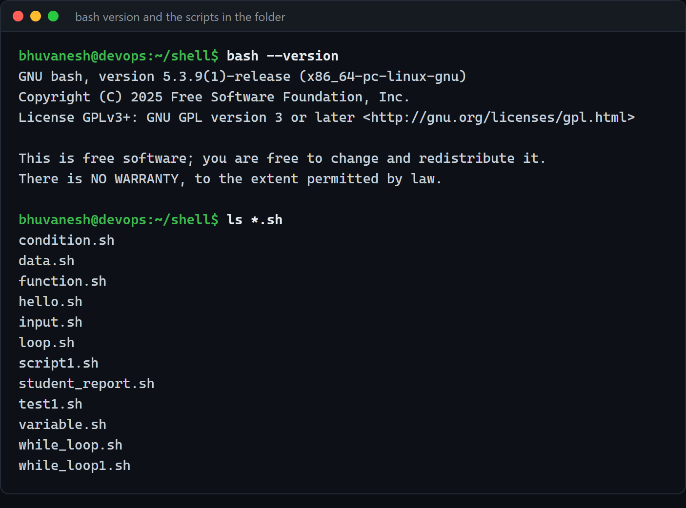
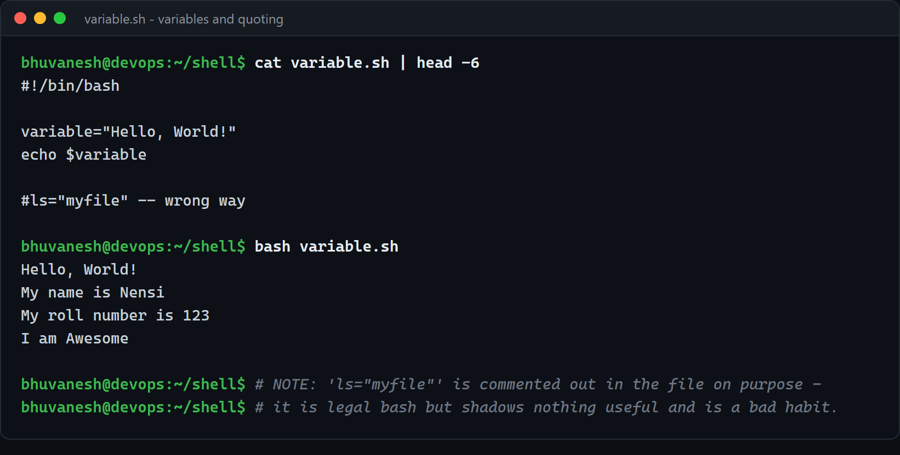
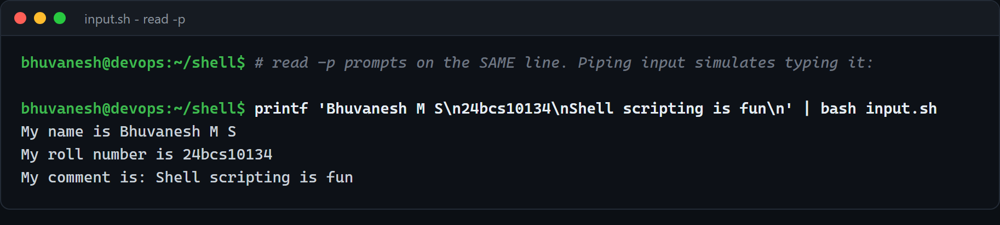
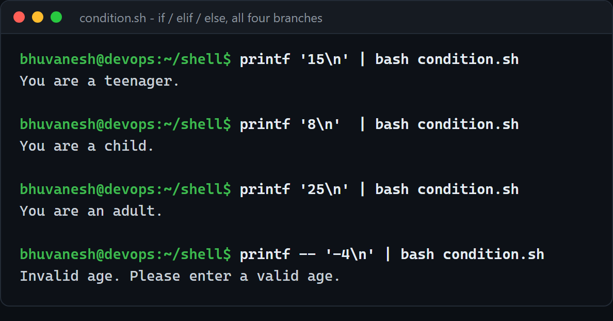
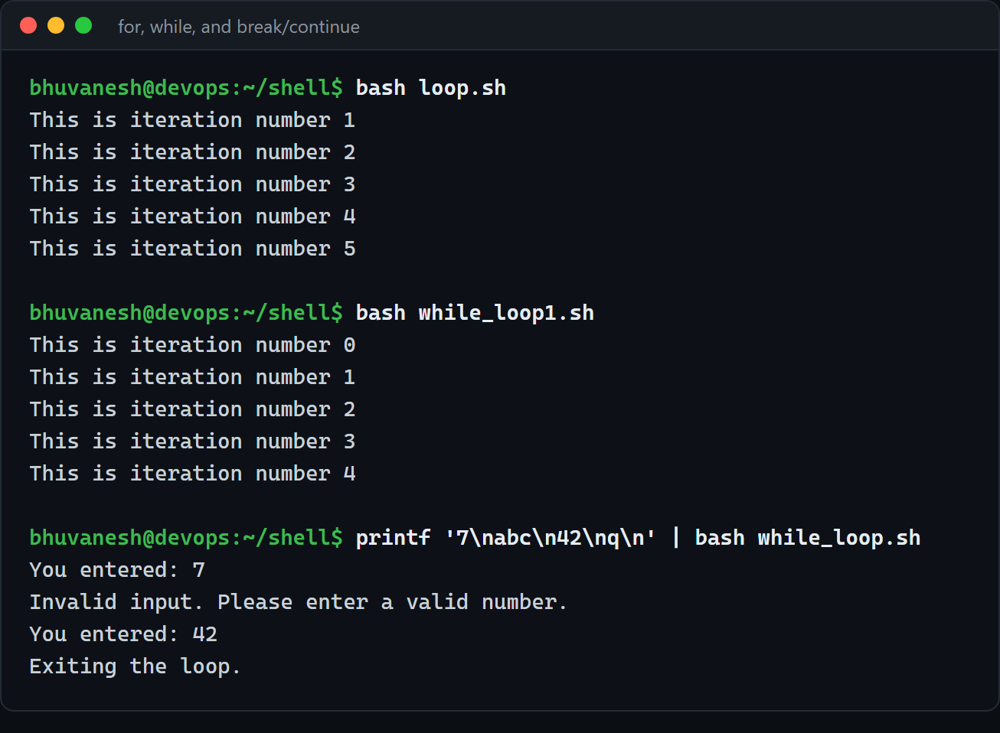
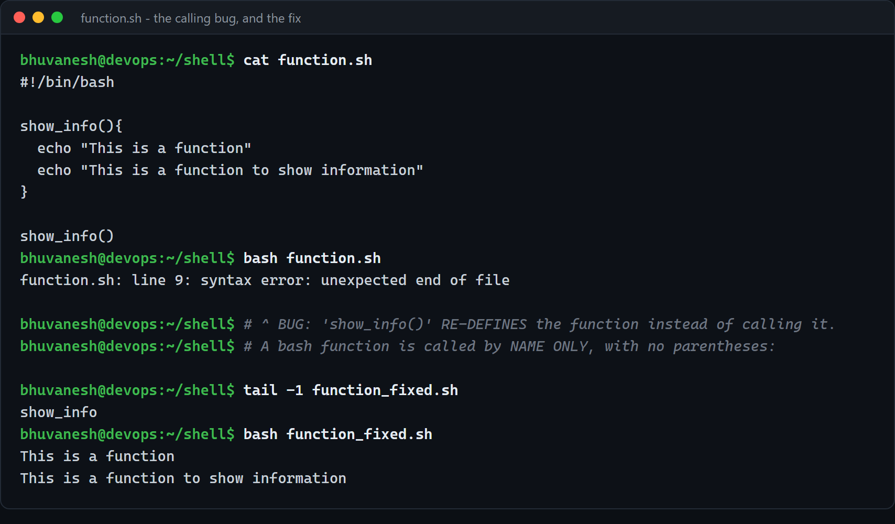
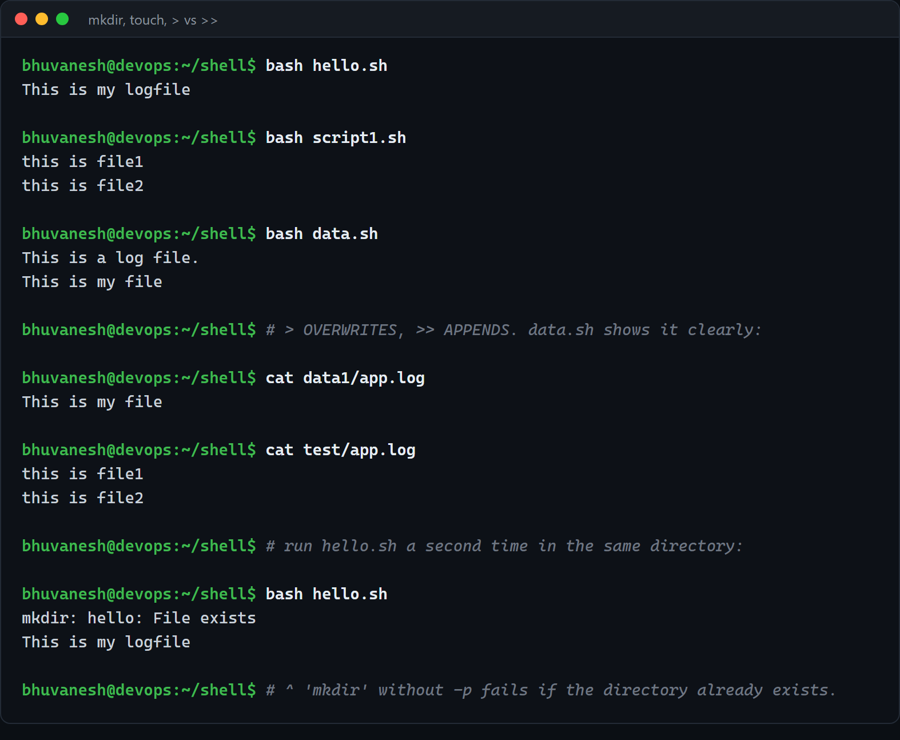
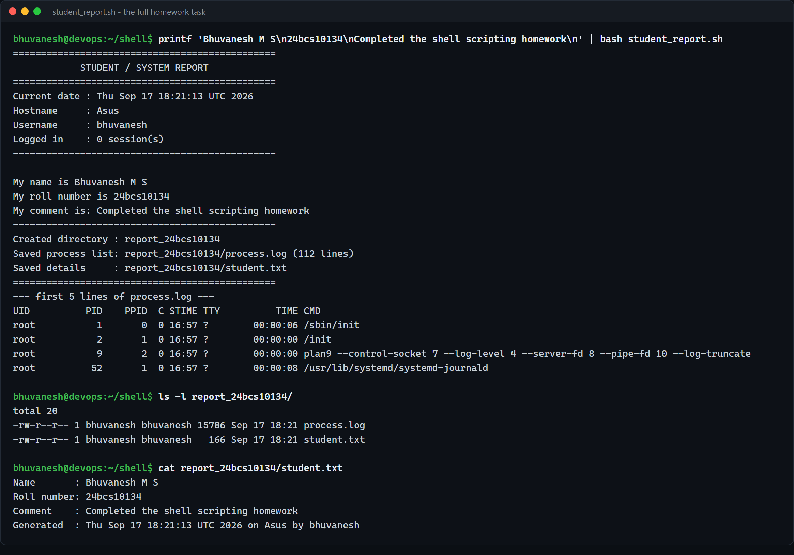

# Shell Scripting (Homework Submission)

**Name:** Bhuvanesh M S
**Enrollment number:** 24bcs10134
**Environment:** Ubuntu 26.04 LTS on WSL 2 (Windows 11) · GNU bash 5.3.9

---

## Homework task ([task.md](task.md))

Write shell scripts that:

1. Print the **current date**
2. Print the **hostname** and the **username**
3. Capture **process information into a file** using `>` redirection
4. Print **name, roll number and a comment**
5. Use **variables**, take input with **`read -p`**, and **create a directory and a file**

plus practise the class-along scripts: variables, input, conditionals, loops, functions, and
file/redirection operations.



---

## 1 — Variables

[`variable.sh`](variable.sh)

```bash
variable="Hello, World!"
echo $variable

name="Nensi"
roll_no=123
comment="Awesome"
echo "My name is $name"
```



**What I understood**

- **No spaces around `=`.** `name = "Nensi"` is not an assignment — bash reads it as running a
  command called `name`. This is the single most common beginner error.
- **Everything is a string.** `roll_no=123` stores the *characters* `123`. Bash only treats it
  as a number when the context demands it (`-lt`, `(( ))`).
- **Always quote when you expand: `"$name"`.** Unquoted `$name` is word-split, so a value with
  a space becomes two arguments. My name has spaces in it, which makes this immediately real.
- The file deliberately keeps `#ls="myfile"` commented out. It is legal bash, but naming a
  variable after a command is a trap — you end up unsure whether `$ls` or `ls` was meant.
- Use `$( )` to capture **command output** into a variable: `current_date=$(date)`. This is
  different from `$hostname`, which is just an empty variable — a mistake `task.md` makes on
  purpose.

## 2 — Taking input

[`input.sh`](input.sh)

```bash
read -p "Enter your name: " name
read -p "Enter your roll number: " roll_no
read -p "Enter your comment: " comment
```



`read -p` prints the prompt **on the same line** and waits, instead of needing a separate
`echo`. Because `read` reads from stdin, piping input is a legitimate way to test a script
non-interactively:

```bash
printf 'Bhuvanesh M S\n24bcs10134\nShell scripting is fun\n' | bash input.sh
```

Each `\n` satisfies one `read`. This is how these scripts were run for the screenshots, and
it is also how you would test an interactive script in CI.

## 3 — Conditionals

[`condition.sh`](condition.sh)

```bash
if [ $age -lt 0 ]; then
    echo "Invalid age. Please enter a valid age."
elif [ $age -lt 13 ]; then
    echo "You are a child."
elif [ $age -lt 20 ]; then
    echo "You are a teenager."
else
    echo "You are an adult."
fi
```

All four branches, exercised:



| Input | Output |
| ----- | ------ |
| `8` | You are a child. |
| `15` | You are a teenager. |
| `25` | You are an adult. |
| `-4` | Invalid age. Please enter a valid age. |

**What I understood**

- `[` is **a command**, not syntax. That is why the spaces matter: `[$age -lt 0]` fails,
  because bash looks for a command literally named `[$age`.
- **Numeric vs string comparison are different operators.** `-lt -gt -eq` for numbers,
  `< > =` / `!=` for strings. `[ 10 -lt 9 ]` is false; `[ "10" \< "9" ]` is *true*, because
  string-wise `"1"` sorts before `"9"`.
- The order of the `elif` chain does the work: by the time the second branch is reached, the
  age is already known to be `>= 0`, so `-lt 13` alone is enough. Reordering the branches
  silently breaks it.
- `[[ ]]` (used in `while_loop.sh`) is the bash-specific version — it supports regex with `=~`
  and does not word-split, so it is safer. `[ ]` is POSIX and portable.

## 4 — Loops

[`loop.sh`](loop.sh) · [`while_loop1.sh`](while_loop1.sh) · [`while_loop.sh`](while_loop.sh)



```bash
for i in {1..5}; do echo "This is iteration number $i"; done   # -> 1..5

count=0
while [ $count -lt 5 ]; do
  echo "This is iteration number $count"
  ((count++))                                                  # -> 0..4
done
```

**The two loops print different ranges, and that is the point.** The `for` loop with `{1..5}`
is inclusive of both ends. The `while` loop starts at `0` and stops *before* `5`, so it prints
`0..4` — same number of iterations, different values. Off-by-one errors live exactly here.

`while_loop.sh` adds `break` and `continue` with input validation:

```
input 7    -> You entered: 7
input abc  -> Invalid input. Please enter a valid number.   (continue - skip the rest)
input 42   -> You entered: 42
input q    -> Exiting the loop.                             (break - leave entirely)
```

- **`continue`** skips to the next iteration; **`break`** exits the loop.
- `! [[ $input =~ ^[0-9]+$ ]]` is a regex test: anchored `^...$`, one or more digits. Without
  the anchors, `abc123` would pass.
- `while true` is an infinite loop on purpose — `break` is the only way out, which is the
  right shape for a menu or a prompt.

## 5 — Functions

[`function.sh`](function.sh)



Running the file as committed **fails**:

```
function.sh: line 9: syntax error: unexpected end of file
```

**This is a genuine bug in the script, and a useful one.** The last line is:

```bash
show_info()        # <- this RE-DEFINES the function, it does not call it
```

`name()` in bash begins a **function definition**, and bash then waits for the `{ ... }` body
that never comes — hence "unexpected end of file". A bash function is called by **name only**:

```bash
show_info          # <- correct
```

which produces the expected output:

```
This is a function
This is a function to show information
```

Worth remembering alongside it: bash functions take arguments positionally as `$1`, `$2` — not
in the parentheses — and `return` only returns an **exit status** (0–255), not a value. To
return data you `echo` it and capture with `$( )`.

## 6 — Files, directories and redirection

[`hello.sh`](hello.sh) · [`script1.sh`](script1.sh) · [`data.sh`](data.sh)



```bash
# data.sh
echo "This is a log file." > app.log     # creates / OVERWRITES
cat app.log                              # -> This is a log file.
echo "This is my file"    > app.log      # OVERWRITES again
cat app.log                              # -> This is my file

# script1.sh
echo "this is file1" >  app.log          # overwrite
echo "this is file2" >> app.log          # APPEND
cat app.log                              # -> both lines
```

**`>` truncates the file first; `>>` appends.** The final contents prove it:

```
$ cat data1/app.log       ->  This is my file          (only the last write survived)
$ cat test/app.log        ->  this is file1
                              this is file2            (both writes survived)
```

Running `hello.sh` a second time shows the other lesson:

```
$ bash hello.sh
mkdir: hello: File exists
This is my logfile
```

**`mkdir` fails if the directory already exists**, which makes a script non-repeatable. The fix
is `mkdir -p`, which succeeds silently either way — that is what my homework script uses.

> Note the script keeps running after the failed `mkdir`. Bash does **not** stop on error by
> default. `set -e` (or better, `set -euo pipefail`) is what makes a script abort on the first
> failure.

## 7 — The homework script

[`student_report.sh`](student_report.sh) — covers every requirement in `task.md` in one place.



```
===============================================
            STUDENT / SYSTEM REPORT
===============================================
Current date : Thu Sep 17 18:21:13 UTC 2026
Hostname     : Asus
Username     : bhuvanesh
Logged in    : 0 session(s)
-----------------------------------------------
My name is Bhuvanesh M S
My roll number is 24bcs10134
My comment is: Completed the shell scripting homework
-----------------------------------------------
Created directory : report_24bcs10134
Saved process list: report_24bcs10134/process.log (112 lines)
Saved details     : report_24bcs10134/student.txt
```

and the artefacts it produced on disk:

```
$ ls -l report_24bcs10134/
-rw-r--r-- 1 bhuvanesh bhuvanesh 15786 Sep 17 18:21 process.log
-rw-r--r-- 1 bhuvanesh bhuvanesh   166 Sep 17 18:21 student.txt

$ cat report_24bcs10134/student.txt
Name       : Bhuvanesh M S
Roll number: 24bcs10134
Comment    : Completed the shell scripting homework
Generated  : Thu Sep 17 18:21:13 UTC 2026 on Asus by bhuvanesh
```

| Requirement | How it is done |
| ----------- | -------------- |
| Current date | `current_date=$(date)` |
| Hostname / username | `$(hostname)` and `$(whoami)` |
| Variables | every value goes through one |
| Input | `read -p` × 3 |
| Create a directory | `mkdir -p "report_${roll_no}"` — named from the input |
| Create a file | `touch "$report_dir/process.log"` |
| Process info into a file | `ps -ef > "$report_dir/process.log"` |
| Name / roll number / comment | echoed, **and** written to `student.txt` |

The directory name is built from the roll number the user typed (`report_${roll_no}`), which
is the point of using variables rather than hardcoding — the same script gives every student
their own folder.

A related script, [`test1.sh`](test1.sh), is the in-class version of the same idea.

---

## One real problem: CRLF line endings

Worth recording, because it stopped every script from running.

The `.sh` files in this repository were committed from Windows with **CRLF** line endings.
Run from WSL, bash fails immediately:

```
input.sh: line 2: $'\r': command not found
input.sh: line 3: read: `name': not a valid identifier
condition.sh: line 7: syntax error near unexpected token `elif'
```

The carriage return is not whitespace to bash — it becomes **part of the last token on every
line**, so `read -p "..." name\r` asks for a variable literally called `name\r`, and
`fi\r` never closes the `if`.

Fixed by converting the files to LF and adding a [`.gitattributes`](../.gitattributes) at the
repository root so git keeps them that way:

```
*.sh   text eol=lf
*.yaml text eol=lf
*.yml  text eol=lf
```

```bash
file *.sh
# before: Bourne-Again shell script, ASCII text executable, with CRLF line terminators
# after:  Bourne-Again shell script, ASCII text executable
```

## Summary

| Homework item | Status |
| ------------- | ------ |
| Print the current date | Done — §7 |
| Print hostname and username | Done — §7 |
| Process info into a file with `>` | Done — §7 |
| Print name, roll number, comment | Done — §2, §7 |
| Variables | Done — §1 |
| Input with `read -p` | Done — §2 |
| Create a directory and a file | Done — §6, §7 |
| Conditionals, loops, functions | Done — §3, §4, §5 |
