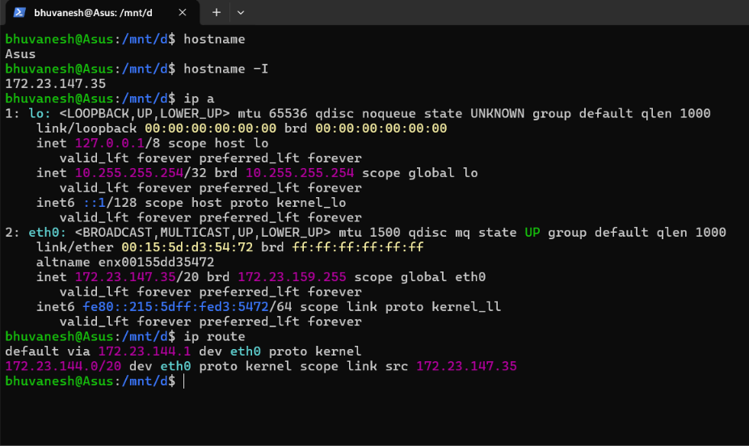
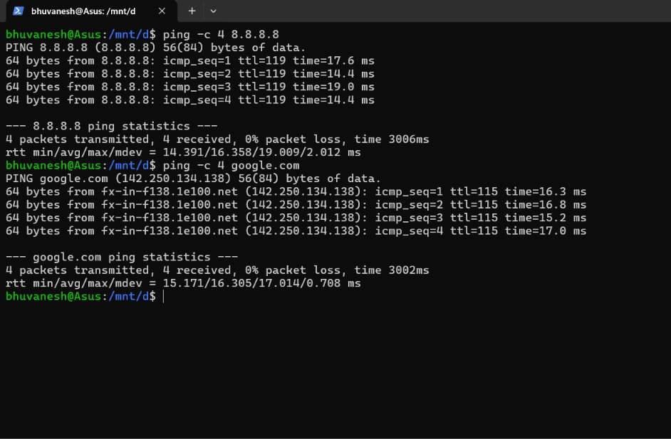
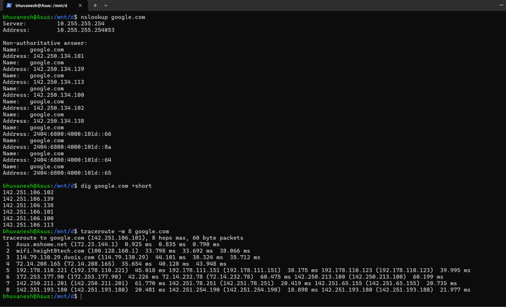
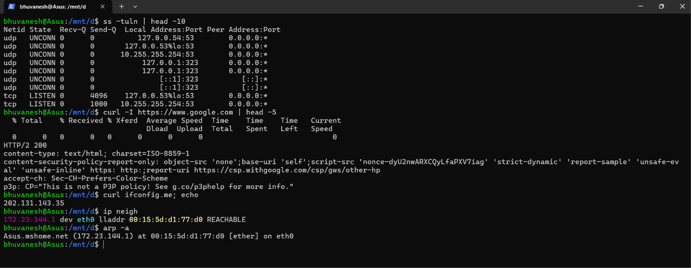

# Session 4 — Networking (Homework Submission)

**Name:** Bhuvanesh M S (24bcs10134)
**Environment used:** Ubuntu on WSL 2 (Windows 11)

## Homework tasks

1. Practice the commands and the repositories shared in the instructor's GitHub repo.
2. Create a Markdown file, execute the networking commands, add the output/screenshots, and
   write a short explanation of what was understood about each command.

---

## Task 1 — Repositories practised

Resources shared by the instructor
([full list](https://github.com/stars/Nency-Ravaliya/lists/networking)):

| Repository | Topic covered |
| ---------- | ------------- |
| [Networking](https://github.com/Nency-Ravaliya/Networking) | Core networking fundamentals |
| [Subnetting](https://github.com/Nency-Ravaliya/Subnetting) | Subnet masks, network vs host bits |
| [IP-quest](https://github.com/Nency-Ravaliya/IP-quest) | IP addressing practice |
| [OSI-Network-devices](https://github.com/Nency-Ravaliya/OSI-Network-devices) | OSI layers and the devices at each |
| [Network-Troubleshooting](https://github.com/Nency-Ravaliya/Network-Troubleshooting) | Diagnosing connectivity problems |
| [How-DHCP-Works](https://github.com/Nency-Ravaliya/How-DHCP-Works) | Automatic IP assignment |
| [IPFIX-NETFLOW-NTP](https://github.com/Nency-Ravaliya/IPFIX-NETFLOW-NTP) | Flow monitoring and time sync |

My own class notes on IP classes and subnetting are in [ip.md](ip.md).

### Key concepts revised

**IP address** — a unique identifier for a device on a network. IPv4 is **32 bits**, written
as four octets (`192.168.1.10`), each 0–255.

**Address classes:**

| Class | First octet range | Default subnet mask | Network / host bits |
| ----- | ----------------- | ------------------- | ------------------- |
| A | 1 – 127   | 255.0.0.0       | 8 network / 24 host |
| B | 128 – 191 | 255.255.0.0     | 16 network / 16 host |
| C | 192 – 223 | 255.255.255.0   | 24 network / 8 host |
| D | 224 – 239 | (multicast)     | — |

**Subnet mask** — separates the **network** part of an address from the **host** part. In
`120.27.1.0/8`, the `/8` means the first 8 bits are the network, leaving 24 host bits.

**Counting hosts** — with 24 host bits: 2²⁴ total addresses, but **2²⁴ − 2** usable, because
the first address is the *network address* and the last is the *broadcast address*.

**Private IP ranges** (not routable on the public internet):

| Class | Range |
| ----- | ----- |
| A | 10.0.0.0 – 10.255.255.255 |
| B | 172.16.0.0 – 172.31.255.255 |
| C | 192.168.0.0 – 192.168.255.255 |

**Special addresses** — `127.0.0.1` is loopback (the machine itself), `0.0.0.0` means "any
address", and `255.255.255.255` is the broadcast address.

---

## Task 2 — Networking commands, output and explanations

> Six of these tools are not installed by default on Ubuntu and were installed first:
>
> ```bash
> sudo apt update
> sudo apt install -y net-tools dnsutils traceroute
> ```
>
> `net-tools` provides `ifconfig`, `netstat`, `route` and `arp`; `dnsutils` provides `dig`
> and `nslookup`.

---

## A. Identity and configuration — `hostname`, `ip a`, `ip route`

```bash
hostname          # the name of this machine
hostname -I       # all IP addresses assigned to it
ip a              # short for "ip address" - all interfaces
ip route          # where traffic is sent
```



### 1. `hostname`

**What I understood:** `hostname` prints the name identifying this machine on the network —
here **`Asus`**. The `-I` flag lists its IP addresses (**172.23.147.35**), which is the
quickest way to find your own IP without reading the full `ip a` output.

### 2. `ip a` — interfaces and IP addresses

**What I understood:** `ip a` is the **modern standard** command for viewing network
interfaces. Reading my output:

- **`lo`** is the **loopback** interface at `127.0.0.1/8` — the machine talking to itself.
  It is always present and never leaves the computer.
- **`eth0`** is the real network interface, `state UP`, carrying actual traffic.
- `link/ether 00:15:5d:d3:54:72` is the **MAC address** — the hardware identifier fixed to
  the network card, unlike the IP address, which can change.
- `inet 172.23.147.35/20` is the IP with its **prefix length**. `/20` means 20 network bits
  and 12 host bits, giving 2¹² − 2 = **4094 usable hosts** on this subnet.
- `brd 172.23.159.255` is the **broadcast address** — the last address in the range, used to
  reach every host on the subnet at once.
- `mtu 1500` is the **Maximum Transmission Unit**: the largest packet size in bytes.
- The `inet6 fe80::...` entry is the IPv6 link-local address, generated automatically.

### 3. `ifconfig` — the older equivalent

**What I understood:** `ifconfig` shows the same information as `ip a` but is the **older,
deprecated** tool from the `net-tools` package, which is why it is not installed by default
on modern Ubuntu. It is worth knowing because older documentation and interview questions
still refer to it, but new work should use `ip a`.

### 4. `ip route` — the routing table

**What I understood:** The routing table decides **where packets go**. My output has two rows:

- `default via 172.23.144.1 dev eth0` — the **default gateway**. Anything not on the local
  network is handed to this router. Note that it matches hop 1 of the traceroute below.
- `172.23.144.0/20 dev eth0 scope link src 172.23.147.35` — traffic for my own subnet goes
  out directly, with no router involved.

Without a correct default gateway, a machine can reach its own subnet but not the internet.

---

## B. Connectivity — `ping`

```bash
ping -c 4 8.8.8.8         # ping Google's DNS by IP
ping -c 4 google.com      # ping by domain name
```



### 5. `ping`

**What I understood:** `ping` sends **ICMP echo request** packets and waits for replies,
confirming a host is reachable and measuring the **round-trip time**. `-c 4` limits it to 4
packets, otherwise it runs forever. From my output:

- **`0% packet loss`** on both — the connection is healthy. Loss here would mean an
  unreliable link.
- `rtt min/avg/max/mdev = 14.391/16.358/19.009/2.012 ms` — the average round trip to
  `8.8.8.8` was about **16 ms**. `mdev` is the variation (jitter); a low value means a stable
  connection.
- **`ttl=119`** — Time To Live, decremented by one at each router. Starting from 128, this
  suggests the reply crossed about **9 routers** on the way back.
- `ping google.com` resolved the name to **142.250.134.138** and showed the reverse name
  `fx-in-f138.1e100.net`, proving **DNS worked as well as connectivity**.

The most useful diagnostic trick: if `ping 8.8.8.8` succeeds but `ping google.com` fails,
the network is fine and the problem is **DNS**.

---

## C. Name resolution and path — `nslookup`, `dig`, `traceroute`

```bash
nslookup google.com       # simple name-to-IP lookup
dig google.com +short     # just the answer
traceroute -m 8 google.com
```



### 6. `nslookup` and `dig` — DNS lookups

**What I understood:** DNS translates **domain names into IP addresses**. From my output:

- `Server: 10.255.255.254` is the **DNS resolver** being used — in WSL this is the virtual
  DNS provided by Windows.
- **"Non-authoritative answer"** means the reply came from a **cache**, not from the domain's
  own authoritative name server. This is normal, and much faster.
- Google returned **many A records** (`142.250.134.101`, `.113`, `.138`, `.139` …) — one
  domain maps to multiple servers for **load balancing**.
- The `2404:6800:4000:101d::66` entries are **AAAA records**, the IPv6 equivalent of A records.
- Interesting detail: `dig +short` returned a **different set** of addresses
  (`142.251.106.x`) from the ones `nslookup` gave (`142.250.134.x`). This is not an error —
  DNS deliberately hands out different servers to spread load and to route users to whichever
  data centre is nearest.
- `+short` strips everything except the answer, which is what makes `dig` useful in scripts.

### 7. `traceroute` — the path packets take

**What I understood:** `traceroute` lists **every router (hop)** a packet passes through, with
the time taken at each. It works by sending packets with an increasing **TTL**, so each router
in turn reports back when the TTL expires. Reading my 8 hops:

- **Hop 1** — `Asus.mshome.net (172.23.144.1)` at 0.9 ms: my own default gateway, matching
  the `ip route` output.
- **Hop 2** — `wifi.height8tech.com (100.128.160.1)`: my ISP. The `100.x` range is
  **carrier-grade NAT**, used by ISPs to share public addresses between customers.
- **Hop 3** — `114.79.130.29.dvois.com`: still inside the ISP network.
- **Hops 4–8** — `72.14.208.165`, then `142.250.x` and `142.251.x`: Google's own network.
- Three times are shown per hop because **three probes** are sent to each one.
- `-m 8` caps the trace at 8 hops so the output fits on one screen.

Where `ping` tells you *whether* a host is reachable, `traceroute` shows **where** the journey
slows down or breaks. Rows of `* * *` mean a hop did not reply — usually a firewall
suppressing ICMP rather than an actual fault.

---

## D. Ports, HTTP and Layer 2 — `ss`, `curl`, `arp`

```bash
ss -tuln | head -10               # listening sockets
curl -I https://www.google.com    # headers only
curl ifconfig.me                  # my public IP address
ip neigh                          # modern ARP table
arp -a                            # legacy equivalent
```



### 8. `netstat` / `ss` — open ports and connections

**What I understood:** These show which **ports** are open and which process is listening on
each. Reading the flags: `-t` TCP, `-u` UDP, `-l` listening only, `-n` numeric (do not resolve
names, which is much faster), `-p` show the process. From my output:

- Several entries on **port 53** (`127.0.0.53`, `10.255.255.254`) — that is **DNS**, run
  locally by `systemd-resolved`.
- **Port 323** on `127.0.0.1` — `chrony`, the NTP time-synchronisation service that also
  appeared in the Session 1 service list.
- `LISTEN` means waiting for incoming connections; `UNCONN` is normal for UDP, which is
  connectionless.
- `0.0.0.0:*` in the peer column means "accept from any address".

`ss` is the modern replacement for `netstat`. This is the command that answers "is my server
actually running and listening?" and "what is already using this port?".

### 9. `curl` and `wget` — fetching over HTTP

**What I understood:** `curl` sends an HTTP request and prints the response.

- `curl -I` fetches only the **headers**. The first line, **`HTTP/2 200`**, is the status
  code — 200 means success — and HTTP/2 is the protocol version.
- The progress table above that output appears because piping into `head` makes curl think it
  is writing to a file; adding `-s` (silent) suppresses it.
- **`curl ifconfig.me` returned `202.131.143.35`** — my **public** IP, the address the
  internet sees. It is completely different from the **private** `172.23.147.35` shown by
  `ip a`. The reason is **NAT** (Network Address Translation): the router rewrites the private
  address into one shared public address. This is why private ranges can be reused by everyone
  without conflict, and it is a very common interview question.
- `wget` downloads a file and saves it to disk. In short: `curl` is for **testing** endpoints,
  `wget` is for **downloading** files.

### 10. `arp` / `ip neigh` — IP to MAC address mapping

**What I understood:** ARP (Address Resolution Protocol) maps an **IP address** to the
**MAC address** of a physical network card. IP addressing works at **Layer 3**, but actual
delivery on a local network happens at **Layer 2** using MAC addresses, so this translation is
what makes local traffic possible. From my output:

- `172.23.144.1 dev eth0 lladdr 00:15:5d:d1:77:d0 REACHABLE` — the gateway's IP resolved to
  its MAC address, and the entry is confirmed working.
- `arp -a` shows the same mapping in the older format, with the hostname `Asus.mshome.net`
  resolved.
- The gateway's MAC (`...d1:77:d0`) differs from my own interface's MAC (`...d3:54:72`) —
  they are two distinct pieces of hardware.
- The table is a **cache** of recent lookups, so the request does not have to be repeated for
  every packet.

---

## Summary of commands

| Command | Purpose | Category |
| ------- | ------- | -------- |
| `hostname` | Machine name and IPs | Identity |
| `ip a` / `ifconfig` | Interfaces, IPs, MAC addresses | Configuration |
| `ip route` / `route -n` | Routing table, default gateway | Routing |
| `ping` | Is the host reachable? | Connectivity (ICMP) |
| `traceroute` | What path do packets take? | Connectivity (path) |
| `nslookup` / `dig` | Domain name → IP | DNS |
| `ss` / `netstat` | Open ports and connections | Sockets |
| `curl` / `wget` | HTTP requests and downloads | Application |
| `arp` / `ip neigh` | IP → MAC address | Layer 2 |

### Old vs new commands

| Deprecated (`net-tools`) | Modern (`iproute2`) |
| ------------------------ | ------------------- |
| `ifconfig` | `ip a` |
| `route -n` | `ip route` |
| `netstat -tulnp` | `ss -tulnp` |
| `arp -a` | `ip neigh` |

### Troubleshooting order I learned

1. `ip a` — do I have an IP address at all?
2. `ping <gateway>` — can I reach my own router? (`172.23.144.1` here)
3. `ping 8.8.8.8` — can I reach the internet by IP?
4. `ping google.com` — does DNS resolve? (failing only here means a DNS problem)
5. `traceroute` — if it is slow or dropping, where does it break?
6. `ss -tuln` — is the service I need actually listening?
