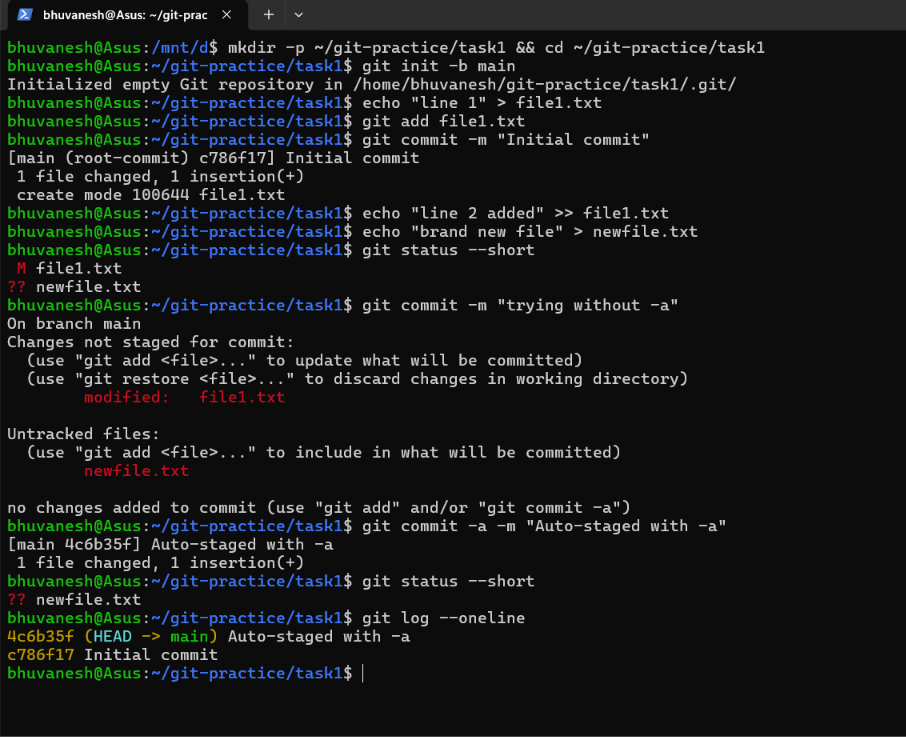
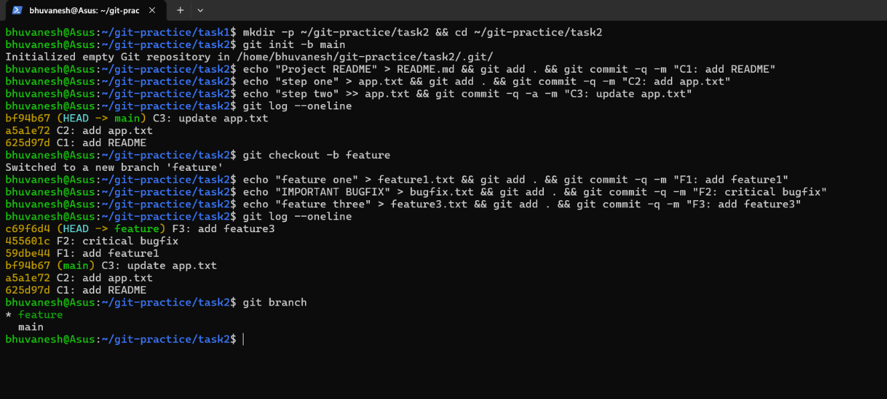
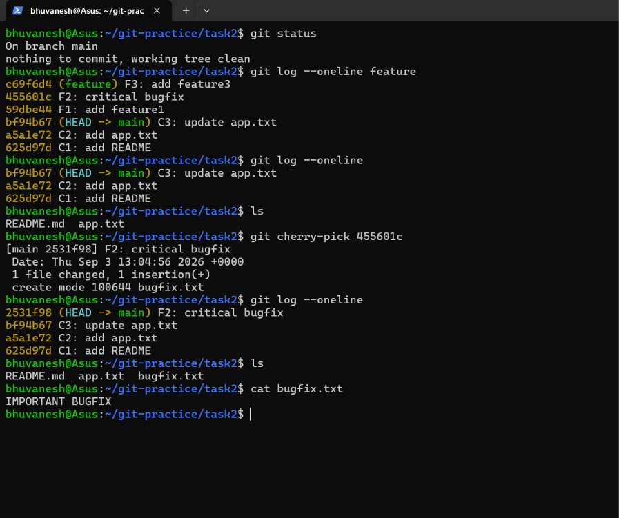

# Session 5 — Git & GitHub (Homework Submission)

**Name:** Bhuvanesh M S (24bcs10134)
**Environment used:** Ubuntu on WSL 2 (Windows 11) · git version 2.53.0

## Homework tasks

1. **`git commit -a -m`** — practise it, understand how it differs from `git commit -m`, and
   test both to observe the difference.
2. **`git cherry-pick`** — create commits on `main`, create a branch with more commits, then
   cherry-pick one specific commit from that branch into `main` and verify it arrived.

> All the practice below was done in a **separate throwaway repository**
> (`~/git-practice`), not in this submission repository, so that the homework commits do not
> pollute the real history.

---

## Setup

Git needs an identity before it will create any commit:

```bash
git config --global user.name "Bhuvanesh M S"
git config --global user.email "your-email@example.com"
git config --global --list      # verify
```

---

## Task 1 — `git commit -m` vs `git commit -a -m`

### The short answer

| | `git commit -m` | `git commit -a -m` |
| --- | --- | --- |
| Stages anything? | No — commits **only** what is already staged with `git add` | Yes — **auto-stages every tracked file that was modified or deleted** |
| Modified tracked files | Ignored unless you `git add` them | Included automatically |
| **Untracked (new) files** | **Not included** | **Still not included** |
| Steps required | `git add` then `git commit` | One step |
| Risk | None — you choose exactly what goes in | Can sweep in unrelated edits you forgot about |

The key point that catches people out: **`-a` does NOT mean "commit everything."** It means
"automatically stage the files git is *already tracking*." A brand-new file git has never seen
is invisible to `-a`, and still needs `git add`.

### Commands used

```bash
mkdir -p ~/git-practice/task1 && cd ~/git-practice/task1
git init -b main

echo "line 1" > file1.txt
git add file1.txt
git commit -m "Initial commit"

# now make TWO kinds of change
echo "line 2 added" >> file1.txt     # modified - git already TRACKS this file
echo "brand new file" > newfile.txt  # brand new - git does NOT track it yet

git status --short

# attempt 1 - plain -m with nothing staged
git commit -m "trying without -a"

# attempt 2 - the -a flag
git commit -a -m "Auto-staged with -a"

git status --short
git log --oneline
```



### What I understood

- The first commit created the **root commit** `c786f17`, reported as
  `[main (root-commit) c786f17]` — the only commit in a repository with no parent.
- In `git status --short`, the two-letter prefix matters: **` M file1.txt`** means *modified
  but not staged*, while **`?? newfile.txt`** means *untracked* — git has never seen it.
- **`git commit -m "trying without -a"` created no commit at all.** It listed the changes and
  ended with `no changes added to commit (use "git add" and/or "git commit -a")`, because
  nothing had been staged. This is the safe default: git commits only what you explicitly
  chose.
- **`git commit -a -m "Auto-staged with -a"` succeeded**, producing commit `4c6b35f` with
  `1 file changed, 1 insertion(+)`. It picked up the modification to `file1.txt`
  automatically, skipping the `git add` step entirely.
- **Crucially, `git status --short` afterwards still showed `?? newfile.txt`.** Even with
  `-a`, the untracked file was not committed — note that the commit reported only *one* file
  changed, not two. To include it you must run `git add newfile.txt` first.
- `git log --oneline` confirms the history is just `4c6b35f` and `c786f17`: the failed
  `-m` attempt left no trace.
- So the working rule: use `-a` as a shortcut when you are only editing files that already
  exist in the repo; use `git add` when you have created new ones.

---

## Task 2 — `git cherry-pick`

### What cherry-pick does

`git merge` brings **all** commits from another branch. `git cherry-pick` copies **one
specific commit** onto the current branch, leaving the rest behind. It is what you reach for
when a single urgent fix exists on a feature branch but the rest of that branch is not ready
to ship.

### Steps 1 and 2 — commits on `main`, then a branch with more commits

```bash
mkdir -p ~/git-practice/task2 && cd ~/git-practice/task2
git init -b main

# three commits on main
echo "Project README" > README.md && git add . && git commit -q -m "C1: add README"
echo "step one" > app.txt && git add . && git commit -q -m "C2: add app.txt"
echo "step two" >> app.txt && git commit -q -a -m "C3: update app.txt"
git log --oneline

# a new branch with three more commits
git checkout -b feature
echo "feature one" > feature1.txt && git add . && git commit -q -m "F1: add feature1"
echo "IMPORTANT BUGFIX" > bugfix.txt && git add . && git commit -q -m "F2: critical bugfix"
echo "feature three" > feature3.txt && git add . && git commit -q -m "F3: add feature3"
git log --oneline
git branch
```



**Observations**

- `main` ended up with three commits: `bf94b67` (C3), `a5a1e72` (C2), `625d97d` (C1).
- `git checkout -b feature` **created the branch and switched to it in one step** — the
  output confirms `Switched to a new branch 'feature'`.
- After three more commits, `git log --oneline` on `feature` shows **six** commits: the three
  new ones (`c69f6d4`, `455601c`, `59dbe44`) sitting **on top of** the three it inherited
  from `main`. A new branch starts as a pointer to the same history, not a copy.
- The `(HEAD -> feature)` and `(main)` labels show where each branch pointer currently is —
  `main` is still parked at `bf94b67` while `feature` has moved ahead.
- `git branch` lists both, with `*` marking `feature` as current.
- The commit I want to move across is **`455601c` — `F2: critical bugfix`**. Identifying this
  hash from `git log --oneline` is what makes the cherry-pick possible.

### Step 3 — cherry-pick that one commit into `main`

```bash
git checkout main
git log --oneline feature   # see the feature commits without switching
git log --oneline           # main has only C1..C3
ls                          # bugfix.txt is absent

git cherry-pick 455601c     # bring across ONLY F2

git log --oneline
ls
cat bugfix.txt
```



### Verification — what I understood

- `git log --oneline feature` was used to inspect the other branch **without switching to
  it** — passing a branch name to `git log` is often quicker than checking it out.
- Before the cherry-pick, `main` had only `README.md` and `app.txt`, and its log showed just
  C1–C3. **`bugfix.txt` did not exist.**
- `git cherry-pick 455601c` reported
  `[main 2531f98] F2: critical bugfix` with `1 file changed, 1 insertion(+)` and
  `create mode 100644 bugfix.txt` — the `create mode` line is git confirming a brand-new file
  arrived.
- Afterwards `ls` shows **`bugfix.txt`** present, and `cat bugfix.txt` prints
  **`IMPORTANT BUGFIX`** — proof the actual file content came across, not merely a log entry.
- **F1 and F3 were left behind.** `feature1.txt` and `feature3.txt` are still absent from
  `main`, which is exactly the point of cherry-pick as opposed to a merge.
- **The commit hash changed: `455601c` on `feature` became `2531f98` on `main`.**
  Cherry-pick does not move the original commit; it **creates a new commit that applies the
  same change**. A commit's hash is computed from its content *and its parent*, so a
  different parent necessarily produces a different hash. The same change now exists in two
  places under two identities — which is also why cherry-picking the same commit twice is a
  common source of duplicate history.
- The original `455601c` is untouched on `feature`; nothing was removed from that branch.

### A problem I hit, and how I recovered

My first attempt used the wrong hash — `a5a1e72`, which is **C2, a commit already on
`main`**. Re-applying it tried to create `app.txt` a second time, so git stopped with a
conflict:

```
error: Cherry-picking is not possible because you have unmerged files.
fatal: cherry-pick failed
```

`git status` then reported `You are currently cherry-picking commit a5a1e72` with
`both added: app.txt` under **Unmerged paths**. Two things I learned from this:

1. Cherry-picking a commit onto a branch that **already contains that change** causes a
   conflict, because both sides add the same file.
2. Once a cherry-pick stops, git **stays in that state** and refuses later commands until it
   is resolved. The three ways out are `--continue` (after `git add` on the fixed files),
   `--skip` (abandon this one patch), or `--abort`.

I used `git cherry-pick --abort`, which rewound the repository to exactly how it was before
the attempt, losing nothing. `git status` then reported
`nothing to commit, working tree clean` — visible at the top of the screenshot above — and
retrying with the correct hash worked first time.

### Useful variations

```bash
git cherry-pick <hash1> <hash2>    # several specific commits
git cherry-pick A^..B              # a range of commits
git cherry-pick -n <hash>          # apply the change but do not commit yet
git cherry-pick -x <hash>          # record the original hash in the commit message
git cherry-pick --abort            # back out if there is a conflict
git cherry-pick --continue         # resume after resolving a conflict
```

---

## Summary

| Command | What it does |
| ------- | ------------ |
| `git status --short` | ` M` = modified, `??` = untracked |
| `git add <file>` | Stage a change (the only way to include a **new** file) |
| `git commit -m "msg"` | Commit **only what is staged** |
| `git commit -a -m "msg"` | Auto-stage **tracked, modified** files, then commit |
| `git log --oneline` | Compact history with the short hashes |
| `git log --oneline <branch>` | Inspect another branch without switching to it |
| `git checkout -b <name>` | Create a branch and switch to it |
| `git branch` | List branches; `*` marks the current one |
| `git cherry-pick <hash>` | Copy **one** commit onto the current branch |
| `git cherry-pick --abort` | Cancel a cherry-pick that hit a conflict |
