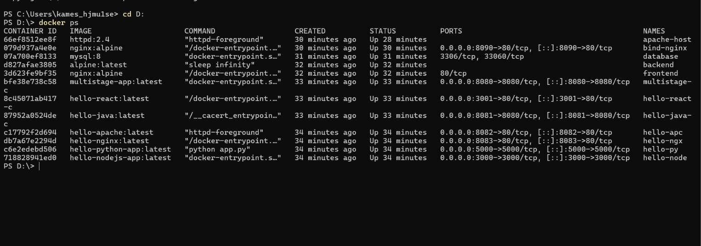
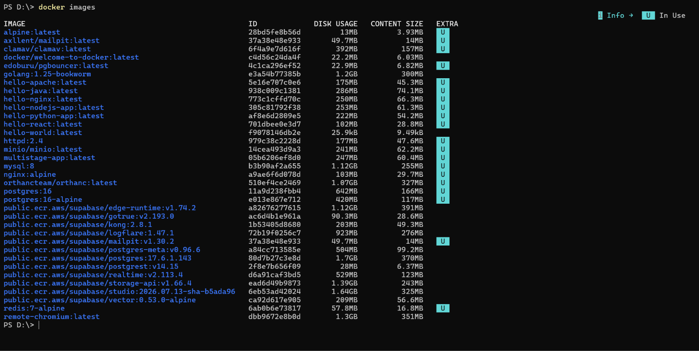
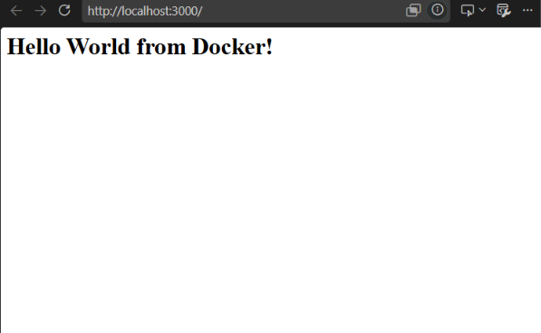
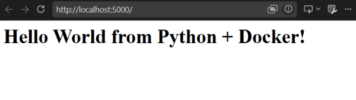
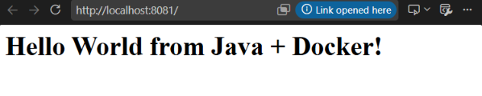
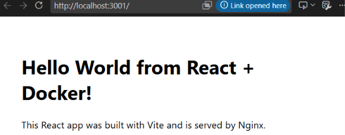
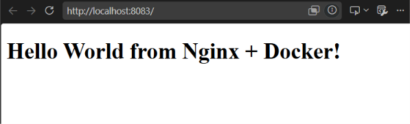

# Docker Fundamentals — Hello World Applications (Homework Submission)

**Name:** Bhuvanesh M S
**Enrollment number:** 24bcs10134
**Environment:** Docker version 29.5.3 (Docker Desktop, Linux containers) on Windows 11

---

## Task — Hello World applications in Docker

Six containerised "Hello World" web applications, each in its own folder with its own
Dockerfile, built into an image, run as a container, and verified in a browser.

### Folder structure

```
session6-7-docker/
├── nodejs-app/            Node.js + Express
├── python-app/            Python + Flask
├── java-app/              Java (built-in HttpServer, multi-stage build)
├── Apache-app/            Apache httpd
├── React-app/             React + Vite (multi-stage build, served by Nginx)
├── nginx-app/             Nginx
└── multi-stage-dockerfile/  Multi-stage build demo (port 8080)
```

### Port assignments

Every app is given a different host port so they can all run at the same time.

| Application | Folder | Image | Host port | Container port |
| ----------- | ------ | ----- | --------- | -------------- |
| Node.js | `nodejs-app` | `hello-nodejs-app` | **3000** | 3000 |
| Python | `python-app` | `hello-python-app` | **5000** | 5000 |
| Java | `java-app` | `hello-java` | **8081** | 8080 |
| Apache | `Apache-app` | `hello-apache` | **8082** | 80 |
| React | `React-app` | `hello-react` | **3001** | 80 |
| Nginx | `nginx-app` | `hello-nginx` | **8083** | 80 |
| Multi-stage | `multi-stage-dockerfile` | `multistage-app` | **8080** | 8080 |

---

## Build and run commands

```bash
cd session6-7-docker

# build all six images
docker build -t hello-nodejs-app ./nodejs-app
docker build -t hello-python-app ./python-app
docker build -t hello-java       ./java-app
docker build -t hello-apache     ./Apache-app
docker build -t hello-react      ./React-app
docker build -t hello-nginx      ./nginx-app

# run them all
docker run -d --name hello-node    -p 3000:3000 hello-nodejs-app
docker run -d --name hello-py      -p 5000:5000 hello-python-app
docker run -d --name hello-java-c  -p 8081:8080 hello-java
docker run -d --name hello-apc     -p 8082:80   hello-apache
docker run -d --name hello-react-c -p 3001:80   hello-react
docker run -d --name hello-ngx     -p 8083:80   hello-nginx

docker ps
```

Then open each in a browser:

| URL | Expected |
| --- | -------- |
| http://localhost:3000 | Hello World from Docker! |
| http://localhost:5000 | Hello World from Python + Docker! |
| http://localhost:8081 | Hello World from Java + Docker! |
| http://localhost:8082 | Hello World from Apache + Docker! |
| http://localhost:3001 | Hello World from React + Docker! |
| http://localhost:8083 | Hello World from Nginx + Docker! |

---

## The applications

### 1. Node.js — `nodejs-app`

An Express server responding on port 3000.

```dockerfile
FROM node:24-alpine
WORKDIR /app
COPY package*.json ./
RUN npm install
COPY . .
EXPOSE 3000
CMD ["npm", "start"]
```

**Why `COPY package*.json` before `COPY . .`** — Docker caches each layer. Copying only the
manifest first means `npm install` is re-run **only when the dependencies change**, not on
every source edit. This is the single most important Dockerfile optimisation for Node.

### 2. Python — `python-app`

A Flask app on port 5000.

```dockerfile
FROM python:3.11-slim
WORKDIR /app
COPY requirements.txt .
RUN pip install --no-cache-dir -r requirements.txt
COPY app.py .
EXPOSE 5000
CMD ["python", "app.py"]
```

```python
app.run(host="0.0.0.0", port=5000)
```

**The `0.0.0.0` detail matters.** Flask defaults to `127.0.0.1`, which inside a container
means "only this container". Published ports would then appear to do nothing. Binding to
`0.0.0.0` makes the server listen on all interfaces so Docker can reach it.

### 3. Java — `java-app` (multi-stage)

Uses the JDK's built-in `com.sun.net.httpserver.HttpServer`, so no Maven or Gradle is needed.

```dockerfile
FROM eclipse-temurin:21-jdk-alpine AS builder
WORKDIR /build
COPY HelloWorld.java .
RUN javac HelloWorld.java

FROM eclipse-temurin:21-jre-alpine
WORKDIR /app
COPY --from=builder /build/HelloWorld.class .
EXPOSE 8080
CMD ["java", "HelloWorld"]
```

**Two stages because Java needs a compiler to build but only a runtime to run.** The `javac`
compiler and the `.java` source stay in the builder stage and never reach the final image,
which ships the **JRE** rather than the full **JDK**.

### 4. Apache — `Apache-app`

```dockerfile
FROM httpd:2.4
COPY index.html /usr/local/apache2/htdocs/index.html
EXPOSE 80
```

**No `CMD` is needed** — the official `httpd` image already defines one. Note that Apache
serves from `/usr/local/apache2/htdocs`, whereas Nginx uses `/usr/share/nginx/html`; copying
to the wrong path is the usual reason the default page keeps appearing.

### 5. React — `React-app` (multi-stage)

A real Vite + React build, compiled in Node and served as static files by Nginx.

```dockerfile
FROM node:22-alpine AS builder
WORKDIR /app
COPY package*.json ./
RUN npm install
COPY . .
RUN npm run build

FROM nginx:alpine
COPY --from=builder /app/dist /usr/share/nginx/html
EXPOSE 80
```

**This is the most valuable pattern of the six.** React compiles to plain HTML, CSS and JS —
once built, Node is not needed at runtime at all. The builder stage carries `node_modules`
and the whole toolchain; the final image contains only Nginx plus the `dist` output. The
result is **102 MB against 253 MB** for the plain Node image.

### 6. Nginx — `nginx-app`

```dockerfile
FROM nginx:latest
COPY index.html /usr/share/nginx/html/index.html
EXPOSE 80
CMD ["nginx", "-g", "daemon off;"]
```

**`daemon off;` is essential.** Nginx normally forks into the background, but a container
lives only as long as its foreground process — so a backgrounding Nginx would make the
container exit immediately. This flag keeps it in the foreground.

---

## Multi-stage build

The multi-stage build assignment is documented separately, in its own README:

**[multi-stage-dockerfile/README.md](multi-stage-dockerfile/README.md)**

It covers building the multi-stage image, running it on **port 8080**, the `docker ps`
verification, and the three-application deployment task.


---

## Image sizes produced

| Image | Size | Note |
| ----- | ---- | ---- |
| `hello-react` | **102 MB** | multi-stage — smallest, only Nginx + static files |
| `hello-apache` | 175 MB | plain httpd |
| `hello-python-app` | 222 MB | python:3.11-slim + Flask |
| `multistage-app` | 247 MB | multi-stage Node |
| `hello-nginx` | 250 MB | nginx:latest (the `alpine` tag would be far smaller) |
| `hello-nodejs-app` | 253 MB | single-stage Node |
| `hello-java` | 286 MB | multi-stage, but a JRE is inherently large |

The React app is the clearest illustration: the same application shipped as a Node image
would be roughly 2.5× larger.

---

## Useful commands

```bash
docker images                      # list images
docker ps                          # running containers
docker ps -a                       # including stopped ones
docker logs <container>            # container output
docker exec -it <container> sh     # shell inside a container
docker stop $(docker ps -q)        # stop everything
docker rm -f $(docker ps -aq)      # remove all containers
docker system prune -a             # full cleanup
```

Resources are listed in [docker.md](docker.md).

---

## Verification — screenshots

### `docker ps` — all containers running with their published ports



Every application is up, each on its own host port: 3000, 5000, 8081, 8082, 3001, 8083 and
8080 for the multi-stage build.

### `docker images` — all built images



The six `hello-*` images and `multistage-app` are all present. The sizes confirm the
multi-stage benefit: `hello-react` is **102MB** against **253MB** for `hello-nodejs-app`.

### Hello World displayed on a webpage

**1. Node.js — http://localhost:3000**



**2. Python — http://localhost:5000**



**3. Java — http://localhost:8081**



**4. Apache — http://localhost:8082**


**5. React — http://localhost:3001**



**6. Nginx — http://localhost:8083**



All six display Hello World in the browser, confirming every application was built, run and
served successfully from its own container.
