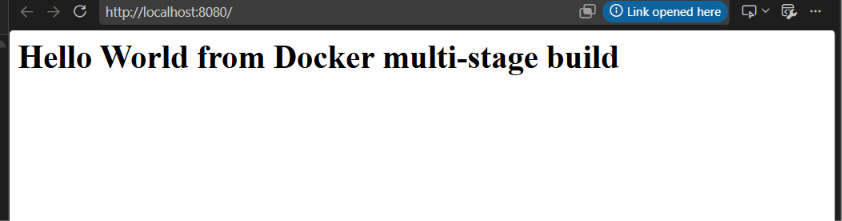
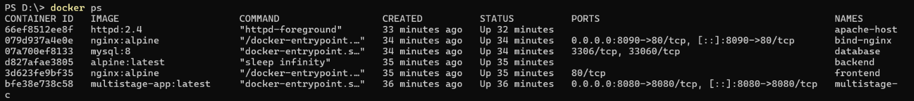
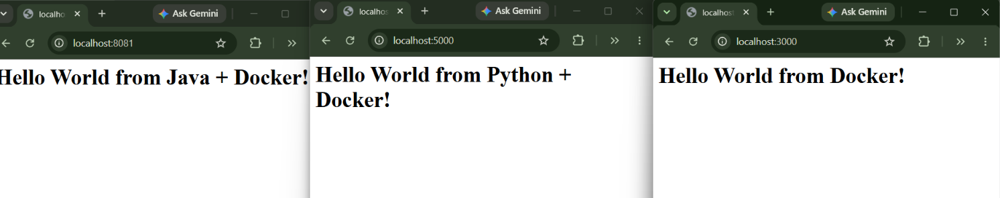

# Docker Images — Multi-Stage Build (Homework Submission)

**Name:** Bhuvanesh M S
**Enrollment number:** 24bcs10134
**Environment:** Docker version 29.5.3 (Docker Desktop, Linux containers) on Windows 11

---

## Task 1 — Build and run the multi-stage Dockerfile

### The Dockerfile

```dockerfile
# -------------------------
# Stage 1: Build
# -------------------------
FROM node:24-alpine AS builder
WORKDIR /app
COPY package*.json ./
RUN npm install
COPY . .

# -------------------------
# Stage 2: Production
# -------------------------
FROM node:24-alpine AS production
WORKDIR /app
COPY --from=builder /app/package*.json ./
RUN npm install --omit=dev
COPY --from=builder /app/server.js ./
EXPOSE 8080
CMD ["npm", "start"]
```

The application is an Express server listening on **port 8080**:

```javascript
const express = require("express");
const app = express();
const PORT = 8080;

app.get("/", (req, res) => {
  res.send("<h1>Hello World from Docker multi-stage build</h1>");
});

app.listen(PORT, () => {
  console.log(`Server running on port ${PORT}`);
});
```

### Commands

```bash
cd session6-7-docker

# build the image from the multi-stage Dockerfile
docker build -t multistage-app ./multi-stage-dockerfile

# run a container from it, publishing port 8080
docker run -d --name multistage-c -p 8080:8080 multistage-app

# verify the running container
docker ps

# access the application
curl http://localhost:8080
```

---

## Task 2 — Documentation and evidence

### Application running successfully

```
$ curl http://localhost:8080
<h1>Hello World from Docker multi-stage build</h1>
```

The page displays exactly the required text:

> **Hello World from Docker multi-stage build**

In a browser: **http://localhost:8080**




### `docker ps` showing the container on port 8080

```
$ docker ps
NAMES          IMAGE                   PORTS                                         STATUS
multistage-c   multistage-app:latest   0.0.0.0:8080->8080/tcp, [::]:8080->8080/tcp   Up
```



The `PORTS` column confirms **`0.0.0.0:8080->8080/tcp`** — host port 8080 mapped to
container port 8080.


---

## Task 3 — Deploying three different types of applications

Three different application types were containerised and run simultaneously, each in its own
folder with its own Dockerfile. Full details are in the
[sessions 6 & 7 README](../README.md).

| # | Type | Folder | Image | Host port | Verified output |
| - | ---- | ------ | ----- | --------- | --------------- |
| 1 | **Node.js** (Express) | [`nodejs-app`](../nodejs-app/) | `hello-nodejs-app` | 3000 | `Hello World from Docker!` |
| 2 | **Python** (Flask) | [`python-app`](../python-app/) | `hello-python-app` | 5000 | `Hello World from Python + Docker!` |
| 3 | **Java** (HttpServer) | [`java-app`](../java-app/) | `hello-java` | 8081 | `Hello World from Java + Docker!` |

Three more were also deployed: Apache (8082), React (3001) and Nginx (8083).

```bash
docker build -t hello-nodejs-app ./nodejs-app
docker build -t hello-python-app ./python-app
docker build -t hello-java       ./java-app

docker run -d --name hello-node   -p 3000:3000 hello-nodejs-app
docker run -d --name hello-py     -p 5000:5000 hello-python-app
docker run -d --name hello-java-c -p 8081:8080 hello-java

docker ps
```



Verified output from all three:

```
3000   <h1>Hello World from Docker!</h1>
5000   <h1>Hello World from Python + Docker!</h1>
8081   <h1>Hello World from Java + Docker!</h1>
```


---

## What I understood about multi-stage builds

A single-stage image keeps **everything** used during the build: compilers, dev
dependencies, source files and build caches. None of it is needed to *run* the application,
but all of it still ships — making images larger, slower to pull, and wider in attack
surface.

Multi-stage builds solve this with several `FROM` statements. Each `FROM` begins a fresh
stage, and `COPY --from=<stage>` pulls **only the finished artifacts** forward into the final
image. Everything else is thrown away when the build ends.

In the Dockerfile above:

- **Stage 1 (`builder`)** runs a full `npm install`, including dev dependencies, and holds
  the complete source tree.
- **Stage 2 (`production`)** starts clean, copies across only `package*.json` and
  `server.js`, and reinstalls with `--omit=dev` so dev dependencies never reach the final
  image.
- Only stage 2 becomes the shipped image; stage 1 is discarded.

### The same pattern in the other apps

| App | Build stage | Final stage | Result |
| --- | ----------- | ----------- | ------ |
| [`java-app`](../java-app/) | JDK — compiles `.java` with `javac` | **JRE** — runs the `.class` only | No compiler or source in the image |
| [`React-app`](../React-app/) | Node — `npm run build` | **Nginx** — serves `dist/` | **102 MB vs 253 MB** |

The React app is the clearest illustration: React compiles to plain HTML, CSS and JS, so Node
is not needed at runtime at all. Shipping the same app as a Node image would be roughly
**2.5× larger**.

### Key takeaways

- `AS <name>` names a stage so later stages can copy from it.
- `COPY --from=builder` is the mechanism that carries artifacts across the boundary.
- Build tools, secrets used at build time, and dev dependencies stay behind — a security
  benefit as much as a size one.
- Smaller images pull faster, which matters in CI/CD where images are pulled on every deploy.


