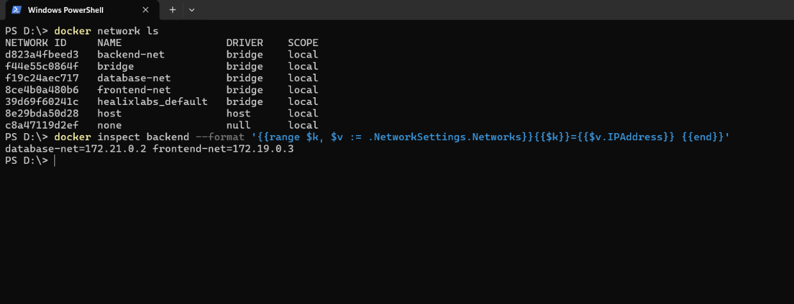
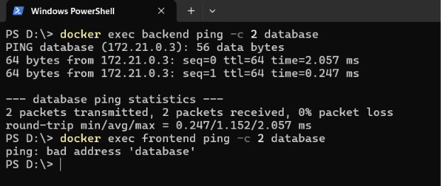

# Docker Networking — Networking & Volumes (Homework Submission)

**Name:** Bhuvanesh M S
**Enrollment number:** 24bcs10134
**Environment:** Docker version 29.5.3 (Docker Desktop, Linux containers) on Windows 11

Resources: https://docs.docker.com/engine/network/drivers/

---

## Task 1 — Container networking

### Topology built

| Container | Image | Networks |
| --------- | ----- | -------- |
| `frontend` | `nginx:alpine` | `frontend-net` |
| `backend` | `alpine:latest` | **`frontend-net` + `database-net`** (two networks) |
| `database` | `mysql:8` | `database-net` |

`backend-net` is the third network created as required. `backend` sits on two networks,
which makes it the only container able to talk to **both** the frontend and the database —
the standard three-tier pattern, where the web tier is never allowed to reach the database
directly.

### Commands

```bash
# three networks
docker network create frontend-net
docker network create backend-net
docker network create database-net
docker network ls

# frontend on one network
docker run -d --name frontend --network frontend-net nginx:alpine

# backend on the first network, then attached to a second
docker run -d --name backend --network frontend-net alpine:latest sleep infinity
docker network connect database-net backend

# database on its own network
docker run -d --name database --network database-net \
  -e MYSQL_ROOT_PASSWORD=rootpass -e MYSQL_DATABASE=testdb mysql:8

# confirm backend has two IP addresses
docker inspect backend --format '{{range $k, $v := .NetworkSettings.Networks}}{{$k}}={{$v.IPAddress}} {{end}}'
```

Output:

```
database-net=172.21.0.2 frontend-net=172.19.0.3
```

**One container, two networks, two IP addresses** — one on each bridge. Note the different
subnets (`172.21.x` and `172.19.x`): every user-defined network gets its own.

### Connectivity tests

```bash
docker exec backend  ping -c 2 frontend    # same network  -> works
docker exec frontend ping -c 2 backend     # same network  -> works
docker exec backend  ping -c 2 database    # backend is on database-net -> works
docker exec frontend ping -c 2 database    # different network -> FAILS
```

Results:

```
=== backend -> frontend (SAME network) ===
2 packets transmitted, 2 packets received, 0% packet loss

=== frontend -> backend (SAME network) ===
2 packets transmitted, 2 packets received, 0% packet loss

=== backend -> database (backend IS on database-net) ===
2 packets transmitted, 2 packets received, 0% packet loss

=== frontend -> database (NOT on database-net) ===
ping: bad address 'database'
```

### What I understood

- On a **user-defined bridge network**, containers reach each other by **container name**.
  Docker runs an internal DNS server, so `ping frontend` works with no IP addresses or
  `/etc/hosts` editing. This does **not** work on the default `bridge` network, which is one
  of the main reasons to create your own.
- `docker network connect` attaches a **running** container to an extra network — no restart
  and no recreation needed. The container simply gains a second interface and IP.
- The failure message is the interesting part. `frontend -> database` did not time out, it
  returned **`bad address 'database'`** — the name did not even *resolve*. Docker's DNS only
  answers for containers that share a network, so from the frontend the database is not
  merely unreachable, it is **invisible**.
- That is real security, not just routing: putting the database on a separate network means a
  compromised frontend cannot even discover it. This is why production setups isolate tiers
  rather than putting everything on one network.

---

## Task 2 — Host network

```bash
docker pull httpd:2.4
docker run -d --name apache-host --network host httpd:2.4
docker ps
curl http://localhost:80
```

`docker ps` shows the container running with **no port mappings at all**, because host
networking does not use them:

```
NAMES         IMAGE       NETWORK   PORTS   STATUS
apache-host   httpd:2.4   host              Up
```

### Result on Docker Desktop for Windows — an honest note

Accessing `http://localhost:80` **from Windows failed**:

```
Trying 127.0.0.1:80...
connect to 127.0.0.1 port 80 failed: Connection refused
Failed to connect to localhost port 80
```

Apache is genuinely running, though. Verified by querying it from **inside** the Docker
environment, using a second container that also joins the host network:

```bash
docker run --rm --network host alpine sh -c "apk add --no-cache curl >/dev/null; curl -s http://localhost:80/"
```

```html
<html><head>
<title>It works! Apache httpd</title>
</head><body>
```

**Why this happens:** on Windows, Docker runs inside a **Linux virtual machine** (WSL 2).
`--network host` means the container shares the network namespace of *that VM*, not of
Windows. So "localhost" for the container is the VM, and Windows sits outside it. Host
networking behaves as taught only on a **native Linux** Docker host.

To reach Apache from a Windows browser, the port must be published explicitly, which uses
the normal bridge network instead:

```bash
docker run -d --name apache-published -p 80:80 httpd:2.4
curl http://localhost:80          # now works from Windows
```

```html
<title>It works! Apache httpd</title>
```

### What I understood

| | Bridge (default) | Host |
| --- | --- | --- |
| Network namespace | Container gets its own | Shares the host's |
| Port publishing | Required (`-p 8080:80`) | Ignored — ports are already the host's |
| Port conflicts | Avoidable, remap freely | Two containers cannot share port 80 |
| Isolation | Good | **None** — the container sees all host interfaces |
| Speed | Slight NAT overhead | Marginally faster, no NAT |
| Container-name DNS | Yes, on user-defined networks | No |

Host networking trades isolation for a small performance gain and is mainly used for network
monitoring tools that need to see the host's real interfaces. For ordinary web applications,
bridge with published ports is the correct choice — and on Docker Desktop it is the only one
that works from the Windows side.

---

## Task 3 — Bind mount

### Setup

A folder on the host with an `index.html`, mounted into an Nginx container:

`bind-mount-demo/index.html`

```html
<h1>Hello students</h1>
```

```bash
docker run -d --name bind-nginx -p 8090:80 \
  -v "B:\Trimester-9\DevOps\devops-heros\session8-docker-networking-volume\bind-mount-demo:/usr/share/nginx/html:ro" \
  nginx:alpine

curl http://localhost:8090
```

```html
<!DOCTYPE html>
<html>
  <head><title>Bind Mount Demo</title></head>
  <body>
    <h1>Hello students</h1>
  </body>
</html>
```

### Modifying the file with the container still running

The host file was edited to:

```html
<h1>Hello students - UPDATED without restarting the container!</h1>
```

No `docker restart`, no rebuild — just a re-request:

```bash
docker ps --filter name=bind-nginx --format "{{.Names}}: {{.Status}}"
curl http://localhost:8090 | grep h1
```

```
bind-nginx: Up 13 seconds

<h1>Hello students - UPDATED without restarting the container!</h1>
```

The container had been up **13 seconds** and was never restarted, yet it served the new
content immediately.

### What I understood

- A **bind mount** maps a host directory straight into the container. It is not a copy —
  both sides see the *same* files on disk, so a host edit is visible inside the container
  instantly.
- This is the opposite of `COPY` in a Dockerfile. `COPY` bakes a **snapshot** into the image
  at build time, so changing the file afterwards requires a rebuild. A bind mount stays live.
- That makes bind mounts the standard tool for **local development** — edit code on the host,
  refresh the browser, no rebuild cycle.
- `:ro` mounts the directory **read-only** inside the container, so the container cannot
  modify the host files. Sensible whenever the container only needs to read.
- **Bind mount vs named volume:**

| | Bind mount | Named volume |
| --- | --- | --- |
| Location | A path you choose on the host | Managed by Docker (`/var/lib/docker/volumes`) |
| Created with | `-v /host/path:/container/path` | `-v myvolume:/container/path` |
| Best for | Development, config files, live editing | Databases and production data |
| Portability | Tied to that host's paths | Portable across hosts |

The `docker-compose.yml` in this folder uses a **named volume** (`db_data`) for MySQL, which
is the right choice there — database files should be managed by Docker, not by a host path.

---

## Task 4 — Overlay networks (research)

### What an overlay network is

The bridge networks in Task 1 all exist on a **single Docker host**. An **overlay** network
spans **multiple Docker hosts**, letting containers on different physical machines talk to
each other by name as if they shared one network.

### How it works

1. Several Docker hosts are joined into a cluster (**Docker Swarm**, via `docker swarm init`
   and `docker swarm join`).
2. An overlay network is created across that cluster.
3. Docker builds a **VXLAN tunnel** between the hosts. Container traffic is wrapped
   ("encapsulated") inside normal UDP packets on port **4789**, sent across the physical
   network, and unwrapped on the far side.
4. Containers therefore see one flat virtual network and never need to know which machine a
   peer is on.
5. A distributed key-value store keeps the network state — IP allocations and service
   records — in sync across all hosts.

### Commands

```bash
docker swarm init                                   # start a cluster
docker network create -d overlay my-overlay         # create the overlay
docker network create -d overlay --attachable my-overlay   # allow plain containers too
docker service create --network my-overlay --name web --replicas 3 nginx
docker network ls                                   # SCOPE column reads "swarm"
```

In `docker network ls`, the bridge networks show `SCOPE = local` while an overlay shows
`SCOPE = swarm` — the clearest way to tell them apart.

### Use cases

- **Multi-host container communication** — the core purpose.
- **Scaling out** — when one machine runs out of CPU or memory, spread containers across
  several without rewriting how they address each other.
- **High availability** — replicas on different physical hosts survive one host failing.
- **Service discovery with load balancing** — a service name resolves to a virtual IP that
  Docker load-balances across all healthy replicas.
- **Encrypted traffic** — `--opt encrypted` enables IPsec between hosts, for traffic crossing
  an untrusted network.

### Network drivers compared

| Driver | Scope | Purpose |
| ------ | ----- | ------- |
| `bridge` | Single host | Default; isolated network with published ports |
| `host` | Single host | Share the host's network stack, no isolation |
| `overlay` | **Multiple hosts** | Cluster-wide networking over VXLAN |
| `macvlan` | Single host | Give a container its own MAC and a real LAN IP |
| `none` | Single host | No networking at all |

### What I understood

Overlay networks are what turn Docker from a single-machine tool into a cluster platform. The
key insight is that containers do not need to know anything about the physical topology —
Docker hides the difference between "next to me" and "on another machine" behind the same
container-name DNS used in Task 1. In practice, Kubernetes solves the same problem with its
own CNI plugins (Calico, Flannel), which is why overlay networking is useful background for
the Kubernetes sessions that follow.

---

## Cleanup

```bash
docker rm -f frontend backend database apache-host bind-nginx
docker network rm frontend-net backend-net database-net
```
---

## Verification output

### Task 1 — networks created and backend on two of them

```
$ docker network ls
NAME            DRIVER    SCOPE
backend-net     bridge    local
database-net    bridge    local
frontend-net    bridge    local

$ docker inspect backend --format "{{range \$k, \$v := .NetworkSettings.Networks}}{{\$k}}={{\$v.IPAddress}} {{end}}"
database-net=172.21.0.2 frontend-net=172.19.0.3
```



### Task 1 — connectivity and isolation

```
$ docker exec backend ping -c 2 frontend
2 packets transmitted, 2 packets received, 0% packet loss

$ docker exec frontend ping -c 2 backend
2 packets transmitted, 2 packets received, 0% packet loss

$ docker exec backend ping -c 2 database
2 packets transmitted, 2 packets received, 0% packet loss

$ docker exec frontend ping -c 2 database
ping: bad address "database"
```



### Task 2 — Apache on the host network

```
$ docker ps
NAMES         IMAGE       PORTS   STATUS
apache-host   httpd:2.4           Up 16 minutes        <- no port mappings

$ curl http://localhost:80                              <- from Windows
connect to 127.0.0.1 port 80 failed: Connection refused

$ docker run --rm --network host alpine sh -c "apk add curl; curl -s localhost:80"
<title>It works! Apache httpd</title>                   <- works inside the VM

$ docker run -d --name apache-published -p 80:80 httpd:2.4
$ curl http://localhost:80
<title>It works! Apache httpd</title>                   <- works from Windows
```

### Task 3 — bind mount, before and after editing

```
$ curl http://localhost:8090                     # BEFORE
    <h1>Hello students</h1>
$ docker ps --filter name=bind-nginx
bind-nginx: Up 19 minutes

# index.html edited on the host - no restart, no rebuild

$ curl http://localhost:8090                     # AFTER
    <h1>Hello students - UPDATED without restarting the container!</h1>
$ docker ps --filter name=bind-nginx
bind-nginx: Up 19 minutes                        <- same container, same uptime
```

The uptime is identical before and after, proving the container was never restarted.

