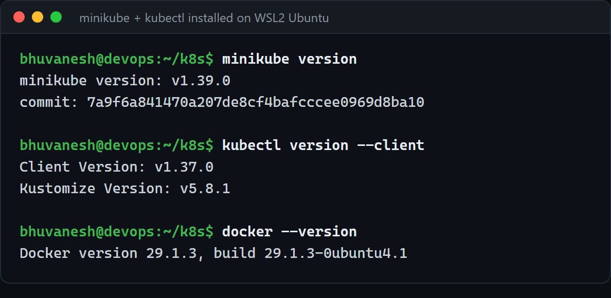
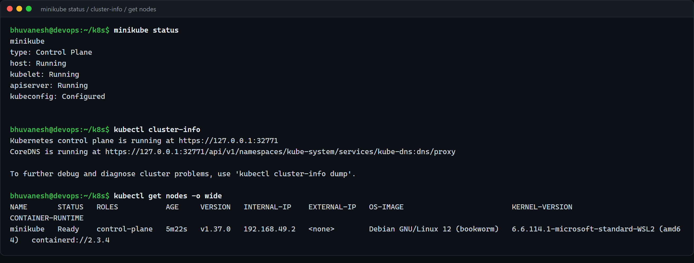
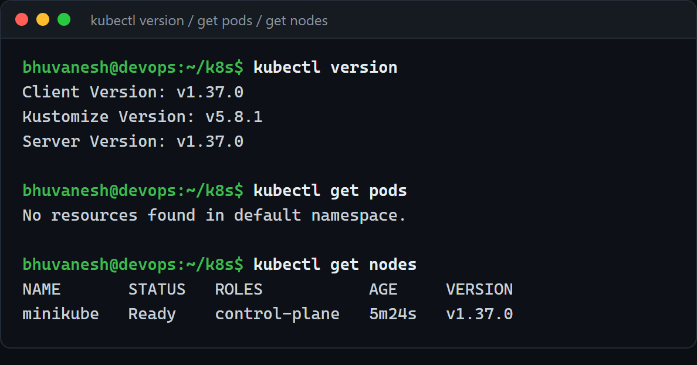
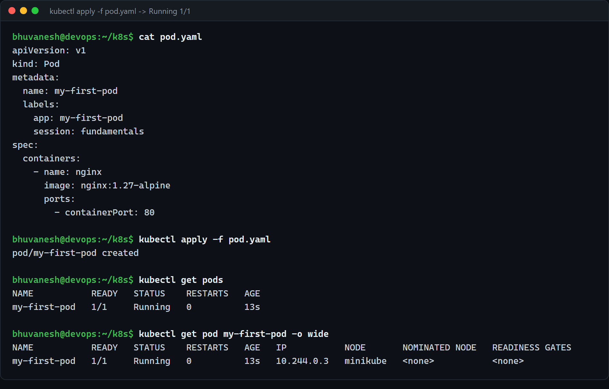
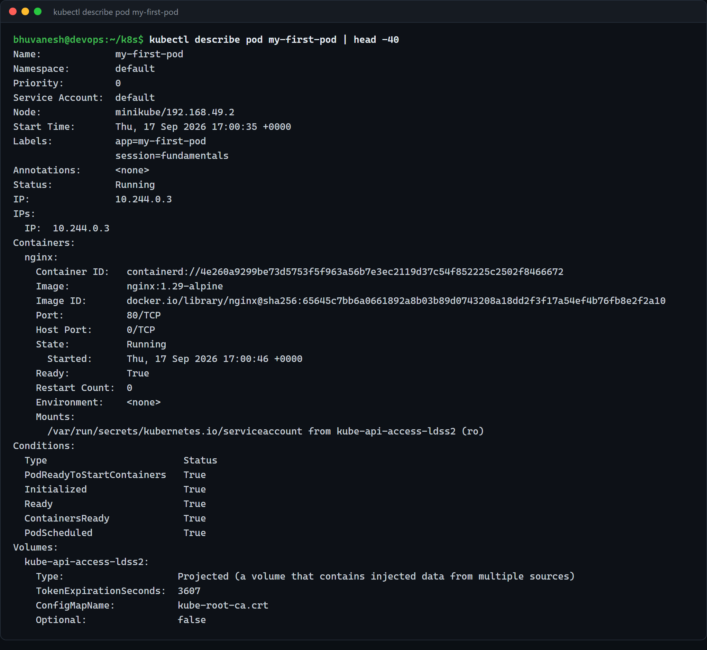
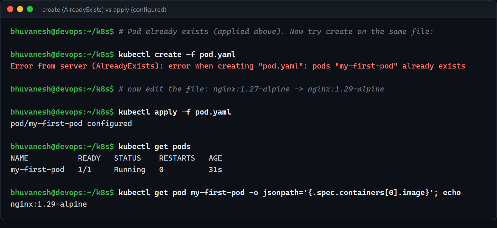
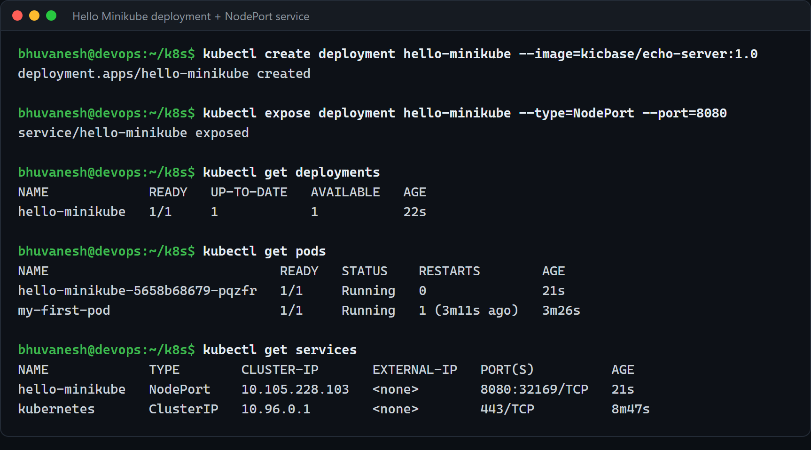
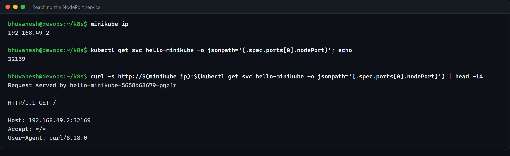
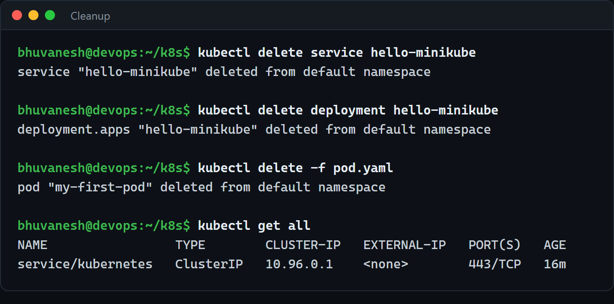

# Kubernetes Fundamentals — Architecture, Minikube & the First Pod (Homework Submission)

**Name:** Bhuvanesh M S
**Enrollment number:** 24bcs10134
**Environment:** Ubuntu 26.04 LTS on WSL 2 (Windows 11) · Docker Engine 29.1.3 · minikube v1.39.0 ·
kubectl v1.37.0 · Kubernetes v1.37.0

Resources used:

- https://kubernetes.io/docs/concepts/architecture/ — **primary source of truth**
- https://minikube.sigs.k8s.io/docs/start/
- https://kubernetes.io/docs/tutorials/kubernetes-basics/
- https://github.com/Nency-Ravaliya/Kubernetes

---

## Homework tasks

1. Read the official Kubernetes architecture documentation and cross-check it against the
   class notes — the instructor was explicit that **the official docs are the primary source
   of truth**, ahead of any third-party tutorial site.
2. Install **Minikube** on WSL2/Ubuntu.
3. Confirm Minikube actually works — `minikube start`, `minikube status`, and the
   *Hello Minikube* deployment example end to end.
4. Write **`pod.yaml` by hand** (not copy-pasted), apply it, and confirm it reaches
   `Running` / `1/1`.
5. Run the full first-commands sequence: `kubectl version`, `kubectl cluster-info`,
   `kubectl get pods`, `kubectl get nodes`.
6. Deliberately test the **`apply` vs `create`** difference.
7. Optional / extra-credit: skim the *Learn Kubernetes Basics* "Deploy an App" module and
   read `core-objects.md` in the class Kubernetes repo.

---

## Task 1 — Kubernetes architecture, cross-checked against the official docs

Read from <https://kubernetes.io/docs/concepts/architecture/>. This is my own summary after
reading it, with the places where it disagreed with (or was more precise than) my class notes
called out explicitly.

A Kubernetes cluster is split into a **control plane** (takes decisions about the cluster) and
a set of **nodes** (run the actual workloads).

### Control plane components

| Component | What it actually does |
| --------- | --------------------- |
| **kube-apiserver** | The front end of the control plane. It is the **only** component that talks to etcd. Every `kubectl` command, every controller and every kubelet goes through it. It is stateless, so it scales horizontally. |
| **etcd** | Consistent, highly-available key-value store. It is the **single source of truth for all cluster data**. The docs are blunt about this: if you run etcd, you must have a backup plan for it. |
| **kube-scheduler** | Watches for newly created Pods with **no node assigned**, and picks a node for them. It only *decides*; it does not start anything. Scheduling accounts for resource requests, affinity/anti-affinity, taints and tolerations, and data locality. |
| **kube-controller-manager** | Runs the controllers (Node controller, Job controller, EndpointSlice controller, ServiceAccount controller, …) as one binary, in one process. Each controller runs a **reconciliation loop**: compare desired state to actual state, act on the difference. |
| **cloud-controller-manager** | Optional. Only present on a cloud provider. It holds the cloud-specific logic (node lifecycle, routes, load balancers) so the rest of the control plane stays cloud-agnostic. On Minikube this component **does not exist at all**. |

### Node components

| Component | What it actually does |
| --------- | --------------------- |
| **kubelet** | The agent on every node. It takes **PodSpecs** and makes sure the containers described in them are running and healthy. Important nuance from the docs: **kubelet does not manage containers that were not created by Kubernetes.** |
| **kube-proxy** | Maintains the network rules on each node that implement the **Service** abstraction. The docs note it is *optional* — if the cluster's CNI plugin implements service routing itself, kube-proxy is not needed. |
| **Container runtime** | The software that actually runs containers — containerd, CRI-O, or anything implementing the **CRI**. My Minikube node uses `containerd://2.3.4`, *not* Docker, even though the Minikube node itself is a Docker container. |

### Addons

**CoreDNS**, the dashboard, metrics-server and the CNI plugin are **addons** — they run as
normal Pods in `kube-system`, they are not part of the core control plane. `kubectl cluster-info`
below shows CoreDNS being reported as a cluster service, which matches this.

### Where the official docs corrected my notes

Four things I had written down loosely and the docs made precise:

1. **The scheduler does not start Pods.** It only writes the chosen node name onto the Pod
   object. The **kubelet** on that node notices and actually starts the containers. My notes
   had these blurred together.
2. **Only the API server talks to etcd.** No controller, scheduler or kubelet ever reads etcd
   directly. This is what makes the API server the single choke point for authentication,
   authorisation and admission control.
3. **Docker is not a Kubernetes component.** The runtime interface is the CRI. My node reports
   `containerd`, and `dockershim` was removed back in Kubernetes v1.24 — so "Kubernetes runs
   Docker" is simply wrong today.
4. **"Control plane" is a role, not a machine.** In Minikube, one single node carries the
   control-plane role *and* runs workloads. `kubectl get nodes` below shows exactly one node
   with `ROLES: control-plane`, and my Pods still get scheduled on it, because Minikube removes
   the usual control-plane taint.

---

## Task 2 — Installing Minikube on WSL2 / Ubuntu

The class notes' commands, run inside the `Ubuntu-DevOps` WSL2 distro:

```bash
# Docker Engine — Minikube's driver
sudo apt-get update
sudo apt-get install -y docker.io conntrack
sudo systemctl enable --now docker
sudo usermod -aG docker $USER      # so minikube can use docker without sudo

# Minikube
curl -LO https://storage.googleapis.com/minikube/releases/latest/minikube-linux-amd64
sudo install minikube-linux-amd64 /usr/local/bin/minikube
rm minikube-linux-amd64

# kubectl (matching the cluster version)
curl -LO "https://dl.k8s.io/release/$(curl -L -s https://dl.k8s.io/release/stable.txt)/bin/linux/amd64/kubectl"
sudo install -o root -g root -m 0755 kubectl /usr/local/bin/kubectl
```



### A note on what I actually had to do

WSL2 already had the Docker Desktop CLI on the Windows PATH, but **Docker Desktop's WSL
integration was not enabled for this distro**, so `docker` was not usable from inside Ubuntu.
Rather than depend on Docker Desktop, I installed **Docker Engine natively inside the WSL2
distro** (`docker.io` from the Ubuntu repos) and pointed Minikube at that. This is the setup
the Minikube docs describe for Linux, and it means the cluster does not depend on a Windows
GUI app being open.

`conntrack` is installed because Minikube's preflight checks require it for connection
tracking.

---

## Task 3 — Starting the cluster and confirming it works

```bash
minikube start --driver=docker --memory=2200mb --cpus=2
minikube status
kubectl cluster-info
kubectl get nodes -o wide
```



All four lines of `minikube status` report healthy:

```
host: Running
kubelet: Running
apiserver: Running
kubeconfig: Configured
```

Reading `kubectl get nodes -o wide` against the architecture above:

- `ROLES: control-plane` — one node doing both jobs, as expected for Minikube.
- `INTERNAL-IP 192.168.49.2` — the Docker bridge address of the Minikube container.
- `CONTAINER-RUNTIME containerd://2.3.4` — **containerd, not Docker**, exactly the CRI point
  from Task 1. Docker is only the *driver* that runs the node itself.
- `KERNEL-VERSION ...microsoft-standard-WSL2` — the node container shares the WSL2 kernel,
  which is why this is a container and not a VM.

### The first-commands sequence

```bash
kubectl version
kubectl get pods
kubectl get nodes
```



`kubectl version` printing **both** a Client Version and a Server Version is the real proof
that kubectl reached the API server — a client-only answer would mean the kubeconfig is
pointing at nothing. `kubectl get pods` correctly answers `No resources found in default
namespace`, because the cluster's own Pods live in `kube-system`, not `default`.

---

## Task 4 — `pod.yaml`, written by hand

Written out by hand rather than copied, which is the whole point of this task —
the four mandatory fields have to become muscle memory.

[`pod.yaml`](pod.yaml):

```yaml
apiVersion: v1
kind: Pod
metadata:
  name: my-first-pod
  labels:
    app: my-first-pod
    session: fundamentals
spec:
  containers:
    - name: nginx
      image: nginx:1.29-alpine
      ports:
        - containerPort: 80
```

### The four mandatory fields

| Field | Why it is mandatory |
| ----- | ------------------- |
| `apiVersion` | Which version of the API this object is written against. A Pod is core/v1, so it is just `v1` — **no group prefix**. A Deployment would be `apps/v1`. |
| `kind` | Which type of object. Combined with `apiVersion`, this is what tells the API server how to validate and where to store it. |
| `metadata` | Must at minimum carry a `name`, unique within the namespace. `labels` are optional here but are what controllers and Services select on later. |
| `spec` | The **desired state**. For a Pod, `spec.containers` is required and must have at least one container with a `name` and an `image`. |

`containerPort: 80` is documentation, not a firewall — it does **not** publish the port. It
records which port the container listens on so that readers and tools know. Reaching the Pod
from outside still needs a Service.

### Applying it

```bash
kubectl apply -f pod.yaml
kubectl get pods
kubectl get pod my-first-pod -o wide
```



`1/1   Running` — one container ready out of one desired. The Pod also has its own cluster IP
`10.244.0.3` from the CNI's Pod CIDR, which is a different range from the node IP
`192.168.49.2`.

```bash
kubectl describe pod my-first-pod
```



`describe` is where the useful detail is: the node it landed on, the resolved image digest, the
**container ID prefixed `containerd://`** (the CRI point again), and the five Pod conditions
(`PodScheduled`, `Initialized`, `ContainersReady`, `PodReadyToStartContainers`, `Ready`) all
`True`. That condition list is effectively the Pod's startup checklist — when something is
broken, the first `False` entry tells you which stage failed.

---

## Task 5 — `apply` vs `create`, tested on purpose

The Pod from Task 4 is already running. Now run `create` against the same file, then edit the
image from `nginx:1.27-alpine` to `nginx:1.29-alpine` and `apply` again:



```
$ kubectl create -f pod.yaml
Error from server (AlreadyExists): error when creating "pod.yaml": pods "my-first-pod" already exists

$ kubectl apply -f pod.yaml
pod/my-first-pod configured
```

and the image really did change:

```
$ kubectl get pod my-first-pod -o jsonpath='{.spec.containers[0].image}'
nginx:1.29-alpine
```

### What I understood

- **`create` is imperative** — "make this new object". If the name is taken it fails with
  `AlreadyExists`. It has no opinion about updating anything.
- **`apply` is declarative** — "make the cluster match this file". It creates the object if
  it is missing (`created`) and patches it if it exists (`configured`). The same command works
  the first time and every time after, which is exactly what you want in a script or a CI
  pipeline.
- The mechanism behind this is the **`kubectl.kubernetes.io/last-applied-configuration`**
  annotation. `apply` stores the configuration it last sent, then diffs the new file against
  it, so it can tell the difference between "the user removed this field" and "some controller
  added this field". `create` writes no such annotation — which is why mixing `create` first
  and `apply` later can behave oddly, and why it is better to use `apply` consistently.
- Word choice in the output is the tell: **`created` vs `configured`**.
- One honest observation from my own run: a later `kubectl get pods` showed
  `RESTARTS 1` for this Pod. Changing the image on a **bare Pod** is one of the very few
  fields Kubernetes allows to be mutated in place, and the kubelet satisfies it by killing the
  old container and starting a new one — same Pod, same IP, new container. This is *not* a
  rolling update; there is no second replica and there is a real gap in service. Getting a
  zero-downtime image change is precisely what a Deployment is for, which is the next session.

---

## Task 6 — Hello Minikube (end-to-end sanity check)

Following <https://kubernetes.io/docs/tutorials/hello-minikube/>:

```bash
kubectl create deployment hello-minikube --image=kicbase/echo-server:1.0
kubectl expose deployment hello-minikube --type=NodePort --port=8080
kubectl get deployments
kubectl get pods
kubectl get services
```



The Service line is the interesting one:

```
hello-minikube   NodePort   10.105.228.103   <none>   8080:32169/TCP
```

Three different ports/addresses are in play — the container's `8080`, the Service's stable
ClusterIP `10.105.228.103:8080`, and the **NodePort `32169`** opened on the node itself.

```bash
curl http://$(minikube ip):$(kubectl get svc hello-minikube -o jsonpath='{.spec.ports[0].nodePort}')
```



```
Request served by hello-minikube-5658b68679-pqzfr
```

The echo server reports back the **Pod name that served the request**, which proves the whole
chain worked: node IP → NodePort → kube-proxy → Service → endpoint → Pod.

> **Note on `minikube service --url`:** the tutorial suggests it, and I tried it first. On
> Linux with the **docker driver** it prints `http://127.0.0.1:44927` and then warns
> *"Because you are using a Docker driver on linux, the terminal needs to be open to run it."*
> — it opens a blocking SSH tunnel and does not return. Going straight to
> `minikube ip` + the nodePort avoids the tunnel entirely and works because the Minikube
> node's Docker bridge network is directly reachable from inside WSL.

### Cleanup



`kubectl get all` back to only the built-in `service/kubernetes` — the cluster is clean for
the next session.

---

## Task 7 — Extra credit: `core-objects.md` preview

Read <https://github.com/Nency-Ravaliya/Kubernetes/blob/main/core-objects.md> ahead of time.
The shape of what is coming:

| Object | One-line purpose |
| ------ | ---------------- |
| **Pod** | Smallest deployable unit. One or more containers sharing a network namespace and volumes. Mortal — if it dies, it stays dead. |
| **ReplicaSet** | Keeps *N* identical Pods running. Replaces them when they die. No update strategy. |
| **Deployment** | Manages ReplicaSets, and therefore gives you rolling updates, rollbacks and revision history. **This is what you actually deploy.** |
| **Service** | A stable name and virtual IP in front of a changing set of Pods. |
| **DaemonSet** | One Pod per node — for agents like log shippers and CNI plugins. |
| **StatefulSet** | Stable network identity and stable per-Pod storage, created and scaled in order. |

The point that lands hardest reading it in this order: **a Pod on its own is not a deployment
strategy.** My `my-first-pod` above is not self-healing — delete it and nothing brings it back.
Everything above the Pod row in that table exists to fix some aspect of that.

---

## Summary

| Homework item | Status |
| ------------- | ------ |
| Read official architecture docs, cross-check notes | Done — Task 1, with four corrections listed |
| Install Minikube on WSL2/Ubuntu | Done — Task 2 |
| `minikube start` + `minikube status` | Done — Task 3 |
| Hello Minikube end-to-end | Done — Task 6 |
| Hand-write `pod.yaml`, apply, confirm `1/1 Running` | Done — Task 4 |
| `kubectl version` / `cluster-info` / `get pods` / `get nodes` | Done — Task 3 |
| Test `apply` vs `create` deliberately | Done — Task 5 |
| Extra credit: read `core-objects.md` | Done — Task 7 |
